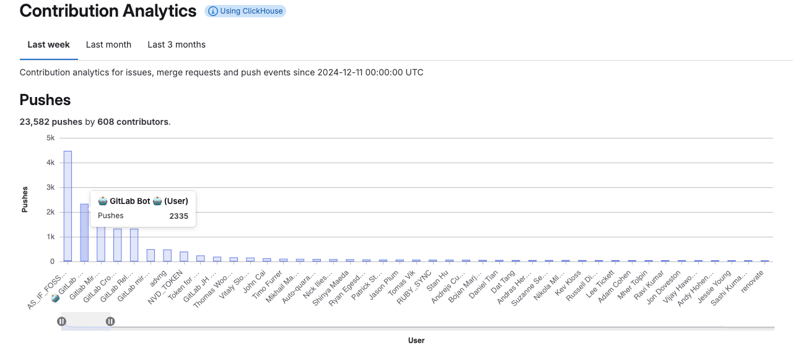



- Tier: 专业版，旗舰版
- Offering: JihuLab.com，私有化部署



贡献分析提供了你的群组成员在上周、上个月或过去三个月内的[贡献事件](../../profile/contributions_calendar.md#user-contribution-events)概览。
交互式条形图和详细表格按群组成员展示了贡献事件（推送事件、议题以及合并请求）。

使用贡献分析来洞察团队活动和个人表现，并将此信息用于：

- 工作负载均衡：分析群组在一段时间内的贡献，识别高绩效成员或可能需要额外支持的成员。
- 团队协作：评估贡献的平衡性，例如代码推送与审查或批准的比例，以确保协作开发实践。
- 培训机会：识别团队成员可能从指导或培训中受益的领域，例如较低的合并请求批准率或议题解决率。
- 回顾评估：将贡献分析纳入回顾中，评估团队实现目标的效率以及需要调整的地方。

## 跟踪

贡献分析基于推送事件，因为它们比唯一提交能提供更可靠的贡献视图。
由于提交可能被推送到多个分支，计算唯一提交可能导致重复计算。
通过改为跟踪推送事件，极狐GitLab 确保每个贡献都被准确计数。

例如，一个用户在一次推送中将三个提交推送到分支 A。
随后，该用户将其中两个提交从分支 A 推送到分支 B。
极狐GitLab 记录了五次提交，但用户只做了三次唯一提交。

## 查看贡献分析

要查看贡献分析：

1. 在顶部栏中，选择 **搜索或跳转到** 并查找你的群组。
1. 在左侧边栏中，选择 **分析** > **贡献分析**。
1. 可选。过滤结果：

   - 要查看上周、上个月或过去三个月的贡献分析，请选择三个选项卡中的一个。
     所选时间段将应用于所有图表和表格。
   - 要放大条形图以仅显示部分群组成员，
     请选择图表下方的滑块（）并沿轴线滑动它们。
   - 要按列对贡献表格进行排序，请选择列标题或 V 形符号
     （ 表示降序， 表示升序）。

1. 可选。要查看群组成员的贡献，可以：

   - 在 **贡献分析** 条形图上，将鼠标悬停在带有成员名称的条形上。
   - 在 **每个群组成员的贡献** 表格中，选择成员的姓名。
     将显示该成员的极狐GitLab 个人资料，你可以浏览其[贡献日历](../../profile/contributions_calendar.md)。

你也可以使用 [GraphQL API](../../../api/graphql/reference/_index.md#groupcontributions) 检索用户贡献的指标。

## 使用 ClickHouse 的贡献分析

在 JihuLab.com 上，贡献分析通过 ClickHouse Cloud 集群运行。
在极狐GitLab 私有化部署实例上，当你配置 ClickHouse 集成后，ClickHouse 的 `events` 表会自动从 PostgreSQL 的 `events` 表中填充数据。对于大型部署，此过程可能需要一些时间。表完全同步后，新事件大约会延迟三分钟才能在 ClickHouse 中可用。

有关更多信息，请参阅：

- [ClickHouse 集成指南](../../../integration/clickhouse.md)
- [极狐GitLab 中的 ClickHouse 使用情况](https://handbook.jihulab.com/handbook/engineering/architecture/design-documents/clickhouse_usage/)