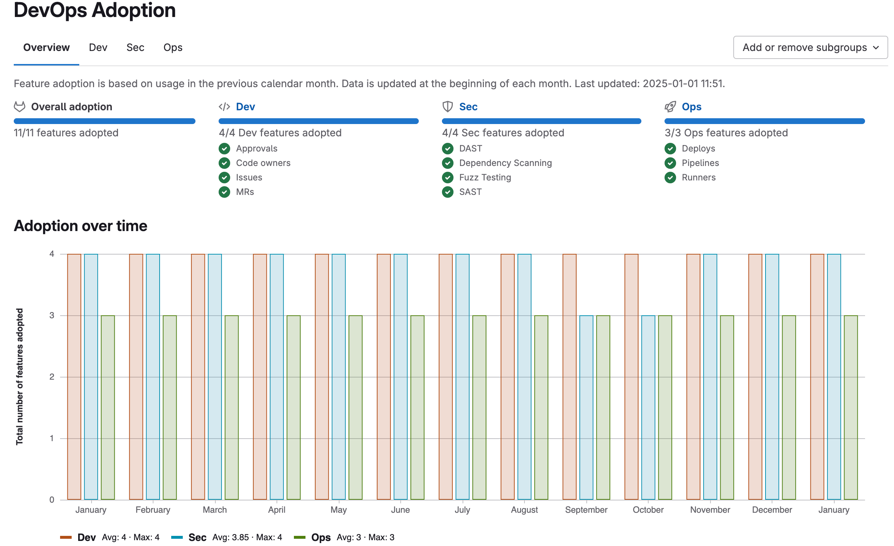



- Tier: 旗舰版
- Offering: JihuLab.com，私有化部署





- 在极狐GitLab 16.6 中引入到[注册功能计划](../../../administration/settings/usage_statistics.md#registration-features-program)。



DevOps 采用情况展示了你组织中的群组如何采用和使用极狐GitLab 功能。
此信息适用于群组和[实例](../../../administration/analytics/devops_adoption.md)。

使用群组 DevOps 采用情况可以：

- 识别在采用极狐GitLab 功能方面落后的子群组，以便你可以指导他们的 DevOps 之旅。
- 找到已采用某些功能的子群组，并为其他子群组提供关于如何使用这些功能的指导。
- 验证你是否从极狐GitLab 获得了预期的投资回报。

## 功能采用

DevOps 采用情况展示了开发、安全和运维方面的功能采用情况。

| 类别   | 功能                                                         |
|--------|--------------------------------------------------------------|
| 开发   | 审批 代码所有者 议题 合并请求                        |
| 安全   | DAST 依赖扫描 模糊测试 SAST                         |
| 运维   | 部署 流水线 Runners                                    |

当某个群组或子群组在上一个完整日历月内，在其项目中使用过某项功能时，该功能就会显示为**已采用**。
例如，如果某个群组内的项目中创建了一个议题，则该群组在此时间段内已采纳议题。

**概览**标签页展示了：

- 已采用功能的总数。
- 每个类别中已采用的功能。
- 在**随时间采用情况**条形图中，每月每个类别中已采用的功能数量。
  该图表仅显示自你为群组启用 DevOps 采用情况之日起的数据。
- 在**按子群组采用情况**表格中，每个子群组在每个类别中已采用的功能数量。

**开发**、**安全**和**运维**标签页按子群组展示了在开发、安全和运维方面已采用的功能。

DevOps 采用报告不包括：

- 休眠项目。使用某项功能的项目数量不予考虑。拥有许多休眠项目并不会降低采用率。
- 新的极狐GitLab 功能。采用情况是指已采用功能的总数，而不是功能的百分比。

## 数据处理

一项每周任务会处理 DevOps 采用情况的数据。
在你首次访问群组的 DevOps 采用情况之前，此任务是禁用的。

数据处理任务在每月的第一天更新数据。
如果月度更新失败，该任务会每天尝试，直至成功。

在极狐GitLab 处理群组数据期间，DevOps 采用情况数据可能需要最多一分钟才会显示。

## 查看群组 DevOps 采用情况

先决条件：

- 你必须具有该群组的报告者、开发者、维护者或所有者的角色。

查看 DevOps 采用情况：

1. 在顶部栏中，选择**搜索或跳转到**并找到你的群组。
1. 在左侧边栏中，选择**分析** > **DevOps 采用情况**。
1. 要查看一个月内按类别采用的功能，请将鼠标悬停在某个条形上。

## 将子群组添加到 DevOps 采用情况

先决条件：

- 你必须具有该群组的报告者、开发者、维护者或所有者的角色。

将子群组添加到 DevOps 采用情况报告：

1. 在顶部栏中，选择**搜索或跳转到**并找到你的群组。
1. 在左侧边栏中，选择**分析** > **DevOps 采用情况**。
1. 从**添加或移除子群组**下拉列表中，选择你要添加的子群组。

## 从 DevOps 采用情况中移除子群组

先决条件：

- 你必须具有该群组的报告者、开发者、维护者或所有者的角色。

从 DevOps 采用情况报告中移除子群组：

1. 在顶部栏中，选择**搜索或跳转到**并找到你的群组。
1. 在左侧边栏中，选择**分析** > **DevOps 采用情况**。
1. 任选其一：

- 从**添加或移除子群组**下拉列表中，取消选择你要移除的子群组。
- 在**按子群组采用情况**表格中，在你要移除的群组所在行，选择**从表格中移除群组**（）。