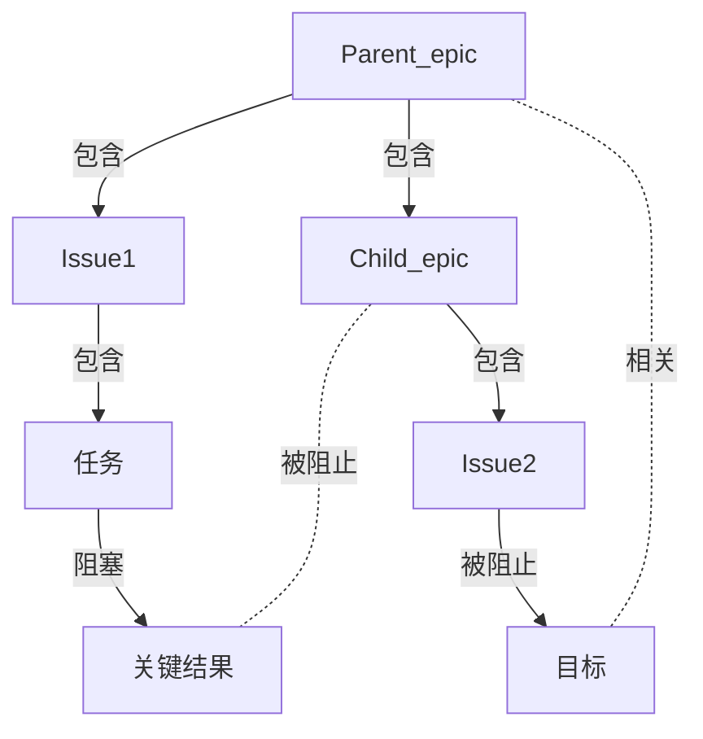



- Tier: 专业版，旗舰版
- Offering: JihuLab.com，私有化部署



在极狐GitLab 中，史诗用于协调和跟踪大型计划，通过将工作项组织到工作层级中来实现。
史诗让复杂项目易于管理。它们可以：

- 将大型功能分解为较小的、可逐步增加价值的可交付成果。
- 通过计划的开始和结束日期跟踪相关工作项的进展。
- 围绕功能范围和需求组织讨论和决策。
- 创建将任务与战略目标连接起来的层级结构。
- 构建可视化路线图以监控目标进展。

团队使用史诗跨多个迭代进行协调，并跟踪长期目标的进展。

在旗舰版中，[嵌套史诗](../../work_items/child_items.md#work-with-multi-level-hierarchies) 通过与敏捷框架一致的工作层级提供额外的结构。
将复杂项目分解为更易于管理的子史诗，这些子史诗可以进一步包含它们自己的议题和任务集合。
这种嵌套结构有助于保持清晰度，并确保项目的所有方面都得到覆盖，同时不忽视总体目标。

<!-- Video published on 2023-10-30 -->

## 史诗与其他项的关系

史诗与其他项的可能关系包括：

- 一个史诗是一个或多个议题的父级。
- 一个史诗是一个或多个[子史诗](../../work_items/child_items.md#work-with-multi-level-hierarchies) 的父级。仅旗舰版。
- 一个史诗与一个或多个任务、目标或关键结果 [相关联](linked_epics.md)。

关系示例集合：

### 来自不同群组层级的子议题

你可以将来自不同群组层级的议题添加到史诗中。
为此，在 [添加现有议题](../../work_items/child_items.md#add-an-existing-issue-to-an-epic) 时，粘贴议题 URL。

## 作为工作项的史诗



- 在极狐GitLab 17.2 中 [引入]，[有功能标志](../../../administration/feature_flags/_index.md) `work_item_epics`。默认禁用。在 [beta](../../../policy/development_stages_support.md#beta) 中引入。
- 在极狐GitLab 17.6 中 [在 JihuLab.com 上启用]。
- 在极狐GitLab 17.7 中 [默认在私有化部署中启用]。
- 在极狐GitLab 18.1 中 [GA]。功能标志 `work_item_epics` 已移除。



我们通过将史诗迁移到统一的工作项框架，改变了史诗的外观，以更好地满足我们的敏捷计划产品需求。

更多信息，请参见史诗 9290 和以下博客文章：

- [初探：极狐GitLab 全新的敏捷计划体验](https://gitlab.cn/blog/first-look-the-new-agile-planning-experience-in-gitlab/)（2024 年 6 月）
- [推出全新的史诗体验以改进敏捷计划](https://gitlab.cn/blog/unveiling-a-new-epic-experience-for-improved-agile-planning/)（2024 年 7 月）

### 工作项 Markdown 引用



- 在极狐GitLab 18.1 中 [引入]，[有功能标志](../../../administration/feature_flags/_index.md) `extensible_reference_filters`。默认禁用。
- 在极狐GitLab 18.2 中 [GA]。功能标志 `extensible_reference_filters` 已移除。



你可以在极狐GitLab 风格的 Markdown 字段中使用 `[work_item:123]` 来引用工作项。
更多信息，请参见 [极狐GitLab 特定引用](../../markdown.md#gitlab-specific-references)。