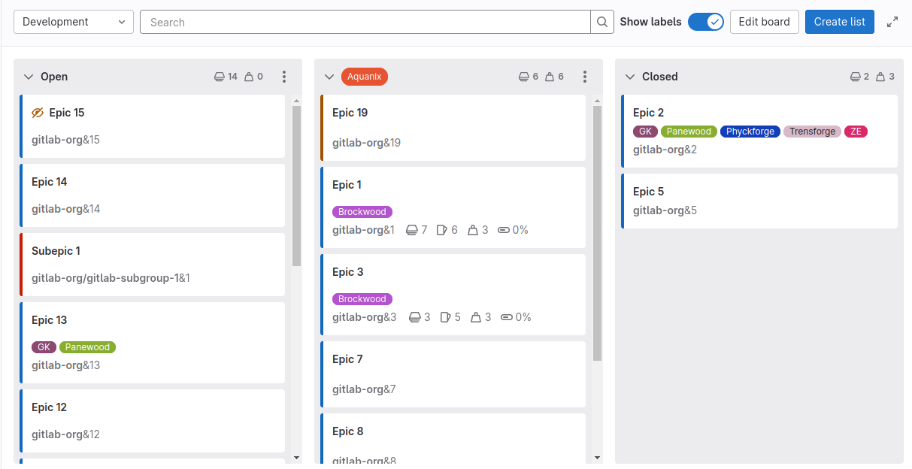
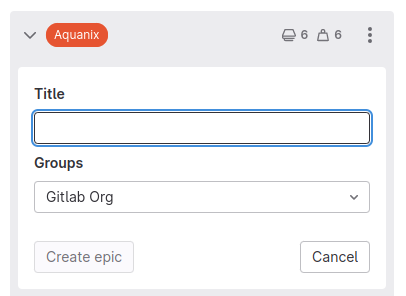



- Tier: 专业版，旗舰版
- Offering: JihuLab.com，私有化部署





- 在极狐GitLab 15.11 中引入了在列表顶部显示总权重。
- 在极狐GitLab 17.7 中，最低用户角色从报告者改为计划者。



史诗板建立在现有的[史诗跟踪功能](_index.md)和[标签](../../project/labels.md)之上。你的史诗以卡片形式显示在垂直列表中，按分配的标签进行组织。

在每个列表顶部，你可以看到列表中的史诗数量 () 以及所有史诗的总权重 ()。

要查看史诗板：

1. 在顶部栏中，选择 **搜索或跳转到** 并找到你的群组。
1. 在左侧边栏中，选择 **计划** > **史诗板**。

## 创建史诗板

先决条件：

- 你必须具有群组的计划者、报告者、开发者、维护者或所有者角色。

要创建新史诗板：

1. 在顶部栏中，选择 **搜索或跳转到** 并找到你的群组。
1. 在左侧边栏中，选择 **计划** > **史诗板**。
1. 在左上角，选择带有当前板名称的下拉列表。
1. 选择 **创建新板**。
1. 输入新板的标题。
1. 可选。要隐藏开放或已关闭列表，请清除 **显示开放列表** 和 **显示已关闭列表** 复选框。
1. 可选。设置板范围：
   1. 在 **范围** 旁边，选择 **展开**。
   1. 在 **标签** 旁边，选择 **编辑** 并选择要用作板范围的标签。
1. 选择 **创建板**。

现在你可以[添加一些列表](#create-a-new-list)。以后要更改这些选项，请[编辑板](#edit-the-scope-of-an-epic-board)。

## 删除史诗板

先决条件：

- 你必须具有群组的计划者、报告者、开发者、维护者或所有者角色。
- 群组中至少存在两个板。

要删除当前活动的史诗板：

1. 在史诗板页面的左上角，选择下拉列表。
1. 选择 **删除板**。
1. 选择 **删除**。

## 在史诗板上可以执行的操作

- [创建新列表](#create-a-new-list)。
- [移除现有列表](#remove-a-list)。
- [过滤史诗](#filter-epics)。
- 创建工作流，例如使用[议题板](../../../tutorials/plan_and_track.md)时。
- [移动史诗和列表](#move-epics-and-lists)。
- 更改史诗标签（通过将史诗从一个列表拖到另一个列表）。
- 关闭史诗（将其拖到 **已关闭** 列表）。
- [编辑板的范围](#edit-the-scope-of-an-epic-board)。

### 创建新列表



- 在极狐GitLab 17.5 中引入了在现有列表之间创建列表。



先决条件：

- 你必须具有群组的计划者、报告者、开发者、维护者或所有者角色。

要创建新列表：

1. 在顶部栏中，选择 **搜索或跳转到** 并找到你的群组。
1. 在左侧边栏中，选择 **计划** > **史诗板**。
1. 在右上角，选择 **新列表**。
1. 悬停或在两个列表之间移动键盘焦点。
1. 选择 **新列表**。
   新列表面板将打开。

   
1. 在 **新列表** 列中，展开 **选择标签** 下拉列表，并选择要用作列表范围的标签。
1. 选择 **添加到板**。

新列表将插入到与新列表面板相同位置的板上。

要移动和重新排序列表，请拖动它们。

或者，你可以选择板右侧末端的 **新列表**。新列表将插入到列表右侧末端，位于 **已关闭** 之前。

### 移除列表

移除列表不会对史诗和标签产生任何影响，因为只是移除了列表视图。以后你随时可以重新创建它。

先决条件：

- 你必须具有群组的计划者、报告者、开发者、维护者或所有者角色。

要从史诗板移除列表：

1. 在要移除的列表顶部，选择 **列表设置** 图标 ()。列表设置侧边栏将在右侧打开。
1. 选择 **移除列表**。
1. 在确认对话框中，选择 **确定**。

### 从史诗板创建史诗

先决条件：

- 你必须具有群组的计划者、报告者、开发者、维护者或所有者角色。
- 你必须首先[创建列表](#create-a-new-list)。

要从史诗板的列表创建史诗：

1. 在列表顶部，选择 **新建史诗** () 图标。
1. 输入新史诗的标题。
1. 选择 **创建史诗**。

### 编辑史诗

当你从史诗板选择史诗卡片时，史诗会在[抽屉中打开](manage_epics.md#open-epics-in-a-drawer)。在那里，你可以编辑所有字段，包括描述、评论或相关项。

### 过滤史诗

使用史诗板顶部的过滤器，仅显示你需要的结果。这与史诗列表中使用的过滤类似，因为史诗和标签的元数据在史诗板中被重用。

你可以按以下条件过滤：

- 作者
- 标签

### 查看史诗的工作项数量、权重和进度

史诗板上的史诗会显示其工作项、权重和进度的摘要。要查看已打开和已关闭的工作项数量以及已完成和未完成的权重，请将鼠标悬停在工作项图标 、权重图标  或进度图标  上。

### 移动史诗和列表

你可以通过拖动来移动史诗和列表。

先决条件：

- 你必须具有群组的计划者、报告者、开发者、维护者或所有者角色。

要移动史诗，请选择史诗卡片并将其拖动到其当前列表中的另一个位置或另一个列表中。了解可能的影响，请参阅[在列表之间拖动史诗](#dragging-epics-between-lists)。

要移动列表，请选择其顶部栏，然后水平拖动。你不能移动 **开放** 和 **已关闭** 列表，但在编辑史诗板时可以隐藏它们。

#### 将史诗移动到列表开头



- 在极狐GitLab 15.4 中引入。



当你有许多史诗时，手动将史诗从板列表底部拖动到顶部很不方便。你可以使用菜单快捷方式将史诗移动到列表顶部。

即使其他史诗被过滤器隐藏，你的史诗也会被移动到列表顶部。

先决条件：

- 你必须至少具有群组的计划者角色。

要将史诗移动到列表开头：

1. 在史诗板中，将鼠标悬停在要移动的史诗卡片上。
1. 选择 **卡片选项** ()，然后选择 **移动到列表开头**。

#### 将史诗移动到列表末尾



- 在极狐GitLab 15.4 中引入。



当你有许多史诗时，手动将史诗从板列表顶部拖动到底部很不方便。你可以使用菜单快捷方式将史诗移动到列表底部。

即使其他史诗被过滤器隐藏，你的史诗也会被移动到列表底部。

先决条件：

- 你必须至少具有群组的计划者角色。

要将史诗移动到列表末尾：

1. 在史诗板中，将鼠标悬停在要移动的史诗卡片上。
1. 选择 **卡片选项** ()，然后选择 **移动到列表末尾**。

#### 在列表之间拖动史诗

当你在列表之间拖动史诗时，结果因源列表和目标列表而异。

|                       | 至开放         | 至已关闭   | 至标签 B 列表                   |
| --------------------- | -------------- | ---------- | ------------------------------- |
| **从开放**            | -              | 关闭史诗   | 添加标签 B                      |
| **从已关闭**          | 重新打开史诗   | -          | 重新打开史诗并添加标签 B        |
| **从标签 A 列表**     | 移除标签 A     | 关闭史诗   | 移除标签 A 并添加标签 B         |

### 编辑史诗板的范围

先决条件：

- 你必须具有群组的计划者、报告者、开发者、维护者或所有者角色。

要编辑史诗板的范围：

1. 在右上角，选择 **配置板** ()。
1. 可选：
   - 编辑板的标题。
   - 显示或隐藏开放和已关闭列。
   - 选择其他标签作为板的范围。
1. 选择 **保存更改**。