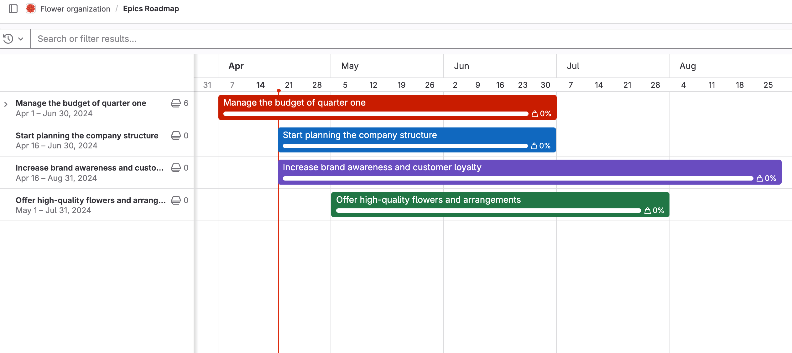
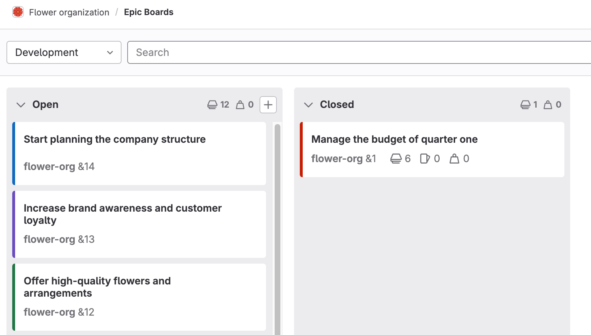



- Tier: 专业版，旗舰版
- Offering: JihuLab.com，私有化部署



本页面汇集了您可以使用[史诗](_index.md)或与其相关的所有操作说明。

有关管理史诗子项的信息，请参阅[子项](../../work_items/child_items.md)。

## 创建史诗

先决条件：

- 您必须拥有史诗所在群组的计划者、报告者、开发者、维护者或所有者角色。

要在您所在的群组中创建史诗：

1. 进入“新建史诗”表单：
   - 前往您的群组，从左侧边栏中选择 **工作项**。然后选择 **新建项**。
   - 在您群组中的某个史诗中，在右上角选择 **更多操作** ()。然后选择 **新建相关项**。
   - 从任意位置，在顶部菜单中选择 **新建** ()。然后选择 **新建工作项**。
   - 在空的[路线图](../roadmap/_index.md)中，选择 **新建工作项**。

1. 从 **类型** 下拉列表中，如果尚未选择 **史诗**，请选择它。
1. 填写字段。
   - 输入标题。
   - 输入描述。
   - 要[将史诗设为机密](#make-an-epic-confidential)，请选中 **开启机密性** 旁边的复选框。
   - 选择标记。
   - 选择开始和截止日期，或[继承](#start-and-due-date-inheritance)它们。
   - 选择[颜色](#epic-color)。
1. 选择 **创建史诗**。

新创建的史诗将打开。

### 开始和截止日期继承

如果您选择 **继承**：

- 对于 **开始日期**：极狐GitLab 会扫描分配给该史诗的所有子史诗和议题，并将开始日期设置为与子史诗或分配给子项的里程碑中找到的最早开始日期一致。
- 对于 **截止日期**：极狐GitLab 会扫描分配给该史诗的所有子史诗和议题，并将截止日期设置为与子史诗或分配给子项的里程碑中找到的最晚截止日期一致。

这些日期是动态的，如果发生以下任何情况，将重新计算：

- 子史诗的日期发生变化。
- 里程碑被重新分配给某个议题。
- 里程碑的日期发生变化。
- 议题被添加到史诗中或从史诗中移除。

由于史诗的日期可以继承其子项的日期，因此开始日期和截止日期会从底部向顶部传播。
如果最底层子史诗的开始日期发生变化，则该日期将成为其父史诗可能的最早开始日期。
父史诗的开始日期随后会反映此更改，并向上传播到顶级史诗。

## 编辑史诗

创建史诗后，您可以编辑以下详细信息：

- 标题
- 描述
- 开始日期
- 截止日期
- 标记
- 里程碑
- [颜色](#epic-color)

先决条件：

- 您必须拥有史诗所在群组的计划者、报告者、开发者、维护者或所有者角色。

要编辑史诗的标题或描述：

1. 选择 **编辑**。
1. 进行更改。
1. 选择 **保存更改**。

要编辑史诗的开始日期、截止日期、里程碑或标记：

1. 在右侧边栏中每个部分旁边，选择 **编辑**。
1. 为您的史诗选择日期、里程碑或标记。

### 重新排序史诗描述中的列表项

当您查看描述中包含列表的史诗时，您也可以重新排序列表项。

先决条件：

- 您必须拥有项目的计划者、报告者、开发者、维护者或所有者角色，是史诗的作者，或被指派到该史诗。
- 史诗的描述必须包含[有序、无序](../../markdown.md#lists)或[任务](../../markdown.md#task-lists)列表。

要重新排序列表项，在查看史诗时：

1. 将鼠标悬停在列表项行上，使拖动手柄图标 () 可见。
1. 选择并按住拖动手柄图标。
1. 将行拖到列表中的新位置。
1. 松开拖动手柄图标。

### 批量编辑史诗

先决条件：

- 您必须拥有父史诗所在群组的计划者、报告者、开发者、维护者或所有者角色。

要同时更新多个史诗：

1. 在顶部栏中，选择 **搜索或跳转到** 并找到您的群组。
1. 在左侧边栏中，选择 **计划** > **工作项**，然后按 **类型** = **史诗** 进行筛选。
1. 选择 **批量编辑**。右侧会出现一个带有可编辑字段的侧边栏。
1. 选中您要编辑的每个史诗旁边的复选框。
1. 从侧边栏中，编辑可用字段。
1. 选择 **更新所选**。

在群组中批量编辑史诗时，您可以编辑以下属性：

- 状态（开启或关闭）
- [指派人](#assignees)
- [标记](../../project/labels.md)
- [健康状态](#health-status)
- [通知](../../profile/notifications.md)订阅
- [机密性](#make-an-epic-confidential)
- [里程碑](../../project/milestones/_index.md)
- [父项](../../work_items/child_items.md#add-a-parent-epic-to-an-epic)

## 防止使用 **阅读更多** 截断描述

如果史诗描述很长，极狐GitLab 只显示其中的一部分。
要查看完整描述，您必须选择 **阅读更多**。
此截断功能使您无需滚动浏览冗长文本即可更轻松地找到页面上的其他元素。

要更改描述是否被截断：

1. 在史诗上，在右上角，选择 **更多操作** ()。
1. 根据您的偏好切换 **截断描述**。

此设置会被记住，并影响所有议题、任务、史诗、目标和关键结果。

## 隐藏右侧边栏

当空间允许时，史诗属性会显示在描述右侧的边栏中。

要隐藏侧边栏并为描述增加空间：

1. 在史诗上，在右上角，选择 **更多操作** ()。
1. 选择 **隐藏侧边栏**。

此设置会被记住，并影响所有议题、任务、史诗、目标和关键结果。

要再次显示侧边栏：

- 重复上述步骤并选择 **显示侧边栏**。

## 指派人



- Offering: JihuLab.com，私有化部署



一个史诗可以指派给一个或多个用户。

指派人可以根据需要随时更改。
其理念是，指派人是对史诗负责的人员。

如果用户不是群组成员，则只有当其他群组成员进行指派时，才能将史诗指派给他们。

### 更改史诗的指派人

先决条件：

- 您必须拥有群组的计划者、报告者、开发者、维护者或所有者角色。

要更改史诗的指派人：

1. 在顶部栏中，选择 **搜索或跳转到** 并找到您的群组。
1. 在左侧边栏中，选择 **计划** > **工作项**，然后按 **类型** = **史诗** 进行筛选。
1. 选择您的史诗进行查看。
1. 在右侧边栏的 **指派人** 部分，选择 **编辑**。
1. 从下拉列表中，选择要添加为指派人的用户。
1. 选择下拉列表外部的任意区域。

指派人即被更改，无需刷新页面。

## 史诗颜色



- Tier: 专业版，旗舰版



您可以为史诗设置颜色，以便在视觉上对任务进行分类和确定优先级。
使用颜色可以：

- 将史诗与团队或公司计划关联。
- 指示史诗层级中的级别。
- 将相关的史诗分组在一起。

史诗颜色在[路线图](../roadmap/_index.md)和[史诗看板](epic_boards.md)中可见。

在路线图上，时间轴条与史诗的颜色匹配：

在史诗看板上，颜色显示在史诗卡片的强调色上：

### 更改史诗的颜色

先决条件：

- 您必须拥有史诗所在群组的计划者、报告者、开发者、维护者或所有者角色。

要更改史诗的颜色：

1. 在顶部栏中，选择 **搜索或跳转到** 并找到您的群组。
1. 在左侧边栏中，选择 **计划** > **工作项**，然后按 **类型** = **史诗** 进行筛选。
1. 选择一个史诗。
1. 在右侧边栏的 **颜色** 部分，选择 **编辑**。
1. 选择现有颜色或输入 RGB 或十六进制值。
1. 选择对话框外部的任意区域。

史诗的颜色即被更新。

## 删除史诗

先决条件：

- 您必须拥有史诗所在群组的计划者或所有者角色。

要删除史诗：

1. 在右上角，选择 **更多操作** ()，然后选择 **删除史诗**。
1. 选择 **删除**。在确认对话框中，选择 **删除史诗**。

删除史诗会将系统中所有现有议题从其关联的史诗中解除关联。

## 关闭史诗

先决条件：

- 您必须拥有史诗所在群组的计划者、报告者、开发者、维护者或所有者角色。

要关闭史诗：

- 在右上角，选择 **更多操作** ()，然后选择 **关闭史诗**。

您也可以使用 [`/close` 快速操作](../../project/quick_actions.md#close)。

## 重新开启已关闭的史诗

您可以重新开启已关闭的史诗。

先决条件：

- 您必须拥有史诗所在群组的计划者、报告者、开发者、维护者或所有者角色。

要执行此操作，请执行以下任一操作：

- 在右上角，选择 **更多操作** ()，然后选择 **重新开启史诗**。
- 使用 [`/reopen` 快速操作](../../project/quick_actions.md#reopen)。

您也可以通过[将议题升级为史诗](../../project/issues/managing_issues.md#promote-an-issue-to-an-epic)来创建史诗。

## 从议题转到史诗

如果议题属于某个史诗，您可以从以下位置转到父史诗：

- 议题顶部的面包屑。
- 右侧边栏中的 **父项** 部分。

## 查看史诗列表

先决条件：

- 您必须是以下之一的成员：
  - 该群组
  - 该群组中的项目
  - 该群组任何后代群组中的项目

要查看群组中的史诗：

1. 在顶部栏中，选择 **搜索或跳转到** 并找到您的群组。
1. 在左侧边栏中，选择 **计划** > **工作项**，然后按 **类型** = **史诗** 进行筛选。

要设置史诗列表上显示的史诗属性，请[配置显示偏好](../../work_items/_index.md#configure-list-display-preferences)。

### 谁可以查看史诗

您是否可以查看史诗取决于[群组可见性级别](../../public_access.md)和史诗的[机密性状态](#make-an-epic-confidential)：

- 公开群组和非机密史诗：任何人都可以查看该史诗。
- 私有群组和非机密史诗：您必须拥有群组的访客、计划者、报告者、开发者、维护者或所有者角色，或者是该群组或其任何后代群组中项目的成员。
- 机密史诗（无论群组可见性如何）：您必须至少拥有群组的计划者角色。

查看史诗的权限与查看其子项的权限不同。
在 **子项** 部分，您只能看到您有权查看的条目。
条目计数和进度会包含您无法查看的条目。
有关更多信息，请参阅[查看史诗中议题的计数和权重](../../work_items/child_items.md#view-count-and-weight-of-issues-in-an-epic)。

### 在抽屉中打开史诗

当您从工作项页面或史诗看板中选择一个史诗时，它会在详细信息面板中打开。
然后您可以查看和编辑其详细信息，而不会丢失史诗列表或看板的上下文。

使用抽屉时：

- 从列表中选择一个史诗以在抽屉中打开它。
- 抽屉出现在屏幕右侧。
- 您可以直接在抽屉中编辑史诗。
- 要关闭抽屉，请选择关闭图标 () 或按 **Escape**。

#### 在完整页面视图中打开史诗

要在完整页面视图中打开史诗：

- 在新标签页中打开史诗。从工作项列表中，执行以下任一操作：
  - 右键单击史诗并在新的浏览器标签页中打开。
  - 按住 <kbd>Command</kbd> 或 <kbd>Control</kbd> 并选择该史诗。
- 选择一个史诗，然后从抽屉中，执行以下任一操作：
  - 在左上角，选择议题引用，例如 `my_project#123`。
  - 在右上角，选择 **在完整页面中打开** ()。

要始终在完整页面视图中打开工作项，请参阅[设置是否在抽屉中打开项的偏好](../../work_items/_index.md#configure-list-display-preferences)。

## 筛选史诗列表

您可以按以下条件筛选史诗列表：

- 标题或描述（选择 **在其中搜索**）
- 作者姓名 / 用户名
- 机密性
- 群组
- 健康
- 标记
- 里程碑
- 反应表情
- 父项
- 已订阅
- 为史诗启用的[自定义字段](../../work_items/custom_fields.md)

要筛选：

1. 在顶部栏中，选择 **搜索或跳转到** 并找到您的群组。
1. 在左侧边栏中，选择 **计划** > **工作项**，然后按 **类型** = **史诗** 进行筛选。
1. 根据需要选择其他筛选器、运算符和值。
   要按标题或描述搜索，请在筛选栏中输入。
1. 按 <kbd>Enter</kbd> 或选择放大镜 ()。

### 使用 OR 运算符筛选

当您按以下条件[筛选史诗列表](#filter-a-list-of-epics)时，可以使用 OR 运算符（**是以下之一：`||`**）：

- 指派人
- 作者
- 标记

`is one of` 表示包含性 OR。例如，如果您按 `Label is one of Deliverable` 和
`Label is one of UX` 进行筛选，极狐GitLab 会显示具有 `Deliverable`、`UX` 或两者标记的史诗。

## 对史诗列表排序

您可以按以下条件对史诗列表进行排序：

- 创建日期
- 更新日期
- 关闭日期
- 里程碑截止日期
- 截止日期
- 热度
- 标题
- 开始日期
- 健康
- 阻塞

每个选项都包含一个按钮，可以在 **升序** 和 **降序** 之间切换顺序。
排序选项和顺序会被保存，并在您浏览史诗的任何地方使用，包括[路线图](../roadmap/_index.md)。

## 更改活动排序顺序

您可以反转默认顺序，并按最新项在顶部的顺序与活动源进行交互。您的偏好会保存在本地存储中，并自动应用于您查看的每个史诗和议题。

要更改活动排序顺序，请选择 **最旧优先** 下拉列表，并选择要首先显示的最旧或最新项。

## 将史诗设为机密

如果您正在处理包含私人信息的项，您可以将史诗设为机密。

> [!note]
> 机密史诗只能包含[机密议题](../../project/issues/confidential_issues.md)
> 和机密的子史诗。但是，如果合并请求是在公开项目中创建的，则它们是公开的。
> 要创建机密的合并请求，请参阅[针对机密议题的合并请求](../../project/merge_requests/confidential.md)。

先决条件：

- 您必须拥有史诗所在群组的计划者、报告者、开发者、维护者或所有者角色。

要将史诗设为机密：

- **创建史诗时**：选中 **开启机密性** 旁边的复选框。
- **在现有史诗中**：在右上角，选择 **更多操作** ()。然后选择 **开启机密性**。

您也可以使用 [`/confidential` 快速操作](../../project/quick_actions.md#confidential)。

## 管理分配给史诗的议题

本节汇集了您可以对与史诗相关的[议题](../../project/issues/_index.md)执行的所有操作说明。

### 健康状态



- Tier: 旗舰版



使用史诗的健康状态来快速了解项目进度。
健康状态可帮助您主动沟通和管理潜在问题。

您可以在史诗视图以及 **子项** 和 **关联项** 部分中查看史诗的健康状态。

您可以将健康状态设置为：

- 正常（绿色）
- 需要注意（琥珀色）
- 有风险（红色）

要解决影响计划工作按时交付的风险，请将史诗健康状态审查纳入您的：

- 每日站会
- 项目状态报告
- 每周会议

#### 更改史诗的健康状态

先决条件：

- 您必须拥有群组的计划者、报告者、开发者、维护者或所有者角色。

要更改史诗的健康状态：

1. 在顶部栏中，选择 **搜索或跳转到** 并找到您的群组。
1. 在左侧边栏中，选择 **计划** > **工作项**，然后按 **类型** = **史诗** 进行筛选。
1. 选择一个史诗。
1. 在右侧边栏的 **健康状态** 部分，选择 **编辑**。
1. 从下拉列表中，选择一个状态。

史诗的健康状态即被更新。

您也可以使用 [`/health_status`](../../project/quick_actions.md#health_status) 和 [`/clear_health_status`](../../project/quick_actions.md#clear_health_status) 快速操作来设置和清除健康状态。

### 参与者

参与者是与史诗交互过的用户。
有关查看参与者的信息，请参阅[参与者](../../participants.md)。
