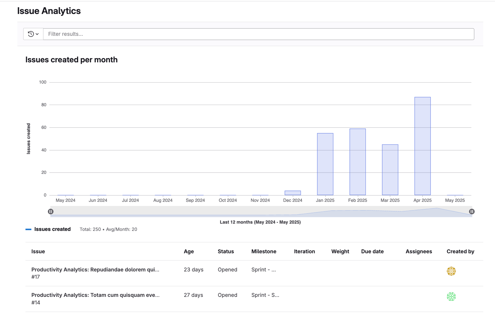
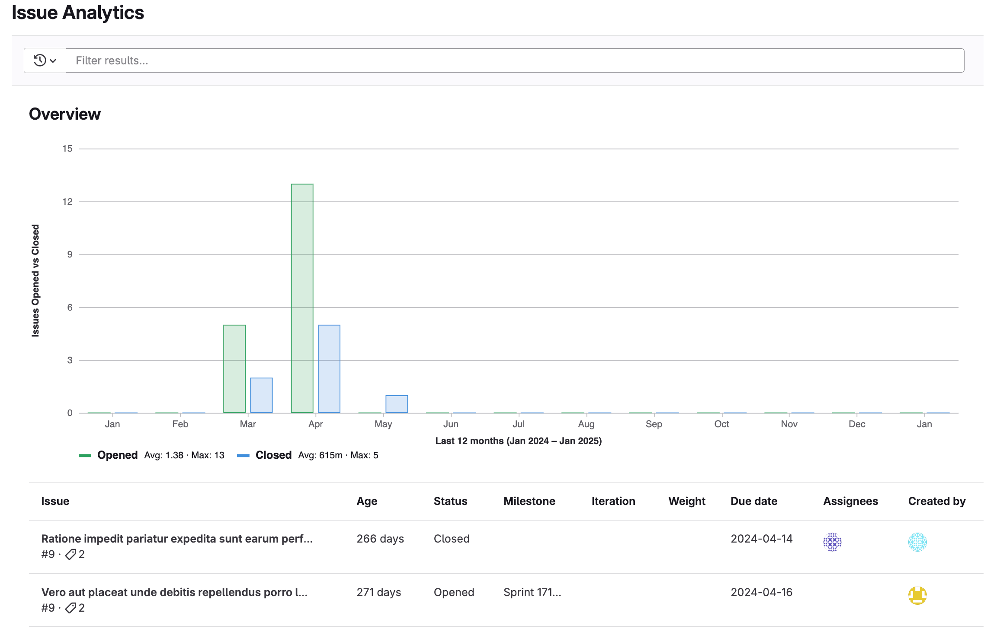



- Tier: 专业版，旗舰版
- Offering: JihuLab.com，私有化部署



议题分析提供了关于群组或项目中每月创建的议题的洞察。
柱状图展示每月打开和关闭的议题数量。
表格显示基于全局页面过滤器的前 100 个议题，包含每个议题的以下详情：

- 名称
- 存在时长
- 状态
- 里程碑
- 迭代
- 权重
- 截止日期
- 指派人
- 作者

## 查看议题分析

查看议题分析：

1. 在顶部栏中，选择 **搜索或跳转到** 并找到您的项目或群组。
1. 在左侧边栏中，选择 **分析** > **议题分析**。要查看某个月份的议题总数，请将鼠标悬停在对应柱子上。
1. 可选。要过滤结果，在 **搜索或过滤结果** 文本框中，输入您的条件：

   - 作者
   - 指派人
   - 里程碑
   - 标签
   - 我的反应
   - 权重

1. 可选。要更改显示的总月数，将参数 `months_back=n` 附加到 URL 后。
   例如，`https://jihulab.com/groups/gitlab-cn/-/issues_analytics?months_back=15`
   会显示极狐GitLab.org 群组 15 个月的数据图表。

您也可以通过 **新建议题** 下钻报告从 [价值流仪表板](../../analytics/value_streams_dashboard.md) 访问议题分析。

### 增强议题分析



- Tier: 旗舰版
- Offering: JihuLab.com，私有化部署





- [引入](/) 于极狐GitLab 16.3 [使用功能标志](../../../administration/feature_flags/_index.md) 名为 `issues_completed_analytics_feature_flag`。默认禁用。
- [在极狐GitLab 16.8 中在 JihuLab.com 和私有化部署上启用](/)。
- [功能标志 `issues_completed_analytics_feature_flag`](/) 在极狐GitLab 16.10 中移除。



增强议题分析显示额外指标 `已关闭议题`，代表所选时间段内您的群组中已解决的议题总数。
您可以使用此指标提升整体周转时间并为客户交付更多价值。

