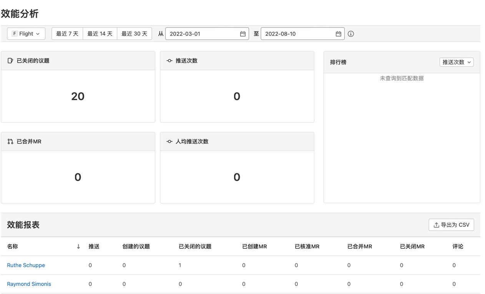
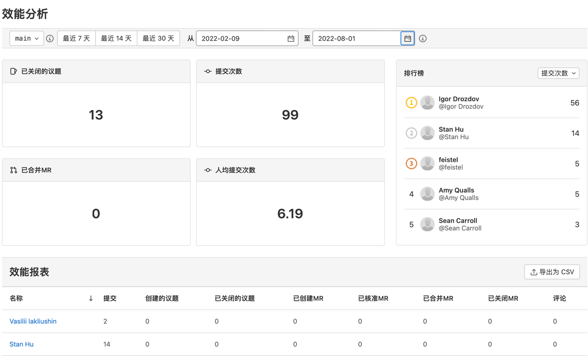

# 效能分析  **(PREMIUM)**

效能分析可以帮助您查看并分析人员在一段时间内的贡献情况，进而识别出需要帮助的人员，提高贡献效率。您可以通过群组和项目两个维度查看效能分析数据。

## 查看效能分析

查看效能分析，您需要：

1. 启动极狐GitLab Rails 控制台，在控制台中运行 `Feature.enable(:performance_analytics)`，启用效能分析功能开关。详情请参见[功能标志文档](../../../administration/feature_flags.md)（效能分析的功能标志为 performance_analytics）。
2. 在极狐GitLab 首页的左侧边栏中，选择 **搜索或转到**。
3. 选择您想要查看效能分析的群组或项目。
4. 在左侧边栏中，选择 **分析 > 效能分析**。

群组维度的效能分析页面如下：

项目维度的效能分析页面如下：

## 组成部分

效能分析页面主要由四个部分组成：

* 筛选器
* 效能指标
* 排行榜
* 效能报表

### 筛选器

您可以通过筛选器查看贡献人员在特定项目、分支及时间段内的贡献情况。

选择项目：您可以查看人员关于特定项目的贡献情况。默认展示所有项目的数据，且项目支持多选。
页面展示数据均基于所选项目的所有分支。

选择分支：您可以查看人员关于特定分支的贡献情况，分支选项仅影响代码提交次数的数据。默认展示该项目的默认分支的数据，分支不支持多选。

最近 7 天：过去 7 天内人员的贡献情况。

最近 14 天：过去 14 天内人员的贡献情况。

最近 30 天：过去 30 天内人员的贡献情况。（默认）

从/至：自定义时间段内人员的贡献情况。起止时间间隔不能超过 180 天。

### 效能指标

系统通过四个指标展示人员在特定项目、分支及时间段内的贡献情况。在群组维度中，页面统计人员的代码推送情况；在项目维度中，页面统计人员的代码提交情况。

* 已关闭的议题
* 提交/推送次数
* 已合并MR
* 人均提交/推送次数

### 排行榜

对人员的贡献数量进行从高到低的排行，排行指标可以是提交/推送次数、已关闭的议题或已合并MR。默认排行指标为提交/推送次数，且最多展示 20 个人员。

### 效能报表

以报表的形式展示人员不同指标的贡献情况。

指标包括：

* 提交/推送
* 创建的议题
* 已关闭的议题
* 已创建MR
* 已核准MR
* 已合并MR
* 已关闭MR
* 评论

效能分析页面统计参与贡献的人员的数据，如果一个群组成员从未进行过贡献，页面上不会出现其名字及数据；如果一个群组成员进行过贡献，但是现在已经离开群组，其名字和贡献情况依然会显示在统计信息中。

当一个议题被反复打开和关闭时，它的**创建的议题**的数量统计为 1，**已关闭的议题**的数量统计为关闭的次数。

您可以点击效能指标的名称对人员的贡献数量进行排序，也可以点击 **导出为 CSV** 将报表导出为 CSV 文件。

