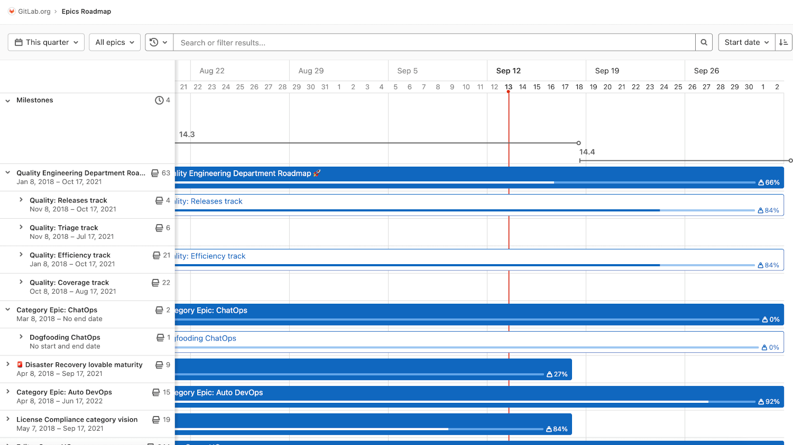
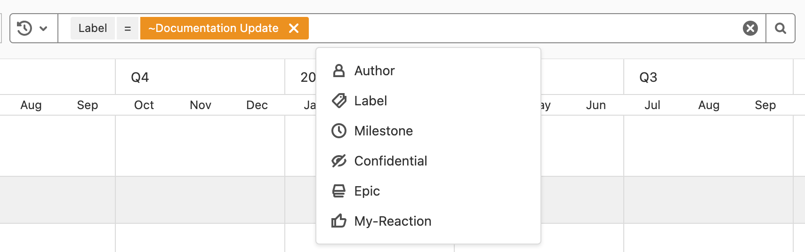
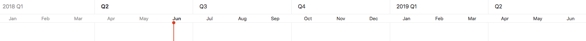
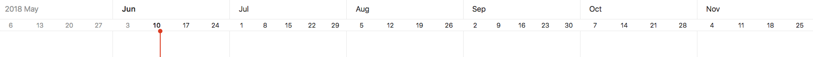
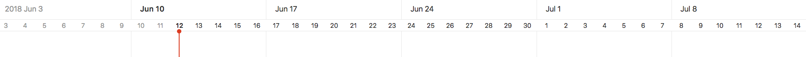
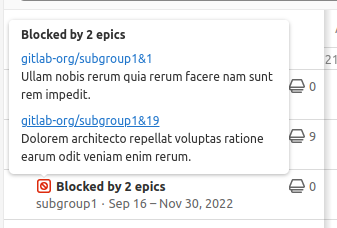



- Tier: 专业版，旗舰版
- Offering: JihuLab.com，私有化部署



群组中包含开始日期或截止日期的史诗，可以以时间线的形式可视化呈现。

极狐GitLab 中的路线图以时间线视图（即甘特图）提供史诗和里程碑的计划工作与进展的高层概览。
使用路线图来可视化和传达您项目的战略方向与依赖关系。

史诗路线图提供以下优势：

- 使团队围绕共同的愿景和目标保持一致。
- 协助长期规划和资源分配。
- 及早识别潜在的阻碍、依赖和风险。
- 让利益相关者清晰了解项目的时间线和里程碑。
- 帮助跟踪和更新项目进度。

## 查看路线图

要在群组中查看路线图：

1. 在顶部栏中，选择 **搜索或跳转到** 并找到您的群组。
1. 在左侧边栏中，选择 **计划** > **路线图**。

路线图显示某个群组、其某个子群组，或这些群组中某个项目内的史诗和里程碑。

在史诗条上，您可以看到每个史诗的标题、进度和已完成权重百分比。
当您将鼠标悬停在史诗条上时，会出现一个弹出框，显示史诗的标题、开始日期、截止日期和已完成权重。

您可以展开包含子史诗的史诗，以在路线图中显示其子史诗。
您可以选择史诗标题旁边的箭头 () 来展开和折叠子史诗。

在里程碑条顶部，您可以看到其标题。当您指向里程碑条或标题时，会出现一个弹出框，显示其标题、开始日期和截止日期。您还可以选择 **里程碑** 标题旁边的箭头 () 来切换里程碑条的列表。

您还可以从史诗中[查看筛选为此史诗后代的路线图](../../work_items/child_items.md#view-child-epics-on-a-roadmap)。

## 排序和筛选路线图

> [!note]
> 按里程碑筛选路线图可能对您不可用。请务必查看本节的历史记录以了解详情。

当您想要探索路线图时，有几种方法可以通过排序史诗或按对您重要的条件进行筛选来使其更易于使用。

在路线图视图中，您可以按以下条件对史诗进行排序：

- 开始日期
- 截止日期
- 标题
- 创建日期
- 最后更新日期

每个选项都包含一个按钮，可在 **升序** 和 **降序** 之间切换排序顺序。排序选项和顺序在浏览史诗时会保留，包括[史诗列表视图](../epics/_index.md)。

在路线图视图中，您还可以按史诗的以下条件进行筛选：

- 作者
- 标记
- 里程碑
- [机密性](../epics/manage_epics.md#make-an-epic-confidential)
- 史诗
- 您的回应
- 群组

您还可以从史诗中[查看筛选为此史诗后代的路线图](../../work_items/child_items.md#view-child-epics-on-a-roadmap)。

### 提高路线图的性能

如果您的群组包含大量史诗，使用筛选器可以减少路线图的加载时间。
筛选路线图会减少路线图包含的数据量。减少路线图中的数据也可以让您更容易找到所需的信息。

特别是，基于标记的筛选可以显著提高性能。

设置好要应用的筛选器后，您可以将 URL 保存为浏览器中的书签。
将来，您可以使用该书签快速加载筛选后的路线图。

### 路线图设置

当您启用路线图设置侧边栏时，可以使用它来细化路线图中显示的史诗。

您可以配置以下内容：

- 选择日期范围。
- 打开或关闭里程碑，并选择显示所有、群组、子群组或项目里程碑。
- 显示所有、已开启或已关闭的史诗。
- 打开或关闭子议题的进度跟踪，并选择使用议题权重或计数来计算进度。
- 打开或关闭标记。

路线图配置设置不会保存在用户偏好中，而是通过 URL 参数保存或共享。

## 时间线时长

### 日期范围预设

路线图提供以下日期范围选项，每个选项都有预定的时间线时长：

- **本季度**：包含当前季度中的周。
- **今年**：包含当前年份中的周或月。
- **3 年内**：包含过去 18 个月和未来 18 个月（共三年）中的周、月或季度。

### 布局预设

根据所选的[日期范围预设](#date-range-presets)，路线图支持以下布局预设：

- **季度**：仅在选择了 **3 年内** 日期范围时可用。
- **月**：在选择了 **今年** 或 **3 年内** 日期范围时可用。
- **周**（默认）：适用于所有日期范围预设。

### 季度

在 **季度** 预设中，路线图显示开始或截止日期落在当前所选日期范围预设内的史诗和里程碑，其中今天由时间线中的垂直红线表示。时间线标题上季度名称下方的子标题代表该季度的月份。

### 月

在 **月** 预设中，路线图显示开始或截止日期落在当前所选日期范围预设内或贯穿其中的史诗和里程碑，其中今天由时间线中的垂直红线表示。时间线标题上月份名称下方的子标题代表该周开始日（星期日）的日期。此预设为默认选择。

### 周

在 **周** 预设中，路线图显示开始或截止日期落在当前所选日期范围预设内或贯穿其中的史诗和里程碑，其中今天由时间线中的垂直红线表示。时间线标题上星期名称下方的子标题代表一周中的各天。

## 路线图时间线条

时间线条根据史诗或里程碑的开始和截止日期指示其大致位置。

## 被阻塞的史诗



- Tier: 旗舰版
- Offering: JihuLab.com，私有化部署



如果史诗[被另一个史诗阻塞](../epics/linked_epics.md#blocking-epics)，其标题旁边会出现一个图标以指示其阻塞状态。

当您将鼠标悬停在阻塞图标 () 上时，会显示一个包含详细信息的弹出框。

