

- Tier: 专业版，旗舰版
- Offering: JihuLab.com



这些是关于群组 SAML 和 SCIM 的笔记和截图，极狐GitLab 支持团队在排查问题时偶尔会使用，但它们并不适合放入官方文档。极狐GitLab 将其公开，以便任何人都可以利用支持团队收集的知识。

请参阅 极狐GitLab [群组 SAML](_index.md) 文档，了解该功能及其设置方法。

在排查 SAML 配置问题时，极狐GitLab 团队成员通常会先从 [SAML 故障排查部分](_index.md#troubleshooting) 开始。

然后他们可能会设置所需身份提供商的测试配置。我们在本节中提供了示例截图。

<a id="saml-and-scim-screenshots"></a>

## SAML 和 SCIM 截图

本节包含以下 [群组 SAML](_index.md) 和 [群组 SCIM](scim_setup.md) 示例配置的相关截图：

- [Azure Active Directory](#azure-active-directory)
- [AWS IAM Identity Center](#aws-iam-identity-center)
- [Google Workspace](#google-workspace)
- [Okta](#okta)
- [OneLogin](#onelogin)

> [!warning]
> 这些截图仅在极狐GitLab 支持团队需要时更新。它们 **不是** 官方文档。

如果您当前遇到极狐GitLab 问题，可以查看您的 [支持选项](https://about.gitlab.com/support/)。

<a id="azure-active-directory"></a>

## Azure Active Directory

此部分包含 Azure Active Directory 配置相关元素的截图。

<a id="basic-saml-app-configuration"></a>

### 基本 SAML 应用配置

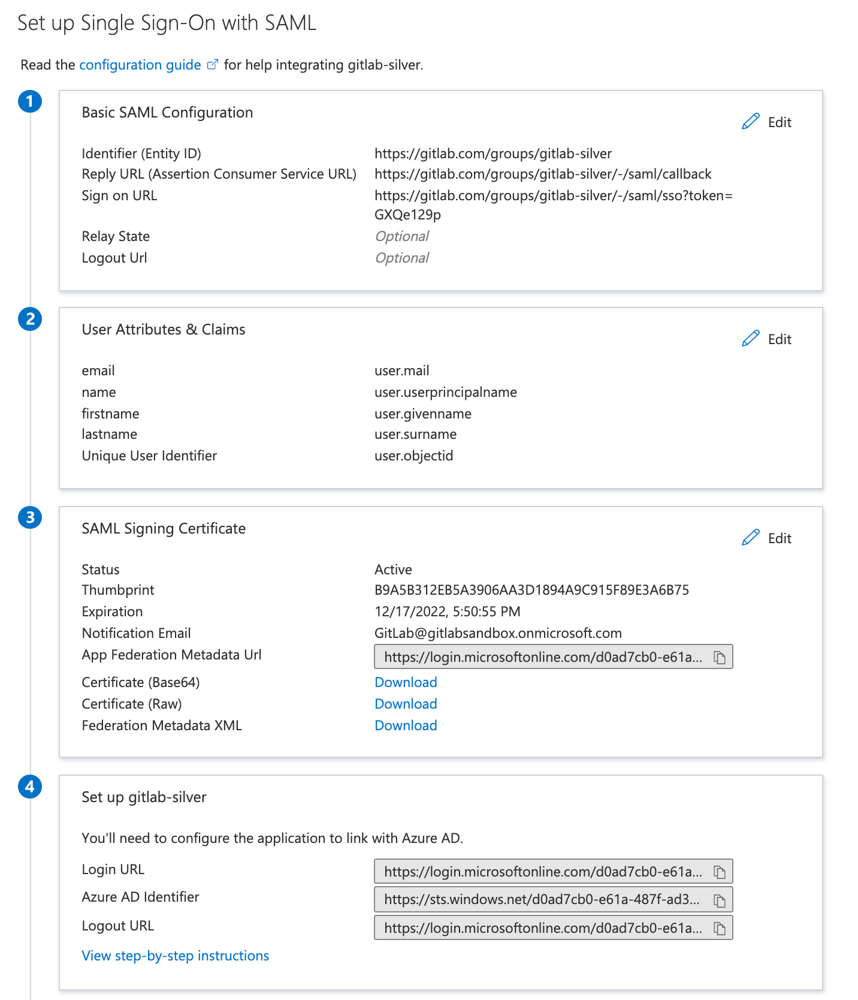

<a id="user-claims-and-attributes"></a>

### 用户声明和属性

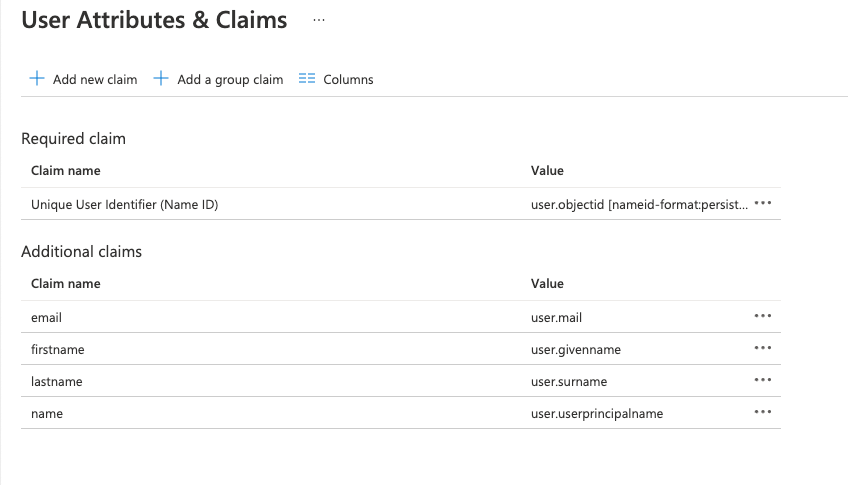

<a id="scim-mapping"></a>

### SCIM 映射

预配：

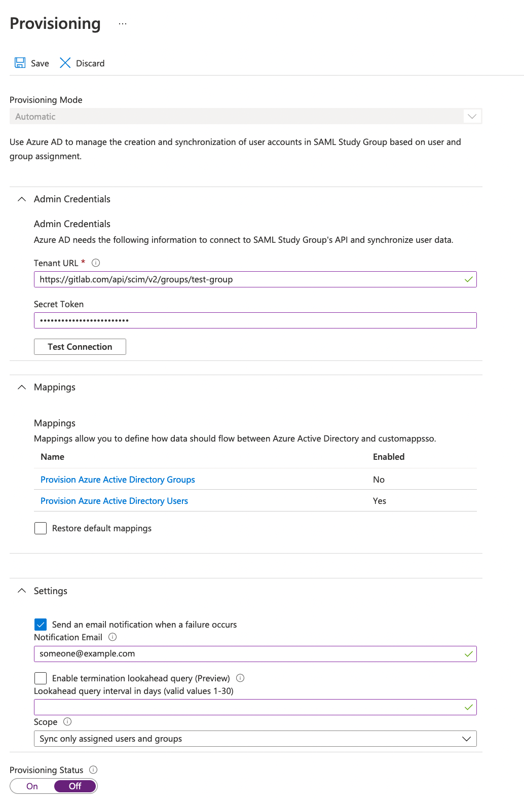

<a id="attribute-mapping"></a>

### 属性映射

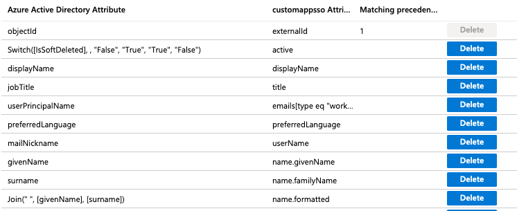

<a id="group-sync"></a>

### 群组同步

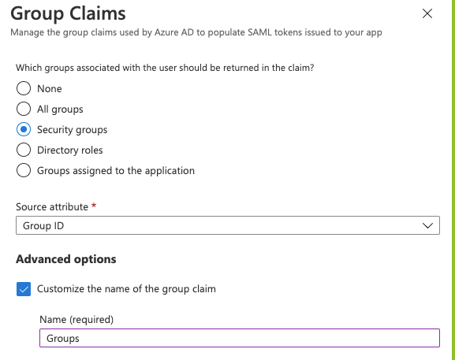

使用 **群组 ID** 源属性要求用户在配置 SAML 群组链接时输入群组 ID 或对象 ID。

如果可以，您也可以添加用户友好的群组名称。在设置 Azure 群组声明时：

1. 选择 **sAMAccountName** 源属性。
1. 输入群组名称。您可以指定一个最长 256 个字符的名称。
1. 要确保该属性是断言的一部分，请选择 **仅为云专用群组发出群组名称**。

[Azure AD 将可在 SAML 响应中发送的群组数量限制为 150 个](https://support.esri.com/en-us/knowledge-base/when-azure-ad-is-the-saml-identify-provider-the-group-a-000022190)。如果用户是 150 个以上群组的成员，Azure 不会在 SAML 响应中包含该用户的群组声明。

<a id="google-workspace"></a>

## Google Workspace

<a id="google-workspace-basic-saml-app-configuration"></a>

### 基本 SAML 应用配置

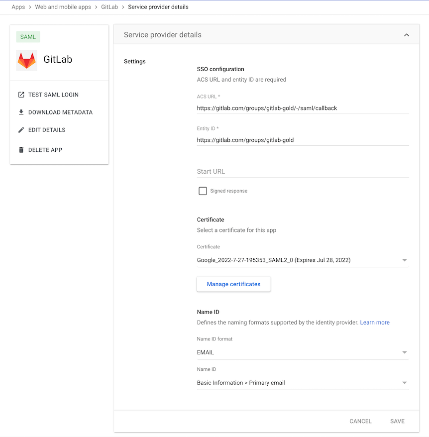

<a id="google-workspace-user-claims-and-attributes"></a>

### 用户声明和属性

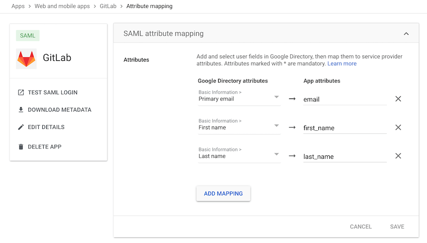

<a id="idp-links-and-certificate"></a>

### 身份提供商链接和证书

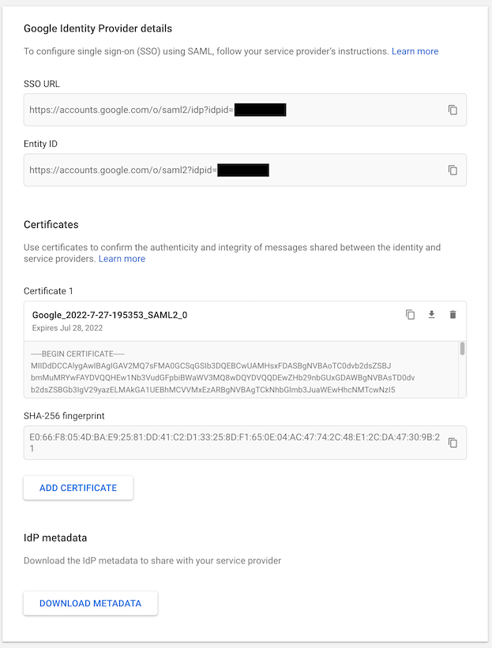

<a id="okta"></a>

## Okta

<a id="basic-saml-app-configuration-for-gitlab-com-groups"></a>

### JihuLab.com 群组的基本 SAML 应用配置

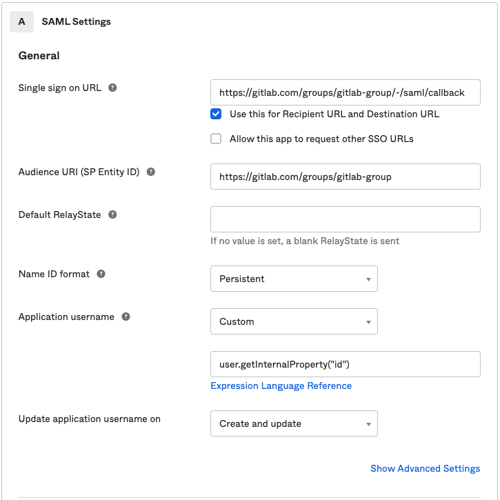

<a id="basic-saml-app-configuration-for-gitlab-self-managed"></a>

### 极狐GitLab 私有化部署的基本 SAML 应用配置

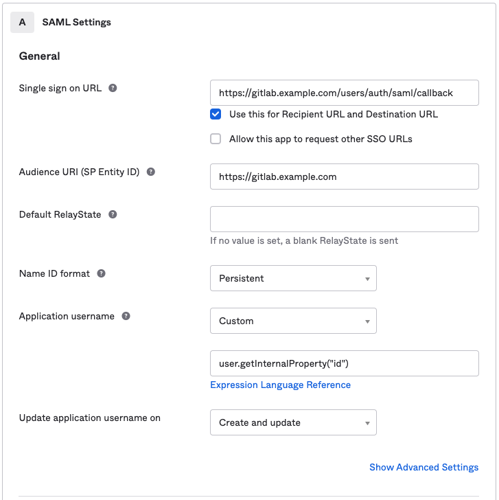

<a id="okta-user-claims-and-attributes"></a>

### 用户声明和属性

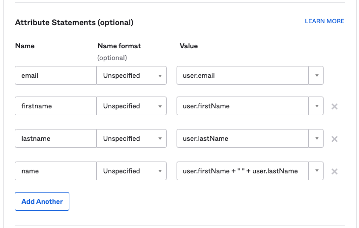

<a id="okta-group-sync"></a>

### 群组同步

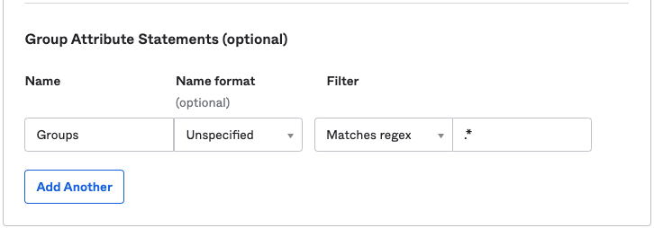

<a id="advanced-saml-app-settings-defaults"></a>

### 高级 SAML 应用设置（默认值）

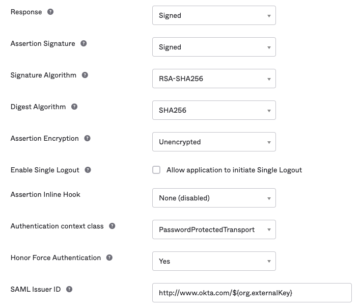

<a id="okta-idp-links-and-certificate"></a>

### 身份提供商链接和证书

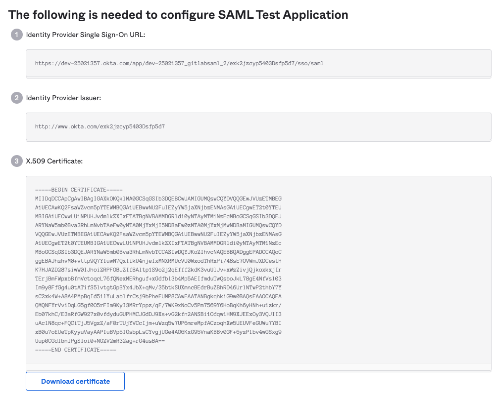

<a id="saml-sign-on-settings"></a>

### SAML 登录设置

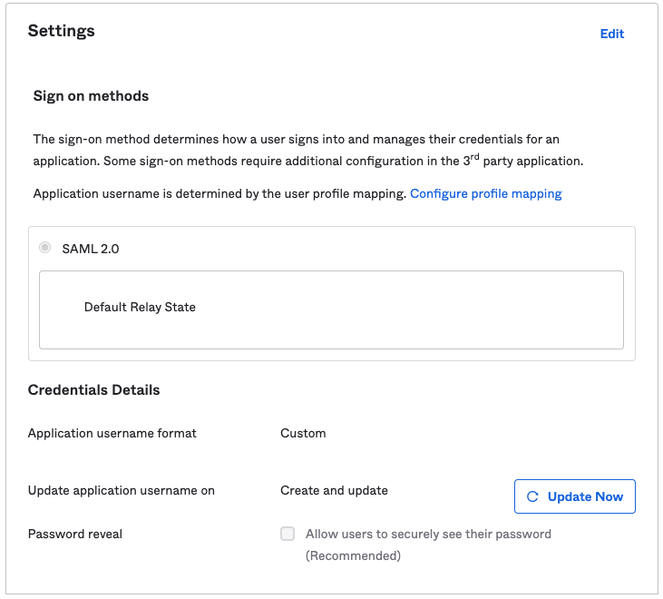

<a id="scim-settings"></a>

### SCIM 设置

在为新建用户分配 SCIM 应用时设置用户名：

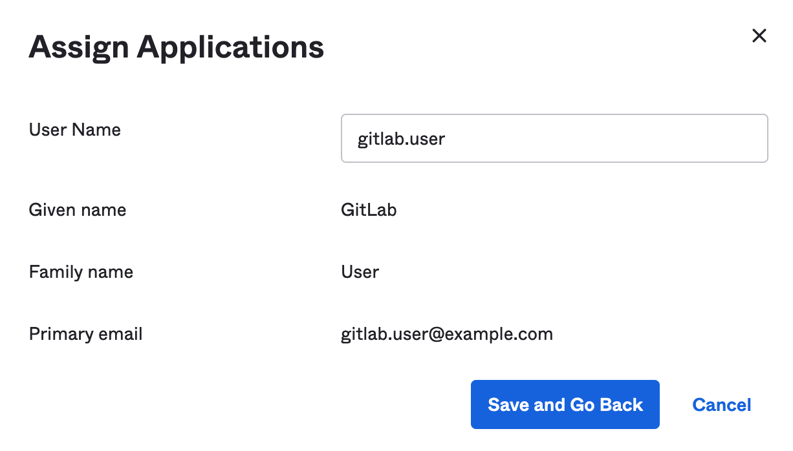

<a id="onelogin"></a>

## OneLogin

<a id="onelogin-basic-saml-app-configuration"></a>

### 基本 SAML 应用配置

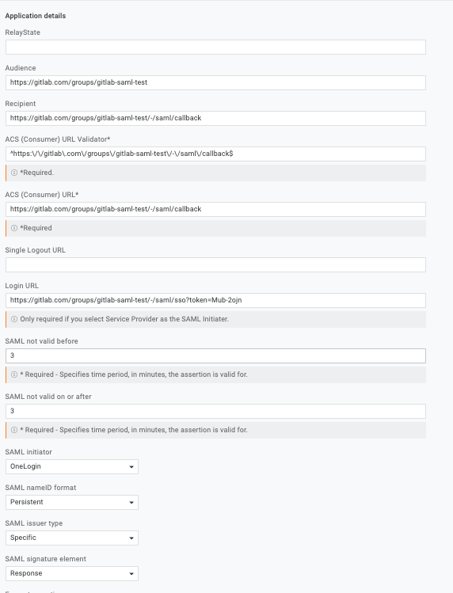

<a id="parameters"></a>

### 参数

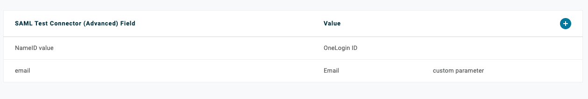

<a id="adding-a-user"></a>

### 添加用户

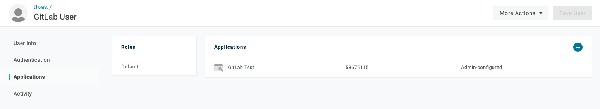

<a id="sso-settings"></a>

### 单点登录设置

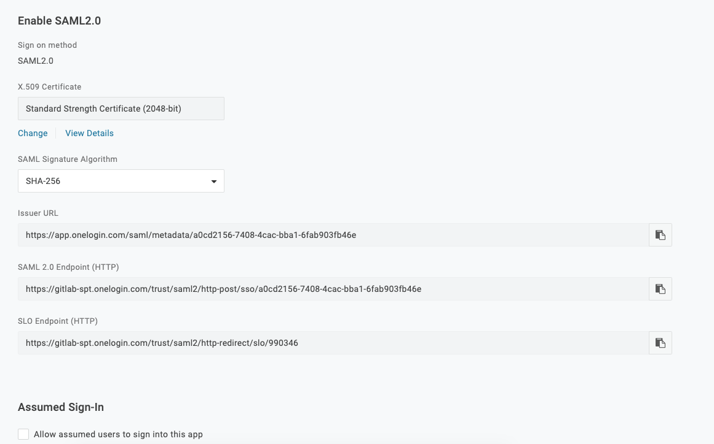

<a id="aws-iam-identity-center"></a>

## AWS IAM Identity Center

使用下表中的值配置 AWS IAM Identity Center。有关完整设置说明，请参阅 [AWS IAM Identity Center](_index.md#aws-iam-identity-center)。

<a id="application-properties"></a>

### 应用程序属性

在 AWS IAM Identity Center 中设置您自己的 SAML 2.0 应用程序时，需要配置以下应用程序属性：

| AWS Identity Center 字段       | 值                                                                                         |
| ------------------------------- | --------------------------------------------------------------------------------------------- |
| **应用程序 ACS URL**         | 您的群组的 **断言消费者服务 URL**（来自 极狐GitLab **SAML SSO** 设置）           |
| **应用程序 SAML 受众**   | 您的群组的 **标识符**（来自 极狐GitLab **SAML SSO** 设置）                               |
| **应用程序启动 URL**       | 您的群组的 **极狐GitLab 单点登录 URL**（来自 极狐GitLab **SAML SSO** 设置）                |

设置 **应用程序启动 URL** 以进行 SP 发起的登录。如果不设置，现有用户将无法关联其账户。

<a id="attribute-mappings"></a>

### 属性映射

| 属性      | 值                | 格式        |
| -------------- | -------------------- | ------------- |
| **主体**    | `${user:email}`      | `unspecified` |
| **email**      | `${user:email}`      | `unspecified` |
| **first_name** | `${user:givenName}`  | `unspecified` |
| **last_name**  | `${user:familyName}` | `unspecified` |

> [!warning]
> 您必须将 **主体** (NameID) 格式设置为 `unspecified`。如果设置为 `persistent` 或 `transient`，现有的极狐GitLab 用户在尝试通过 SAML 关联其账户时会收到 `403` 错误。此错误仅在账户关联时发生，不影响通过 AWS IAM Identity Center 预配的新用户。

<a id="gitlab-saml-sso-settings"></a>

### 极狐GitLab SAML SSO 设置

| 极狐GitLab 字段                             | 值                                                                           |
| ---------------------------------------- | ------------------------------------------------------------------------------- |
| **身份提供商单点登录 URL** | **IAM Identity Center 登录 URL**（来自应用程序的 **IAM Identity Center SAML 元数据** 部分）|
| **证书指纹**              | 从 AWS Identity Center 下载的证书的 SHA1 指纹         |

<a id="saml-response-example"></a>

## SAML 响应示例

当用户使用 SAML 登录时，极狐GitLab 会收到一个 SAML 响应。该 SAML 响应可作为 base64 编码的消息在 `production.log` 日志中找到。通过搜索 `SAMLResponse` 来定位响应。解码后的 SAML 响应为 XML 格式。例如：

```xml
<?xml version="1.0" encoding="UTF-8"?>
<saml2p:Response xmlns:saml2p="urn:oasis:names:tc:SAML:2.0:protocol" xmlns:xs="http://www.w3.org/2001/XMLSchema" Destination="https://gitlabexample/-/saml/callback" ID="id4898983630840142426821432" InResponseTo="_c65e4c88-9425-4472-b42c-37f4186ac0ee" IssueInstant="2022-05-30T21:30:35.696Z" Version="2.0">
 <saml2:Issuer xmlns:saml2="urn:oasis:names:tc:SAML:2.0:assertion" Format="urn:oasis:names:tc:SAML:2.0:nameid-format:entity">http://www.okta.com/exk2y6j57o1Pdr2lI8qh7</saml2:Issuer>
 <ds:Signature xmlns:ds="http://www.w3.org/2000/09/xmldsig#">
   <ds:SignedInfo>
     <ds:CanonicalizationMethod Algorithm="http://www.w3.org/2001/10/xml-exc-c14n#"/>
     <ds:SignatureMethod Algorithm="http://www.w3.org/2001/04/xmldsig-more#rsa-sha256"/>
     <ds:Reference URI="#id4898983630840142426821432">
       <ds:Transforms>
         <ds:Transform Algorithm="http://www.w3.org/2000/09/xmldsig#enveloped-signature"/>
         <ds:Transform Algorithm="http://www.w3.org/2001/10/xml-exc-c14n#">
           <ec:InclusiveNamespaces xmlns:ec="http://www.w3.org/2001/10/xml-exc-c14n#" PrefixList="xs"/>
         </ds:Transform>
       </ds:Transforms>
       <ds:DigestMethod Algorithm="http://www.w3.org/2001/04/xmlenc#sha256"/>
       <ds:DigestValue>neiQvv9d3OgS4GZW8Nptp4JhjpKs3GCefibn+vmRgk4=</ds:DigestValue>
     </ds:Reference>
   </ds:SignedInfo>
   <ds:SignatureValue>dMsQX8ivi...HMuKGhyLRvabGU6CuPrf7==</ds:SignatureValue>
   <ds:KeyInfo>
     <ds:X509Data>
       <ds:X509Certificate>MIIDq...cptGr3vN9TQ==</ds:X509Certificate>
     </ds:X509Data>
   </ds:KeyInfo>
 </ds:Signature>
 <saml2p:Status xmlns:saml2p="urn:oasis:names:tc:SAML:2.0:protocol">
   <saml2p:StatusCode Value="urn:oasis:names:tc:SAML:2.0:status:Success"/>
 </saml2p:Status>
 <saml2:Assertion xmlns:saml2="urn:oasis:names:tc:SAML:2.0:assertion" xmlns:xs="http://www.w3.org/2001/XMLSchema" ID="id489" IssueInstant="2022-05-30T21:30:35.696Z" Version="2.0">
   <saml2:Issuer xmlns:saml2="urn:oasis:names:tc:SAML:2.0:assertion" Format="urn:oasis:names:tc:SAML:2.0:nameid-format:entity">http://www.okta.com/exk2y6j57o1Pdr2lI8qh7</saml2:Issuer>
   <ds:Signature xmlns:ds="http://www.w3.org/2000/09/xmldsig#">
     <ds:SignedInfo>
       <ds:CanonicalizationMethod Algorithm="http://www.w3.org/2001/10/xml-exc-c14n#"/>
       <ds:SignatureMethod Algorithm="http://www.w3.org/2001/04/xmldsig-more#rsa-sha256"/>
       <ds:Reference URI="#id48989836309833801859473359">
         <ds:Transforms>
           <ds:Transform Algorithm="http://www.w3.org/2000/09/xmldsig#enveloped-signature"/>
           <ds:Transform Algorithm="http://www.w3.org/2001/10/xml-exc-c14n#">
             <ec:InclusiveNamespaces xmlns:ec="http://www.w3.org/2001/10/xml-exc-c14n#" PrefixList="xs"/>
           </ds:Transform>
         </ds:Transforms>
         <ds:DigestMethod Algorithm="http://www.w3.org/2001/04/xmlenc#sha256"/>
         <ds:DigestValue>MaIsoi8hbT9gsi/mNZsz449mUuAcuEWY0q3bc4asOQs=</ds:DigestValue>
       </ds:Reference>
     </ds:SignedInfo>
     <ds:SignatureValue>dMsQX8ivi...HMuKGhyLRvabGU6CuPrf7==</ds:SignatureValue>
     <ds:KeyInfo>
       <ds:X509Data>
         <ds:X509Certificate>MIIDq...cptGr3vN9TQ==</ds:X509Certificate>
       </ds:X509Data>
     </ds:KeyInfo>
   </ds:Signature>
   <saml2:Subject xmlns:saml2="urn:oasis:names:tc:SAML:2.0:assertion">
     <saml2:NameID Format="urn:oasis:names:tc:SAML:2.0:nameid-format:persistent">useremail@domain.com</saml2:NameID>
     <saml2:SubjectConfirmation Method="urn:oasis:names:tc:SAML:2.0:cm:bearer">
       <saml2:SubjectConfirmationData InResponseTo="_c65e4c88-9425-4472-b42c-37f4186ac0ee" NotOnOrAfter="2022-05-30T21:35:35.696Z" Recipient="https://gitlab.example.com/-/saml/callback"/>
     </saml2:SubjectConfirmation>
   </saml2:Subject>
   <saml2:Conditions xmlns:saml2="urn:oasis:names:tc:SAML:2.0:assertion" NotBefore="2022-05-30T21:25:35.696Z" NotOnOrAfter="2022-05-30T21:35:35.696Z">
     <saml2:AudienceRestriction>
       <saml2:Audience>https://gitlab.example.com/</saml2:Audience>
     </saml2:AudienceRestriction>
   </saml2:Conditions>
   <saml2:AuthnStatement xmlns:saml2="urn:oasis:names:tc:SAML:2.0:assertion" AuthnInstant="2022-05-30T21:30:35.696Z" SessionIndex="_c65e4c88-9425-4472-b42c-37f4186ac0ee">
     <saml2:AuthnContext>
       <saml2:AuthnContextClassRef>urn:oasis:names:tc:SAML:2.0:ac:classes:PasswordProtectedTransport</saml2:AuthnContextClassRef>
     </saml2:AuthnContext>
   </saml2:AuthnStatement>
   <saml2:AttributeStatement xmlns:saml2="urn:oasis:names:tc:SAML:2.0:assertion">
     <saml2:Attribute Name="email" NameFormat="urn:oasis:names:tc:SAML:2.0:attrname-format:unspecified">
       <saml2:AttributeValue xmlns:xs="http://www.w3.org/2001/XMLSchema" xmlns:xsi="http://www.w3.org/2001/XMLSchema-instance" xsi:type="xs:string">useremail@domain.com</saml2:AttributeValue>
     </saml2:Attribute>
     <saml2:Attribute Name="firstname" NameFormat="urn:oasis:names:tc:SAML:2.0:attrname-format:unspecified">
       <saml2:AttributeValue xmlns:xs="http://www.w3.org/2001/XMLSchema" xmlns:xsi="http://www.w3.org/2001/XMLSchema-instance" xsi:type="xs:string">John</saml2:AttributeValue>
     </saml2:Attribute>
     <saml2:Attribute Name="lastname" NameFormat="urn:oasis:names:tc:SAML:2.0:attrname-format:unspecified">
       <saml2:AttributeValue xmlns:xs="http://www.w3.org/2001/XMLSchema" xmlns:xsi="http://www.w3.org/2001/XMLSchema-instance" xsi:type="xs:string">Doe</saml2:AttributeValue>
     </saml2:Attribute>
     <saml2:Attribute Name="Groups" NameFormat="urn:oasis:names:tc:SAML:2.0:attrname-format:unspecified">
       <saml2:AttributeValue xmlns:xs="http://www.w3.org/2001/XMLSchema" xmlns:xsi="http://www.w3.org/2001/XMLSchema-instance" xsi:type="xs:string">Super-awesome-group</saml2:AttributeValue>
     </saml2:Attribute>
   </saml2:AttributeStatement>
 </saml2:Assertion>
</saml2p:Response>
```