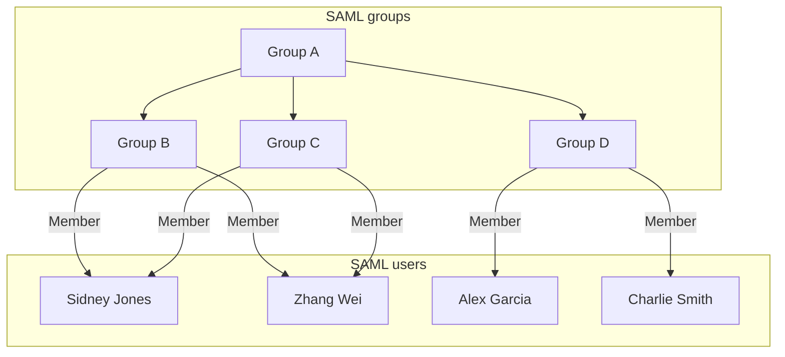
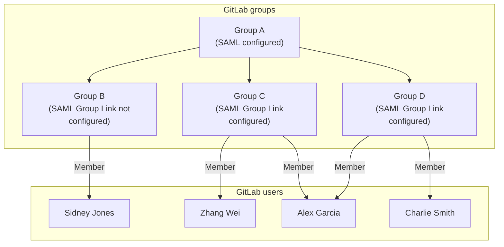
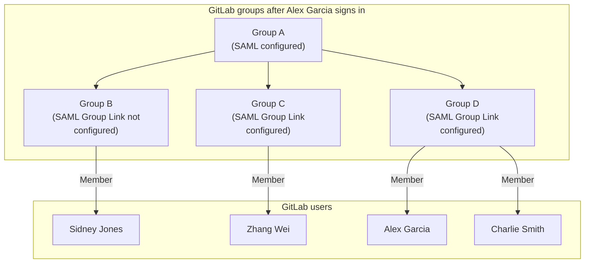



- Tier: 专业版，旗舰版
- Offering: JihuLab.com，私有化部署



使用 SAML 群组同步，根据用户在 SAML 身份提供商（IdP）中的群组分配，将用户以特定角色分配到现有的极狐GitLab 群组。
通过 SAML 群组同步，您可以在 SAML IdP 群组和极狐GitLab 群组之间创建多对多映射。

例如，如果用户 `@amelia` 在 SAML IdP 中被分配到 `security` 群组，
您可以使用 SAML 群组同步将 `@amelia` 以维护者角色分配到 `security-gitlab` 群组，
并以报告者角色分配到 `vulnerability` 群组。

SAML 群组同步不会创建群组。
您必须首先[创建群组](../_index.md#create-a-group)，然后创建映射。

在 JihuLab.com 上，SAML 群组同步默认已配置。
在极狐GitLab 私有化部署上，您必须手动配置。

<a id="role-prioritization"></a>

## 角色优先级

群组同步决定用户在映射群组中的角色和成员类型。

<a id="multiple-saml-idps"></a>

### 多个 SAML IdP



- Offering: 私有化部署



当用户登录时，极狐GitLab：

- 检查所有已配置的 SAML 群组链接。
- 根据用户在不同 IdP 中所属的 SAML 群组，将该用户添加到相应的极狐GitLab 群组。

极狐GitLab 中的群组链接映射不绑定到特定 IdP，因此您必须配置所有 SAML IdP，使其在 SAML 响应中包含群组属性。这意味着极狐GitLab 能够匹配 SAML 响应中的群组，无论用户使用哪个 IdP 登录。

例如，您有 2 个 IdP：`SAML1` 和 `SAML2`。

在极狐GitLab 中，您在特定群组上配置了两个群组链接：

- `gtlb-owner => Owner role`。
- `gtlb-dev => Developer role`。

在 `SAML1` 中，用户是 `gtlb-owner` 的成员，但不是 `gtlb-dev` 的成员。

在 `SAML2` 中，用户是 `gtlb-dev` 的成员，但不是 `gtlb-owner` 的成员。

当用户使用 `SAML1` 登录群组时，SAML 响应显示该用户是 `gtlb-owner` 的成员，因此极狐GitLab 将该用户在该群组中的角色设置为 `Owner`。

然后用户退出并使用 `SAML2` 重新登录群组。SAML 响应显示该用户是 `gtlb-dev` 的成员，因此极狐GitLab 将该用户在该群组中的角色设置为 `Developer`。

现在让我们更改前面的示例，使该用户在 `SAML2` 中既不是 `gtlb-owner` 也不是 `gtlb-dev` 的成员。

- 当用户使用 `SAML1` 登录群组时，该用户在该群组中被赋予 `Owner` 角色。
- 当用户使用 `SAML2` 登录时，该用户会从群组中移除，因为他们不是任何已配置群组链接的成员。

<a id="multiple-saml-groups"></a>

### 多个 SAML 群组

如果用户是映射到同一极狐GitLab 群组的多个 SAML 群组的成员，则该用户被分配这些 SAML 群组中的最高角色。

例如，如果用户在一个群组中拥有访客角色，在另一个群组中拥有维护者角色，则他们被分配维护者角色。

<a id="membership-types"></a>

### 成员类型

如果用户在 SAML 群组中的角色高于其在某个子群组中的角色，则他们在映射的极狐GitLab 群组中的[成员身份](../../project/members/_index.md#display-direct-members)会根据他们在映射群组中被分配的角色而有所不同。

如果通过群组同步，用户被分配了：

- 更高的角色，则他们是该群组的直接成员。
- 相同或更低的角色，则他们是该群组的继承成员。

<a id="automatic-member-removal"></a>

## 自动成员移除

群组同步后，不属于映射 SAML 群组成员的用户将从群组中移除。
在 JihuLab.com 上，顶级群组中的用户被分配默认成员角色，而不是被移除。

例如，在下图中：

- Alex Garcia 登录极狐GitLab，因不属于 SAML 群组 C 而从极狐GitLab 群组 C 中移除。
- Sidney Jones 属于 SAML 群组 C，但因尚未登录而未被添加到极狐GitLab 群组 C。







<a id="configure-saml-group-sync"></a>

## 配置 SAML 群组同步

如果群组名称与 SAML 响应中列出的 `groups` 不匹配，
添加或更改群组同步配置可能会从映射的极狐GitLab 群组中移除用户。
为避免用户被移除，在配置群组同步之前，请确保满足以下任一条件：

- SAML 响应包含 `groups` 属性，且 `AttributeValue` 值与极狐GitLab 中的 **SAML 群组名称** 匹配。
- 从极狐GitLab 中移除所有群组以禁用群组同步。

如果您使用 SAML 群组同步并且有多个极狐GitLab 节点，例如在分布式或高可用架构中，
您必须在所有 Sidekiq 节点以及 Rails 应用节点上包含 SAML 配置块。





要配置 SAML 群组同步：

1. 参阅 [JihuLab.com 群组的 SAML SSO](_index.md)。
1. 确保您的 SAML 身份提供商发送名为 `Groups` 或 `groups` 的属性声明。





要配置 SAML 群组同步：

1. 配置 [SAML OmniAuth 提供商](../../../integration/saml.md)。
1. 确保您的 SAML 身份提供商发送的属性声明名称与 `groups_attribute` 设置的值相同。此属性区分大小写。请参阅 `/etc/gitlab/gitlab.rb` 中的以下提供商配置示例：

   ```ruby
   gitlab_rails['omniauth_providers'] = [
     {
       name: "saml",
       label: "Provider name", # optional label for login button, defaults to "Saml",
       groups_attribute: 'Groups',
       args: {
         assertion_consumer_service_url: "https://gitlab.example.com/users/auth/saml/callback",
         idp_cert_fingerprint: "43:51:43:a1:b5:fc:8b:b7:0a:3a:a9:b1:0f:66:73:a8",
         idp_sso_target_url: "https://login.example.com/idp",
         issuer: "https://gitlab.example.com",
         name_identifier_format: "urn:oasis:names:tc:SAML:2.0:nameid-format:persistent"
       }
     }
   ]
   ```

   在此示例中，`groups_attribute` 是提供商哈希的一个键，与
   `name` 和 `label` 同级，而不是在 `args` 内部。
   如果它在 `args` 内部，群组同步将不会运行。
   用户仍然可以登录，SAML 响应仍然携带群组，
   但极狐GitLab 不会更改任何成员身份，也不会记录任何错误。
   有关更多信息，请参阅
   [SAML 群组链接存在但成员身份未更改](troubleshooting.md#saml-group-links-exist-but-no-memberships-change)。





SAML 响应中 `Groups` 或 `groups` 的值可以是群组名称或 ID。
例如，Azure AD 发送 Azure 群组对象 ID 而不是名称。在配置 [SAML 群组链接](#configure-saml-group-links) 时使用 ID 值。

```xml
<saml:AttributeStatement>
  <saml:Attribute Name="Groups">
    <saml:AttributeValue xsi:type="xs:string">Developers</saml:AttributeValue>
    <saml:AttributeValue xsi:type="xs:string">Product Managers</saml:AttributeValue>
  </saml:Attribute>
</saml:AttributeStatement>
```

其他属性名称，例如 `http://schemas.microsoft.com/ws/2008/06/identity/claims/groups`
不被接受为群组来源。

有关在 SAML 身份提供商设置中配置所需群组属性名称的更多信息，请参阅
[Azure AD](example_saml_config.md#group-sync) 和 [Okta](example_saml_config.md#group-sync-1) 的示例配置。

<a id="configure-saml-group-links"></a>

## 配置 SAML 群组链接

SAML 群组同步仅管理具有一个或多个 SAML 群组链接的群组。

先决条件：

- 您的极狐GitLab 私有化部署实例必须已配置 SAML 群组同步。

启用 SAML 后，具有所有者角色的用户会在群组 **设置** > **SAML 群组链接** 中看到新的菜单项。

- 您可以配置一个或多个 **SAML 群组链接**，将 SAML IdP 群组名称映射到极狐GitLab 角色。
- SAML IdP 群组的成员将在下次 SAML 登录时被添加为极狐GitLab 群组的成员。
- 每次用户使用 SAML 登录时都会评估群组成员身份。
- 可以为顶级群组或任何子群组配置 SAML 群组链接。
- 如果创建然后移除了 SAML 群组链接，并且存在：
  - 其他已配置的 SAML 群组链接，则在同步期间，被移除群组链接中的用户会自动从群组中移除。
  - 没有其他已配置的 SAML 群组链接，则用户在同步期间保留在群组中。
    这些用户必须手动从群组中移除。

要链接 SAML 群组：

1. 在 **SAML 群组名称** 中，输入相关 `saml:AttributeValue` 的值。
   SAML 群组名称区分大小写，并且必须与 SAML 响应中发送的值完全匹配。
1. 在 **访问级别** 中选择[默认角色](../../permissions.md)或[自定义成员角色](../../custom_roles/_index.md)。
1. 选择 **保存**。
1. 如有必要，重复操作以添加其他群组链接。

<a id="manage-gitlab-duo-seat-assignment"></a>

## 管理极狐GitLab Duo 席位分配



- Offering: JihuLab.com，私有化部署



先决条件：

- 有效的 [极狐GitLab Duo 附加订阅](../../../subscriptions/subscription-add-ons.md)

SAML 群组同步可以根据 IdP 群组成员身份管理极狐GitLab Duo 席位的分配和移除。仅当订阅中还有剩余席位时，才会分配席位。





要为 JihuLab.com 配置：

1. [配置 SAML 群组链接](#configure-saml-group-links) 时，选中 **为此群组中的用户分配极狐GitLab Duo 席位** 复选框。
1. 选择 **保存**。
1. 为所有应分配极狐GitLab Duo Pro 或极狐GitLab Duo Enterprise 席位的 SAML 用户重复添加其他群组链接。
   对于身份提供商群组成员身份与启用此设置的群组链接不匹配的用户，其极狐GitLab Duo 席位将被取消分配。

对于没有有效极狐GitLab Duo 附加订阅的群组，此复选框不会出现。





要为私有化部署配置：

1. 配置 [SAML OmniAuth 提供商](../../../integration/saml.md)。
1. 确保您的配置包含 `groups_attribute` 和 `duo_add_on_groups`。属于一个或多个 `duo_add_on_groups` 的用户，如果有可用席位，将获得一个极狐GitLab Duo 席位。请参阅 `/etc/gitlab/gitlab.rb` 中的以下提供商配置示例：

   ```ruby
   gitlab_rails['omniauth_providers'] = [
     {
       name: "saml",
       label: "Provider name",
       groups_attribute: 'Groups',
       duo_add_on_groups: ['Developers', 'Freelancers'],
       args: {
         assertion_consumer_service_url: "https://gitlab.example.com/users/auth/saml/callback",
         idp_cert_fingerprint: "43:51:43:a1:b5:fc:8b:b7:0a:3a:a9:b1:0f:66:73:a8",
         idp_sso_target_url: "https://login.example.com/idp",
         issuer: "https://gitlab.example.com",
         name_identifier_format: "urn:oasis:names:tc:SAML:2.0:nameid-format:persistent"
       }
     }
   ]
   ```





<a id="microsoft-azure-active-directory-integration"></a>

## Microsoft Azure Active Directory 集成

> [!note]
> Microsoft 已[宣布](https://azure.microsoft.com/en-us/updates?id=azure-ad-is-becoming-microsoft-entra-id)将 Azure Active Directory (AD) 更名为 Entra ID。


Azure AD 在 `groups` 声明中最多发送 150 个群组。
将 Azure AD 与 SAML 群组同步一起使用时，如果您组织中的用户是超过 150 个群组的成员，
Azure AD 会在 SAML 响应中为[群组超额](https://learn.microsoft.com/en-us/security/zero-trust/develop/configure-tokens-group-claims-app-roles#group-overages)发送 `groups` 声明属性，
并且该用户可能会被自动从群组中移除。

为避免此问题，您可以使用 Azure AD 集成，该集成：

- 不限于 150 个群组。
- 使用 Microsoft Graph API 获取所有用户成员身份。
  [Graph API 端点](https://learn.microsoft.com/en-us/graph/api/user-list-transitivememberof?view=graph-rest-1.0&tabs=http#http-request)仅接受
  [用户对象 ID](https://learn.microsoft.com/en-us/partner-center/find-ids-and-domain-names#find-the-user-object-id) 或
  [userPrincipalName](https://learn.microsoft.com/en-us/entra/identity/hybrid/connect/plan-connect-userprincipalname#what-is-userprincipalname)
  作为 [Azure 配置的](_index.md#azure) 唯一用户标识符（名称标识符）属性。
- 处理群组同步时，仅支持使用群组唯一标识符（如 `12345678-9abc-def0-1234-56789abcde`）配置的群组链接。

或者，您可以更改[群组声明](https://learn.microsoft.com/en-us/entra/identity/hybrid/connect/how-to-connect-fed-group-claims)以使用 **分配给应用程序的群组** 选项。

<a id="configure-azure-ad"></a>

### 配置 Azure AD

作为集成的一部分，您必须允许极狐GitLab 与 Microsoft Graph API 通信。

<!-- vale gitlab_base.SentenceSpacing = NO -->

要配置 Azure AD：

1. 在 [Azure 门户](https://portal.azure.com) 中，转到 **Microsoft Entra ID** > **应用注册** > **所有应用程序**，然后选择您的极狐GitLab SAML 应用程序。
1. 在 **基本信息** 下，会显示 **应用程序（客户端）ID** 和 **目录（租户）ID** 值。复制这些值，因为极狐GitLab 配置中需要用到它们。
1. 在左侧导航中，选择 **证书和密钥**。
1. 在 **客户端密钥** 选项卡上，选择 **新建客户端密钥**。
   1. 在 **描述** 文本框中，添加描述。
   1. 在 **过期时间** 下拉列表中，设置凭据的过期日期。如果密钥过期，极狐GitLab 集成将无法继续工作，直到更新凭据。
   1. 要生成凭据，请选择 **添加**。
   1. 复制凭据的 **值**。此值仅显示一次，极狐GitLab 配置中需要用到它。
1. 在左侧导航中，选择 **API 权限**。
1. 选择 **Microsoft Graph** > **应用程序权限**。
1. 选中 **GroupMember.Read.All** 和 **User.Read.All** 复选框。
1. 选择 **添加权限** 以保存。
1. 选择 **为 `<application_name>` 授予管理员同意**，然后在确认对话框中选择 **是**。两个权限的 **状态** 列都应变为绿色勾选，并显示 **已为 `<application_name>` 授予**。

<!-- vale gitlab_base.SentenceSpacing = YES -->

<a id="configure-gitlab"></a>

### 配置极狐GitLab

配置 Azure AD 后，您必须配置极狐GitLab 以与 Azure AD 通信。

使用此配置，如果用户使用 SAML 登录且 Azure 在响应中发送 `group` 声明，
极狐GitLab 会启动一个群组同步作业，调用 Microsoft Graph API 并检索用户的群组成员身份。
然后根据 SAML 群组链接更新极狐GitLab 群组成员身份。

下表列出了极狐GitLab 设置及对应的 Azure AD 字段：

| 极狐GitLab 设置 | Azure 字段                                |
| -------------- | ------------------------------------------ |
| 租户 ID      | 目录（租户）ID                      |
| 客户端 ID      | 应用程序（客户端）ID                    |
| 客户端密钥  | 值（在 **证书和密钥** 页面上） |





要为 JihuLab.com 群组配置 Azure AD：

1. 在顶部栏中，选择 **搜索或跳转到** 并找到您的群组。
   此群组必须位于顶级。
1. 选择 **设置** > **SAML SSO**。
1. 配置[群组的 SAML SSO](_index.md)。
1. 在 **Microsoft Azure 集成** 部分，选中 **为此群组启用 Microsoft Azure 集成** 复选框。
   仅当为该群组配置并启用了 SAML SSO 时，此部分才可见。
1. 输入之前在 Azure 门户中配置 Azure Active Directory 时获得的 **租户 ID**、**客户端 ID** 和 **客户端密钥**。
1. 可选。如果使用 Azure AD 美国政府版或 Azure AD 中国版，请输入相应的 **登录 API 端点** 和 **Graph API 端点**。默认值适用于大多数组织。
1. 选择 **保存更改**。





先决条件：

- 管理员访问权限。

要为极狐GitLab 私有化部署配置：

1. 配置[实例的 SAML SSO](../../../integration/saml.md)。
1. 在右上角，选择 **管理**。
1. 在左侧边栏中，选择 **设置** > **常规**。
1. 在 **Microsoft Azure 集成** 部分，选中 **为此群组启用 Microsoft Azure 集成** 复选框。
1. 输入之前在 Azure 门户中配置 Azure Active Directory 时获得的 **租户 ID**、**客户端 ID** 和 **客户端密钥**。
1. 可选。如果使用 Azure AD 美国政府版或 Azure AD 中国版，请输入相应的 **登录 API 端点** 和 **Graph API 端点**。默认值适用于大多数组织。
1. 选择 **保存更改**。





<a id="global-saml-group-memberships-lock"></a>

## 全局 SAML 群组成员锁定



- Offering: 私有化部署



您可以对 SAML 群组成员身份实施全局锁定。此锁定限制了谁可以邀请新成员加入与 SAML 群组链接同步的子群组。

启用全局群组成员锁定时：

- 您不能将群组或子群组设置为[代码所有者](../../project/codeowners/_index.md)。
  有关更多信息，请参阅[与全局群组成员锁定的不兼容性](../../project/codeowners/troubleshooting.md#incompatibility-with-global-group-memberships-locks)。
- 只有管理员可以管理群组成员并更改其访问级别。
- 群组成员不能：
  - 与其他群组共享项目。
  - 邀请成员加入在群组中创建的项目。
  - 修改为 SAML 群组链接同步配置的顶级群组的成员身份。

<a id="lock-group-memberships"></a>

### 锁定群组成员身份

先决条件：

- 已配置 [极狐GitLab 私有化部署的 SAML SSO](../../../integration/saml.md)。
- 管理员访问权限。

要将成员身份锁定到 SAML 群组链接同步：

1. 在右上角，选择 **管理**。
1. 在左侧边栏中，选择 **设置** > **常规**。
1. 展开 **可见性和访问控制** 部分。
1. 选中 **将成员身份锁定到 SAML 群组链接同步** 复选框。
