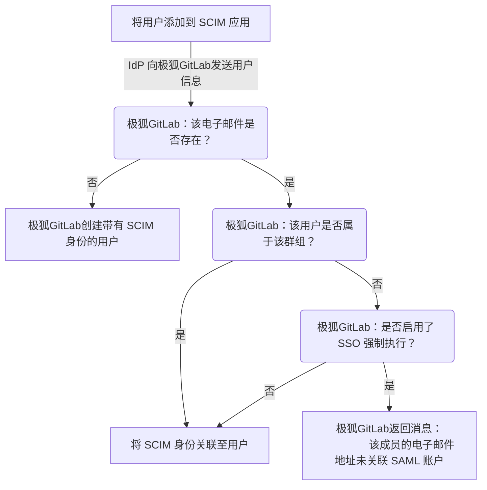
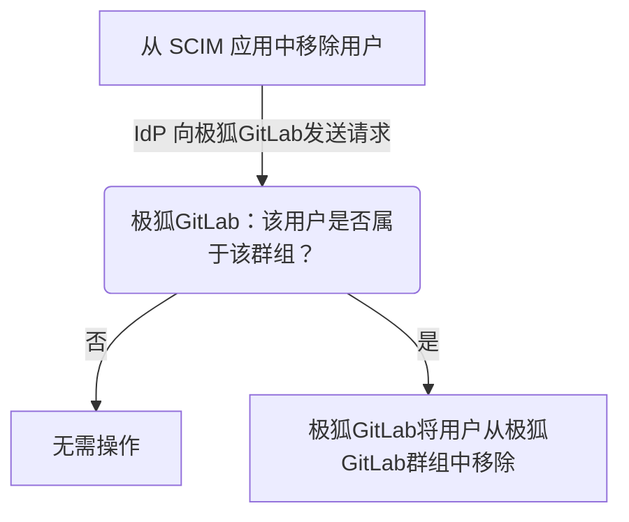



- Tier: 专业版，旗舰版
- Offering: JihuLab.com



你可以使用开放标准跨域身份管理系统 (SCIM) 自动执行以下操作：

- 创建用户。
- 移除用户（停用 SCIM 身份）。
- 重新添加用户（重新激活 SCIM 身份）。

极狐GitLab SAML SSO SCIM 不支持更新用户信息。

当为某个极狐GitLab 群组启用 SCIM 时，该群组的成员身份将在极狐GitLab 与身份提供商之间同步。

[内部极狐GitLab 群组 SCIM API](../../../development/internal_api/_index.md#group-scim-api) 实现了 [RFC7644 协议](https://www.rfc-editor.org/rfc/rfc7644) 的一部分。
身份提供商可以使用 [内部极狐GitLab 群组 SCIM API](../../../development/internal_api/_index.md#group-scim-api) 开发 SCIM 应用。

要设置极狐GitLab 私有化部署上的 SCIM，请参见 [配置极狐GitLab 私有化部署的 SCIM](../../../administration/settings/scim_setup.md)。

## 配置极狐GitLab

先决条件：

- 必须已配置 [群组单点登录](_index.md)。

要配置极狐GitLab SAML SSO SCIM：

1. 在顶部栏中，选择 **搜索或跳转到** 并找到你的群组。
1. 在左侧边栏中，选择 **设置** > **SAML SSO**。
1. 选择 **生成 SCIM 令牌**。
1. 为配置身份提供商，保存以下信息：
   - **你的 SCIM 令牌** 字段中的令牌。
   - **SCIM API 端点 URL** 字段中的 URL。

## 配置身份提供商

极狐GitLab 支持与多个身份提供商进行 SCIM 集成。其他身份提供商可能仍然可以与极狐GitLab 配合使用，但尚未经过测试且不受支持。如需帮助有关不受支持的提供商，请直接联系该提供商。极狐GitLab 支持团队可以协助审查相关的日志条目。

### 配置 Okta

在配置 Okta 的 [单点登录](_index.md) 过程中创建的 SAML 应用必须配置 SCIM。

先决条件：

- 你必须使用 Okta [生命周期管理](https://www.okta.com/products/lifecycle-management/) 产品。要使用 SCIM on Okta，需要此产品版本。
- [极狐GitLab 已配置](#configure-gitlab)。
- 已按照 [Okta 设置说明](_index.md#okta) 中的描述为 [Okta](https://developer.okta.com/docs/guides/build-sso-integration/saml2/main/) 设置了 SAML 应用。
- 你的 Okta SAML 设置必须精确匹配 [配置步骤](_index.md)，特别是 NameID 配置。

要在 Okta 中配置 SCIM：

1. 登录 Okta。
1. 在右上角，选择 **管理员**。该按钮在 **管理员** 区域中不可见。
1. 在 **应用** 选项卡中，选择 **浏览应用目录**。
1. 搜索 **极狐GitLab**，找到并选择 **极狐GitLab** 应用。
1. 在极狐GitLab 应用概览页面上，选择 **添加**。
1. 在 **应用可见性** 下，同时勾选两个复选框。当前极狐GitLab 应用不支持 SAML 认证，因此不应向用户显示该图标。
1. 选择 **完成** 以完成应用的添加。
1. 在 **置备** 选项卡中，选择 **配置 API 集成**。
1. 选择 **启用 API 集成**。
   - 对于 **基础 URL**，粘贴从极狐GitLab SCIM 配置页面中 **SCIM API 端点 URL** 复制的 URL。
   - 对于 **API 令牌**，粘贴从极狐GitLab SCIM 配置页面中 **你的 SCIM 令牌** 复制的 SCIM 令牌。
1. 要验证配置，请选择 **测试 API 凭证**。
1. 选择 **保存**。
1. 保存 API 集成详细信息后，左侧会出现新的设置选项卡。选择 **至应用**。
1. 选择 **编辑**。
1. 勾选 **创建用户** 和 **停用用户** 的 **启用** 复选框。
1. 选择 **保存**。
1. 在 **分配** 选项卡中分配用户。分配的用户将在你的极狐GitLab 群组中创建并管理。

### 配置 Microsoft Entra ID



- 在 GitLab 16.10 中，术语[已变更] 为 Microsoft Entra ID。



先决条件：

- [极狐GitLab 已配置](#configure-gitlab)。
- 已配置 [群组单点登录](_index.md)。

在配置 [Azure Active Directory](https://learn.microsoft.com/en-us/entra/identity/enterprise-apps/view-applications-portal) 的 [单点登录](_index.md) 过程中创建的 SAML 应用必须配置 SCIM。有关示例，请参见 [配置示例](example_saml_config.md#scim-mapping)。

> [!note]
> 你必须严格按照以下说明精确配置 SCIM 置备。如果配置错误，你将遇到用户置备和登录问题，并且需要大量精力才能解决。如果你在任何步骤中遇到问题或疑问，请联系极狐GitLab 支持。

要配置 Microsoft Entra ID 的 SCIM：

1. 在你的应用中，转到 **置备** 选项卡并选择 **开始**。
1. 将 **置备模式** 设置为 **自动**。
1. 使用以下值完成 **管理员凭证**：
   - 极狐GitLab 中的 **SCIM API 端点 URL** 作为 **租户 URL** 字段的值。
   - 极狐GitLab 中的 **你的 SCIM 令牌** 作为 **密钥令牌** 字段的值。
1. 选择 **测试连接**。如果测试成功，在继续之前保存你的配置，或参见 [故障排除](troubleshooting.md) 信息。
1. 选择 **保存**。

保存后，会显示 **映射** 和 **设置** 部分。

#### 配置映射

在 **映射** 部分下，首先置备群组：

1. 选择 **置备 Microsoft Entra ID 群组**。
1. 在属性映射页面上，关闭 **启用** 开关。极狐GitLab 不支持 SCIM 群组置备。保持群组置备启用不会破坏 SCIM 用户置备，但会在 Entra ID SCIM 置备日志中产生错误，可能导致混淆和误导。

   > [!note]
   > 即使 **置备 Microsoft Entra ID 群组** 被禁用，映射部分仍可能显示“已启用: 是”。此行为是一个可以安全忽略的显示错误。

1. 选择 **保存**。

接下来，置备用户：

1. 选择 **置备 Microsoft Entra ID 用户**。
1. 确保 **启用** 开关设置为 **是**。
1. 确保所有 **目标对象操作** 均已启用。
1. 在 **属性映射** 下，配置映射以匹配 [已配置的属性映射](#configure-attribute-mappings)：
   1. 可选。在 **customappsso 属性** 列中，找到 `externalId` 并删除它。
   1. 编辑第一个属性，使其具有：
      - **源属性** `objectId`
      - **目标属性** `externalId`
      - **匹配优先级** `1`
   1. 更新现有的 **customappsso** 属性以匹配 [配置的属性映射](#configure-attribute-mappings)。
   1. 删除下表中未列出的任何额外属性。即使不删除，它们也不会造成问题，但极狐GitLab 不会使用这些属性。
1. 在映射列表下方，勾选 **显示高级选项** 复选框。
1. 选择 **编辑 customappsso 的属性列表** 链接。
1. 确保 `id` 是主键和必填字段，且 `externalId` 也是必填字段。
1. 选择 **保存**，这将使你返回属性映射配置页面。
1. 要关闭 **属性映射** 配置页面，选择右上角的 `X`。

#### 配置设置

在 **设置** 部分下：

1. 可选。如有需要，勾选 **发生故障时发送电子邮件通知** 复选框。
1. 可选。如有需要，勾选 **防止意外删除** 复选框。
1. 如有必要，选择 **保存** 以确保所有更改均已保存。

配置完映射和设置后，返回应用概览页面并选择 **开始置备**，以启动对极狐GitLab 中用户的自动 SCIM 置备。

> [!warning]
> 一旦同步，更改映射到 `id` 和 `externalId` 的字段可能会导致错误。这些错误包括置备错误、重复用户，并可能阻止现有用户访问极狐GitLab 群组。

#### 配置属性映射

> [!note]
> 当微软从 Azure Active Directory 过渡到 Entra ID 命名方案时，你可能会在用户界面中注意到不一致之处。如果遇到问题，你可以查看本文档的旧版本或联系极狐GitLab 支持。

在 [为 SCIM 配置 Entra ID](#configure-microsoft-entra-id) 期间，你需要配置属性映射。有关示例，请参见 [配置示例](example_saml_config.md#scim-mapping)。

下表列出了极狐GitLab 所需的属性映射。

| 源属性                                                          | 目标属性                      | 匹配优先级 |
|:-----------------------------------------------------------------|:-------------------------------|:----------|
| `objectId`                                                       | `externalId`                   | 1         |
| `userPrincipalName` 或 `mail` 1                      | `emails[type eq "work"].value` |           |
| `mailNickname`                                                   | `userName`                     |           |
| `displayName` 或 `Join(" ", [givenName], [surname])` 2 | `name.formatted`               |           |
| `Switch([IsSoftDeleted], , "False", "True", "True", "False")` 3 | `active`                       |           |

1. 当 `userPrincipalName` 不是电子邮件地址或无法投递时，使用 `mail` 作为源属性。
1. 如果 `displayName` 的格式与 `Firstname Lastname` 不匹配，请使用 `Join` 表达式。
1. 这是一个表达式映射类型，而非直接映射。在 **映射类型** 下拉列表中选择 **表达式**。

每个属性映射都有：

- 一个 **customappsso 属性**，对应 **目标属性**。
- 一个 **Microsoft Entra ID 属性**，对应 **源属性**。
- 一个匹配优先级。

对于每个属性：

1. 编辑现有属性或添加新属性。
1. 从下拉列表中选择所需的源属性和目标属性映射。
1. 选择 **确定**。
1. 选择 **保存**。

如果你的 SAML 配置与 [推荐的 SAML 设置](_index.md#azure) 不同，请选择映射属性并相应地修改它们。你映射到 `externalId` 目标属性的源属性，必须与用于 SAML `NameID` 的属性匹配。

如果某个映射未在表中列出，请使用 Microsoft Entra ID 的默认值。有关所需属性列表，请参阅 [内部群组 SCIM API](../../../development/internal_api/_index.md#group-scim-api) 文档。

## 用户访问

在同步过程中，所有新用户：

- 将获得极狐GitLab 账户。
- 会通过邀请电子邮件欢迎他们加入群组。
  你可以通过已验证域名 [绕过邮箱确认](_index.md#bypass-user-email-confirmation-with-verified-domains)。

### 限制访问时的置备行为



- 在 GitLab 18.6 中，以一个名为 `bso_minimal_access_fallback` 的 [功能标志](../../../administration/feature_flags/_index.md) 引入。默认禁用。
- 在 GitLab 18.10 中[默认启用]。



当启用 [限制访问](../manage.md#restricted-access) 且没有可用的订阅席位时，通过 SCIM 置备的用户将被分配最低访问权限角色。

发生这种情况时，用户将被成功创建并具有最低访问权限（响应 `HTTP 201 Created`），并且用户的 `roles` 属性会反映此分配。如果无可用席位，后续的角色更新操作可能会失败。

更多信息，请参见 [SAML、SCIM、LDAP 的置备行为](../manage.md#provisioning-behavior-with-saml-scim-and-ldap)。

下图描述了你向 SCIM 应用添加用户时发生的情况：

在置备期间：

- 在检查极狐GitLab 用户账户是否存在时，会同时考虑主邮箱和备用邮箱。
- 重复的用户名将在创建用户时通过添加后缀 `1` 来处理。例如，如果 `test_user` 已存在，则使用 `test_user1`。如果 `test_user1` 也已存在，极狐GitLab 会递增后缀以查找未使用的用户名。如果尝试 4 次后仍未找到未使用的用户名，将为用户名附加一个随机字符串。

在后续访问时，新用户和现有用户可以通过以下方式访问群组：

- 通过身份提供商的仪表盘。
- 通过直接访问链接。

有关角色信息，请参见 [群组 SAML](_index.md#user-access-and-management) 页面。

### 通过 SCIM 为极狐GitLab 群组创建的用户密码

极狐GitLab 要求所有用户账户设置密码。对于通过 SCIM 置备创建的用户，极狐GitLab 会自动生成一个随机密码，用户首次登录时无需设置密码。有关极狐GitLab 如何为通过 SCIM for GitLab 群组创建的用户生成密码的更多信息，请参见 [通过集成认证创建的用户生成密码](../../profile/user_passwords.md)。

### 链接 SCIM 和 SAML 身份

如果配置了 [群组 SAML](_index.md) 并且你拥有现有的 JihuLab.com 账户，用户可以链接其 SCIM 和 SAML 身份。用户应在启用同步之前进行此操作，因为在同步活跃时，现有用户可能会出现置备错误。

要链接你的 SCIM 和 SAML 身份：

1. 将你 JihuLab.com 用户账户中的 [主邮箱](../../profile/_index.md#change-your-primary-email) 地址更新为与身份提供商中的用户配置文件邮箱地址一致。
1. [链接你的 SAML 身份](_index.md#link-saml-to-your-existing-gitlabcom-account)。

### 移除访问权限

在身份提供商上移除或停用用户后，他们将失去对以下内容的访问权限：

- 顶级群组。
- 所有子群组和项目。

身份提供商根据其配置的计划执行同步后，该用户的成员身份将被撤销，他们将失去访问权限。

启用 SCIM 时，这不会自动移除没有 SAML 身份的现有用户。

> [!note]
> 取消置备不会删除极狐GitLab 用户账户。

### 重新激活访问权限



- 在 GitLab 16.0 中，以一个名为 `skip_saml_identity_destroy_during_scim_deprovision` 的 [功能标志](../../../administration/feature_flags/list.md) 引入。默认禁用。
- 在 GitLab 16.4 中[已正式发布]。功能标志 `skip_saml_identity_destroy_during_scim_deprovision` 已移除。



通过 SCIM 移除或停用用户后，你可以通过将该用户重新添加到 SCIM 身份提供商来重新激活其访问权限。

身份提供商根据其配置的计划执行同步后，该用户的 SCIM 身份将被重新激活，并且他们的群组成员身份将被恢复。