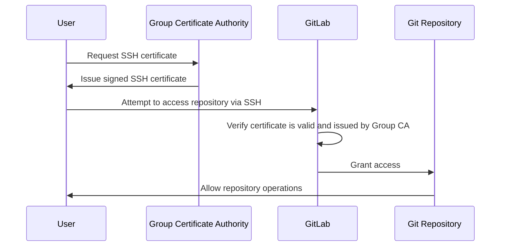



- Tier: 专业版，旗舰版
- Offering: JihuLab.com



使用 SSH 证书控制和管理托管在 JihuLab.com 上的项目和群组的 Git 访问。

SSH 证书是经过加密签名的文档，用于验证用户的身份和权限。SSH 证书由受信任的证书颁发机构（CA）颁发，包含用户身份、有效期和权限等信息。

如果您是私有化部署实例的管理员，您可以使用实例级别的 SSH 证书方法。选择以下方法之一：

- [使用 `gitlab-sshd` 的实例级 SSH 证书](../../administration/operations/gitlab_sshd_ssh_certificates.md)：直接在 `gitlab-sshd` 中配置受信任的 CA 密钥，无需修改系统 OpenSSH `sshd_config`。
- [使用 OpenSSH `AuthorizedPrincipalsCommand` 的用户查找](../../administration/operations/ssh_certificates.md)：使用系统 OpenSSH 守护进程配置 SSH 证书。

SSH 证书认证的好处包括：

- 集中访问控制：您可以通过中央 CA 管理访问，而不是通过个人用户管理的 SSH 密钥。
- 增强的安全性：SSH 证书比传统 SSH 密钥更安全。
- 限时访问：您可以设置证书在特定时间后过期。
- 简化的凭证管理：组织可以维护已批准的 SSH 证书凭证列表，用于仓库访问。
- 独立于用户管理的凭证：访问由群组管理的证书控制，而不是用户的个人公共 SSH 密钥。

<a id="ssh-certificates-and-ssh-keys"></a>

## SSH 证书与 SSH 密钥

下表比较了 SSH 证书和 SSH 密钥：

| 功能               | SSH 证书                      | SSH 密钥 |
| --------------------- | ------------------------------------- | -------- |
| 访问控制        | 通过群组管理的 CA 集中控制。 | 分散在各个用户账户中。 |
| 过期            | 内置过期。                  | 无内置过期。 |
| 凭证管理 | 由群组所有者管理。              | 由个人用户管理。 |
| 设置复杂性      | 初始设置更复杂。           | 初始设置更简单。 |

<a id="authentication-flow"></a>

## 认证流程

下图说明了 SSH 证书认证在极狐GitLab 中的工作原理，从请求证书到访问仓库：



认证过程在允许仓库访问之前验证用户是否拥有有效的 SSH 证书。

<a id="add-a-ca-certificate-to-a-top-level-group"></a>

## 向顶级群组添加 CA 证书



- 在极狐GitLab 16.4 中引入，使用功能标志 `ssh_certificates_rest_endpoints`。默认禁用。
- 在极狐GitLab 16.9 中于 JihuLab.com 上启用。
- 在极狐GitLab 17.7 中 GA。功能标志 `ssh_certificates_rest_endpoints` 已移除。



前提条件：

- 您必须拥有该群组的所有者角色。
- 该群组必须是顶级群组，而不是子群组。

要向群组添加 CA 证书：

1. 生成用作证书颁发机构文件的 SSH 密钥对：

   ```plaintext
   ssh-keygen -f CA
   ```

1. 使用[群组 SSH 证书 API](../../api/group_ssh_certificates.md#add-a-group-ssh-certificate) 将公钥添加到顶级群组，以授予对该群组及其子群组项目的访问权限。

<a id="issue-ca-certificates-for-users"></a>

## 为用户签发 CA 证书

前提条件：

- 您必须拥有该群组的所有者角色。
- 用户证书只能用于访问顶级群组及其子群组中的项目。
- 必须指定用户的用户名或主电子邮件（`user` 或 `user@example.com`），以将极狐GitLab 用户与用户证书关联。
- 用户必须是[企业用户](../enterprise_user/_index.md)。

要签发用户证书，请使用您[之前创建的](#add-a-ca-certificate-to-a-top-level-group)密钥对中的私钥：

```shell
ssh-keygen -s CA -I user@example.com -V +1d user-key.pub
```

（`user-key.pub`）密钥是用户用于 SSH 认证的 SSH 密钥对中的公钥。SSH 密钥对可以由用户生成，也可以由群组所有者基础设施与 SSH 证书一起提供。

过期日期（`+1d`）标识 SSH 证书可用于访问群组项目的时长。

用户证书只能用于访问顶级群组中的项目。

<a id="certificate-principals"></a>

### 证书主体

前面的 `ssh-keygen` 示例没有设置任何证书主体（`-n` 标志）。没有主体时，OpenSSH 接受任何 SSH 登录用户的证书。极狐GitLab 将证书映射到具有身份（`-I`）值的用户。

如果您使用一个或多个主体签署证书，则列表必须包含 `git`，因为用户通过 SSH 以 `git` 用户身份（例如，`git@jihulab.com`）向极狐GitLab 进行认证：

```shell
ssh-keygen -s CA -I user@example.com -n git -V +1d user-key.pub
```

如果非空主体列表中缺少 `git`，极狐GitLab 会拒绝该证书，并显示类似以下错误：

```plaintext
ssh: 主体 "git" 不在给定证书的有效主体集中：["user@example.com"]
```

<a id="enforce-ssh-certificates"></a>

## 强制使用 SSH 证书



- 在极狐GitLab 16.7 中引入，使用功能标志 `enforce_ssh_certificates_via_settings`。默认禁用。
- 在极狐GitLab 16.9 中于 JihuLab.com 上启用。
- 在极狐GitLab 17.7 中 GA。功能标志 `enforce_ssh_certificates_via_settings` 已移除。



您可以强制使用 SSH 证书，并限制用户使用 SSH 密钥和访问令牌进行认证。

强制使用 SSH 证书时：

- 仅影响个人用户账户。
- 不适用于服务账户、部署密钥和其他类型的内部账户。
- 仅由所有者添加到群组的 SSH 证书用于认证仓库访问。

> [!note]
> 强制使用 SSH 证书会禁用普通用户的 HTTPS 访问。

前提条件：

- 您必须拥有该群组的所有者角色。

要强制使用 SSH 证书：

1. 在顶部栏中，选择 **搜索或跳转到** 并找到您的群组。
1. 在左侧边栏中，选择 **设置** > **通用**。
1. 展开 **权限和群组功能** 部分。
1. 选中 **强制 SSH 证书** 复选框。
1. 选择 **保存更改**。