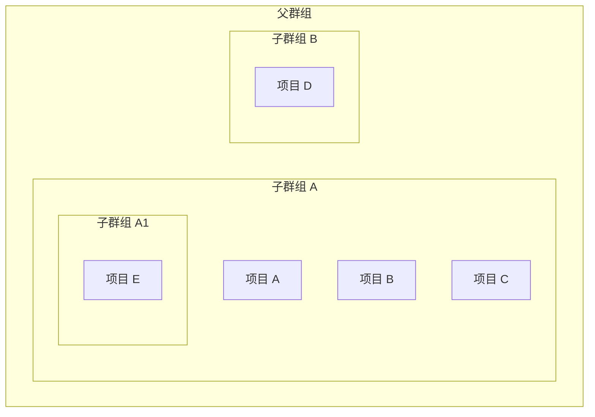
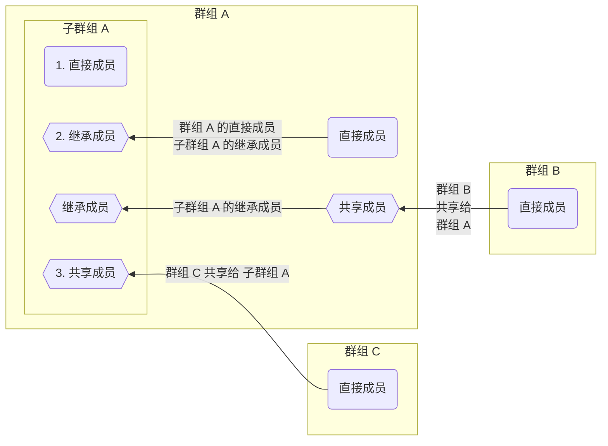
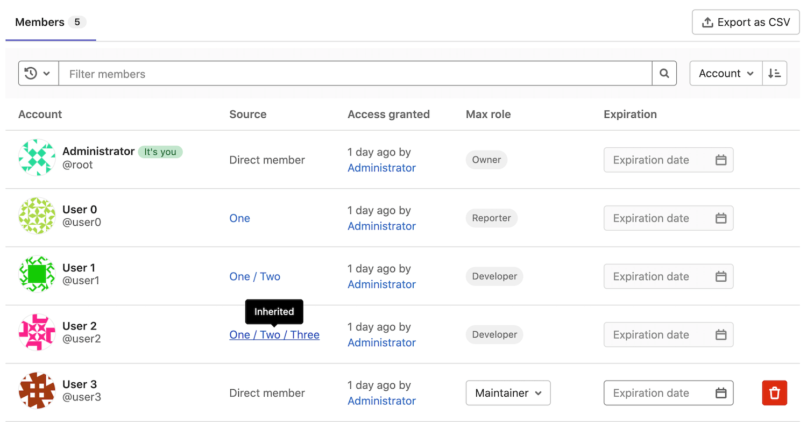



- Tier: 基础版，专业版，旗舰版
- Offering: JihuLab.com，私有化部署



你可以将极狐GitLab [群组](../_index.md)组织为子群组。你可以使用子群组来：

- 分离内部和外部内容。因为每个子群组可以拥有自己的
  [可见性级别](../../public_access.md)，所以你可以在同一个父群组下托管用于不同目的
  的群组。
- 组织大型项目。你可以使用子群组来管理谁可以访问部分
  源代码。
- 管理权限。为每个用户在其[成员身份](#子群组成员)所属的每个群组中赋予不同的
  [角色](../../permissions.md#group-permissions)。

子群组可以：

- 属于一个直接父群组。
- 拥有多个子群组。
- 嵌套多达 20 层。
- 使用注册到父群组的 [Runner](../../../ci/runners/_index.md)：
  - 为父群组配置的密钥对于子群组作业可用。
  - 在属于子群组的项目中拥有维护者或所有者角色的用户可以看到注册到
    父群组的 Runner 的详细信息。

示例：

## 查看群组的子群组

先决条件：

- 要查看私有的嵌套子群组，你必须是该私有子群组的直接或继承成员。

要查看群组的子群组：

1. 在顶部栏，选择 **搜索或跳转到** 并找到你的群组。
1. 在左侧边栏中，选择 **子群组和项目** 选项卡。
1. 选择你要查看的子群组。
   要查看嵌套子群组，展开（）一个子群组。

### 公有父群组中的私有子群组

在层级列表中，拥有私有子群组的公有群组会显示展开选项（），
这表明该群组有嵌套子群组。所有用户都可以看到展开选项（），但只有私有子群组的直接或继承成员才能查看该私有群组。

如果你希望保持嵌套子群组存在信息的私密性，
则应该只将私有子群组添加到私有父群组中。

## 创建子群组

先决条件：

- 你必须至少拥有以下其中一项：
  - 群组的维护者或所有者角色。
  - [由设置决定的角色](#更改谁可以创建子群组)。即使群组创建在用户设置中被
    [管理员禁用](../../../administration/admin_area.md#prevent-a-user-from-creating-top-level-groups)，这些用户仍然可以创建子群组。

> [!note]
> 你不能使用顶级域名为极狐GitLab Pages 子群组网站提供服务。例如，`subgroupname.example.io`。

要创建子群组：

1. 在顶部栏中，选择 **搜索或跳转到** 并找到你希望在其中创建子群组的群组。
1. 在父群组的概览页面，右上角，选择 **新建子群组**。
1. 填写字段。查看不能用作群组名称的[保留名称列表](../../reserved_names.md)。
1. 选择 **创建子群组**。

### 更改谁可以创建子群组

先决条件：

- 根据群组的设置，你必须在群组上拥有维护者或所有者角色。

要更改谁可以在群组上创建子群组：

- 作为在群组上拥有所有者角色的用户：
  1. 在顶部栏中，选择 **搜索或跳转到** 并找到你的群组。
  1. 选择 **设置** > **通用**。
  1. 展开 **权限和群组功能**。
  1. 从 **允许创建子群组的角色** 中选择一个选项。
  1. 选择 **保存更改**。
- 作为管理员：
  1. 在右上角，选择 **管理员**。
  1. 在左侧边栏中，选择 **概览** > **群组** 并找到你的群组。
  1. 在该群组所在行，选择 **编辑**。
  1. 从 **允许创建子群组** 下拉列表中选择一个选项。
  1. 选择 **保存更改**。

更多信息，请查看[权限表格](../../permissions.md#group-permissions)。

## 子群组成员



- 在极狐GitLab 16.10 中[变更](https://gitlab.com/gitlab-org/gitlab/-/issues/219230)为在成员页面的成员选项卡上显示受邀群组成员，该变更是由一个名为 `webui_members_inherited_users` 的功能标志控制的。默认禁用。
- 在极狐GitLab 17.0 中[在 JihuLab.com 和私有化部署上启用](https://gitlab.com/gitlab-org/gitlab/-/issues/219230)。
- 功能标志 `webui_members_inherited_users` [移除](https://gitlab.com/gitlab-org/gitlab/-/merge_requests/163627)于极狐GitLab 17.4。受邀群组成员默认显示。



当你将成员添加到群组时，该成员也会被添加到该群组的所有子群组中。
该成员的权限会从群组继承到所有子群组。

子群组成员可以是：

1. 子群组的[直接成员](../../project/members/_index.md#add-users-to-a-project)。
1. 子群组的[继承成员](../../project/members/_index.md)，从子群组的父群组继承而来。
1. 已[与子群组的顶级群组共享的群组](../../project/members/sharing_projects_groups.md#invite-a-group-to-a-group)中的成员。
1. [间接成员](../../project/members/_index.md)包括继承成员和已[被邀请到子群组或其上级群组](../../project/members/sharing_projects_groups.md#invite-a-group-to-a-group)的群组成员。

群组成员权限只能由以下人员更改：

- 在群组上拥有所有者角色的用户。
- 更改该成员被添加到的群组的配置。

### 确定成员身份继承

要查看成员是否从其父群组继承了权限：

1. 在顶部栏中，选择 **搜索或跳转到** 并找到你的群组。
1. 在左侧边栏中，选择 **管理** > **成员**。
   成员的继承情况显示在 **来源** 列中。

以下是一个示例子群组 **Four** 的成员列表：

在上方截图中：

- 有五名成员有权限访问群组 **Four**。
- 用户 0 在群组 **Four** 上有报告者角色，并且已经从群组 **One** 继承了权限：
  - 用户 0 是群组 **One** 的直接成员。
  - 群组 **One** 在层级中位于群组 **Four** 之上。
- 用户 1 在群组 **Four** 上有开发者角色，并且从群组 **Two** 继承了权限：
  - 用户 0 是群组 **Two** 的直接成员，群组 **Two** 是群组 **One** 的子群组。
  - 群组 **One** / **Two** 在层级中位于群组 **Four** 之上。
- 用户 2 在群组 **Four** 上有开发者角色，并且从群组 **Three** 继承了权限：
  - 用户 0 是群组 **Three** 的直接成员，群组 **Three** 是群组 **Two** 的子群组。群组 **Two** 是群组
    **One** 的子群组。
  - 群组 **One** / **Two** / **Three** 在层级中位于群组 **Four** 之上。
- 用户 3 是群组 **Four** 的直接成员。这意味着他们直接从群组 **Four** 获得了维护者角色。
- 管理员在群组 **Four** 上拥有所有者角色，并且是所有子群组的成员。因此，与用户 3 一样，
  **来源** 列显示他们是直接成员。

成员可以[按继承或直接成员身份进行筛选](../_index.md#过滤群组)。

### 覆盖上级群组成员身份

在子群组中拥有所有者角色的用户可以为其添加成员。

你不能在子群组中为用户设置比该用户在父群组中拥有的角色更低级别的角色。
要覆盖用户在父群组中的角色，请以更高的角色再次将该用户添加到子群组中。
例如：

- 如果用户 1 以开发者角色被添加到群组 **Two**，则用户 1 会在群组 **Two** 的每个子群组中继承该角色。
- 要以维护者角色赋予用户 1 在群组 **Four**（在 **One / Two / Three** 之下），请以维护者角色将用户 1 再次添加到群组 **Four**。
- 如果用户 1 从群组 **Four** 中被移除，那么该用户的角色将回退到他们在群组 **Two** 中的角色。用户 1 将再次在群组 **Four** 中拥有开发者
  角色。

## 提及子群组

在史诗、议题、提交和合并请求中提及子群组（[`@<subgroup_name>`](../../discussions/_index.md#提及)）
会通知该群组的所有直接成员。子群组的继承成员不会收到提及通知。
提及的运作方式与项目和群组相同，你可以选择要通知的成员群组。