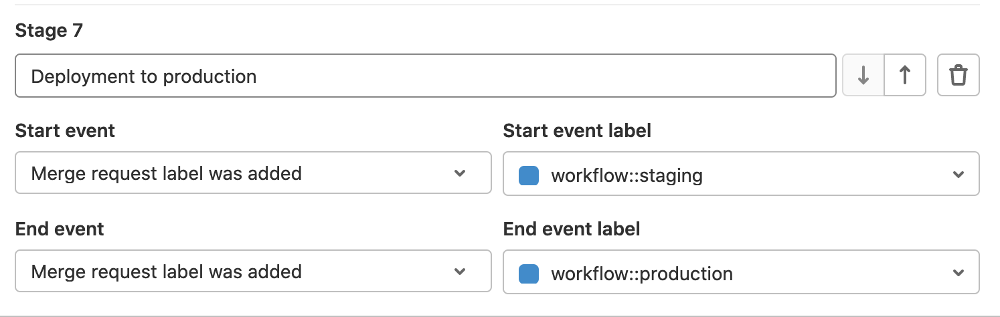



- Tier: 基础版，专业版，旗舰版
- Offering: JihuLab.com，私有化部署



价值流分析计算软件开发过程中每个阶段的持续时间。通过跟踪合并请求或议题事件，您可以衡量从想法到生产所需的时间。

使用价值流分析来识别：

- 从想法到生产所需的时间。
- 给定项目的速度。
- 开发过程中的瓶颈。
- 长期存在的议题或合并请求。
- 导致软件开发生命周期变慢的因素。

价值流分析帮助企业：

- 可视化端到端的 DevSecOps 工作流。
- 识别并解决低效问题。
- 优化工作流，更快地交付更多价值（例如，[缩短合并请求审查时间](https://gitlab.cn/blog/how-we-reduced-mr-review-time-with-value-stream-management/)）。

如需点击式演示，请参阅[价值流管理产品导览](https://gitlab.navattic.com/vsm)。

价值流分析具有层级结构：

- 一个 **价值流** 包含一个价值流阶段列表。
- 每个价值流阶段列表包含一个或多个 **阶段**。
- 每个阶段由两个 **事件** 定义：开始和结束。

<a id="value-streams"></a>

## 价值流

价值流是向客户交付价值的整个工作流程。价值流是阶段的容器对象。每个群组可以有多个价值流，以专注于 DevOps 生命周期的不同方面。

<a id="value-stream-stages"></a>

## 价值流阶段

阶段表示一个事件对（开始和结束事件）以及附加的元数据，例如阶段名称。您可以使用内置的默认阶段来进行价值流分析，您可以对它们重新排序和隐藏。您还可以创建和添加与特定开发工作流相一致的定制阶段。

<a id="value-stream-stage-events"></a>

## 价值流阶段事件



- 在极狐GitLab 17.2 引入了合并请求首次指派审查者事件。在极狐GitLab 17.2 之前创建或更新的合并请求中的审查者指派事件不可用于报告。



事件是定义阶段开始和结束的构建块。每个事件都有开始和结束时间：

- 开始事件时间标记阶段中工作开始的时间（例如，创建议题时）。
- 结束事件时间标记阶段中工作完成的时间（例如，关闭议题时）。

极狐GitLab 根据开始和结束事件时间计算阶段持续时间，使用以下公式：

阶段持续时间 = 结束事件时间 - 开始事件时间

价值流分析支持以下事件：

- 议题已关闭
- 议题已创建
- 议题首次添加到看板
- 议题首次添加到迭代
- 议题首次被指派
- 议题首次关联里程碑
- 议题首次在提交中提及
- 议题标签已添加
- 议题标签已移除
- 合并请求已关闭
- 合并请求已创建
- 合并请求首次被指派
- 合并请求首次提交
- 合并请求首次部署到生产环境
- 合并请求标签已添加
- 合并请求标签已移除
- 合并请求最后一次获批
- 合并请求最后一次构建完成
- 合并请求最后一次构建开始
- 合并请求已合并
- 合并请求首次指派审查者

<a id="data-aggregation"></a>

## 数据聚合



- Tier: 专业版，旗舰版
- Offering: JihuLab.com，私有化部署





- 在极狐GitLab 15.0 添加了按停止日期筛选功能。



价值流分析使用后端流程收集和聚合阶段级数据，确保它能扩展以支持拥有大量议题和合并请求的大型群组。由于此过程，在您执行操作（例如，关闭一个议题）与数据在价值流分析页面上显示之间可能会有轻微的延迟。

处理数据并显示结果最多可能需要 10 分钟。在以下情况下，数据收集可能超过 10 分钟：

- 如果这是您首次查看价值流分析，并且尚未创建价值流。
- 如果群组层级结构已被重新排列。
- 如果对议题和合并请求进行了批量更新。

要查看数据最近更新的时间，请在 **编辑** 旁边的右上角，将鼠标悬停在 **上次更新** 徽章上。

<a id="stage-measurement"></a>

## 阶段计量

价值流分析从每个阶段的开始事件到结束事件进行计量。只有已达到结束事件的项才会包含在阶段时间计算中。

默认情况下，受阻议题不会包含在生命周期概览中。但是，您可以使用自定义标签（例如 `workflow::blocked`）来跟踪它们。

您可以根据预定义事件自定义价值流分析中的阶段。为了帮助您配置，极狐GitLab 提供了一个预定义的阶段列表，您可以将其用作模板。例如，您可以定义一个阶段，当您向议题添加一个标签时开始，当您添加另一个标签时结束。

下表概览了价值流分析中预定义的阶段。

| 阶段   | 计量方法   |
| ------- | -------------------- |
| 议题     | 从创建议题到采取行动解决问题之间的中位时间，行动通过给议题添加标签或将其添加到里程碑来进行，以先发生者为准。只有已经为其创建了[议题看板列表](../../project/issue_board.md)的标签才会被跟踪。 |
| 计划      | 从上一阶段采取的行动到向分支推送第一次提交之间的中位时间。分支上的第一次提交会触发 **计划** 和 **代码** 阶段的分离。分支中至少有一个提交必须包含相关议题编号（例如，`#42`）。如果分支中没有任何提交提及相关议题编号，则该阶段测量时间不会将其考虑在内。 |
| 代码      | 从推送第一次提交（上一阶段）到创建与该提交相关的合并请求 (MR) 之间的中位时间。保持流程跟踪的关键是在合并请求的描述中包含[议题关闭模式](../../project/issues/managing_issues.md#default-closing-pattern)。例如，`Closes #xxx`，其中 `xxx` 是与该合并请求相关的议题编号。如果不存在关闭模式，则计算将使用合并请求中第一次提交的创建时间作为开始时间。 |
| 测试      | 在该项目运行整个流水线的中位时间。它与极狐GitLab CI/CD 为推送到该合并请求的提交运行每个作业所花费的时间相关。它基本上是所有流水线的开始->结束时间。 |
| 审查    | 从创建具有关闭议题模式的合并请求到其合并所花费的中位时间。 |
| 发布   | 从合并具有关闭议题模式的合并请求到首次部署到[生产环境](#production-environment)之间的中位时间。如果不存在生产环境，则不会跟踪此阶段。 |

> [!note]
> 价值流分析基于时间戳数据，只聚合阶段的最终开始和停止事件。对于在阶段之间多次来回移动的项，阶段时间仅根据最终事件的时间戳计算。

<a id="example-workflow"></a>

### 示例工作流程

此示例展示了在一天内完成全部七个阶段的工作流程。

如果某个阶段不包含开始和停止时间，则其中位时间不包含其数据。在此示例中，已创建里程碑，并配置了用于测试和设置环境的 CI/CD。

- 09:00：创建议题。**议题** 阶段开始。
- 11:00：将议题添加到里程碑（或待办事项），开始处理议题，并在本地创建分支。
  **议题** 阶段停止，**计划** 阶段开始。
- 12:00：进行第一次提交。
- 12:30：进行第二次提交到分支，提及议题编号。
  **计划** 阶段停止，**代码** 阶段开始。
- 14:00：推送分支并创建包含[议题关闭模式](../../project/issues/managing_issues.md#closing-issues-automatically)的合并请求。
  **代码** 阶段停止，**测试** 和 **审查** 阶段开始。
- 极狐GitLab CI/CD 花费 5 分钟运行在 [`.gitlab-ci.yml` 文件](../../../ci/yaml/_index.md)中定义的脚本。
- 19:00：合并合并请求。**审查** 阶段停止，**发布** 阶段开始。
- 19:30：部署到 `production` 环境完成。**发布** 停止。

价值流分析记录每个阶段的以下时间：

- **议题**：09:00 至 11:00：2 小时
- **计划**：11:00 至 12:00：1 小时
- **代码**：12:00 至 14:00：2 小时
- **测试**：5 分钟
- **审查**：14:00 至 19:00：5 小时
- **发布**：19:00 至 19:30：30 分钟

请记住与此示例相关的以下观察结果：

- 此示例表明，第一次提交是否提及议题编号并不重要，您可以在之后正在处理的分支上的任何提交中提及。
- **测试** 阶段用于计算周期的总时间。它包含在 **审查** 流程中，因为每个 MR 都应该被测试。
- 此示例仅展示了七个阶段的 **一个周期**。价值流分析仪表板显示多个周期的中位时间。

<a id="cumulative-label-event-duration"></a>

### 累积标签事件持续时间



- 在极狐GitLab 16.9 引入，带有功能标志 `enable_vsa_cumulative_label_duration_calculation` 和 `vsa_duration_from_db`，默认禁用。
- 在极狐GitLab 16.10 上启用（JihuLab.com 和私有化部署），功能标志 `vsa_duration_from_db` 已移除。
- 功能标志 `enable_vsa_cumulative_label_duration_calculation` 在极狐GitLab 17.0 中移除。



使用此功能，价值流分析会测量基于标签的阶段中重复事件的持续时间。您应该为开始和结束事件都配置标签移除或添加事件。

例如，一个阶段在添加和移除 `in progress` 标签时进行跟踪，时间如下：

- 9:00：添加标签。
- 10:00：移除标签。
- 12:00：添加标签。
- 14:00：移除标签。

使用原始计算方法，持续时间为五小时（从 9:00 到 14:00）。启用累积标签事件持续时间计算后，持续时间为三小时（9:00 到 10:00 和 12:00 到 14:00）。

> [!note]
> 当您将极狐GitLab 版本升级到 16.10（或更高版本）时，现有的基于标签的价值流分析阶段将通过后台聚合过程自动重新聚合。

<a id="reaggregate-data-after-upgrade"></a>

#### 升级后重新聚合数据



- Offering: 私有化部署



在大型实例上，当您升级极狐GitLab 版本时，特别是如果跳过了几个次要版本，后台聚合过程可能会持续更长时间。此延迟可能导致价值流分析页面上显示过时的数据。为了加快聚合过程并避免过时数据，您可以在 [Rails 控制台](../../../administration/operations/rails_console.md#starting-a-rails-console-session)中，为给定群组调用同步聚合代码片段：

```ruby
group = Group.find(-1) # put your group id here
group_to_aggregate = group.root_ancestor

loop do
  cursor = {}
  context = Analytics::CycleAnalytics::AggregationContext.new(cursor: cursor)
  service_response = Analytics::CycleAnalytics::DataLoaderService.new(group: group_to_aggregate, model: Issue, context: context).execute

  if service_response.success? && service_response.payload[:reason] == :limit_reached
    cursor = service_response.payload[:context].cursor
  elsif service_response.success?
    puts "finished"
    break
  else
    puts "failed"
    break
  end
end

loop do
  cursor = {}
  context = Analytics::CycleAnalytics::AggregationContext.new(cursor: cursor)
  service_response = Analytics::CycleAnalytics::DataLoaderService.new(group: group_to_aggregate, model: MergeRequest, context: context).execute

  if service_response.success? && service_response.payload[:reason] == :limit_reached
    cursor = service_response.payload[:context].cursor
  elsif service_response.success?
    puts "finished"
    break
  else
    puts "failed"
    break
  end
end
```

<a id="production-environment"></a>

## 生产环境

价值流分析通过查找项目[环境](../../../ci/yaml/_index.md#environment)，其名称匹配以下任一模式，来识别[生产环境](../../../ci/environments/_index.md#deployment-tier-of-environments)：

- `prod` 或 `prod/*`
- `production` 或 `production/*`

这些模式不区分大小写。

您可以在极狐GitLab CI/CD 配置中更改项目环境的名称。

<a id="view-value-stream-analytics"></a>

## 查看价值流分析



- 在极狐GitLab 16.5 引入了预定义日期范围下拉列表，带有功能标志 `vsa_predefined_date_ranges`，默认禁用。
- 在极狐GitLab 16.7 启用了预定义日期范围下拉列表（私有化部署和 JihuLab.com）。
- 预定义日期范围下拉列表在极狐GitLab 16.9 上 GA。功能标志 `vsa_predefined_date_ranges` 已移除。



先决条件：

- 您必须具有报告者、开发者、维护者或所有者角色。
- 您必须创建自定义价值流。价值流分析仅显示为您的群组或项目创建的自定义价值流。

要查看群组或项目的价值流分析：

1. 在顶部栏上，选择 **搜索或跳转到** 并找到您的项目或群组。
1. 在左侧边栏中，选择 **分析** > **价值流分析**。
1. 要查看特定阶段的指标，请在 **筛选结果** 文本框下方选择一个阶段。
1. 可选。筛选结果：
   1. 选择 **筛选结果** 文本框。
   1. 选择一个参数。
   1. 选择一个值或输入文本以细化结果。
   1. 要查看特定日期范围内的指标，从下拉列表中选择预定义日期范围或 **自定义** 选项。选择 **自定义** 选项后：

      - 在 **开始日期** 字段中，选择开始日期。
      - 在 **结束日期** 字段中，选择结束日期。

      图表和列表显示在日期范围内创建的工作流项。
1. 可选。按升序或降序排序结果：
   - 要按最新或最旧的工作流项排序，请选择 **最后事件** 表头。
   - 要按在每个阶段花费的最多或最少时间排序，请选择 **持续时间** 表头。

工作流项表头旁边的徽章显示在所选阶段完成的工作流项数量。

该表格显示所选阶段的相关工作流项列表。根据您选择的阶段，它可能是：

- 议题
- 合并请求

> [!note]
> 每个预定义日期范围的结束日期都是当前日期，并包含在所选的日期范围内。例如，`最近 30 天` 的开始日期是当前日期的前 29 天，共计 30 天。

<a id="data-filters"></a>

### 数据筛选器

您可以筛选价值流分析以查看符合特定条件的数据。支持以下筛选器：

- 日期范围
- 项目
- 指派人
- 作者
- 里程碑
- 标签

<a id="value-stream-analytics-metrics"></a>

## 价值流分析指标

价值流分析中的 **概览** 页面显示项目和群组的 DevSecOps 生命周期性能的关键指标。

<a id="lifecycle-metrics"></a>

### 生命周期指标

价值流分析包括以下生命周期指标：

- **前置时间**：从议题创建到关闭的中位时间。
- **周期时间**：议题首次在合并请求的[提交消息中被引用](../../project/issues/crosslinking_issues.md#from-commit-messages)到该引用的议题被关闭之间的中位时间。您必须在提交消息中包含 `#` 后跟议题编号（例如，`#123`），否则不会显示数据。周期时间通常比前置时间短，因为合并请求是在第一次提交之后创建的。
- **新增议题**：创建的新议题数量。
- **部署**：部署到生产环境的总次数。

<a id="dora-metrics"></a>

### DORA 指标



- Tier: 旗舰版
- Offering: JihuLab.com，私有化部署





- 在极狐GitLab 15.0 中引入了恢复服务时间瓷砖。
- 在极狐GitLab 15.0 中引入了变更失败率瓷砖。



价值流分析包括以下 [DORA](../../analytics/dora_metrics.md) 指标：

- 部署频率
- 变更前置时间
- 恢复服务时间
- 变更失败率

DORA 指标根据 [DORA API](../../../api/dora/metrics.md) 的数据计算。

如果您拥有极狐GitLab 专业版或旗舰版订阅：

- 成功部署次数通过 DORA 数据计算。
- 数据基于环境及环境层级进行筛选。

<a id="view-lifecycle-and-dora-metrics"></a>

## 查看生命周期和 DORA 指标

先决条件：

- 要查看部署指标，您必须已经[配置了生产环境](#production-environment)。

要查看生命周期指标：

1. 在顶部栏，选择 **搜索或跳转到** 并找到您的项目或群组。
1. 在左侧边栏中，选择 **分析** > **价值流分析**。生命周期指标显示在 **筛选结果** 文本框下方。
1. 可选。筛选结果：
   1. 选择 **筛选结果** 文本框。根据您选择的筛选器，仪表板会自动聚合生命周期指标并显示价值流的状态。
   1. 选择一个参数。
   1. 选择一个值或输入文本以细化结果。
   1. 要调整日期范围：
      - 在 **开始日期** 字段中，选择开始日期。
      - 在 **结束日期** 字段中，选择结束日期。

要查看[价值流仪表板](../../analytics/value_streams_dashboard.md)和 [DORA 指标](../../analytics/dora_metrics.md)：

1. 在顶部栏，选择 **搜索或跳转到** 并找到您的项目或群组。
1. 在左侧边栏中，选择 **分析** > **价值流分析**。
1. 在 **筛选结果** 文本框下方，在 **生命周期指标** 行中，选择 **价值流仪表板 / DORA**。
1. 可选。要打开新页面，将路径 `/analytics/dashboards/value_streams_dashboard` 附加到群组 URL 后面（例如，`https://jihulab.com/groups/gitlab-cn/-/analytics/dashboards/value_streams_dashboard`）。

<a id="view-metrics-for-each-development-stage"></a>

## 查看每个开发阶段的指标

价值流分析显示议题或合并请求在每个开发阶段所花费的中位时间。

要查看群组在每个阶段花费的中位时间：

1. 在顶部栏，选择 **搜索或跳转到** 并找到您的项目或群组。
1. 在左侧边栏中，选择 **分析** > **价值流分析**。
1. 可选。筛选结果：
   1. 选择 **筛选结果** 文本框。
   1. 选择一个参数。
   1. 选择一个值或输入文本以细化结果。
   1. 要调整日期范围：
      - 在 **开始日期** 字段中，选择开始日期。
      - 在 **结束日期** 字段中，选择结束日期。
1. 要查看每个阶段的指标，在 **筛选结果** 文本框上方悬停在一个阶段上。

> [!note]
> 日期范围选择器根据事件时间筛选项。事件时间是指给定项的所选阶段完成的时间。

<a id="view-tasks-by-type"></a>

## 按类型查看任务



- Tier: 专业版，旗舰版
- Offering: JihuLab.com，私有化部署



**按类型划分的任务** 图表显示您的群组每天已完成任务（已关闭的议题和已合并的合并请求）的累积数量。

该图表使用全局页面筛选器，根据选定的群组和时间范围显示数据。

要查看按类型划分的任务：

1. 在顶部栏，选择 **搜索或跳转到** 并找到您的群组。
1. 在左侧边栏中，选择 **分析** > **价值流分析**。
1. 在 **筛选结果** 文本框下方，选择 **概览**。**按类型划分的任务** 图表显示在 **总时间** 图表下方。
1. 可选。要按类型筛选任务，请选择 **设置** ()，然后选择 **议题** 或 **合并请求**。
1. 可选。要按标签筛选任务，请选择 **设置** ()，然后选择一个或多个标签。默认情况下会选择顶级群组标签（最多 10 个）。您可以选择最多 15 个标签。

<a id="create-a-value-stream"></a>

## 创建价值流



- Tier: 专业版，旗舰版
- Offering: JihuLab.com，私有化部署





- **新建价值流** 在极狐GitLab 16.10 中从对话框改为页面，带有功能标志 `vsa_standalone_settings_page`，默认禁用。
- 在极狐GitLab 17.7 中 GA，功能标志 `vsa_standalone_settings_page` 已移除。



<a id="with-default-stages"></a>

### 使用默认阶段

要创建具有默认阶段的价值流：

1. 在顶部栏，选择 **搜索或跳转到** 并找到您的项目或群组。
1. 在左侧边栏中，选择 **分析** > **价值流分析**。
1. 选择 **新建价值流**。
1. 输入价值流的名称。
1. 选择 **从默认模板创建**。
1. 自定义默认阶段：
   - 要对阶段重新排序，请选择向上或向下箭头。
   - 要隐藏一个阶段，请选择 **隐藏** ()。
1. 要添加自定义阶段，选择 **添加阶段**。
   - 输入阶段的名称。
   - 选择 **开始事件** 和 **停止事件**。
1. 选择 **新建价值流**。

> [!note]
> 如果您最近升级到极狐GitLab 专业版，数据收集和显示可能需要长达 30 分钟。

<a id="with-custom-stages"></a>

### 使用自定义阶段

要创建具有自定义阶段的价值流：

1. 在顶部栏，选择 **搜索或跳转到** 并找到您的项目或群组。
1. 在左侧边栏中，选择 **分析** > **价值流分析**。
1. 选择 **新建价值流**。
1. 对于每个阶段：
   - 输入阶段的名称。
   - 选择 **开始事件** 和 **停止事件**。
1. 要添加另一个阶段，请选择 **添加阶段**。
1. 要对阶段重新排序，请选择向上或向下箭头。
1. 选择 **新建价值流**。

<a id="label-based-stages-for-custom-value-streams"></a>

## 基于标签的自定义价值流阶段

要测量复杂的工作流程，您可以使用[范围标签](../../project/labels.md#scoped-labels)。例如，要测量从预发布环境到生产环境的部署时间，您可以使用以下标签：

- 当代码部署到预发布环境时，将 `workflow::staging` 标签添加到合并请求。
- 当代码部署到生产环境时，将 `workflow::production` 标签添加到合并请求。



<a id="automatic-data-labeling-with-webhooks"></a>

### 使用 Webhooks 自动数据标记

您可以通过使用[极狐GitLab webhook 事件](../../project/integrations/webhook_events.md)自动添加标签，以便在特定事件发生时，将标签应用到合并请求或议题。然后，您可以添加基于标签的阶段来跟踪工作流程。要了解更多实现细节，请参阅博客文章[自动应用极狐GitLab 标签](https://gitlab.cn/blog/applying-gitlab-labels-automatically/)。

<a id="example-configuration"></a>

### 示例配置


在上一个示例中，为在 **Test Group**（顶级命名空间）中使用不同开发工作流程的两个团队设置了两个独立的价值流。

第一个价值流使用基于时间戳的标准事件来定义阶段。第二个价值流使用标签事件。

<a id="edit-a-value-stream"></a>

## 编辑价值流


- Tier: 专业版，旗舰版
- Offering: JihuLab.com，私有化部署





- **编辑价值流** 在极狐GitLab 16.10 中将[变更](从对话框改为页面) [功能标志](../../../administration/feature_flags/_index.md) `vsa_standalone_settings_page` 实现，默认禁用。
- 在极狐GitLab 17.7 中[GA](。功能标志 `vsa_standalone_settings_page` 已移除。



创建价值流后，你可以根据需要进行自定义。编辑价值流的方法如下：

1. 在顶部栏中，选择 **搜索或跳转到** 并找到你的项目或群组。
1. 在左侧边栏中，选择 **分析** > **价值流分析**。
1. 从价值流下拉列表中，选择你要编辑的价值流。
1. 在价值流下拉列表旁边，选择 **编辑**。
1. 可选：
   - 重命名价值流。
   - 隐藏或重新排序默认阶段。
   - 移除现有自定义阶段。
   - 要添加新阶段，选择 **添加阶段**。
   - 为阶段选择开始和结束事件。
1. 可选。要撤销任何修改，选择 **恢复价值流默认值**。
1. 选择 **保存价值流**。

## 删除价值流



- Tier: 专业版，旗舰版
- Offering: JihuLab.com，私有化部署



要删除自定义价值流：

1. 在顶部栏中，选择 **搜索或跳转到** 并找到你的项目或群组。
1. 在左侧边栏中，选择 **分析** > **价值流分析**。
1. 从价值流下拉列表中，选择你要删除的价值流，然后选择 **删除（value stream 名称）**。
1. 确认后，选择 **删除**。

## 查看周期完成所需天数



- Tier: 专业版，旗舰版
- Offering: JihuLab.com，私有化部署



**总时间图** 显示开发周期完成所需平均天数。
该图表展示最近 500 个工作流项的数据。

1. 在顶部栏中，选择 **搜索或跳转到** 并找到你的项目或群组。
1. 在左侧边栏中，选择 **分析** > **价值流分析**。
1. 在 **过滤结果** 框上方，选择一个阶段：
   - 要查看所有阶段的周期时间摘要，选择 **概览**。
   - 要查看特定阶段的周期时间，选择该阶段。
1. 可选。过滤结果：
   1. 选择 **过滤结果** 文本框。
   1. 选择一个参数。
   1. 选择一个值或输入文本以细化结果。
   1. 调整日期范围：
      - 在 **开始** 字段中，选择开始日期。
      - 在 **结束** 字段中，选择结束日期。

## 访问权限

价值流分析的访问权限取决于项目类型。

| 项目类型 | 权限                                                      |
|----------|-----------------------------------------------------------|
| 公开     | 任何人可访问。                                            |
| 内部     | 任何已认证用户可访问。                                    |
| 私有     | 任何具有报告者、开发者、维护者或所有者角色的用户可访问。  |

## 价值流分析 GraphQL API



- Tier: 基础版，专业版，旗舰版
- Offering: JihuLab.com，私有化部署





- 在极狐GitLab 17.0 中[引入](https://gitlab.com/gitlab-org/gitlab/-/issues/410327)通过 GraphQL 加载阶段指标。



借助 VSA GraphQL API，你可以从配置的价值流和价值流阶段请求指标。如果你想将 VSA 数据导出到外部系统或用于报告，这会很有用。

可用的指标包括：

- 阶段中已完成项的数量。计数最多限制为 10,000 项。
- 阶段中已完成项的中位数持续时间。
- 阶段中已完成项的平均持续时间。

### 请求指标

先决条件：

- 你必须具有报告者、开发者、维护者或所有者角色。

首先，你必须确定要在报告中使用的价值流。

要请求群组的已配置价值流，运行：

```graphql
group(fullPath: "your-group-path") {
  valueStreams {
    nodes {
      id
      name
    }
  }
}
```

类似地，要请求项目的指标，运行：

```graphl
project(fullPath: "your-project-path") {
  valueStreams {
    nodes {
      id
      name
    }
  }
}
```

要请求价值流各阶段的指标，运行：

```graphql
group(fullPath: "your-group-path") {
  valueStreams(id: "your-value-stream-id") {
    nodes {
      stages {
        id
        name
      }
    }
  }
}
```

根据你想如何使用数据，你可以请求一个特定阶段或价值流中所有阶段的指标。

> [!note]
> 请求所有阶段的指标在某些安装中可能太慢。
> 建议的方法是逐个阶段请求指标。

请求特定阶段的指标：

```graphql
group(fullPath: "your-group-path") {
  valueStreams(id: "your-value-stream-id") {
    nodes {
      stages(id: "your-stage-id") {
        id
        name
        metrics(timeframe: { start: "2024-03-01", end: "2024-03-31" }) {
          average {
            value
            unit
          }
          median {
            value
            unit
          }
          count {
            value
            unit
          }
        }
      }
    }
  }
}
```

> [!note]
> 你应该始终在给定时间范围内请求指标。
> 支持的最长时间范围是 180 天。

`metrics` 节点支持额外的过滤选项：

- 指派人用户名
- 作者用户名
- 标签名称
- 里程碑标题

带过滤器的请求示例：

```graphql
group(fullPath: "your-group-path") {
  valueStreams(id: "your-value-stream-id") {
    nodes {
      stages(id: "your-stage-id") {
        id
        name
        metrics(
          labelNames: ["backend"],
          milestoneTitle: "17.0",
          timeframe: { start: "2024-03-01", end: "2024-03-31" }
        ) {
          average {
            value
            unit
          }
          median {
            value
            unit
          }
          count {
            value
            unit
          }
        }
      }
    }
  }
}
```

### 最佳实践

- 为了准确了解当前状态，请尽可能接近时间范围结束时请求指标。
- 对于定期报告，你可以创建脚本并使用[计划流水线](../../../ci/pipelines/schedules.md)功能及时导出数据。
- 调用 API 时，你会获得数据库中的当前数据。随着时间的推移，相同的指标可能会因数据库中基础数据的变化而改变。例如，从群组中移动或移除项目可能会影响群组级别的指标。
- 重新请求先前时段的指标并与之前收集的指标进行比较，可以发现数据的偏差，这有助于发现和解释变化的趋势。

## 功能可用性

价值流分析在项目和群组级别为基础版（FOSS）和许可版本提供不同功能。

- 在极狐GitLab 基础版中，价值流分析不会聚合数据。它直接查询数据库，其中日期范围过滤器应用于议题和合并请求的创建日期。你可以使用预定义的默认阶段查看价值流分析。
- 在极狐GitLab 专业版中，价值流分析会聚合数据，并将日期范围过滤器应用于结束事件。你还可以创建、编辑和删除价值流。

| 功能                                                  | 群组级（许可）                                                                                | 项目级（许可）                  | 项目级（基础版）                |
|-------------------------------------------------------|-----------------------------------------------------------------------------------------------|---------------------------------|---------------------------------|
| 创建自定义价值流                                      | 是                                                                                           | 是                              | 否，只有一个价值流（默认）和默认阶段 |
| 创建自定义阶段                                        | 是                                                                                           | 是                              | 否                              |
| 过滤（例如，按作者、标签、里程碑）                    | 是                                                                                           | 是                              | 是                              |
| 阶段时间图                                            | 是                                                                                           | 是                              | 否                              |
| 总时间图                                              | 是                                                                                           | 是                              | 否                              |
| 按类型任务图                                          | 是                                                                                           | 否                              | 否                              |
| DORA 指标                                             | 是                                                                                           | 是                              | 否                              |
| 周期时间和前置时间摘要（生命周期指标）                | 是                                                                                           | 是                              | 否                              |
| 新议题、提交和部署（生命周期指标）                    | 是，不包括提交                                                                                | 是                              | 是                              |
| 使用聚合后端                                          | 是                                                                                           | 是                              | 否                              |
| 日期过滤行为                                          | 过滤在日期范围内[完成]的项目 | 按创建日期过滤项目              | 按创建日期过滤项目              |
| 授权                                                  | 至少为报告者                                                                                 | 至少为报告者                    | 可以公开                        |

## 故障排除

### Sidekiq `cronjob:analytics_cycle_analytics` 导致 100% CPU 使用率

价值流分析的后台任务可能会通过独占 CPU 资源严重影响性能。

要从这种情况中恢复：

1. 在 [Rails 控制台](../../../administration/operations/rails_console.md)中为所有项目禁用该功能，并移除现有任务：

   ```ruby
   Project.find_each do |p|
     p.analytics_access_level='disabled';
     p.save!
   end

   Analytics::CycleAnalytics::GroupStage.delete_all
   Analytics::CycleAnalytics::Aggregation.delete_all
   ```

1. 配置 [Sidekiq 路由](../../../administration/sidekiq/processing_specific_job_classes.md)，例如使用单个 `feature_category=value_stream_management` 和多个 `feature_category!=value_stream_management` 条目。
   在[企业版列表](../../../administration/sidekiq/processing_specific_job_classes.md#list-of-available-job-classes)中查找其他相关的队列元数据。
1. 逐个为项目启用价值流分析。
   你可能需要根据性能要求进一步调整 Sidekiq 路由。