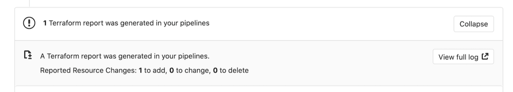
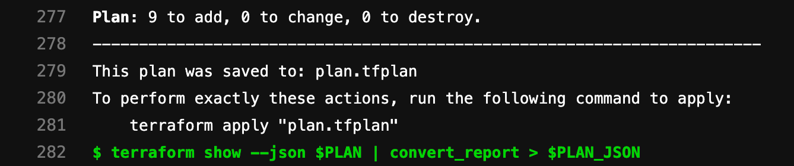



- Tier: 基础版，专业版，旗舰版
- Offering: JihuLab.com，私有化部署



围绕基础设施即代码（IaC）变更进行协作需要检查和批准代码变更以及预期的基础设施变更。极狐GitLab 提供了一种解决方案，通过合并请求页面帮助围绕 OpenTofu 代码变更及其预期影响进行协作。这样用户无需构建自定义工具或依赖第三方解决方案来简化他们的 IaC 工作流。

<a id="output-opentofu-plan-information-into-a-merge-request"></a>

## 在合并请求中输出 OpenTofu 计划信息

使用[极狐GitLab Terraform/OpenTofu 报告产物](../../../ci/yaml/artifacts_reports.md#artifactsreportsterraform)，您可以直接在合并请求小组件中暴露 `tofu plan` 运行的详细信息，让您能够查看 OpenTofu 创建、修改或销毁的资源的统计信息。

> [!warning]
> 与任何其他作业产物一样，OpenTofu 计划数据可被仓库上具有访客角色的任何人查看。
> OpenTofu 和极狐GitLab 默认均不加密计划文件。如果您的 OpenTofu `plan.json` 或 `plan.cache`
> 文件包含密码、访问令牌或证书等敏感数据，您应
> 加密计划输出或修改项目可见性设置。您还应 **禁用**
> [公共流水线](../../../ci/pipelines/settings.md#change-pipeline-visibility-for-non-project-members-in-public-projects)
> 并将 [产物的 public 标志设置为 false](../../../ci/yaml/_index.md#artifactspublic)（`public: false`）。
> 此设置可确保产物仅对极狐GitLab 管理员和具有报告者、开发者、维护者或所有者角色的项目成员可访问。

<a id="configure-opentofu-report-artifacts"></a>

## 配置 OpenTofu 报告产物

极狐GitLab 通过 OpenTofu CI/CD 组件[与 OpenTofu 集成](_index.md#quickstart-an-opentofu-project-in-pipelines)。该组件使用极狐GitLab 管理的 OpenTofu 状态来在合并请求中显示 OpenTofu 变更。

<a id="automatically-configure-opentofu-report-artifacts"></a>

### 自动配置 OpenTofu 报告产物

您应使用 [OpenTofu CI/CD 组件](https://gitlab.com/components/opentofu)，该组件会自动在 `plan` 作业中配置 OpenTofu 报告产物。

<a id="manually-configure-opentofu-report-artifacts"></a>

### 手动配置 OpenTofu 报告产物

如需快速设置，您应自定义预构建镜像并依赖 `gitlab-tofu` 辅助工具。

要手动配置极狐GitLab OpenTofu 报告产物：

1. 定义可重用变量，以便多次引用这些文件：

   ```yaml
   variables:
     PLAN: plan.cache
     PLAN_JSON: plan.json
   ```

1. 安装 `jq`，一个 [轻量且灵活的命令行 JSON 处理器](https://stedolan.github.io/jq/)。
1. 为特定的 `jq` 命令创建别名，该命令解析出您想从 `tofu plan` 输出中提取的信息：

   ```yaml
   before_script:
     - apk --no-cache add jq
     - alias convert_report="jq -r '([.resource_changes[]?.change.actions?]|flatten)|{\"create\":(map(select(.==\"create\"))|length),\"update\":(map(select(.==\"update\"))|length),\"delete\":(map(select(.==\"delete\"))|length)}'"
   ```

   > [!note]
   > 在使用 Bash 的发行版中（例如 Ubuntu），`alias` 语句不会在非交互模式下展开。如果您的流水线因错误
   > `convert_report: command not found` 而失败，可以通过将 `shopt` 命令添加到脚本中来显式激活别名展开：

   ```yaml
   before_script:
     - shopt -s expand_aliases
     - alias convert_report="jq -r '([.resource_changes[]?.change.actions?]|flatten)|{\"create\":(map(select(.==\"create\"))|length),\"update\":(map(select(.==\"update\"))|length),\"delete\":(map(select(.==\"delete\"))|length)}'"
   ```

1. 定义运行 `tofu plan` 和 `tofu show` 的 `script`。这些命令将输出进行管道传输，并将相关部分转换为存储变量 `PLAN_JSON`。此 JSON 用于创建[极狐GitLab OpenTofu 报告产物](../../../ci/yaml/artifacts_reports.md#artifactsreportsterraform)。OpenTofu 报告获取一个 OpenTofu `tfplan.json` 文件。收集到的 OpenTofu 计划报告作为产物上传到极狐GitLab，并显示在合并请求中。

   ```yaml
   plan:
     stage: build
     script:
       - terraform plan -out=$PLAN
       - terraform show -json $PLAN | convert_report > $PLAN_JSON
     artifacts:
       reports:
         terraform: $PLAN_JSON
   ```

1. 运行流水线以在合并请求中显示小组件，如下所示：

   

   > [!note]
   > 小组件报告的每个操作的最大变更数为 999,999。此限制仅用于显示目的，变更资源数量更多的计划仍可正常应用。

1. 在小组件中，选择 **查看完整日志** 以转到存在于流水线日志中的计划输出：

   