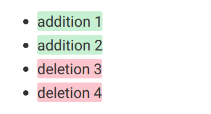
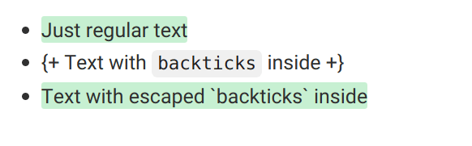
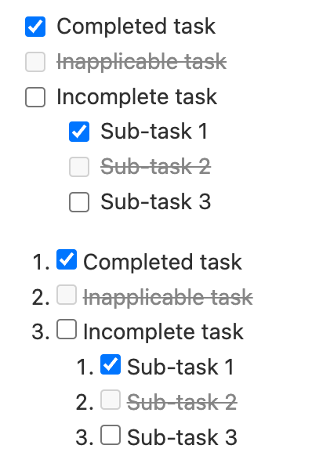
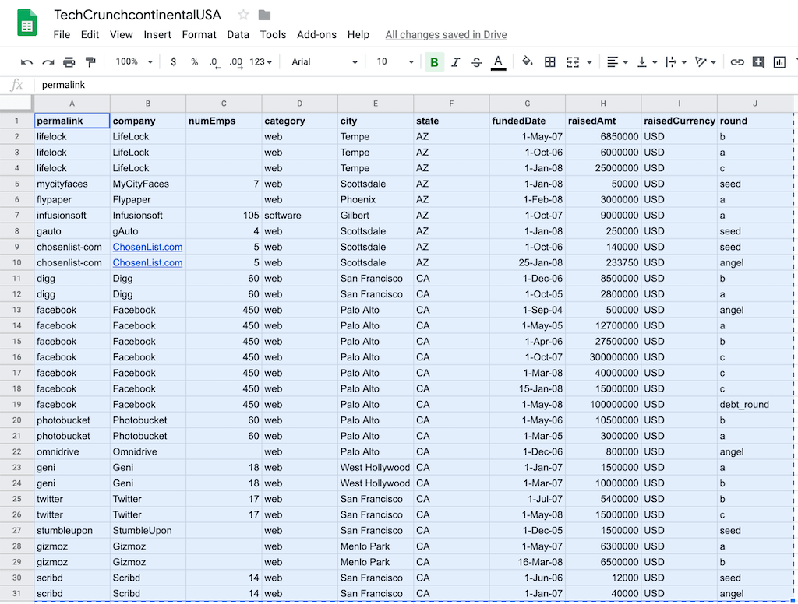
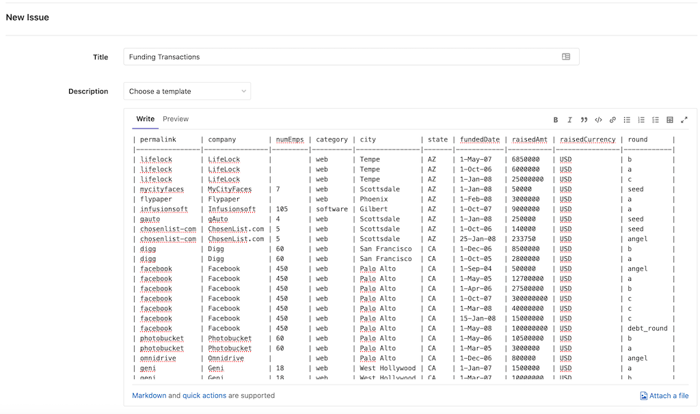
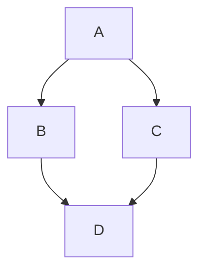
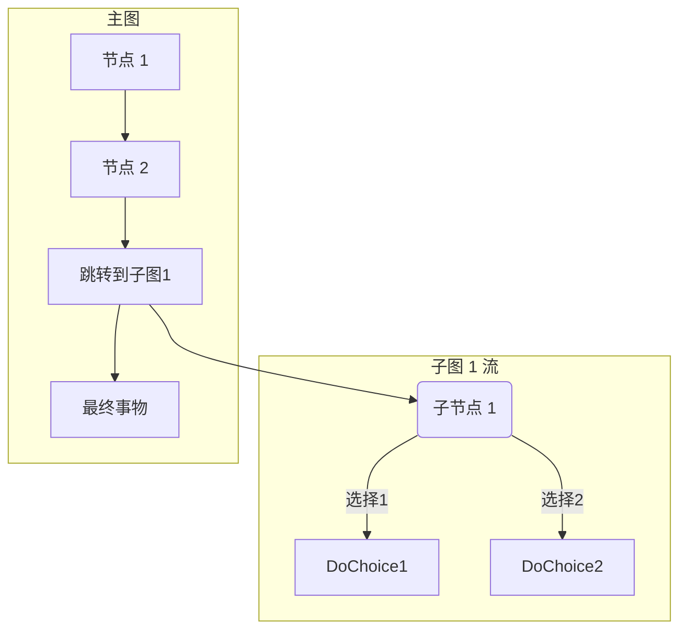
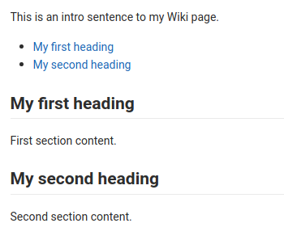



- Tier: 基础版，专业版，旗舰版
- Offering: JihuLab.com，私有化部署



极狐GitLab Flavored Markdown (GLFM) 是一种强大的标记语言，用于在 极狐GitLab 用户界面中格式化文本。
GLFM：

- 支持代码、图表、数学公式和多媒体，创建丰富内容。
- 通过交叉引用链接议题、合并请求和其他 极狐GitLab 内容。
- 使用任务列表、表格和可折叠部分组织信息。
- 支持超过 100 种编程语言的语法高亮。
- 通过语义化标题结构和图片描述确保可访问性。

当你在 极狐GitLab UI 中输入文本时，极狐GitLab 会假定文本使用的是 极狐GitLab Flavored Markdown。

你可以在以下位置使用 极狐GitLab Flavored Markdown：

- 评论
- 议题
- 史诗
- 合并请求
- 里程碑
- 代码片段（片段文件必须以 `.md` 扩展名命名）
- Wiki 页面
- 仓库中的 Markdown 文档
- 发布

你也可以在 极狐GitLab 中使用其他富文本文件。可能需要安装依赖项才能实现。有关更多信息，请参阅 [`gitlab-markup` gem 项目](https://jihulab.com/gitlab-cn/gitlab-markup)。

> [!note]
> 此 Markdown 规范仅适用于 极狐GitLab。我们尽力在此处忠实地渲染 Markdown，
> 但 [极狐GitLab 文档网站](https://gitlab.cn/docs) 和 [极狐GitLab 手册](https://handbook.gitlab.com) 使用不同的 Markdown 渲染器。

要查看 极狐GitLab 如何渲染这些示例的确切效果：

1. 复制相关的原始 Markdown 示例（而不是渲染后的版本）。
1. 将 Markdown 粘贴到 极狐GitLab 中支持 Markdown 预览的地方，例如议题或合并请求的评论或描述，或者新的 Markdown 文件。
1. 选择 **预览** 以查看 极狐GitLab 渲染的 Markdown。

## 与标准 Markdown 的区别

<!--
Use this topic to list features that are not present in standard Markdown.
Don't repeat this information in each individual topic, unless there's a specific
reason, like in "Newlines".
-->

极狐GitLab Flavored Markdown 由以下部分组成：

- 核心 Markdown 功能，基于 [CommonMark 规范](https://spec.commonmark.org/current/)。
- 来自 [GitHub Flavored Markdown](https://github.github.com/gfm/) 的扩展。
- 专为 极狐GitLab 制作的扩展。

所有标准 Markdown 格式在 极狐GitLab 中都应该按预期工作。一些标准功能通过附加功能进行了扩展，而不会影响标准用法。

以下功能在标准 Markdown 中不存在：

- [警告](#alerts)
- [以 `HEX`、`RGB` 或 `HSL` 编写的颜色色块](#colors)
- [描述列表](#description-lists)
- [图表和流程图](#diagrams-and-flowcharts)
- [表情符号](#emoji)
- [脚注](#footnotes)
- [前言](#front-matter)
- [极狐GitLab 特定引用](#gitlab-specific-references)（在 Markdown 片段文件中不支持。）
- [包含文件](#includes)
- [占位符](#placeholders)
- [内联差异](#inline-diff)
- [用 LaTeX 编写的数学公式和符号](#math-equations)
- [删除线](#emphasis)
- [目录](#table-of-contents)
- [表格](#tables)
- [任务列表](#task-lists)
- [Wiki 特定 Markdown](project/wiki/markdown.md)

以下功能是从标准 Markdown 扩展而来的：

| 标准 Markdown                     | 极狐GitLab 中的扩展 Markdown |
|-----------------------------------|-------------------------------|
| [块引用](#blockquotes)           | [多行块引用](#multiline-blockquote) |
| [代码块](#code-spans-and-blocks) | [彩色代码和语法高亮](#syntax-highlighting) |
| [标题](#headings)                 | [可链接的标题 ID](#heading-ids-and-links) |
| [图片](#images)                   | [嵌入视频](#videos) 和 [音频](#audio) |
| [链接](#links)                     | [自动链接 URL](#url-auto-linking) |

## Markdown 与可访问性

当你使用 极狐GitLab Flavored Markdown 时，你正在创建数字内容。
这些内容应尽可能对受众可访问。
以下列表并非详尽无遗，但为一些需要特别注意的 极狐GitLab Flavored Markdown 样式提供了指导：

### 可访问的标题

使用标题格式创建逻辑标题结构。
页面上的标题结构应该有意义，就像一个良好的目录。
确保页面上只有一个 `h1` 元素，标题级别不被跳过，并且它们嵌套正确。

### 可访问的表格

为了保持表格的可访问性和可扫描性，表格不应有任何空单元格。
如果单元格没有其他有意义的值，请考虑输入 **N/A** 表示“不适用”或 **None**。

### 可访问的图片和视频

在 `[alt text]` 中描述图片或视频。使描述准确、简洁且独特。
不要在描述中使用 `image of` 或 `video of`。有关更多信息，请参阅 [WebAim 替代文本](https://webaim.org/techniques/alttext/)。

## 工作项和合并请求标题



- 完整的 极狐GitLab Flavored Markdown 支持在 极狐GitLab 18.0 中引入。
- 完整的 极狐GitLab Flavored Markdown 支持在 极狐GitLab 18.11 中移除。



议题、合并请求、史诗和其他工作项的标题不支持完整的 极狐GitLab Flavored Markdown。
标题仅支持：

- 表情符号（`:emoji:` 短代码和自定义表情符号）。
- 自动链接的 URL。
- [极狐GitLab 特定引用](#gitlab-specific-references)，如 `#123`、`@user` 和 `!456`。

标准 Markdown 语法（如粗体、斜体、代码范围、链接、标题、列表和其他块级格式）在标题中不会被处理。
例如，标题 `` **合并请求标题** `` 不会以粗体显示，而是显示星号。

## 标题

使用 `#` 创建 1 到 6 级标题。

```markdown
# H1
## H2
### H3
#### H4
##### H5
###### H6
```

或者，对于 H1 和 H2，使用下划线样式：

```markdown
Alt-H1
======

Alt-H2
------
```

### 标题 ID 和链接



- 标题链接生成在 极狐GitLab 17.0 中更改。



所有 Markdown 渲染的标题都会自动获得可链接的 ID，评论中的除外。

悬停时，指向这些 ID 的链接会变得可见，以便更容易复制链接到标题，以便在其他地方使用。

ID 根据标题内容按以下规则生成：

1. 所有文本转换为小写。
1. 所有非单词文本（如标点或 HTML）被移除。
1. 所有空格转换为连字符。
1. 连续两个或更多连字符转换为一个。
1. 如果已生成具有相同 ID 的标题，则附加一个唯一的递增数字，从 1 开始。

示例：

<!--
Translation note: DO NOT TRANSLATE this example. The example must stay untranslated
to stay in sync with the example link IDs.
-->

```markdown
# This heading has spaces in it
## This heading has a :thumbsup: in it
# This heading has Unicode in it: 한글
## This heading has spaces in it
### This heading has spaces in it
## This heading has 3.5 in it (and parentheses)
## This heading has  multiple spaces and --- hyphens
```

将生成以下链接 ID：

1. `this-heading-has-spaces-in-it`
1. `this-heading-has-a-thumbsup-in-it`
1. `this-heading-has-unicode-in-it-한글`
1. `this-heading-has-spaces-in-it-1`
1. `this-heading-has-spaces-in-it-2`
1. `this-heading-has-35-in-it-and-parentheses`
1. `this-heading-has--multiple-spaces-and-----hyphens`

## 换行

如果前面的文本以两个换行符结束，则会插入一个换行符（开始一个新段落）。例如，当你连续按两次 <kbd>Enter</kbd> 时。如果只使用一个换行符（按一次 <kbd>Enter</kbd>），下一个句子仍然是同一段落的一部分。如果你想保持长行不换行并保持可编辑性，请使用此方法：

```markdown
Here's a line for us to start with.

This longer line is separated from the one above by two newlines, so it is a *separate paragraph*.

This line is also a separate paragraph, but...
These lines are only separated by single newlines,
so they *do not break* and just follow the previous lines
in the *same paragraph*.
```

渲染后，示例看起来类似于：

> Here's a line for us to start with.
>
> This longer line is separated from the one above by two newlines, so it is a *separate paragraph*.
>
> This line is also a separate paragraph, but...
> These lines are only separated by single newlines,
> so they *do not break* and just follow the previous lines
> in the *same paragraph*.

### 新行

一个段落是一行或多行连续文本，由一个或多个空行（第一个段落末尾有两个换行符）分隔，如 [换行](#line-breaks) 中所述。

需要更多对换行或软回车的控制？通过在行尾添加反斜杠或两个或更多空格来添加单行换行。连续两个换行符会创建一个新段落，中间有一个空行：

```markdown
First paragraph.
Another line in the same paragraph.
A third line in the same paragraph, but this time ending with two spaces.<space><space>
A new line directly under the first paragraph.

Second paragraph.
Another line, this time ending with a backslash.\
A new line due to the previous backslash.
```

渲染后，示例看起来类似于：

> First paragraph.
> Another line in the same paragraph.
> A third line in the same paragraph, but this time ending with two spaces.<br>
> A new line directly under the first paragraph.
>
> Second paragraph.
> Another line, this time ending with a backslash.\
> A new line due to the previous backslash.

此语法遵循处理 [段落和换行符](https://spec.commonmark.org/current/) 的 Markdown 规范。

## 强调

你可以通过多种方式强调文本。使用斜体、粗体、删除线，或组合这些强调样式。

示例：

```markdown
Emphasis, or italics, with *asterisks* or _underscores_.

Strong emphasis, or bold, with double **asterisks** or __underscores__.

Combined emphasis with **asterisks and _underscores_**.

Strikethrough with double tildes. ~~Scratch this.~~
```

渲染后，示例看起来类似于：

> Emphasis, or italics, with *asterisks* or _underscores_.
>
> Strong emphasis, or bold, with double **asterisks** or **underscores**.
>
> Combined emphasis with **asterisks and _underscores_**.
>
> Strikethrough with double tildes. ~~Scratch this.~~

### 词内强调

避免对单词的一部分进行斜体处理，尤其是在处理经常出现多个下划线的代码和名称时。

极狐GitLab Flavored Markdown 会忽略单词中的多个下划线，以便更好地渲染讨论代码的 Markdown 文档：

<!--
Translation note: DO NOT TRANSLATE these examples or the rendered versions.
The mid-word emphasis examples do not work in all languages and must stay in English to render correctly.
-->

```markdown
perform_complicated_task

do_this_and_do_that_and_another_thing

but_emphasis is_desired _here_
```

渲染后，示例看起来类似于：

<!-- vale gitlab_base.Spelling = NO -->

> perform_complicated_task
>
> do_this_and_do_that_and_another_thing
>
> but_emphasis is_desired _here_

<!-- vale gitlab_base.Spelling = YES -->

如果你只想强调单词的一部分，仍然可以使用星号：

```markdown
perform*complicated*task

do*this*and*do*that*and*another thing
```

渲染后，示例看起来类似于：

> perform*complicated*task
>
> do*this*and*do*that*and*another thing

### 内联差异

使用内联差异标签，你可以显示 `{+ additions +}` 或 `[- deletions -]`。

包裹标签可以是花括号或方括号：

<!--
Translation note: DO NOT TRANSLATE this example. The example must stay untranslated
to stay in sync with the image.
-->

```markdown
- {+ addition 1 +}
- [+ addition 2 +]
- {- deletion 3 -}
- [- deletion 4 -]
```



---

但是，你不能混合使用包裹标签：

```markdown
- {+ addition +]
- [+ addition +}
- {- deletion -]
- [- deletion -}
```

差异高亮不适用于 `` `inline code` ``。如果你的文本包含反引号 (`` ` ``)，请使用反斜杠 ` \ ` [转义](#escape-characters) 每个反引号：

<!--
Translation note: DO NOT TRANSLATE this example. The example must stay untranslated
to stay in sync with the image.
-->

```markdown
- {+ Just regular text +}
- {+ Text with `backticks` inside +}
- {+ Text with escaped \`backticks\` inside +}
```



### 水平线

使用三个或更多连字符、星号或下划线创建水平线：

```markdown
---

***

___
```

渲染后，所有水平线看起来类似于：

---

## 列表

你可以创建有序列表和无序列表。

对于有序列表，在每行开头添加你希望列表开始的数字，如 `1.`，后跟一个空格。在第一个数字之后，你使用什么数字并不重要。有序列表会根据垂直顺序自动编号，因此对同一列表中的所有项目重复使用 `1.` 是很常见的。如果你以 `1.` 以外的数字开头，它会将该数字作为第一个数字，并从那里开始递增。

示例：

```markdown
1. First ordered list item
2. Another item
   - Unordered sub-list.
1. Actual numbers don't matter, just that it's a number
   1. Ordered sub-list
   1. Next ordered sub-list item
4. And another item.
```

<!--
The "2." and "4." in the previous example are changed to "1." in the following example,
to match the style standards on <https://gitlab.cn/docs>.
See <https://gitlab.cn/docs/development/documentation/styleguide/#lists>.
-->

渲染后，示例看起来类似于：

> 1. First ordered list item
> 1. Another item
>    - Unordered sub-list.
> 1. Actual numbers don't matter, just that it's a number
>    1. Ordered sub-list
>    1. Next ordered sub-list item
> 1. And another item.

对于无序列表，在每行开头添加 `-`、`*` 或 `+`，后跟一个空格。不要在同一列表中混合使用这些字符。

```markdown
Unordered lists can:

- use
- minuses

They can also:

* use
* asterisks

They can even:

+ use
+ pluses
```

<!--
The "*" and "+" in the previous example are changed to "-" in the following example,
to match the style standards on <https://gitlab.cn/docs>.
See <https://gitlab.cn/docs/development/documentation/styleguide/#lists>.
-->

渲染后，示例看起来类似于：

> Unordered lists can:
>
> - use
> - minuses
>
> They can also:
>
> - use
> - asterisks
>
> They can even:
>
> - use
> - pluses

---

如果列表项包含多个段落，则每个后续段落应缩进到与列表项文本开头相同的级别。

示例：

```markdown
1. First ordered list item

   Second paragraph of first item.

1. Another item
```

渲染后，示例看起来类似于：

> 1. First ordered list item
>
>    Second paragraph of first item.
>
> 1. Another item

如果第一个项目的段落没有使用正确数量的空格缩进，该段落会出现在列表之外。
使用正确数量的空格在列表项下正确缩进。
例如：

```markdown
1. First ordered list item

  (Misaligned paragraph of first item.)

1. Another item
```

渲染后，示例看起来类似于：

<!-- markdownlint-disable MD027 -->

> 1. First ordered list item
>
>   (Misaligned paragraph of first item.)
>
> 1. Another item

<!-- markdownlint-enable MD027 -->

---

作为无序列表项的第一个子项的有序列表，如果它们不以 `1.` 开头，则必须有一个前置空行。

例如，有空行：

```markdown
- Unordered list item

  5. First ordered list item
```

渲染后，示例看起来类似于：

<!-- markdownlint-disable MD029 -->

> - Unordered list item
>
>   5. First ordered list item

<!-- markdownlint-disable MD029 -->

如果缺少空行，第二个列表项会渲染为第一个列表项的一部分：

```markdown
- Unordered list item
  5. First ordered list item
```

渲染后，示例看起来类似于：

> - Unordered list item
>   5. First ordered list item

---

CommonMark 忽略有序列表和无序列表项之间的空行，并将它们视为单个列表。这些项目被渲染为 [松散](https://spec.commonmark.org/0.30/#loose) 列表。每个列表项都包含在段落标签中，因此具有段落间距和边距。这使得列表看起来像是在每个项目之间有多余的间距。

例如：

```markdown
- First list item
- Second list item

- A different list
```

渲染后，示例看起来类似于：

> - First list item
> - Second list item
>
> - A different list

CommonMark 忽略空行，并将其渲染为具有段落间距的单个列表。

### 描述列表



- 描述列表在 极狐GitLab 17.7 中引入。



描述列表是带有相应描述的术语列表。
每个术语可以有多个描述。
在 HTML 中，这用 `<dl>`、`<dt>` 和 `<dd>` 标签表示。

要创建描述列表，将术语放在一行，描述放在下一行，以冒号开头。

```markdown
Fruits
: apple
: orange

Vegetables
: broccoli
: kale
: spinach
```

你也可以在术语和描述之间留一个空行。

```markdown
Fruits

: apple

: orange
```

> [!note]
> 富文本编辑器不支持插入新的描述列表。要插入新的描述列表，请使用纯文本编辑器。有关更多信息，请参阅 [议题 535956](https://gitlab.com/gitlab-org/gitlab/-/issues/535956)。

### 任务列表

你可以在支持 Markdown 的任何位置添加任务列表。

- 在议题、合并请求、史诗和评论中，你可以选择复选框。
- 在所有其他位置，你不能选择复选框。你必须通过添加或移除括号中的 `x` 来手动编辑 Markdown。

除了完成和未完成之外，任务还可以是 **不适用** 的。在议题、合并请求、史诗或评论中选择不适用的复选框没有任何效果。

要创建任务列表，请遵循有序或无序列表的格式：

<!--
Translation note: DO NOT TRANSLATE this example. The example must stay untranslated
to stay in sync with the image.
-->

```markdown
- [x] Completed task
- [~] Inapplicable task
- [ ] Incomplete task
  - [x] Sub-task 1
  - [~] Sub-task 2
  - [ ] Sub-task 3

1. [x] Completed task
1. [~] Inapplicable task
1. [ ] Incomplete task
   1. [x] Sub-task 1
   1. [~] Sub-task 2
   1. [ ] Sub-task 3
```



你也可以将任务列表添加到 [表格单元格](#task-lists-in-tables) 中。

## 链接

你可以通过多种方式创建链接：

```markdown
- This line shows an [inline-style link](https://www.google.com)
- This line shows a [link to a repository file in the same directory](permissions.md)
- This line shows a [relative link to a file one directory higher](../_index.md)
- This line shows a [link that also has title text](https://www.google.com "This link takes you to Google!")
```

渲染后，示例看起来类似于：

> - This line shows an [inline-style link](https://www.google.com)
> - This line shows a [link to a repository file in the same directory](permissions.md)
> - This line shows a [relative link to a file one directory higher](../_index.md)
> - This line shows a [link that also has title text](https://www.google.com "This link takes you to Google!")

你不能在 Wiki 页面中使用相对链接引用项目文件，也不能在项目文件中引用 Wiki 页面。存在此限制是因为 Wiki 在 极狐GitLab 中始终位于单独的 Git 仓库中。例如，`[I'm a reference-style link](style)` 仅当链接位于 Wiki Markdown 文件内部时才指向 `wikis/style`。有关更多信息，请参阅 [Wiki 特定 Markdown](project/wiki/markdown.md)。

使用标题 ID 锚点链接到页面中的特定部分：

```markdown
- This line links to [a section on a different Markdown page, using a `#` and the heading ID](permissions.md#project-permissions)
- This line links to [a different section on the same page, using a `#` and the heading ID](#heading-ids-and-links)
```

渲染后，示例看起来类似于：

> - This line links to [a section on a different Markdown page, using a `#` and the heading ID](permissions.md#project-permissions)
> - This line links to [a different section on the same page, using a `#` and the heading ID](#heading-ids-and-links)

使用链接引用：

<!--
The following codeblock uses extra spaces to avoid the Vale ReferenceLinks test.
Do not remove the two-space nesting.
-->

  ```markdown
  - This line shows a [reference-style link, see below][Arbitrary case-insensitive reference text]
  - You can [use numbers for reference-style link definitions, see below][1]
  - Or leave it empty and use the [link text itself][], see below.

  Some text to show that the reference links can follow later.

  [arbitrary case-insensitive reference text]: https://www.mozilla.org/en-US/
  [1]: https://slashdot.org
  [link text itself]: https://about.gitlab.com/
  ```

<!--
The example below uses in-line links to pass the Vale ReferenceLinks test.
Do not change to reference style links.
-->

渲染后，示例看起来类似于：

> - This line is a [reference-style link, see below](https://www.mozilla.org/en-US/)
> - You can [use numbers for reference-style link definitions, see below](https://slashdot.org)
> - Or leave it empty and use the [link text itself](https://about.gitlab.com/), see below.
>
> Some text to show that the reference links can follow later.

### URL 自动链接

你放入文本中的几乎任何 URL 都会自动链接：

```markdown
- https://www.google.com
- https://www.google.com
- ftp://ftp.us.debian.org/debian/
- smb://foo/bar/baz
- irc://irc.freenode.net/
- http://localhost:3000
```

渲染后，示例看起来类似于：

> - <https://www.google.com>
> - <https://www.google.com>
> - <ftp://ftp.us.debian.org/debian/>
> - <a href="smb://foo/bar/baz/">smb://foo/bar/baz</a>
> - <a href="irc://irc.freenode.net">irc://irc.freenode.net</a>
> - <http://localhost:3000>

## 极狐GitLab 特定引用



- Wiki 页面的自动完成在 极狐GitLab 16.11 中引入。
- 从群组引用标签的选项在 极狐GitLab 17.1 中引入。
- 使用 `[work_item:123]` 语法引用议题、史诗和工作项的选项：
  - 在 极狐GitLab 18.1 中引入，带有名为 `extensible_reference_filters` 的功能标志。默认禁用。
  - 在 极狐GitLab 18.2 中 GA。功能标志 `extensible_reference_filters` 已移除。
- 使用 `[epic:123]` 语法引用史诗的选项在 极狐GitLab 18.4 中引入。



极狐GitLab Flavored Markdown 渲染 极狐GitLab 特定引用。例如，你可以引用一个议题、一次提交、一个团队成员，甚至整个项目团队。极狐GitLab Flavored Markdown 会将该引用转换为链接，以便你在它们之间导航。所有对项目的引用都应使用 **项目 slug** 而不是项目名称。

此外，极狐GitLab Flavored Markdown 识别某些跨项目引用，并且还有一个简写版本用于引用同一命名空间中的其他项目。

> [!note]
> 极狐GitLab 特定引用在 Markdown 片段文件中不受支持。

极狐GitLab Flavored Markdown 识别以下内容：
| 引用                                                                           | 输入                                                 | 跨项目引用                        | 同一命名空间内的快捷方式 |
|--------------------------------------------------------------------------------------|-------------------------------------------------------|------------------------------------------------|------------------------------------|
| 特定用户                                                                        | `@user_name`                                          |                                                |                                    |
| 特定群组                                                                       | `@group_name`                                         |                                                |                                    |
| 整个团队                                                                          | [`@all`](discussions/_index.md#mentioning-all-members) |                                               |                                    |
| 项目                                                                              | `namespace/project>`                                  |                                                |                                    |
| 议题                                                                                | ``#123``, `GL-123`, 或 `[issue:123]`                  | `namespace/project#123` 或 `[issue:namespace/project/123]` | `project#123` 或 `[issue:project/123]` |
| [工作项](work_items/_index.md)                                                    | `[work_item:123]`                                     | `[work_item:namespace/project/123]`            | `[work_item:project/123]`          |
| 合并请求                                                                        | `!123`                                                | `namespace/project!123`                        | `project!123`                      |
| 代码片段                                                                              | `$123`                                                | `namespace/project$123`                        | `project$123`                      |
| [史诗](group/epics/_index.md)                                                        | `#123`, `&123`, `[work_item:123]`, 或 `[epic:123]`    | `group1/subgroup#123`, `group1/subgroup&123`, `[work_item:group1/subgroup/123]`, 或 `[epic:group1/subgroup/123]` |  |
| [迭代](group/iterations/_index.md)                                              | `*iteration:"迭代标题"`                        |                                                |                                    |
| [迭代节奏](group/iterations/_index.md) 按 ID<sup>1</sup>                    | `[cadence:123]`                                       |                                                |                                    |
| [迭代节奏](group/iterations/_index.md) 按标题（单个词）<sup>1</sup>      | `[cadence:plan]`                                      |                                                |                                    |
| [迭代节奏](group/iterations/_index.md) 按标题（多个词）<sup>1</sup> | `[cadence:"plan a"]`                                 |                                                |                                    |
| [漏洞](application_security/vulnerabilities/_index.md)                       | `[vulnerability:123]`                                | `[vulnerability:namespace/project/123]`        | `[vulnerability:project/123]`      |
| 功能标志                                                                         | `[feature_flag:123]`                                  | `[feature_flag:namespace/project/123]`         | `[feature_flag:project/123]`       |
| 标签 按 ID <sup>2</sup>                                                             | `~123`                                                | `namespace/project~123`                        | `project~123`                      |
| 标签 按名称（单个词） <sup>2</sup>                                                | `~bug`                                                | `namespace/project~bug`                        | `project~bug`                      |
| 标签 按名称（多个词） <sup>2</sup>                                          | `~"feature request"`                                  | `namespace/project~"feature request"`          | `project~"feature request"`        |
| 标签 按名称（限定范围） <sup>2</sup>                                                  | `~"priority::high"`                                   | `namespace/project~"priority::high"`           | `project~"priority::high"`         |
| 项目里程碑 按 ID <sup>2</sup>                                                 | `%123`                                                | `namespace/project%123`                        | `project%123`                      |
| 里程碑 按名称（单个词） <sup>2</sup>                                            | `%v1.23`                                              | `namespace/project%v1.23`                      | `project%v1.23`                    |
| 里程碑 按名称（多个词） <sup>2</sup>                                      | `%"release candidate"`                                | `namespace/project%"release candidate"`        | `project%"release candidate"`      |
| 提交（特定）                                                                    | `9ba12248`                                            | `namespace/project@9ba12248`                   | `project@9ba12248`                 |
| 提交范围比较                                                              | `9ba12248...b19a04f5`                                 | `namespace/project@9ba12248...b19a04f5`        | `project@9ba12248...b19a04f5`      |
| 仓库文件引用                                                            | `[README](doc/README.md)`                             |                                                |                                    |
| 仓库文件引用（特定行）                                            | `[README](doc/README.md#L13)`                         |                                                |                                    |
| [告警](../operations/incident_management/alerts.md)                                 | `^alert#123`                                          | `namespace/project^alert#123`                  | `project^alert#123`                |
| [联系人](crm/_index.md#contacts)                                                    | `[contact:test@example.com]`                          |                                                |                                    |
| [Wiki 页面](project/wiki/_index.md)（如果页面 slug 与标题相同）      | `[[Home]]` 或 `[wiki_page:Home]`                      | `[wiki_page:namespace/project:Home]` 或 `[wiki_page:group1/subgroup:Home]` |        |
| [Wiki 页面](project/wiki/_index.md)（如果页面 slug 与标题不同）   | `[[How to use GitLab\|how-to-use-gitlab]]`            |                                                |                                    |

**脚注**：

1. 在极狐GitLab 16.9 中引入。
   迭代节奏引用始终以 `[cadence:<ID>]` 格式渲染。
   例如，如果引用的迭代节奏 ID 为 `1`，文本引用 `[cadence:"plan"]` 将渲染为 `[cadence:1]`。
2. 对于标签或里程碑，在 `namespace/project` 前添加 `/` 以指定确切的标签
   或里程碑，消除任何可能的歧义。

例如，使用 `#123` 引用议题会将输出格式化为指向议题编号 123 的链接，文本为 `#123`。同样，指向议题编号 123 的链接也会被识别并格式化为文本 `#123`。如果你不希望 `#123` 链接到议题，请添加前导反斜杠 `\#123`。

除此之外，指向某些对象的链接也会被识别并格式化。
例如：

- 议题上的评论：`"https://gitlab.com/gitlab-org/gitlab/-/issues/1234#note_101075757"`，渲染为 `#1234 (评论 101075757)`
- 议题的设计标签页：`"https://gitlab.com/gitlab-org/gitlab/-/issues/1234/designs"`，渲染为 `#1234 (设计)`。
- 指向单个设计的链接：`"https://gitlab.com/gitlab-org/gitlab/-/issues/1234/designs/layout.png"`，渲染为 `#1234[layout.png]`。

### 显示工作项标题



- 对工作项（任务、目标和关键结果）的支持在极狐GitLab 16.0 中引入。
- 对史诗的支持在极狐GitLab 17.7 中引入，带有名为 `work_item_epics` 的功能标志，默认启用。
- 对史诗在极狐GitLab 18.1 中 GA。功能标志 `work_item_epics` 已移除。



要在议题、任务、目标、关键结果、合并请求或史诗的渲染链接中包含标题：

- 在引用末尾添加加号 (`+`)。

例如，像 `#123+` 这样的引用会渲染为 `议题标题 (#123)`。

像 `https://gitlab.com/gitlab-org/gitlab/-/issues/1234+` 这样的 URL 引用也会被展开。

### 显示工作项摘要



- 对工作项（任务、目标和关键结果）的支持在极狐GitLab 16.0 中引入。
- 对史诗的支持在极狐GitLab 17.7 中引入，带有名为 `work_item_epics` 的功能标志，默认启用。
- 对史诗在极狐GitLab 18.1 中 GA。功能标志 `work_item_epics` 已移除。



要在史诗、议题、任务、目标、关键结果或合并请求的渲染链接中包含扩展摘要：

- 在引用末尾添加 `+s`。

摘要包含有关 **指派人**、**里程碑** 和 **健康状态** 的信息，具体取决于引用工作项的类型。

例如，像 `#123+s` 这样的引用会渲染为
`议题标题 (#123) • 第一指派人, 第二指派人+ • v15.10 • 需要关注`。

像 `https://gitlab.com/gitlab-org/gitlab/-/issues/1234+s` 这样的 URL 引用也会被展开。

要在指派人、里程碑或健康状态更改后更新渲染的引用：

- 刷新页面。

### 悬停时评论预览



- 在极狐GitLab 17.3 中引入，带有名为 `comment_tooltips` 的功能标志。默认禁用。
- 功能标志在极狐GitLab 17.6 中移除。



将鼠标悬停在评论链接上会显示作者和评论的第一行。

### 嵌入可观测性仪表板

你可以将极狐GitLab 可观测性 UI 仪表板嵌入到描述和评论中，例如在史诗、议题和 MR 中。

要嵌入可观测性仪表板 URL：

1. 在极狐GitLab 可观测性 UI 中，复制地址栏中的 URL。
1. 将链接粘贴到评论或描述中。极狐GitLab 风格的 Markdown 会识别该 URL 并显示源。

## 表格

创建表格时：

- 第一行包含表头，由竖线字符 (`|`) 分隔。
- 第二行将表头与单元格分开。
  - 单元格只能包含空格、连字符，以及（可选）用于水平对齐的冒号。
  - 每个单元格必须至少包含一个连字符，但添加更多连字符不会改变单元格的渲染效果。
  - 不允许包含连字符、空格或冒号以外的任何内容。
- 第三行及之后的所有行包含单元格值。
  - 你 **不能** 在 Markdown 中将单元格跨多行分隔，它们必须保持在单行，但可以非常长。如有需要，你也可以包含 HTML `<br>` 标签来强制换行。
  - 单元格大小 **不必** 相互匹配。它们是灵活的，但必须由竖线 (`|`) 分隔。
  - 你 **可以** 有空单元格。
- 列宽会根据单元格内容动态计算。
- 要在文本中使用竖线字符 (`|`) 而不是作为表格分隔符，你必须使用反斜杠 (`\|`) [转义](#escape-characters) 它。

示例：

```markdown
| 表头 1 | 表头 2 | 表头 3 |
| ---      | ------   | -------- |
| 单元格 1   | 单元格 2   | 单元格 3   |
| 单元格 4 | 单元格 5 更长 | 单元格 6 比其他单元格长得多，但这没关系。当单元格对于显示尺寸来说太大时，文本最终会换行。 |
| 单元格 7   |          | 单元格 9   |
```

渲染后，示例看起来类似于：

> | 表头 1 | 表头 2 | 表头 3 |
> | ---      | ------   | -------- |
> | 单元格 1   | 单元格 2   | 单元格 3   |
> | 单元格 4 | 单元格 5 更长 | 单元格 6 比其他单元格长得多，但这没关系。当单元格对于显示尺寸来说太大时，文本最终会换行。 |
> | 单元格 7   |          | 单元格 9   |

### 对齐

此外，你可以通过在第二行的“破折号”线两侧添加冒号 (`:`)
来选择列中文本的对齐方式。这会影响列中的每个单元格：

```markdown
| 左对齐 | 居中 | 右对齐 |
| :----------- | :------: | ------------: |
| 单元格 1       | 单元格 2   | 单元格 3        |
| 单元格 4       | 单元格 5   | 单元格 6        |
```

渲染后，示例看起来类似于：

> | 左对齐 | 居中 | 右对齐 |
> | :----------- | :------: | ------------: |
> | 单元格 1       | 单元格 2   | 单元格 3        |
> | 单元格 4       | 单元格 5   | 单元格 6        |

在极狐GitLab 中，表头在 Chrome 和 Firefox 中始终左对齐，在 Safari 中居中。
更多信息，请参见 [表格](#tables)。

### 具有多行的单元格

你可以使用 HTML 格式来调整表格的渲染效果。例如，你可以
使用 `<br>` 标签强制单元格具有多行：

```markdown
| 名称  | 详情 |
| ----- | ------- |
| 项目1 | 此文本在一行上 |
| 项目2 | 此项目有：<br>- 多个项目<br>- 我们希望单独列出 |
```

渲染后，示例看起来类似于：

> | 名称  | 详情 |
> | ----- | ------- |
> | 项目1 | 此文本在一行上 |
> | 项目2 | 此项目有：<br>- 多个项目<br>- 我们希望单独列出 |

### 表格中的任务列表



- 在表格单元格中原生 Markdown 语法支持任务项在极狐GitLab 18.9 中引入。



你可以在 Markdown 表格单元格中添加任务项复选框。
该复选框必须是单元格中的唯一内容：

```markdown
| 完成 | 任务                    |
| -------- | ----------------------- |
|   [x]    | 重构后端    |
|   [ ]    | 重构前端   |
|   [~]    | 不适用的任务       |
```

渲染后，示例看起来类似于：


要在单个单元格中添加多个任务项，或带有附加文本的任务项，
请使用带有单元格内 Markdown 的 HTML 表格：

```html
<table>
<thead>
<tr><th>表头 1</th><th>表头 2</th></tr>
</thead>
<tbody>
<tr>
<td>单元格 1</td>
<td>单元格 2</td>
</tr>
<tr>
<td>单元格 3</td>
<td>

- [ ] 任务一
- [ ] 任务二

</td>
</tr>
</tbody>
</table>
```

你也可以 [在富文本编辑器中创建表格](rich_text_editor.md#tables) 然后插入任务列表。

### 从电子表格复制和粘贴

如果你在电子表格软件（例如，Microsoft Excel、Google
Sheets 或 Apple Numbers）中工作，当你复制并粘贴
时，极狐GitLab 会从电子表格创建一个 Markdown 表格。例如，假设你有
以下电子表格：



选择单元格并将其复制到剪贴板。打开一个极狐GitLab Markdown
输入框并粘贴电子表格：



### JSON 表格



- Markdown 渲染在极狐GitLab 17.9 中引入。



要使用 JSON 代码块渲染表格，请使用以下语法：

````markdown
```json:table
{}
```
````

<div class="video-fallback">
  观看视频：<a href="https://www.youtube.com/watch?v=12yWKw1AdKY">演示：Markdown 中的 JSON 表格</a>。
</div>
<figure class="video-container">
  <iframe src="https://www.youtube-nocookie.com/embed/12yWKw1AdKY" frameborder="0" allowfullscreen> </iframe>
</figure>

> [!note]
> 管理员可以启用在 Markdown 中渲染 iframe 的功能，并为实例配置允许的 iframe `src`
> 主机。
> 你可以使用 [应用程序设置 API](../api/settings.md#available-settings) 管理这些设置：
>
> - `iframe_rendering_enabled`
> - `iframe_rendering_allowlist`
> - `iframe_rendering_allowlist_raw`。

`items` 属性是一个代表数据点的对象列表。

````markdown
```json:table
{
    "items" : [
      {"a": "11", "b": "22", "c": "33"}
    ]
}
```
````

要指定表格标签，请使用 `fields` 属性。

````markdown
```json:table
{
    "fields" : ["a", "b", "c"],
    "items" : [
      {"a": "11", "b": "22", "c": "33"}
    ]
}
```
````

并非 `items` 中的所有元素都必须在 `fields` 中有对应的值。

````markdown
```json:table
{
    "fields" : ["a", "b", "c"],
    "items" : [
      {"a": "11", "b": "22", "c": "33"},
      {"a": "211", "c": "233"}
    ]
}
```
````

当 `fields` 未显式指定时，标签将从 `items` 的第一个元素中选取。

````markdown
```json:table
{
    "items" : [
      {"a": "11", "b": "22", "c": "33"},
      {"a": "211", "c": "233"}
    ]
}
```
````

你可以为 `fields` 指定自定义标签。

````markdown
```json:table
{
    "fields" : [
        {"key": "a", "label": "AA"},
        {"key": "b", "label": "BB"},
        {"key": "c", "label": "CC"}
    ],
    "items" : [
      {"a": "11", "b": "22", "c": "33"},
      {"a": "211", "b": "222", "c": "233"}
    ]
}
```
````

你可以为 `fields` 的单个元素启用排序。

````markdown
```json:table
{
    "fields" : [
        {"key": "a", "label": "AA", "sortable": true},
        {"key": "b", "label": "BB"},
        {"key": "c", "label": "CC"}
    ],
    "items" : [
      {"a": "11", "b": "22", "c": "33"},
      {"a": "211", "b": "222", "c": "233"}
    ]
}
```
````

你可以使用 `filter` 属性来渲染一个表格，其内容可以根据用户输入动态过滤。

````markdown
```json:table
{
    "fields" : [
        {"key": "a", "label": "AA"},
        {"key": "b", "label": "BB"},
        {"key": "c", "label": "CC"}
    ],
    "items" : [
      {"a": "11", "b": "22", "c": "33"},
      {"a": "211", "b": "222", "c": "233"}
    ],
    "filter" : true
}
```
````

你可以使用 `markdown` 属性来允许在 `items` 和 `caption` 中使用极狐GitLab 风格的 Markdown，
包括极狐GitLab 引用。`fields` 不支持 Markdown。

````markdown
```json:table
{
    "fields" : [
        {"key": "a", "label": "AA"},
        {"key": "b", "label": "BB"},
        {"key": "c", "label": "CC"}
    ],
    "items" : [
      {"a": "11", "b": "**22**", "c": "33"},
      {"a": "#1", "b": "222", "c": "233"}
    ],
    "markdown" : true
}
```
````

默认情况下，每个 JSON 表格都有标题 `Generated with JSON data`。
你可以通过指定 `caption` 属性来覆盖此标题。

````markdown
```json:table
{
    "items" : [
      {"a": "11", "b": "22", "c": "33"}
    ],
    "caption" : "自定义标题"
}
```
````

如果 JSON 无效，则会发生错误。

````markdown
```json:table
{
    "items" : [
      {"a": "11", "b": "22", "c": "33"}
    ],
}
```
````

## 多媒体

嵌入图片、视频和音频。
你可以使用 Markdown 语法添加多媒体，以链接文件、设置尺寸并内联显示。
格式化选项让你可以自定义标题、指定宽度和高度，并控制媒体在
渲染输出中的显示方式。

### 图片



- 在叠加层中打开图片在极狐GitLab 18.6 中引入。
- 透明度棋盘格切换在极狐GitLab 18.10 中引入。



使用前面带有 `!` 的内联或引用 [链接](#links) 嵌入图片。例如：

<!--
请勿更改 `markdown_logo_v17_11.png` 的名称。此文件用于
spec/controllers/help_controller_spec.rb 中的测试。
-->

```markdown

```

> 

在图片链接中：

- 方括号 (`[ ]`) 中的文本成为图片的替代文本。
- 图片链接路径后双引号中的文本成为标题文本。
  要查看标题文本，请将鼠标悬停在图片上。

更多信息，请参见 [可访问的图片和视频](#accessible-images-and-videos)。

选中图片后，它会在叠加层中打开。

如果图片有透明区域，将鼠标悬停在图片上并选择 **切换透明度棋盘格**
以显示棋盘格背景。
棋盘格使透明区域在任何主题下都可见。
**切换透明度棋盘格** 出现在 PNG、WebP 和 GIF 图片上，前提是这些图片至少有 5% 的像素具有一定程度的透明度（不是完全不透明）。
透明度像素少于 5% 的图片不会显示此切换。

### 视频

链接到具有视频扩展名的文件的图片标签会自动转换为
视频播放器。有效的视频扩展名是 `.mp4`、`.m4v`、`.mov`、`.webm` 和 `.ogv`：

这是一个示例视频：

```markdown

```

此示例仅在 [在极狐GitLab 中渲染时](https://gitlab.com/gitlab-org/gitlab/-/blob/master/doc/user/markdown.md#videos) 有效：

> 

### 更改图片或视频尺寸

你可以通过在图片后面添加属性列表来控制图片或视频的宽度和高度。
该值必须是一个整数，单位为 `px`（默认）或 `%`。

例如

```markdown
{width=100 height=100px}

{width=75%}
```

此示例仅在 [在极狐GitLab 中渲染时](https://gitlab.com/gitlab-org/gitlab/-/blob/master/doc/user/markdown.md#change-image-or-video-dimensions) 有效：

> {width=100 height=100px}

你也可以使用 `img` HTML 标签代替 Markdown 并设置其 `height` 和
`width` 参数。

[在极狐GitLab 17.1 及更高版本中](https://gitlab.com/gitlab-org/gitlab/-/issues/419913)，当你将更高分辨率的 PNG 图片粘贴到 Markdown 文本框中时，
总会附加尺寸。尺寸会自动调整以
适应视网膜（及其他更高分辨率）显示器。例如，
144ppi 的图片会调整为其尺寸的 50%，而 96ppi 的图片会
调整为其尺寸的 75%。

选中后，图片会在叠加层中打开，缩放至 100% 或窗口中适合的最大尺寸。

### 音频

与视频类似，链接到具有音频扩展名的文件的链接标签会自动转换为
音频播放器。有效的音频扩展名是 `.mp3`、`.oga`、`.ogg`、`.spx` 和 `.wav`：

这是一个示例音频片段：

```markdown

```

此示例仅在 [在极狐GitLab 中渲染时](https://gitlab.com/gitlab-org/gitlab/-/blob/master/doc/user/markdown.md#audio) 有效：

> 

## 引用块

使用引用块来突出显示信息，例如补充说明。它是通过
以 `>` 开始引用块的行生成的：

```markdown
> 引用块帮助你模拟回复文本。
> 此行是同一引用的一部分。

引用中断。

> 这条非常长的行在换行时仍然被正确引用。继续写以确保此行足够长，从而对每个人都实际换行。你也可以在引用块中 *使用* **Markdown**。
```

渲染后，示例看起来类似于：

> > 引用块帮助你模拟回复文本。
> > 此行是同一引用的一部分。
>
> 引用中断。
>
> > 这条非常长的行在换行时仍然被正确引用。继续写以确保此行足够长，从而对每个人都实际换行。你也可以在引用块中 *使用* **Markdown**。

### 多行引用块

创建由 `>>>` 围起来的多行引用块：

```markdown
>>>
如果你从其他地方粘贴一条消息

跨越了多行，

你可以引用它，而无需手动为每一行添加 `>`！
>>>
```

> 如果你从其他地方粘贴一条消息
>
> 跨越了多行，
>
> 你可以引用它，而无需手动为每一行添加 `>`！

## 代码块和内联代码

突出显示任何应被视为代码而非标准文本的内容。

内联代码使用单个反引号 `` ` `` 格式化：
<a id="inline-code-has-back-ticks-around-it"></a>

```markdown
内联 `代码` 有 `反引号包围` 它。
```

渲染后，示例看起来类似于：

> 内联 `代码` 有 `反引号包围` 它。

对于较大代码示例的类似效果，您可以使用代码块。
要创建代码块：

- 使用三反引号（```` ``` ````）将整个代码块围起来。您可以使用超过三个反引号，只要开头和结尾的数量相同。
- 使用三波浪线（`~~~`）将整个代码块围起来。
- 缩进四个或更多空格。

例如：

````markdown
Python 代码块：

```python
def function():
    #缩进在围栏代码块中完美工作
    s = "Python 代码"
    print s
```

使用 4 个空格的 Markdown 代码块：

    使用 4 个空格
    就像使用
    3 反引号围栏一样。

使用波浪线的 JavaScript 代码块：

~~~javascript
var s = "JavaScript 语法高亮";
alert(s);
~~~
````

前面的三个示例渲染为：

> Python 代码块：
>
> ```python
> def function():
>     #缩进在围栏代码块中完美工作
>     s = "Python 代码"
>     print s
> ```
>
> 使用 4 个空格的 Markdown 代码块：
>
> ```plaintext
> 使用 4 个空格
> 就像使用
> 3 反引号围栏一样。
> ```
>
> 使用波浪线的 JavaScript 代码块：
>
> ```javascript
> var s = "JavaScript 语法高亮";
> alert(s);
> ```

<a id="syntax-highlighting"></a>

### 语法高亮

极狐GitLab 使用 [Rouge Ruby 库](https://github.com/rouge-ruby/rouge)在代码块中实现更丰富的语法高亮。有关支持的语言列表，请访问 [Rouge 项目 wiki](https://github.com/rouge-ruby/rouge/wiki/List-of-supported-languages-and-lexers)。语法高亮仅在代码块中支持，因此无法高亮内联代码。

要对代码块进行围栏并应用语法高亮，请在三个反引号（```` ``` ````）或三个波浪线（`~~~`）之后的代码语言声明后附加代码语言。

使用 `plaintext` 或未指定代码语言的代码块没有语法高亮：

````plaintext
```
未指明语言，所以**无**语法高亮。
s = "这行没有显示高亮。"
但是让我们插入一个 <b>tag</b>。
```
````

渲染后，示例看起来类似于：

> ```plaintext
> 未指明语言，所以**无**语法高亮。
> s = "这行没有显示高亮。"
> 但是让我们插入一个 <b>tag</b>。
> ```

<a id="diagrams-and-flowcharts"></a>

## 图表和流程图

您可以使用以下工具从文本生成图表：

- [Mermaid](https://mermaidjs.github.io/)
- [PlantUML](https://plantuml.com)
- [Kroki](https://kroki.io) 创建各种各样的图表。

在 Wiki 中，您还可以使用 [diagrams.net 编辑器](project/wiki/markdown.md#diagramsnet-editor) 添加和编辑图表。

<a id="mermaid"></a>

### Mermaid



- 在极狐GitLab 16.0 中引入了对实体关系图和思维导图的支持。



访问[官方页面](https://mermaidjs.github.io/)了解更多详情。[Mermaid Live Editor](https://mermaid-js.github.io/mermaid-live-editor/)帮助您学习 Mermaid 并调试 Mermaid 代码中的问题。用它来识别和解决图表中的问题。

JihuLab.com 支持 Mermaid 版本 10。

要生成图表或流程图，请在 `mermaid` 块中编写文本：

````markdown

````

> [!note]
> 在极狐GitLab 私有化部署中，如果您配置了 `Cross-Origin-Resource-Policy` 头为 `same-site` 或 `same-origin`，Mermaid 图表会静默渲染失败。要解决此问题，请改用 `cross-origin`。更多信息，请参见 [`Cross-Origin-Resource-Policy` 头和 Mermaid 图表](https://gitlab.cn/docs/omnibus/settings/nginx/#cross-origin-resource-policy-header-and-mermaid-diagrams)。

渲染后，示例看起来类似于：


您也可以包含子图：

````markdown

````

渲染后，示例看起来类似于：


<a id="plantuml"></a>

### PlantUML

PlantUML 集成在 JihuLab.com 上已启用。要在极狐GitLab 私有化部署安装中提供 PlantUML，极狐GitLab 管理员[必须启用它](../administration/integration/plantuml.md)。

启用 PlantUML 后，不需要图表分隔符 `@startuml`/`@enduml`，因为它们被 `plantuml` 块替代。例如：

````markdown
```plantuml
Bob -> Alice : 你好
Alice -> Bob : 嗨
```
````

您可以使用 `::include` 指令从仓库中的单独文件包含或嵌入 PlantUML 图表。
更多信息，请参见[包含图表文件](../administration/integration/plantuml.md#include-diagram-files)。

<a id="kroki"></a>

### Kroki

要在极狐GitLab 中提供 Kroki，极狐GitLab 管理员必须启用它。
更多信息，请参见 [Kroki 集成](../administration/integration/kroki.md)页面。

<a id="math-equations"></a>

## 数学公式

使用 LaTeX 语法编写的数学公式由 [KaTeX](https://github.com/KaTeX/KaTeX) 渲染。
_KaTeX 仅支持 [一部分](https://katex.org/docs/supported.html) LaTeX。_
此语法也适用于 AsciiDoc Wiki 和使用 `:stem: latexmath` 的文件。详情请参见 [Asciidoctor 用户手册](https://asciidoctor.org/docs/user-manual/#activating-stem-support)。

为防止恶意活动，极狐GitLab 仅渲染前 50 个内联数学实例。
您可以[为群组](../api/graphql/reference/_index.md#mutationgroupupdate)或整个[极狐GitLab 私有化部署实例](../administration/instance_limits.md#math-rendering-limits)禁用此限制。

数学块的数量也基于渲染时间进行限制。如果超过限制，极狐GitLab 将多余的数学实例渲染为文本。Wiki 和仓库文件没有这些限制。

使用带反引号的美元符号（``` $`...`$ ```）或单个美元符号（`$...$`）编写的数学公式会内联渲染在文本中。

使用双美元符号（`$$...$$`）或在[代码块](#code-spans-and-blocks)中将语言声明为 `math` 的数学公式会渲染在单独一行：

<!--
Translation note: DO NOT TRANSLATE this example. The example must stay untranslated
to stay in sync with the image.
-->

`````markdown
这个数学是内联的：$`a^2+b^2=c^2`$。

这个数学使用 ` ```math ` 块单独一行：

```math
a^2+b^2=c^2
```

这个数学使用内联 `$$` 单独一行：$$a^2+b^2=c^2$$

这个数学使用 `$$...$$` 块单独一行：

$$
a^2+b^2=c^2
$$
`````

渲染后，示例看起来像：


> [!note]
> 富文本编辑器不支持插入新的数学块。要插入新的数学块，请使用纯文本编辑器。更多信息，请参见 issue 366527。

<a id="table-of-contents"></a>

## 目录

目录是无序列表，链接到文档中的子标题。
您可以在议题、合并请求和史诗中添加目录，但不能在评论或备注中添加。

在支持的任意内容类型的 **描述** 字段中单独一行添加以下任一标签：

<!--
Tags for the table of contents are presented in a code block to work around a Markdown bug.
Do not change the code block back to single backticks.
For more information, see https://gitlab.com/gitlab-org/gitlab/-/issues/359077.
-->

```markdown
[[_TOC_]]
或
[TOC]
```

- Markdown 文件。
- Wiki 页面。
- 议题。
- 合并请求。
- 史诗。

> [!note]
> 当您将 TOC 代码放在单个方括号中时，无论是否单独一行，目录都会渲染。此行为并非有意为之。
> 更多信息，请参见 issue 359077。

<!--
Translation note: DO NOT TRANSLATE this example. The example must stay untranslated
to stay in sync with the image.
-->

```markdown
这是到我的 Wiki 页面的介绍句子。

[[_TOC_]]

## 我的第一个标题

第一部分内容。

## 我的第二个标题

第二部分内容。
```



<a id="alerts"></a>

## 提示框



- 在极狐GitLab 17.10 中引入。



提示框可用于高亮或引起对某事物的注意。提示框语法使用 Markdown 块引用语法后跟提示框类型。
您可以在任何支持 Markdown 的文本框中使用提示框。

您可以使用以下类型的提示框：

<!--
Translation note: DO NOT TRANSLATE any examples in this section. The examples must stay untranslated
to stay in sync with the image.
-->

- 注意：用户应予以考虑的信息，即便快速浏览时也应顾及：

  ```markdown
  > [!note]
  > 以下信息很有用。
  ```

- 提示：可选信息，帮助用户更成功：

  ```markdown
  > [!tip]
  > 每日诀窍。
  ```

- 重要：用户成功所必需的关键信息：

  ```markdown
  > [!important]
  > 这是您应该知晓的重要信息。
  ```

- 小心：某操作的潜在负面后果：

  ```markdown
  > [!caution]
  > 您需要对以下内容格外谨慎。
  ```

- 警告：关键潜在风险：

  ```markdown
  > [!warning]
  > 以下内容会很危险。
  ```

提示框显示的标题文字默认为提示框的名称。例如，`> [!warning]` 提示框的标题是 `Warning`。

要覆盖提示框的标题，请在同一行输入任意文本。
例如，若想使用警告颜色，但将标题设为 `数据删除`：

```markdown
> [!warning] 数据删除
> 以下说明将使您的数据不可恢复。
```

[多行块引用](#multiline-blockquote)也支持提示框语法。这允许您将大段且更复杂的文本包裹在提示框中。

```markdown
>>> [!note] 需要考虑的事项
您应考虑以下后果：

1. 考虑1
1. 考虑2
>>>
```

提示框渲染为：


<a id="colors"></a>

## 颜色

Markdown 不支持更改文本颜色。

您可以按以下格式编写颜色代码：`HEX`、`RGB` 或 `HSL`。

- `HEX`：`` `#RGB[A]` `` 或 `` `#RRGGBB[AA]` ``
- `RGB`：`` `RGB[A](R, G, B[, A])` ``
- `HSL`：`` `HSL[A](H, S, L[, A])` ``

不支持命名颜色。

在极狐GitLab 应用程序（但不是极狐GitLab 文档）中，反引号中的颜色代码会在颜色代码旁边显示一个颜色块。例如：

```markdown
- `#F00`
- `#F00A`
- `#FF0000`
- `#FF0000AA`
- `RGB(0,255,0)`
- `RGB(0%,100%,0%)`
- `RGBA(0,255,0,0.3)`
- `HSL(540,70%,50%)`
- `HSLA(540,70%,50%,0.3)`
```

此示例仅在[在极狐GitLab 中渲染](https://jihulab.com/gitlab-cn/gitlab/-/blob/master/doc/user/markdown.md#colors)时有效：

- `#F00`
- `#F00A`
- `#FF0000`
- `#FF0000AA`
- `RGB(0,255,0)`
- `RGB(0%,100%,0%)`
- `RGBA(0,255,0,0.3)`
- `HSL(540,70%,50%)`
- `HSLA(540,70%,50%,0.3)`

<a id="escape-color-codes"></a>

### 转义颜色代码



- 在极狐GitLab 18.3 中引入。



要将颜色代码显示为内联代码而不生成颜色块，在前面加上反斜杠（`` \ ``）。

例如：

- `\#FF0000`
- `\RGB(255,0,0)`
- `\HSL(0,100%,50%)`

在所有情况下，反斜杠都会被移除，并且不会在输出中渲染颜色块。

当您想在内联代码中包含如议题编号之类的值，而不意外触发颜色块时，可以使用此方法。

<a id="emoji"></a>

## Emoji

您可以在支持极狐GitLab Flavored Markdown 的任何地方使用 Emoji。
例如：

```markdown
有时您想 :monkey: 胡闹一下并给您的 :speech_balloon: 加点 :star2:。
好吧，我们为您准备了礼物：emoji！

您可以用它指出一个 :bug: 或警告关于 :speak_no_evil: 的补丁。
如果有人改进了您那确实 :snail: 的代码，送他们一些 :birthday:。
人们 :heart: 您为此。

如果您对此不熟悉，别 :fearful:。您可以加入 emoji :family:。
只需查阅支持的代码之一。
```

渲染后，示例看起来类似于：

> 有时您想 
> 胡闹一下并给您的  加点 。
> 好吧，我们为您准备了礼物：emoji！
>
> 您可以用它指出一个 
> 或警告关于  的补丁。
> 如果有人改进了您那确实  的代码，送他们一些 。
> 人们 
> 您为此。
>
> 如果您对此不熟悉，别 。
> 您可以加入 emoji 。
> 只需查阅支持的代码之一。

更多信息，请查看 [emoji 速查表](https://www.webfx.com/tools/emoji-cheat-sheet/) 获取所有支持的 emoji 代码列表。

<a id="emoji-and-your-operating-system"></a>

### Emoji 与您的操作系统

前面的 emoji 示例使用硬编码图像。在极狐GitLab 中渲染的 emoji 可能会根据使用的操作系统和浏览器而有所不同。

大多数 emoji 在 macOS、Windows、iOS、Android 上原生支持，并在不支持的情况下回退到基于图像的 emoji。

<!-- vale gitlab_base.Spelling = NO -->

在 Linux 上，您可以下载 [Noto Color Emoji](https://github.com/googlefonts/noto-emoji) 以获得完整的原生 emoji 支持。Ubuntu 22.04（如同许多现代 Linux 发行版）默认安装了此字体。

<!-- vale gitlab_base.Spelling = YES -->

有关添加自定义 emoji 的更多信息，请参见 [自定义 emoji](emoji_reactions.md#custom-emoji)。

<a id="front-matter"></a>

## 前置信息

前置信息是包含在 Markdown 文档开头、位于内容之前的元数据。这些数据可被静态站点生成器如 [Jekyll](https://jekyllrb.com/docs/front-matter/)、
[Hugo](https://gohugo.io/content-management/front-matter/) 等许多其他应用程序使用。

当您查看由极狐GitLab 渲染的 Markdown 文件时，前置信息按原样显示在文档顶部的框中。HTML 内容显示在前置信息之后。要查看示例，您可以切换[极狐GitLab 文档文件](https://jihulab.com/gitlab-cn/gitlab/-/blob/master/doc/_index.md)的源版本和渲染版本。

在极狐GitLab 中，前置信息仅用于 Markdown 文件和 Wiki 页面，而不用于其他支持 Markdown 格式的地方。它必须位于文档的最顶部，并且必须介于分隔符之间。

支持以下分隔符：

- YAML (`---`):

  ```yaml
  ---
  title: 关于前置信息
  example:
    language: yaml
  ---
  ```

- TOML (`+++`):

  ```toml
  +++
  title = "关于前置信息"
  [example]
  language = "toml"
  +++
  ```

- JSON (`;;;`):

  ```json
  ;;;
  {
    "title": "关于前置信息",
    "example": {
      "language": "json"
    }
  }
  ;;;
  ```

通过向任一现有分隔符添加说明符来支持其他语言。例如：

```php
---php
$title = "关于前置信息";
$example = array(
  'language' => "php",
);
---
```

<a id="includes"></a>

## 包含



- 在极狐GitLab 17.7 中引入。



使用包含，或包含指令，将一个文档的内容添加到另一个文档中。

例如，一本书可以分为多个章节，然后每个章节可以被包含在主书文档中：

```markdown
::include{file=chapter1.md}

::include{file=chapter2.md}
```

在极狐GitLab 中，包含指令仅用于 Markdown 文件和 Wiki 页面，而不用于其他支持 Markdown 格式的地方。

在 Markdown 文件中使用包含指令：

```markdown
::include{file=example_file.md}
```

在 Wiki 页面中使用包含指令：

```markdown
::include{file=example_page.md}
```

每个 `::include` 必须从行首开始，并指定 `file=` 的文件或 URL。
指定文件（或 URL）的内容被包含在 `::include` 的位置，并使用剩余的 Markdown 进行处理。

包含文件内部的包含指令会被忽略。
例如，如果 `file1` 包含 `file2`，而 `file2` 包含 `file3`，则在处理 `file1` 时，它不会拥有 `file3` 的内容。

<a id="include-limits"></a>

### 包含限制

为了保证良好的系统性能并防止恶意文档引发问题，极狐GitLab 对文档中处理的包含指令数量强制执行最大限制。
默认情况下，每个文档最多可以有 32 条包含指令。

要自定义处理的包含指令数量，管理员可以通过[应用程序设置 API](../api/settings.md#available-settings) 更改 `asciidoc_max_includes` 应用程序设置。

<a id="use-includes-from-external-urls"></a>

### 从外部 URL 使用包含

要从单独的 Wiki 页面或外部 URL 使用包含，管理员可以启用 `wiki_asciidoc_allow_uri_includes`
[应用程序设置](../administration/wikis/_index.md#allow-uri-includes-for-asciidoc)。

```markdown
<!-- 定义应用程序设置 wiki_asciidoc_allow_uri_includes 为 true 以允许从 URI 读取内容 -->
::include{file=https://example.org/installation.md}
```

<a id="use-includes-in-code-blocks"></a>

### 在代码块中使用包含

您可以在代码块内部使用 `::include` 指令来添加仓库中文件的内容。
例如，如果您的仓库包含一个文件 `javascript_code.js`：

```javascript
var s = "JavaScript 语法高亮";
alert(s);
```

您可以将其包含在您的 Markdown 文件中：

````markdown
我们的脚本包含：

```javascript
::include{file=javascript_code.js}
```
````

渲染后，示例看起来类似于：

> 我们的脚本包含：
>
> ```javascript
> var s = "JavaScript 语法高亮";
> alert(s);
> ```

<a id="placeholders"></a>

## 占位符



- 在极狐GitLab 18.2 中 [伴随一个功能标志](../administration/feature_flags/_index.md) 引入，名为 `markdown_placeholders`。默认禁用。



> [!flag]
> 此功能的可用性由功能标志控制。
> 更多信息，请参考历史。
> 此功能可供测试，但尚未准备用于生产环境。

占位符可用于显示某些类型的可变数据，例如项目的标题或最新的标签。它们在每次渲染 Markdown 时被填充。

语法是 `%{PLACEHOLDER}`。

| 占位符                     | 示例值                 | 描述                       |
|---------------------------|---------------------|--------------------------|
| `%{gitlab_server}`        | `gitlab.com`        | 项目的服务器               |
| `%{gitlab_pages_domain}`  | `pages.gitlab.com`  | 托管极狐GitLab Pages 的域    |
| `%{project_path}`         | `gitlab-org/gitlab` | 包含父群组的项目路径        |
| `%{project_name}`         | `gitlab`            | 项目的名称                 |
| `%{project_id}`           | `278964`            | 与项目关联的数据库 ID        |
| `%{project_namespace}`    | `gitlab-org`        | 项目的项目命名空间          |
| `%{project_title}`        | `极狐GitLab`        | 项目的标题                 |
| `%{group_name}`           | `gitlab-org`        | 项目的群组                 |
| `%{default_branch}`       | `main`              | 项目仓库配置的默认分支名称   |
| `%{current_ref}`          | `feature-branch`    | 正在查看的当前引用（分支、标签或提交 SHA）|
| `%{commit_sha}`           | `ad10e011ce65492322037633ebc054efde37b143` | 项目仓库默认分支的最新提交 ID|
| `%{latest_tag}`           | `v17.10.7-ee`       | 添加到项目仓库的最新标签    |

<a id="escape-characters"></a>

## 转义字符

Markdown 保留以下 ASCII 字符用于页面格式化：

```plaintext
! " # $ % & ' ( ) * + , - . / : ; < = > ? @ [ \ ] ^ _ ` { | } ~
```

要在文本中使用这些保留字符之一，请在保留字符前立即添加反斜杠字符（` \ `）。当您在保留字符前放置反斜杠时，Markdown 解析器会省略反斜杠并将保留字符视为常规文本。

示例：

```plaintext
\# 不是标题

| 食物  | 您喜欢这个食物吗？（圈选） |
|-------|-------------------------|
| 比萨 | 是 \| 否                  |

\**不是粗体，只是放在一些星号之间的斜体文本*\*
```

渲染后，示例看起来类似于：

> \# 不是标题
>
> | 食物  | 您喜欢这个食物吗？（圈选） |
> |-------|-------------------------|
> | 比萨 | 是 \| 否                  |
>
> \**不是粗体，只是放在一些星号之间的斜体文本*\*

反斜杠并不总是转义紧跟在它后面的字符。在以下情况下，反斜杠显示为常规文本：

- 当反斜杠出现在非保留字符之前时，例如 `A`、`3` 或空格。
- 当反斜杠出现在以下 Markdown 元素内部时：
  - 自动链接
  - 内联 HTML，例如 `<kbd>`
  - 代码块
  - 代码片段

在这些情况下，您可能需要使用等效的 HTML 实体，例如 `&#93;` 代表 `]`。

<a id="use-additional-backticks"></a>

### 使用额外的反引号

前面的建议不适用于代码块或代码片段，因为其中始终显示字面内容。
相反，使用额外的反引号来嵌套代码。

如果您需要在代码块中包含三个反引号，请使用更多数量的反引号来创建代码块：

`````markdown
要在 Markdown 中创建代码块，请使用三个或更多匹配的反引号：

````markdown
```
代码
```
````
`````

渲染后，示例看起来类似于：

> 要在 Markdown 中创建代码块，请使用三个或更多匹配的反引号：
>
> ````markdown
> ```
> 代码
> ```
> ````

要在代码片段中包含一个或多个反引号，请使用更多数量的匹配反引号来创建代码片段。如果内容以空格开头和结尾，这些空格也会被修剪：

```markdown
要在 Markdown 中创建代码片段，请使用匹配的反引号：`` `你好，世界` ``
```
渲染后，示例类似于：

> 要在 Markdown 中创建代码片段，请使用成对的反引号：`` `hello, world` ``

### 在反引号中使用反斜杠

当反斜杠（` \ `）字符位于内联代码示例的末尾时，反斜杠可能会转义最后一个反引号。在这种情况下，请在内联代码周围添加额外的空格，例如：

```markdown
使用反斜杠 ` \ ` 字符来转义以 ` backslash\ ` 结尾的内联代码。
```

渲染后，示例类似于：

> 使用反斜杠 ` \ ` 字符来转义以 ` backslash\ ` 结尾的内联代码。

## 脚注

脚注会添加一个指向 Markdown 文件末尾渲染出的注释的链接。

要创建脚注，你需要一个引用标签以及一个单独的行（位于文件中的任何位置），该行包含注释内容。

无论标签名称如何，引用标签的相对顺序决定了渲染时的编号。

无论你将注释放在何处，它始终显示在渲染文件的底部。

> [!note]
> 富文本编辑器不支持插入新脚注。要插入新脚注，请使用纯文本编辑器。

例如：

- 引用脚注：

  ```markdown
  脚注引用标签如下所示：[^1]

  这个引用标签是字母和数字的混合。[^footnote-42]
  ```

- 在文件的其他部分定义脚注：

  ```markdown
  [^1]: 此文本位于脚注内。
  [^footnote-42]: 此文本是另一个脚注。
  ```

渲染后，脚注类似于：

> 脚注引用标签如下所示：[^1]
>
> 这个引用标签是字母和数字的混合。[^footnote-42]
>
> [^1]: 此文本位于脚注内。
>
> [^footnote-42]: 此文本是另一个脚注。

## 内联 HTML

你也可以在 Markdown 中使用原始 HTML，并且通常效果很好。

请参阅 `HTML::Pipeline` 的 [SanitizationFilter](https://github.com/gjtorikian/html-pipeline/blob/v2.12.3/lib/html/pipeline/sanitization_filter.rb#L42) 类的文档，了解允许的 HTML 标签和属性列表。除了默认的 `SanitizationFilter` 允许列表外，极狐GitLab 还允许 `span`、`abbr`、`details` 和 `summary` 元素。链接上允许使用 `rel="license"` 以支持 [Rel-License 微格式](https://microformats.org/wiki/rel-license) 和许可证归属。

```html
<dl>
  <dt>定义列表</dt>
  <dd>是人们有时会用到的东西。</dd>

  <dt>HTML 中的 Markdown</dt>
  <dd>效果 *不* 是 **很** 好。HTML <em>标签</em> 在大多数情况下 <b>确实有效</b>。</dd>
</dl>
```

渲染后，示例类似于：

> <dl>
>   <dt>定义列表</dt>
>   <dd>是人们有时会用到的东西。</dd>
>
>   <dt>HTML 中的 Markdown</dt>
>   <dd>效果 *不* 是 **很** 好。HTML <em>标签</em> 在大多数情况下 <b>确实有效</b>。</dd>
> </dl>

仍然可以在 HTML 标签内使用 Markdown，但前提是包含 Markdown 的行必须单独成行：

```html
<dl>
  <dt>HTML 中的 Markdown</dt>
  <dd>

  效果 *不* 是 **很** 好。HTML 标签在大多数情况下有效。

  </dd>
</dl>
```

渲染后，示例类似于：

<!--
下面的示例使用 HTML 来确保在 docs.gitlab.com 上正确渲染，
Markdown 在极狐GitLab 中是可以的。
-->

<!-- markdownlint-disable MD027 -->

> <dl>
>   <dt>HTML 中的 Markdown</dt>
>
>   效果 <em>不</em> 是 <b>很</b> 好。HTML 标签在大多数情况下有效。
>
>   </dd>
> </dl>

<!-- markdownlint-enable MD027 -->

### 可折叠部分

可以使用 HTML 的 [`<details>`](https://developer.mozilla.org/zh-CN/docs/Web/HTML/Element/details) 和 [`<summary>`](https://developer.mozilla.org/zh-CN/docs/Web/HTML/Element/summary) 标签来折叠内容。例如，折叠一个长日志文件以节省屏幕空间。

```html
<details>
<summary>点击展开</summary>

这些详细信息 <em>保持</em> <strong>隐藏</strong> 直到展开。

<pre><code>在此处粘贴日志</code></pre>

</details>
```

渲染后，示例类似于：

> <details>
> <summary>点击展开</summary>
>
> 这些详细信息 <em>保持</em> <strong>隐藏</strong> 直到展开。
>
> <pre><code>在此处粘贴日志</code></pre>
>
> </details>

---

这些标签内也支持 Markdown。

请记住，在任何 Markdown 部分前后留一个空行，如示例所示：

````html
<details>
<summary>

点击 _展开。_

</summary>

这些详细信息 _保持_ **隐藏** 直到展开。

```
在此处粘贴日志
```

</details>
````

<!--
下面的示例使用 HTML 来确保在 docs.gitlab.com 上正确渲染，Markdown
在极狐GitLab 中正确工作。
-->

渲染后，示例类似于：

> <details>
> <summary>点击 <em>展开。</em></summary>
>
> 这些详细信息 <em>保持</em> <b>隐藏</b> 直到展开。
>
> <pre><code>在此处粘贴日志</code></pre>
>
> </details>

### 键盘 HTML 标签

`<kbd>` 元素用于标识表示用户键盘输入的文本。被 `<kbd>` 标签包围的文本通常以浏览器的默认等宽字体显示。

```html
按 <kbd>Enter</kbd> 键转到下一页。
```

渲染后，示例类似于：

> 按 <kbd>Enter</kbd> 键转到下一页。

### 上标和下标

极狐GitLab 风格的 Markdown 不支持 Redcarpet 上标语法（`x^2`）。对于上标和下标，请使用标准 HTML 语法：

```html
水的化学式是 H<sub>2</sub>O，
而相对论的方程式是 E = mc<sup>2</sup>。
```

<!-- vale gitlab_base.Spelling = NO -->

渲染后，示例类似于：

> 水的化学式是 H<sub>2</sub>O，
> 而相对论的方程式是 E = mc<sup>2</sup>。

<!-- vale gitlab_base.Spelling = YES -->

极狐GitLab 风格的 Markdown 不支持 Redcarpet 上标语法（`x^2`）。

### HTML 注释

你可以在极狐GitLab 风格的 Markdown 中使用 HTML 注释来添加在渲染输出中不可见的注释或说明。

使用 HTML 注释可以：

- 为其他贡献者添加注释。
- 暂时隐藏内容而不删除它。
- 提供不应出现在最终文档中的上下文或说明。
- 添加元数据或处理指令。

使用 HTML 注释时，你应该：

- 谨慎使用，避免使源代码混乱。
- 保持简洁和相关。
- 用于临时注释，而不是永久文档。
- 避免包含敏感或机密信息。任何可以查看 Markdown 源代码的人都可以看到 HTML 注释。

HTML 注释使用标准 HTML 语法 `<!-- 注释文本 -->`，可以跨单行或多行：

```html
<!-- 这是一个单行注释 -->

<!--
这是一个多行注释
跨越多行
在渲染输出中不可见
-->

此文本可见。
<!-- 段落之间的此注释被隐藏 -->
此文本也可见。
```

渲染后，只有可见文本出现：

> 此文本可见。
>
> 此文本也可见。

#### 代码块中的注释

代码块内的 HTML 注释被视为字面文本并会显示：

````markdown
```html
<!-- 此注释将在代码块中可见 -->
<div>内容</div>
```
````