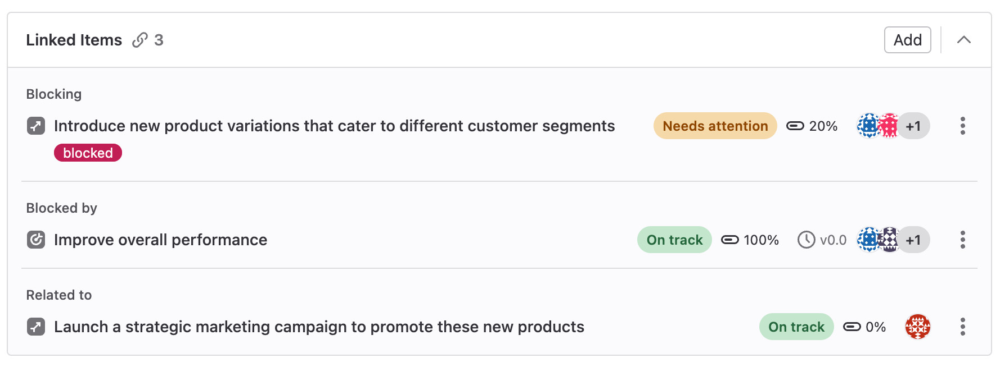



- Tier: 旗舰版
- Offering: JihuLab.com，私有化部署





- 在极狐GitLab 15.6 [引入](https://gitlab.com/gitlab-org/gitlab/-/merge_requests/103355)，通过名为 `okrs_mvc` 的功能标志。默认禁用。



> [!flag]
> 此功能的可用性由功能标志控制。
> 更多信息，请参见历史记录。
> 此功能可用于测试，但尚未准备好用于生产环境。

[目标与关键结果](https://en.wikipedia.org/wiki/OKR)（OKR）是一个用于设定和跟踪目标的框架，这些目标与组织的整体战略和愿景保持一致。

极狐GitLab 中的目标和关键结果共享许多特性。在文档中，术语 **OKR** 指代目标和关键结果两者。

OKR 是一种工作项类型，是极狐GitLab 中[默认议题类型](https://jihulab.com/gitlab-cn/-/issues/323404)演进的一步。
关于将[议题](project/issues/_index.md)和[史诗](group/epics/_index.md)迁移到工作项以及添加自定义工作项类型的路线图，请参见
[史诗 6033](https://gitlab.com/groups/gitlab-org/-/epics/6033) 或
[计划方向页面](https://about.gitlab.com/direction/plan/)。

## 设计有效的 OKR

使用目标和关键结果来使你的团队朝着共同目标对齐并跟踪进度。
通过目标设定一个大目标，并使用[子目标和关键结果](#child-objectives-and-key-results)来衡量大目标的完成情况。

**目标** 是要实现的雄心勃勃的目标，定义了**你打算做什么**。
它们通过将个人、团队或部门的工作与公司整体战略联系起来，展示了这些工作如何影响组织的总体方向。

**关键结果** 是针对对齐目标的进度衡量标准。它们表达了**你如何知道自己是否达到了目标**（目标）。
通过实现特定的成果（关键结果），你为关联的目标创造了进展。

要判断你的 OKR 是否合理，可以使用这句话：

<!-- vale gitlab_base.FutureTense = NO -->
> 我/我们将通过达成和实现以下指标（关键结果），在（日期）前完成（目标）。
<!-- vale gitlab_base.FutureTense = YES -->

要了解如何创建更好的 OKR 以及我们在极狐GitLab 中如何使用它们，请参见
[目标与关键结果手册页面](https://handbook.gitlab.com/handbook/company/okrs/)。

## 创建目标

要创建目标：

1. 在顶部栏中，选择 **搜索或跳转到** 并找到你的项目。
1. 在左侧边栏中，选择 **计划** > **工作项**。
1. 在右上角，选择 **新建工作项**。
1. 对于 **类型**，选择 **目标**。
1. 输入目标标题。
1. 选择 **创建目标**。

要创建关键结果，请将其[作为子项添加](#add-a-child-key-result)到现有目标中。

## 查看目标

要查看目标：

1. 在顶部栏中，选择 **搜索或跳转到** 并找到你的项目。
1. 在左侧边栏中，选择 **计划** > **工作项**。
1. [筛选工作项列表](project/issues/managing_issues.md#filter-the-list-of-issues)，条件为 `类型 = 目标`。
1. 从列表中选择目标的标题。

## 查看关键结果

要查看关键结果：

1. 在顶部栏中，选择 **搜索或跳转到** 并找到你的项目。
1. 在左侧边栏中，选择 **计划** > **工作项**。
1. [筛选工作项列表](project/issues/managing_issues.md#filter-the-list-of-issues)，条件为 `类型 = 关键结果`。
1. 从列表中选择关键结果的标题。

或者，你可以从其父目标的 **子工作项** 部分访问关键结果。

## 编辑标题和描述



- 在极狐GitLab 17.7 [更改](https://gitlab.com/gitlab-org/gitlab/-/merge_requests/169256)了最低用户角色，从报告者改为计划者。



前提条件：

- 你必须具有项目的计划者、报告者、开发者、维护者或所有者角色。

要编辑 OKR：

1. [打开目标](okrs.md#view-an-objective)或[关键结果](#view-a-key-result)进行编辑。
1. 可选。要编辑标题，请选中它，进行更改，然后选择标题文本框外的任意区域。
1. 可选。要编辑描述，请选择编辑图标（），进行更改，然后选择 **保存**。

## 使用 **阅读更多** 防止描述截断



- 在极狐GitLab 17.10 [引入](https://gitlab.com/gitlab-org/gitlab/-/merge_requests/181184)。



如果 OKR 描述较长，极狐GitLab 只显示部分内容。
要查看完整描述，你必须选择 **阅读更多**。
这种截断使你更容易在页面上找到其他元素，而无需滚动冗长的文本。

要更改描述是否截断：

1. 在目标或关键结果上，在右上角选择 **更多操作**（）。
1. 选择 **查看选项**。
1. 根据你的偏好切换 **截断描述**。

此设置会被记住，并影响所有议题、任务、史诗、目标和关键结果。

## 隐藏右侧边栏



- 在极狐GitLab 17.10 [引入](https://gitlab.com/gitlab-org/gitlab/-/merge_requests/181184)。



当空间允许时，属性显示在描述右侧的边栏中。
要隐藏边栏并增加描述空间：

1. 在目标或关键结果上，在右上角选择 **更多操作**（）。
1. 选择 **查看选项**。
1. 选择 **隐藏边栏**。

此设置会被记住，并影响所有议题、任务、史诗、目标和关键结果。

要再次显示边栏：

- 重复上述步骤并选择 **显示边栏**。

## 查看 OKR 系统笔记



- 在极狐GitLab 15.7 [引入](https://gitlab.com/gitlab-org/gitlab/-/issues/378949)，通过名为 `work_items_mvc_2` 的功能标志。默认禁用。
- 在极狐GitLab 15.8 [移动](https://gitlab.com/gitlab-org/gitlab/-/issues/378949)到名为 `work_items_mvc` 的功能标志。默认禁用。
- 在极狐GitLab 16.10，功能标志[更改](https://gitlab.com/gitlab-org/gitlab/-/merge_requests/144141)为从 `work_items_mvc` 到 `work_items_beta`。
- 在极狐GitLab 15.8 [引入](https://gitlab.com/gitlab-org/gitlab/-/issues/378949)更改活动排序顺序。
- 在极狐GitLab 15.10 [引入](https://gitlab.com/gitlab-org/gitlab/-/issues/389971)筛选活动。
- 在极狐GitLab 15.10 [在 JihuLab.com 和私有化部署上启用](https://gitlab.com/gitlab-org/gitlab/-/issues/334812)。
- 在极狐GitLab 17.7 [更改](https://gitlab.com/gitlab-org/gitlab/-/merge_requests/169256)了最低用户角色，从报告者改为计划者。
- 在极狐GitLab 18.6，功能标志 `work_items_beta` [移除](https://gitlab.com/gitlab-com/gl-infra/production/-/issues/17549)。



前提条件：

- 你必须具有项目的计划者、报告者、开发者、维护者或所有者角色。

你可以查看与 OKR 相关的所有[系统笔记](project/system_notes.md)。默认按 **最早在前** 排序。
你可以随时将排序顺序更改为 **最新在前**，该设置会在会话间记住。

## 评论和话题

你可以在 OKR 中添加[评论](discussions/_index.md)并回复话题。

## 指派用户



- 在极狐GitLab 17.7 [更改](https://gitlab.com/gitlab-org/gitlab/-/merge_requests/169256)了最低用户角色，从报告者改为计划者。



要显示谁负责某个 OKR，你可以为其指派用户。

前提条件：

- 你必须具有项目的计划者、报告者、开发者、维护者或所有者角色。

要更改 OKR 的指派人：

1. [打开目标](okrs.md#view-an-objective)或[关键结果](#view-a-key-result)进行编辑。
1. 在 **指派人** 旁边，选择 **添加指派人**。
1. 从下拉列表中选择要添加为指派人的用户。
1. 选择下拉列表外的任意区域。

## 指派标签



- 在极狐GitLab 17.7 [更改](https://gitlab.com/gitlab-org/gitlab/-/merge_requests/169256)了最低用户角色，从报告者改为计划者。



前提条件：

- 你必须具有项目的计划者、报告者、开发者、维护者或所有者角色。

使用[标签](project/labels.md)在团队间组织 OKR。

要向 OKR 添加标签：

1. [打开目标](okrs.md#view-an-objective)或[关键结果](#view-a-key-result)进行编辑。
1. 在 **标签** 旁边，选择 **添加标签**。
1. 从下拉列表中选择要添加的标签。
1. 选择下拉列表外的任意区域。

## 将目标添加到里程碑



- 在极狐GitLab 15.7 [引入](https://gitlab.com/gitlab-org/gitlab/-/issues/367463)。
- 在极狐GitLab 17.7 [更改](https://gitlab.com/gitlab-org/gitlab/-/merge_requests/169256)了最低用户角色，从报告者改为计划者。



你可以将目标添加到[里程碑](project/milestones/_index.md)。
查看目标时，你可以看到里程碑标题。

前提条件：

- 你必须具有项目的计划者、报告者、开发者、维护者或所有者角色。

要将目标添加到里程碑：

1. [打开目标](okrs.md#view-an-objective)进行编辑。
1. 在 **里程碑** 旁边，选择 **添加到里程碑**。
   如果目标已属于某个里程碑，下拉列表会显示当前里程碑。
1. 从下拉列表中选择要与目标关联的里程碑。

## 设置进度



- 在极狐GitLab 15.8 [引入](https://gitlab.com/gitlab-org/gitlab/-/issues/382433)为关键结果设置进度。
- 在极狐GitLab 17.7 [更改](https://gitlab.com/gitlab-org/gitlab/-/merge_requests/169256)了最低用户角色，从报告者改为计划者。



显示完成目标所需工作的完成程度。

你可以手动设置目标和关键结果的进度。

当你为子项输入进度时，层次结构中所有父项的进度将更新为子项进度的平均值。
你可以在任何级别覆盖进度并手动输入值，但当子项的进度值更新时，自动化会再次更新所有父项以显示平均值。

前提条件：

- 你必须具有项目的计划者、报告者、开发者、维护者或所有者角色。

要设置目标或关键结果的进度：

1. 在顶部栏中，选择 **搜索或跳转到** 并找到你的项目。
1. 在左侧边栏中，选择 **计划** > **工作项**。
1. [筛选工作项列表](project/issues/managing_issues.md#filter-the-list-of-issues)，条件为 `类型 = 目标` 或 `类型 = 关键结果`，然后选择你的项。
1. 在 **进度** 旁边，选择文本框。
1. 输入 0 到 100 之间的数字。

## 设置健康状态



- 在极狐GitLab 15.7 [引入](https://gitlab.com/gitlab-org/gitlab/-/issues/381899)。
- 在极狐GitLab 17.7 [更改](https://gitlab.com/gitlab-org/gitlab/-/merge_requests/169256)了最低用户角色，从报告者改为计划者。



为了更好地跟踪实现目标的风险，你可以为每个目标和关键结果分配[健康状态](project/issues/managing_issues.md#health-status)。
你可以使用健康状态向组织中的其他人表明 OKR 是否按计划推进，或者需要关注以保持进度。

前提条件：

- 你必须具有项目的计划者、报告者、开发者、维护者或所有者角色。

要设置 OKR 的健康状态：

1. [打开关键结果](okrs.md#view-a-key-result)进行编辑。
1. 在 **健康状态** 旁边，选择下拉列表并选择所需的健康状态。

## 将关键结果提升为目标



- 在极狐GitLab 16.0 [引入](https://gitlab.com/gitlab-org/gitlab/-/issues/386877)。
- 在极狐GitLab 16.1 [引入](https://gitlab.com/gitlab-org/gitlab/-/issues/412534)快速操作 `/promote_to`。
- 在极狐GitLab 17.7 [更改](https://gitlab.com/gitlab-org/gitlab/-/merge_requests/169256)了最低用户角色，从报告者改为计划者。



前提条件：

- 你必须具有项目的计划者、报告者、开发者、维护者或所有者角色。

要提升关键结果：

1. [打开关键结果](#view-a-key-result)。
1. 在右上角，选择垂直省略号（）。
1. 选择 **提升为目标**。

或者，使用 [`/promote_to objective` 快速操作](project/quick_actions.md#promote_to)。

## 将 OKR 转换为其他项类型



- 在极狐GitLab 17.8 [引入](https://gitlab.com/gitlab-org/gitlab/-/issues/385131)，通过名为 `work_items_beta` 的功能标志。默认禁用。
- [移动](https://gitlab.com/gitlab-org/gitlab/-/issues/385131)到名为 `okrs_mvc` 的功能标志。当前标志状态，请参见本页顶部。



将目标或关键结果转换为其他项类型，例如：

- 议题
- 任务
- 目标
- 关键结果

> [!warning]
> 如果目标类型不支持原始类型的所有字段，更改类型可能导致数据丢失。

前提条件：

- 要转换的 OKR 必须没有分配父项。
- 要转换的 OKR 必须没有任何子项。

要将 OKR 转换为其他项类型：

1. 在顶部栏中，选择 **搜索或跳转到** 并找到你的项目。
1. 在左侧边栏中，选择 **计划** > **工作项**，然后选择你的议题进行查看。
1. 在列表中，找到你的目标或关键结果并选择它。
1. 在右上角，选择 **更多操作**（），然后选择 **更改类型**。
1. 选择所需的项类型。
1. 如果满足所有条件，选择 **更改类型**。

或者，你可以在评论中使用 [`/type` 快速操作](project/quick_actions.md#type)，后跟 `issue`、`task`、`objective` 或 `key result`。

## 复制目标或关键结果引用



- 在极狐GitLab 16.1 [引入](https://gitlab.com/gitlab-org/gitlab/-/issues/396553)。



要在极狐GitLab 的其他地方引用目标或关键结果，你可以使用其完整 URL 或简短引用，格式类似于 `namespace/project-name#123`，其中 `namespace` 是群组或用户名。

要将目标或关键结果引用复制到剪贴板：

1. 在顶部栏中，选择 **搜索或跳转到** 并找到你的项目。
1. 在左侧边栏中，选择 **计划** > **工作项**，然后选择你的目标或关键结果进行查看。
1. 在右上角，选择垂直省略号（），然后选择 **复制引用**。

现在你可以将引用粘贴到另一个描述或评论中。

在 [GitLab-Flavored Markdown](markdown.md#gitlab-specific-references) 中阅读更多关于目标或关键结果引用的信息。

## 复制目标或关键结果电子邮件地址



- 在极狐GitLab 16.1 [引入](https://gitlab.com/gitlab-org/gitlab/-/issues/396553)。



你可以通过发送电子邮件在目标或关键结果中创建评论。
发送电子邮件到此地址会创建一个包含电子邮件正文的评论。

有关通过发送电子邮件创建评论及必要配置的更多信息，请参见
[通过发送电子邮件回复评论](discussions/_index.md#reply-to-a-comment-by-sending-email)。

要复制目标或关键结果的电子邮件地址：

1. 在顶部栏中，选择 **搜索或跳转到** 并找到你的项目。
1. 在左侧边栏中，选择 **计划** > **工作项**，然后选择你的目标进行查看。
1. 在右上角，选择垂直省略号（），然后选择 **复制目标电子邮件地址** 或 **复制关键结果电子邮件地址**。

## 关闭 OKR



- 在极狐GitLab 17.7 [更改](https://gitlab.com/gitlab-org/gitlab/-/merge_requests/169256)了最低用户角色，从报告者改为计划者。



当 OKR 达成时，你可以关闭它。
OKR 被标记为已关闭但不会被删除。

前提条件：

- 你必须具有项目的计划者、报告者、开发者、维护者或所有者角色。

要关闭 OKR：

1. [打开目标](okrs.md#view-an-objective)进行编辑。
1. 在 **状态** 旁边，选择 **已关闭**。

你可以以相同方式重新打开已关闭的 OKR。

## 子目标和关键结果

在极狐GitLab 中，目标类似于关键结果。
在你的工作流程中，使用关键结果来衡量目标中描述的目标。

你可以添加子目标，总共最多 9 个层级。一个目标最多可以有 100 个子 OKR。
关键结果是目标的子项，本身不能有子项。

子目标和关键结果在目标描述下方的 **子工作项** 部分中可用。

### 添加子目标



- 在极狐GitLab 17.1 [引入](https://gitlab.com/gitlab-org/gitlab/-/issues/436255)选择在哪个项目中创建目标的功能。



前提条件：

- 你必须具有项目的访客、计划者、报告者、开发者、维护者或所有者角色。

要向目标添加新目标：

1. 在目标中，在 **子工作项** 部分，选择 **添加**，然后选择 **新建目标**。
1. 输入新目标的标题。
1. 选择一个[项目](project/organize_work_with_projects.md)来创建新目标。
1. 选择 **创建目标**。

要向目标添加现有目标：

1. 在目标中，在 **子工作项** 部分，选择 **添加**，然后选择 **现有目标**。
1. 通过输入部分标题搜索所需目标，然后选择所需的匹配项。

   要添加多个目标，重复此步骤。
1. 选择 **添加目标**。

### 添加子关键结果



- 在极狐GitLab 17.1 [引入](https://gitlab.com/gitlab-org/gitlab/-/issues/436255)选择在哪个项目中创建关键结果的功能。



前提条件：

- 你必须具有项目的访客、计划者、报告者、开发者、维护者或所有者角色。

要向目标添加新关键结果：

1. 在目标中，在 **子工作项** 部分，选择 **添加**，然后选择 **新建关键结果**。
1. 输入新关键结果的标题。
1. 选择一个[项目](project/organize_work_with_projects.md)来创建新关键结果。
1. 选择 **创建关键结果**。

要向目标添加现有关键结果：

1. 在目标中，在 **子工作项** 部分，选择 **添加**，然后选择 **现有关键结果**。
1. 通过输入部分标题搜索所需 OKR，然后选择所需的匹配项。

   要添加多个目标，重复此步骤。
1. 选择 **添加关键结果**。

### 重新排序目标和关键结果子项



- 在极狐GitLab 16.0 [引入](https://gitlab.com/gitlab-org/gitlab/-/issues/385887)。
- 在极狐GitLab 17.7 [更改](https://gitlab.com/gitlab-org/gitlab/-/merge_requests/169256)了最低用户角色，从报告者改为计划者。



前提条件：

- 你必须具有项目的计划者、报告者、开发者、维护者或所有者角色。

默认情况下，子 OKR 按创建日期排序。
要重新排序，请拖放它们。

### 安排 OKR 检查提醒



- 在极狐GitLab 16.4 [引入](https://gitlab.com/gitlab-org/gitlab/-/issues/422761)，通过名为 `okr_checkin_reminders` 的功能标志。默认禁用。
- 在极狐GitLab 17.7 [更改](https://gitlab.com/gitlab-org/gitlab/-/merge_requests/169256)了最低用户角色，从报告者改为计划者。



> [!flag]
> 此功能的可用性由功能标志控制。
> 更多信息，请参见历史记录。
> 此功能可用于测试，但尚未准备好用于生产环境。

安排检查提醒，提醒你的团队提供你关心的关键结果的状态更新。
提醒会作为电子邮件通知和待办事项发送给所有后代目标和关键结果的指派人。
用户无法取消订阅电子邮件通知，但可以关闭检查提醒。
提醒在每周二发送。

前提条件：

- 你必须具有项目的计划者、报告者、开发者、维护者或所有者角色。
- 项目中必须至少有一个目标且至少有一个关键结果。
- 你只能为顶级目标安排提醒。
  为子目标安排检查提醒无效。
  顶级目标的设置会继承给所有子目标。

要为目标安排定期提醒，在新评论中使用
[`/checkin_reminder` 快速操作](project/quick_actions.md#checkin_reminder)。

## 将目标设为父项



- 在极狐GitLab 16.6 [引入](https://gitlab.com/groups/gitlab-org/-/epics/11198)。
- 在极狐GitLab 17.7 [更改](https://gitlab.com/gitlab-org/gitlab/-/merge_requests/169256)了最低用户角色，从报告者改为计划者。



前提条件：

- 你必须具有项目的计划者、报告者、开发者、维护者或所有者角色。
- 父目标和子 OKR 必须属于同一个项目。

要将目标设为 OKR 的父项：

1. [打开目标](#view-an-objective)或[关键结果](#view-a-key-result)进行编辑。
1. 在 **父项** 旁边，从下拉列表中选择要添加的父项。
1. 选择下拉列表外的任意区域。

要移除目标或关键结果的父项，
在 **父项** 旁边，选择下拉列表，然后选择 **取消指派**。

## 机密 OKR



- 在极狐GitLab 15.3 [引入](https://gitlab.com/groups/gitlab-org/-/epics/8410)。



机密 OKR 是仅对具有[足够权限](#who-can-see-confidential-okrs)的项目成员可见的 OKR。
你可以使用机密 OKR 来保护安全漏洞的隐私或防止意外泄露。

### 将 OKR 设为机密



- 在极狐GitLab 17.7 [更改](https://gitlab.com/gitlab-org/gitlab/-/merge_requests/169256)了最低用户角色，从报告者改为计划者。



默认情况下，OKR 是公开的。
你可以在创建或编辑 OKR 时将其设为机密。

#### 在新 OKR 中

当你创建新目标时，文本区域正下方有一个复选框可用于将 OKR 标记为机密。

选中该复选框，然后选择 **创建目标** 或 **创建关键结果** 来创建 OKR。

#### 在现有 OKR 中

前提条件：

- 你必须具有项目的计划者、报告者、开发者、维护者或所有者角色。
- **机密目标** 只能有机密的[子目标或关键结果](#child-objectives-and-key-results)：
  - 要将目标设为机密：如果它有任何子目标或关键结果，你必须先将它们全部设为机密或移除它们。
  - 要将目标设为非机密：如果它有任何子目标或关键结果，你必须先将它们全部设为非机密或移除它们。
  - 要向机密目标添加子目标或关键结果，你必须先将它们设为机密。

要更改现有 OKR 的机密性：

1. [打开目标](#view-an-objective)或[关键结果](#view-a-key-result)。
1. 在右上角，选择垂直省略号（）。
1. 选择 **开启机密性** 或 **关闭机密性**。

### 谁可以查看机密 OKR



- 在极狐GitLab 17.7 [更改](https://gitlab.com/gitlab-org/gitlab/-/merge_requests/169256)了最低用户角色，从报告者改为计划者。



当 OKR 被设为机密时，只有具有项目计划者、报告者、开发者、维护者或所有者角色的用户才能访问该 OKR。
具有访客或[最小](permissions.md#users-with-minimal-access)角色的用户无法访问该 OKR，即使他们在更改前积极参与。

但是，具有 **访客角色** 的用户可以创建机密 OKR，但只能查看他们自己创建的 OKR。

具有访客角色或非成员如果被分配到机密 OKR，则可以读取该 OKR。
当访客用户或非成员从机密 OKR 中取消分配时，他们将无法再查看它。

## 保密 OKR

没有相应权限的用户在搜索结果中看不到保密 OKR。

### 保密 OKR 指示器

保密 OKR 在视觉上与普通 OKR 有几点不同。
在列出 OKR 的任何地方，你都可以看到标记为保密的 OKR 旁边有一个保密 () 图标。

如果你没有[足够的权限](#who-can-see-confidential-okrs)，
你根本看不到保密 OKR。

同样，在 OKR 内部，你可以在面包屑导航旁边看到保密 () 图标。

每次从普通变为保密，或从保密变为普通，都会在 OKR 的评论中通过系统记录进行标示，例如：

-  Jo Garcia 在 5 分钟前将此议题设为保密
-  Jo Garcia 刚刚将此议题设为对所有人可见

## 锁定讨论



- 在极狐GitLab 16.9 中[引入](https://gitlab.com/gitlab-org/gitlab/-/issues/398649)，[带有功能标志](../administration/feature_flags/_index.md)，名称为 `work_items_beta`。默认禁用。
- 在极狐GitLab 17.7 中[更改](https://gitlab.com/gitlab-org/gitlab/-/merge_requests/169256)了最低用户角色，从报告者改为计划者。



> [!flag]
> 此功能的可用性由功能标志控制。
> 更多信息，请参阅历史记录。
> 此功能可用于测试，但尚未准备好用于生产环境。

你可以阻止在 OKR 中进行公开评论。
当你这样做时，只有项目成员可以添加和编辑评论。

先决条件：

- 你必须具有计划者、报告者、开发者、维护者或所有者角色。

要锁定 OKR：

1. 在右上角，选择垂直省略号 ()。
1. 选择 **锁定讨论**。

页面详情中会添加一条系统记录。

如果一个 OKR 在讨论被锁定的情况下关闭，那么你无法重新打开它，直到讨论解锁。

## OKR 中的关联项



- 在极狐GitLab 16.5 中[引入](https://gitlab.com/gitlab-org/gitlab/-/issues/416558)，[带有功能标志](../administration/feature_flags/_index.md)，名称为 `linked_work_items`。默认启用。
- 在极狐GitLab 16.7 中[在 JihuLab.com 和私有化部署上启用](https://gitlab.com/gitlab-org/gitlab/-/merge_requests/139394)。
- 在极狐GitLab 16.8 中[引入](https://gitlab.com/gitlab-org/gitlab/-/issues/427594)通过输入 URL 和 ID 添加关联项。
- 在极狐GitLab 17.0 中[GA](https://gitlab.com/gitlab-org/gitlab/-/merge_requests/150148)。功能标志 `linked_work_items` 已移除。
- 在极狐GitLab 17.0 中[更改](https://gitlab.com/groups/gitlab-org/-/epics/10267)了最低必需角色，从报告者（如果为真）改为访客。



关联项是双向关系，并显示在子目标和关键结果下方的区块中。你可以将同一项目中的目标、关键结果或任务相互关联。

只有当用户可以看到两个项时，该关系才会在 UI 中显示。

### 添加关联项

先决条件：

- 你必须具有项目的访客、计划者、报告者、开发者、维护者或所有者角色。

要将项关联到目标或关键结果：

1. 在目标或关键结果的 **关联项** 部分，
   选择 **添加**。
1. 选择两个项之间的关系。可以是：
   - **关联到**
   - **阻塞**
   - **被阻塞**
1. 输入项的搜索文本、URL 或其引用 ID。
1. 添加完所有要关联的项后，在搜索框下方选择 **添加**。

完成所有关联项的添加后，你可以看到它们被分类，以便更好地从视觉上理解它们的关系。

### 移除关联项

先决条件：

- 你必须具有项目的访客、计划者、报告者、开发者、维护者或所有者角色。

在目标或关键结果的 **关联项** 部分，
每个项旁边，选择垂直省略号 ()，然后选择 **移除**。

由于是双向关系，该关系将不再出现在任何一个项中。