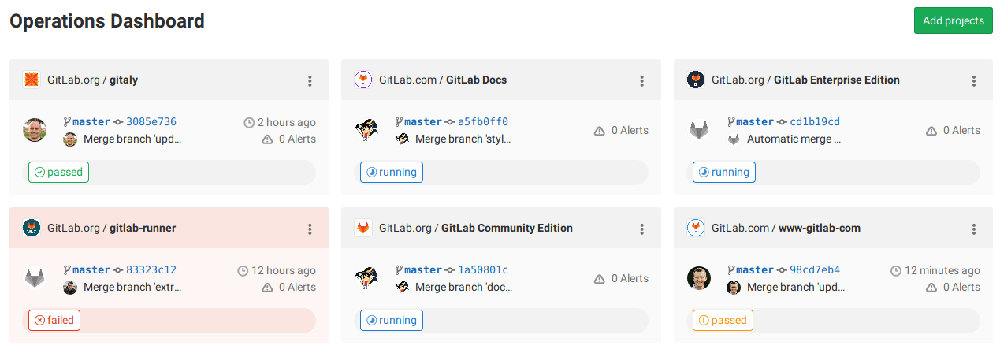



- Tier: 专业版，旗舰版
- Offering: JihuLab.com，私有化部署



运维仪表盘提供每个项目的运维健康状况的摘要，包括流水线和警报状态。

要访问仪表盘：

1. 在顶部栏中，选择 **搜索或跳转到**。
1. 选择 **您的工作**。
1. 选择 **运维**。

## 向仪表盘添加项目

要向仪表盘添加项目：

1. 确保您的警报在 [您在 Prometheus 中设置的警报](../../operations/incident_management/integrations.md#expected-prometheus-request-attributes) 上填充了 `gitlab_environment_name` 标签。
   该值应与极狐GitLab 中您的环境名称匹配。
   您只能显示 `production` 环境的警报。
1. 在仪表盘主屏幕中选择 **添加项目**。
1. 使用 **搜索您的项目** 字段搜索并添加一个或多个项目。
1. 选择 **添加项目**。

添加后，仪表盘会显示项目的活跃警报数量、最后一次提交、流水线状态以及最后部署的时间。

运维仪表盘和 [环境](../../ci/environments/environments_dashboard.md) 仪表盘共享同一个项目列表。从一个仪表盘添加或删除项目也会在另一个仪表盘上添加或删除项目。

## 在仪表盘上排列项目

您可以拖动项目卡片来更改它们的顺序。卡片顺序目前仅保存在您的浏览器中，因此不会更改其他用户的仪表盘。

## 将其设置为登录时的默认仪表盘

运维仪表盘还可以设置为登录时显示的默认极狐GitLab 仪表盘。要将其设为默认，请参阅 [个人资料偏好设置](../profile/preferences.md)。