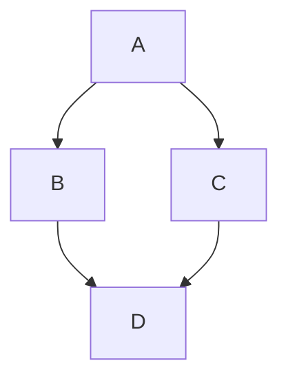



- Tier: 基础版，专业版，旗舰版
- Offering: JihuLab.com，私有化部署



极狐GitLab 使用 [`gitlab-markup`](https://gitlab.com/gitlab-org/gitlab-markup) gem，
该 gem 使用 [`org-ruby`](https://github.com/wallyqs/org-ruby) gem，
将 Org mode 内容转换为 HTML。
有关 Org mode 语法的完整参考，
请参阅 [Org 手册](https://orgmode.org/manuals.html)。

您可以在以下区域使用 Org mode：

- 代码仓库中的 Org mode 文档（`.org`）
- 代码片段，当片段文件以 `.org` 扩展名命名时
- Wiki 页面

<a id="headings"></a>

## 标题

前导星号（`*`）渲染为 1 到 6 级标题。

```org
* Heading 1
** Heading 2
*** Heading 3
**** Heading 4
***** Heading 5
****** Heading 6
```

`#+TITLE:` 渲染为页面顶部的 H1 标题：

```org
#+TITLE: Welcome to Org-mode
```

<a id="heading-anchors"></a>

### 标题锚点

极狐GitLab 会自动为每个 Org mode 标题添加锚点，以便您可以链接到它。

悬停时，指向这些锚点的链接会变得可见，以便更轻松地复制标题链接
并在其他地方使用。

锚点根据标题内容按以下规则生成：

1. 所有文本转换为小写。
1. 除字母、数字、连字符和下划线外的所有字符均被移除。
1. 所有空格转换为连字符。
1. 如果已生成具有相同锚点的标题，
   则附加一个唯一的递增数字，从 1 开始。

示例：

<!--
Translation note: DO NOT TRANSLATE this example.
The example must stay untranslated to stay in sync with the example anchors.
-->

```org
* This heading has spaces in it
** This heading has an accent in it: Café
** This heading has Unicode in it: 日本語
** This heading has spaces in it
*** This heading has spaces in it
** This heading has 3.5 in it (& parentheses)
** This heading has  multiple spaces and - hyphens_and_underscores
```

将生成以下标题锚点：

1. `#this-heading-has-spaces-in-it`
1. `#this-heading-has-an-accent-in-it-café`
1. `#this-heading-has-unicode-in-it-日本語`
1. `#this-heading-has-spaces-in-it-1`
1. `#this-heading-has-spaces-in-it-2`
1. `#this-heading-has-35-in-it--parentheses`
1. `#this-heading-has--multiple-spaces-and---hyphens_and_underscores`

在代码片段中，标题还会获得一个从文件名派生的前缀，
以防止多个文件之间的锚点冲突。
例如，在名为 `README.org` 的文件中，`* TL;DR` 标题
会获得锚点 `#readme-tldr`，而不是 `#tldr`。

<a id="lists"></a>

## 列表

Org mode 支持无序列表、有序列表、描述列表和嵌套列表。

<a id="unordered-lists"></a>

### 无序列表

连字符（`-`）或加号（`+`）创建无序列表：

```org
- Item one
- Item two
  - Nested item
```

```org
+ Item one
+ Item two
  + Nested item
```

渲染时，两个示例看起来类似：

> - 项目一
> - 项目二
>   - 嵌套项

<a id="ordered-lists"></a>

### 有序列表

数字后跟句点（`.`）或右括号（`)`）创建有序列表：

```org
1. First item
2. Second item
   1. Nested item
```

```org
1) First item
2) Second item
   1) Nested item
```

渲染时，两个示例看起来类似：

> 1. 第一项
> 1. 第二项
>    1. 嵌套项

<a id="description-lists"></a>

### 描述列表

```org
- term1 :: Definition of term one
- term2 :: Definition of term two
```

渲染时，示例看起来类似：

> term1
> : 术语一的定义
>
> term2
> : 术语二的定义

<a id="checkboxes"></a>

## 复选框

列表标记后的 `[ ]`、`[X]` 和 `[-]` 渲染为复选框输入元素。
`[-]`（部分选中）渲染为不确定复选框：

<!--
Translation note: DO NOT TRANSLATE this example.
The example must stay untranslated to stay in sync with the image.
-->

```org
- [-] Prepare release
  - [X] Update changelog
  - [ ] Review merge requests
```

渲染时，示例看起来像：


复选框也适用于有序列表：

<!--
Translation note: DO NOT TRANSLATE this example.
The example must stay untranslated to stay in sync with the image.
-->

```org
1. [-] Prepare release
   1. [X] Update changelog
   2. [ ] Review merge requests
```

渲染时，示例看起来像：


<a id="tables"></a>

## 表格

竖线（`|`）创建表格。
由破折号（`-`）和加号（`+`）组成的分隔行将
其上方的行转换为表头：

```org
| Item  | Unit price ($) | Quantity | Subtotal ($) |
|-------+----------------+----------+--------------|
| Eggs  |              3 |        2 |            6 |
| Milk  |              2 |        1 |            2 |
| Bread |              1 |        3 |            3 |
|-------+----------------+----------+--------------|
| Total |                |          |           11 |
#+TBLFM: $>=$2*$3::@>$>=vsum(@I..@II)
```

渲染时，示例看起来类似：

> | 商品  | 单价（$） | 数量 | 小计（$） |
> |-------|----------------|----------|--------------|
> | 鸡蛋  | 3              | 2        | 6            |
> | 牛奶  | 2              | 1        | 2            |
> | 面包 | 1              | 3        | 3            |
> | 总计 |                |          | 11           |

<a id="links"></a>

## 链接

您可以通过多种方式创建链接：

```org
- This line shows an [[https://example.com][inline-style link]]
- This line shows a [[./permissions.md][link to a file in the same directory]]
- This line shows a [[../_index.md][relative link to a file one directory higher]]
- This line links to a [[#headings][heading on the same page, using a `#` and the heading anchor]]
```

渲染时，示例看起来类似：

> - 此行显示[行内样式链接](https://example.com)
> - 此行显示[指向同一目录中文件的链接](permissions.md)
> - 此行显示[指向上一级目录文件的相对链接](../_index.md)
> - 此行链接到[同一页面上的标题，使用 `#` 和标题锚点](#headings)

<a id="url-auto-linking"></a>

### URL 自动链接

您放入文本中的几乎任何 URL 都会自动链接：

```org
See https://example.com for details.
```

渲染时，示例看起来类似：

> 详情请参阅 <https://example.com>。

<a id="emphasis"></a>

## 强调

| 样式                           | 输出                                |
|---------------------------------|---------------------------------------|
| `*bold*`                        | **粗体**                              |
| `/italic/`                      | *斜体*                              |
| `+strikethrough+`               | ~~删除线~~                     |
| `=verbatim=`                    | `verbatim`                            |
| `~code~`                        | `code`                                |
| `This is a ^{superscript} text` | 这是一个 <sup>上标</sup> 文本 |
| `This is a _{subscript} text`   | 这是一个 <sub>下标</sub> 文本   |

<a id="images"></a>

## 图片

链接到没有描述文本的图片文件会内联嵌入图片：

```org
[[img/markdown_logo_v17_11.png]]
```

渲染时，示例看起来类似：


<a id="horizontal-rules"></a>

## 水平线

五个或更多连续连字符（`-`）创建水平线：

```org
Paragraph before.

-----

Paragraph after.
```

渲染时，示例看起来类似：

> 前面的段落。
>
> ---
>
> 后面的段落。

<a id="comments"></a>

## 注释

以 `#` 后跟空格开头的行不会被渲染：

```org
Visible before.

# This line is a comment and isn't rendered.

Visible after.
```

渲染时，示例看起来类似：

> 前面可见。
>
> 后面可见。

`#+BEGIN_COMMENT` 和 `#+END_COMMENT` 之间的内容不会被渲染：

```org
Visible before the block.

#+BEGIN_COMMENT
This entire block is a comment.
None of these lines are rendered.
#+END_COMMENT

Visible after the block.
```

渲染时，示例看起来类似：

> 块之前可见。
>
> 块之后可见。

在标题标记后紧跟 `COMMENT` 标记的标题，
以及其下嵌套的所有内容，都不会被渲染：

```org
* Visible heading

Some visible text.

* COMMENT Hidden heading

This text isn't rendered.

** Nested under hidden heading

This text isn't rendered either.

* Another visible heading
```

只有 `Visible heading` 和 `Another visible heading`，以及它们之间的文本，
会出现在渲染输出中。

<a id="text-blocks"></a>

## 文本块

`#+BEGIN_QUOTE` 和 `#+END_QUOTE` 创建引用块：

```org
#+BEGIN_QUOTE
Everything should be made as simple as possible,
but not any simpler ---Albert Einstein
#+END_QUOTE
```

渲染时，示例看起来类似：

> > 一切都应尽可能简单，
> > 但不能过于简单——阿尔伯特·爱因斯坦

`#+BEGIN_EXAMPLE` 和 `#+END_EXAMPLE` 创建预格式化文本块：

```org
#+BEGIN_EXAMPLE
Here is an example.
#+END_EXAMPLE
```

渲染时，示例看起来类似：

> ```plaintext
> Here is an example.
> ```

冒号（`:`）和空格也会创建预格式化文本块：

```org
: Here is an example.
```

渲染时，示例看起来类似：

> ```plaintext
> Here is an example.
> ```

<a id="source-code-blocks"></a>

## 源代码块

`#+BEGIN_SRC` 和 `#+END_SRC` 配合语言名称创建语法高亮代码块：

```org
#+BEGIN_SRC python
import requests
data = requests.get("https://jsonplaceholder.typicode.com/users/1").json()
#+END_SRC
```

渲染时，示例看起来类似：

> ```python
> import requests
> data = requests.get("https://jsonplaceholder.typicode.com/users/1").json()
> ```

极狐GitLab 使用 [Rouge Ruby 库](https://github.com/rouge-ruby/rouge) 进行语法高亮。
有关支持的语言列表，请参阅
[Rouge 项目 Wiki](https://github.com/rouge-ruby/rouge/wiki/List-of-supported-languages-and-lexers)。

在块头中添加 `:exports both` 会在渲染输出中包含源代码块的执行结果（`#+RESULTS:`）：

```org
#+BEGIN_SRC python :exports both :results output code
import requests
data = requests.get("https://jsonplaceholder.typicode.com/users/1").json()
print([data["username"], data["email"]])
#+END_SRC

#+RESULTS:
#+begin_src python
['Bret', 'Sincere@april.biz']
#+end_src
```

渲染时，示例看起来类似：

> ```python
> import requests
> data = requests.get("https://jsonplaceholder.typicode.com/users/1").json()
> print([data["username"], data["email"]])
> ```
>
> ```python
> ['Bret', 'Sincere@april.biz']
> ```

<a id="diagrams-and-flowcharts"></a>

## 图表和流程图

您可以像在
[极狐GitLab 风格 Markdown](markdown.md#diagrams-and-flowcharts) 中一样，从源代码块中的文本生成图表。

<a id="mermaid"></a>

### Mermaid

```org
#+BEGIN_SRC mermaid
graph TD;
    A-->B;
    A-->C;
    B-->D;
    C-->D;
#+END_SRC
```

渲染时，示例看起来类似：



<a id="plantuml"></a>

### PlantUML

PlantUML 集成已在 JihuLab.com 上启用。
要使 PlantUML 在极狐GitLab 私有化部署上可用，
极狐GitLab 管理员[必须启用它](../administration/integration/plantuml.md)。

```org
#+BEGIN_SRC plantuml
Bob -> Alice : hello
Alice -> Bob : hi
#+END_SRC
```

<a id="math-equations"></a>

## 数学公式

在源代码块中声明语言为 `math` 的数学内容将使用
[KaTeX](https://github.com/KaTeX/KaTeX) 渲染。
KaTeX 仅支持 LaTeX 的[子集](https://katex.org/docs/supported.html)。

```org
#+BEGIN_SRC math
\left( \sum_{k=1}^n a_k b_k \right)^2 \leq \left( \sum_{k=1}^n a_k^2 \right) \left( \sum_{k=1}^n b_k^2 \right)
#+END_SRC
```

渲染时，示例看起来像：


<a id="gitlab-query-language-glql"></a>

## 极狐GitLab 查询语言 (GLQL)

声明语言为 `glql` 的源代码块会嵌入
[极狐GitLab 查询语言 (GLQL)](glql/_index.md) 视图：

<!--
Translation note: DO NOT TRANSLATE this example.
The example must stay untranslated to stay in sync with the image.
-->

```yaml
#+BEGIN_SRC glql
display: table
title: GLQL table 🎉
description: This view lists my open issues
fields: title, state, health, epic, milestone, weight, updated
limit: 5
query: type = Issue AND group = "gitlab-org" AND assignee = currentUser() AND state = opened
#+END_SRC
```

渲染时，示例看起来像：


