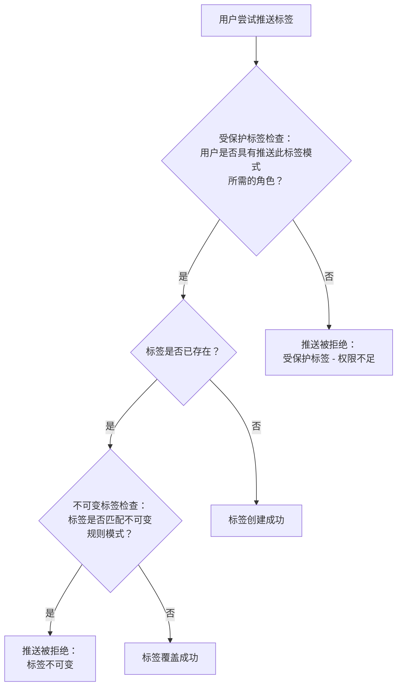



- Tier: 旗舰版
- Offering: JihuLab.com，私有化部署





- 在 GitLab 18.1 中作为[实验性功能](../../../policy/development_stages_support.md)引入，[功能标志](../../../administration/feature_flags/_index.md)命名为 `container_registry_immutable_tags`。默认禁用。
- 在 GitLab 18.2 中于 JihuLab.com 启用。从实验性功能改为 Beta 测试版。功能标志 `container_registry_immutable_tags` 已移除。
- 在 GitLab 18.10 中作为 GA 发布。



使用不可变标签来防止项目中的容器标签被更新或删除。

默认情况下，拥有开发者、维护者或所有者角色的用户可以在所有项目容器仓库中推送和删除镜像标签。通过标签不可变规则，你可以：

- 阻止关键镜像标签的修改，降低恶意或意外更改的风险。
- 每个项目最多创建 5 条保护规则。
- 将保护规则应用于项目中的所有容器仓库。

当至少有一条不可变保护规则与标签名称匹配时，该标签即为不可变。如果有多条规则匹配，将应用最严格的规则。

不可变标签规则：

- 只能创建，不能更新
- 不能被[清理策略](reduce_container_registry_storage.md#cleanup-policy)删除。

## 与受保护标签的比较

虽然[受保护标签](protected_container_tags.md)和不可变标签都能维护镜像完整性，但它们有不同的用途。

受保护标签基于角色限制谁可以创建、更新或删除某些标签。标签不可变性确保一旦标签被创建，任何人都无法更新或删除它。

下图展示了在镜像推送过程中保护规则的评估方式：

### 示例场景

对于一个拥有以下规则的项目：

- 受保护标签规则：模式 `v.*` 需要维护者或所有者角色。
- 不可变标签规则：模式 `v\d+\.\d+\.\d+` 保护语义版本标签。

| 用户角色 | 操作 | 受保护标签检查 | 不可变标签检查 | 结果 |
|-----------|--------|-------------------|-------------------|---------|
| 开发者 | 推送新标签 `v1.0.0` | 被拒绝 | 未评估 | 推送被拒绝。用户缺少所需角色。 |
| 维护者 | 推送新标签 `v1.0.0` | 允许 | 未评估 | 标签已创建。 |
| 维护者 | 覆盖现有标签 `v1.0.0` | 允许 | 被拒绝 | 推送被拒绝。标签不可变。 |
| 维护者 | 推送新标签 `v-beta` | 允许 | 未评估 | 标签已创建。 |

## 前提条件

要使用不可变容器标签，请确保容器镜像仓库可用：

- 在 JihuLab.com 上，容器镜像仓库默认启用。
- 在私有化部署的极狐GitLab 中，[启用元数据数据库](../../../administration/packages/container_registry_metadata_database.md)。

## 创建不可变规则

前提条件：

- 你必须拥有所有者角色。

要创建不可变规则：

1. 在顶部导航栏，选择 **搜索或跳转到** 并找到你的项目。
1. 在左侧边栏中，选择 **设置** > **软件包和镜像仓库**。
1. 展开 **容器镜像仓库**。
1. 在 **受保护的容器标签** 下，选择 **添加保护规则**。
1. 在 **保护类型** 中，选择 **不可变**。
1. 在 **将不可变规则应用于匹配以下内容的标签** 中，使用 [RE2 语法](https://github.com/google/re2/wiki/Syntax)输入正则表达式模式。模式不能超过 100 个字符。更多信息，请参见[正则表达式示例](#regex-pattern-examples)。
1. 选择 **添加规则**。

不可变规则已创建，匹配的标签将受到保护。

## 正则表达式示例

以下是一些可用于保护容器标签的示例模式：

| 模式              | 描述 |
|-------------------|-------------|
| `.*`              | 保护所有标签。 |
| `^v.*`            | 保护以 "v" 开头的标签（如 `v1.0.0` 或 `v2.1.0-rc1`）。 |
| `\d+\.\d+\.\d+`   | 保护语义版本标签（如 `1.0.0` 或 `2.1.0`）。 |
| `^latest$`        | 保护 `latest` 标签。 |
| `.*-stable$`      | 保护以 "-stable" 结尾的标签（如 `1.0-stable` 或 `main-stable`）。 |
| `stable\|release` | 保护包含 "stable" 或 "release" 的标签（如 `1.0-stable`）。 |

## 删除不可变规则

前提条件：

- 你必须拥有所有者角色。

要删除不可变规则：

1. 在顶部导航栏，选择 **搜索或跳转到** 并找到你的项目。
1. 在左侧边栏中，选择 **设置** > **软件包和镜像仓库**。
1. 展开 **容器镜像仓库**。
1. 在 **受保护的容器标签** 下，找到你要删除的不可变规则，选择其旁边的 **删除** ()。
1. 当提示确认时，选择 **删除**。

不可变规则已删除，匹配的标签将不再受保护。

## 传播延迟

规则变更依赖 JWT 令牌在服务之间传播。因此，保护规则和用户访问角色的更改可能只有在当前 JWT 令牌过期后才会生效。延迟时间等于[配置的令牌持续时间](../../../administration/packages/container_registry.md#increase-token-duration)：

- 默认：5 分钟
- JihuLab.com：15 分钟

大多数容器镜像仓库客户端（包括 Docker、极狐GitLab UI 和 API）会为每个操作请求一个新令牌，但自定义客户端可能会在令牌的整个有效期内保留它。

## 镜像清单删除

极狐GitLab UI 和 API 不支持直接删除镜像清单。通过直接的容器镜像仓库 API 调用，清单删除会影响所有关联的标签。

为确保标签保护，只有在对应项目中没有不可变标签规则时，才允许直接的清单删除请求。

无论规则模式是否与容器镜像标签匹配，此限制都适用。