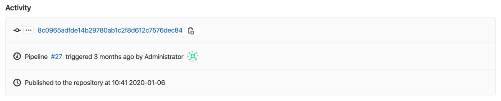



- Tier: 基础版，专业版，旗舰版
- Offering: JihuLab.com，私有化部署





- 在 13.3 中从极狐GitLab 专业版移至基础版。



借助极狐GitLab 软件包仓库，您可以将极狐GitLab 用作多种[支持的软件包管理器](supported_functionality.md)的私有或公共仓库。您可以在其中发布和共享软件包，下游项目可以将其作为依赖项来使用。

## 软件包工作流

了解如何利用极狐GitLab 软件包仓库构建您自己的自定义软件包工作流：

- [将项目用作软件包仓库](../workflows/project_registry.md)，将所有软件包发布到一个项目。
- 从一个 [monorepo 项目](../workflows/working_with_monorepos.md)发布多个不同的软件包。

## 查看软件包

您可以查看项目或群组的软件包：

1. 进入项目或群组。
1. 前往 **部署** > **软件包仓库**。

您可以在此页面上搜索、排序和过滤软件包。您可以通过复制并粘贴浏览器中的 URL 来分享搜索结果。

您还可以找到用于配置软件包管理器或安装给定软件包的有用代码片段。

在群组中查看软件包时：

- 会显示发布到该群组及其项目的所有软件包。
- 仅显示您可以访问的项目。
- 如果某个项目是私有的，或者您不是该项目的成员，则该项目的软件包不会显示。

要了解如何创建和上传软件包，请遵循您[软件包类型](supported_functionality.md)的说明。

## 使用极狐GitLab CI/CD

您可以使用[极狐GitLab CI/CD](../../../ci/_index.md)构建软件包或将软件包导入到软件包仓库中。

### 构建软件包

您可以使用 `CI_JOB_TOKEN` 向极狐GitLab 进行身份验证。

要开始使用，您可以使用可用的 [CI/CD 模板](https://jihulab.com/gitlab-cn/gitlab/-/tree/master/lib/gitlab/ci/templates)。

有关将极狐GitLab 软件包仓库与 CI/CD 配合使用的更多信息，请参见：

- [通用](../generic_packages/_index.md#publish-a-package)
- [Maven](../maven_repository/_index.md#create-maven-packages-with-gitlab-cicd)
- [npm](../npm_registry/_index.md#publish-a-package-with-a-cicd-pipeline)
- [NuGet](../nuget_repository/_index.md#with-a-cicd-pipeline)
- [PyPI](../pypi_repository/_index.md#authenticate-with-the-gitlab-package-registry)
- [Terraform](../terraform_module_registry/_index.md#authenticate-to-the-terraform-module-registry)

如果您使用 CI/CD 构建软件包，在查看软件包详情时会显示扩展的活动信息：

您可以查看是哪个流水线发布了该软件包，以及触发的提交和用户。但是，历史记录仅限于指定软件包的五次最新更新。

### 导入软件包

如果您已经在其他仓库中构建了软件包，可以使用[软件包导入器](https://jihulab.com/gitlab-cn/ci-cd/package-stage/pkgs_importer)将它们导入到极狐GitLab 软件包仓库中。

有关支持的软件包列表，请参见[从其他仓库导入软件包](supported_functionality.md#importing-packages-from-other-repositories)。

## 减少存储使用量

有关减少软件包仓库存储使用量的信息，请参见[减少软件包仓库存储使用量](reduce_package_registry_storage.md)。

## 关闭软件包仓库

软件包仓库默认是开启状态。

在私有化部署实例上，您的管理员可以从极狐GitLab 侧边栏中移除**软件包和镜像库**菜单项。更多信息，请参见[极狐GitLab 软件包仓库管理](../../../administration/packages/_index.md)。

您也可以针对特定项目移除软件包仓库：

1. 在您的项目中，前往 **设置** > **通用**。
1. 展开 **可见性，项目功能，权限** 部分并禁用 **软件包** 功能。
1. 选择 **保存更改**。

**部署** > **软件包仓库** 条目将从侧边栏中移除。

## 软件包仓库可见性权限

[项目权限](../../permissions.md)决定了哪些成员和用户可以下载、推送或删除软件包。

软件包仓库的可见性独立于代码仓库，可以在项目的设置中进行控制。例如，如果您有一个公开项目并将代码仓库可见性设置为**仅项目成员**，那么软件包仓库仍然是公开的。关闭**软件包仓库**开关会关闭所有软件包仓库操作。

| 项目可见性 | 操作                | 最低[角色](../../permissions.md#roles)要求 |
|------------|---------------------|---------------------------------------------|
| 公开       | 查看软件包仓库      | 不适用。互联网上的任何人都可以执行此操作。 |
| 公开       | 发布软件包          | 开发者                                     |
| 公开       | 拉取软件包          | 不适用。互联网上的任何人都可以执行此操作。 |
| 内部       | 查看软件包仓库      | 访客                                       |
| 内部       | 发布软件包          | 开发者                                     |
| 内部       | 拉取软件包          | 访客（1）                                  |
| 私有       | 查看软件包仓库      | 报告者                                     |
| 私有       | 发布软件包          | 开发者                                     |
| 私有       | 拉取软件包          | 报告者（1）                                |

### 允许任何人从软件包仓库拉取



- 于 GitLab 15.7 引入。
- 于 GitLab 17.4 变更，支持 NuGet 群组端点。
- 于 GitLab 17.5 变更，支持 Maven 群组端点。
- 于 GitLab 17.5 变更，支持 Terraform 模块命名空间端点。



要允许任何人从软件包仓库拉取，无论项目可见性如何：

1. 在顶部栏中，选择**搜索或跳转到**并找到您的私有或内部项目。
1. 选择**设置** > **通用**。
1. 展开**可见性，项目功能，权限**。
1. 开启**允许任何人从软件包仓库拉取**开关。
1. 选择**保存更改**。

互联网上的任何人都可以访问该项目的软件包仓库。

#### 禁用允许任何人拉取

先决条件：

- 您必须是管理员。

要在全局范围内隐藏**允许任何人从软件包仓库拉取**开关：

- 将[应用程序设置](../../../api/settings.md#update-application-settings) `package_registry_allow_anyone_to_pull_option` 更新为 `false`。

匿名下载将被关闭，即使是已开启**允许任何人从软件包仓库拉取**的项目也是如此。

当您允许任何人从软件包仓库拉取时，存在一些已知问题：

- 支持项目的端点。
- 支持群组的 NuGet 仓库端点。但是，由于 NuGet 客户端发送身份验证凭据的方式，匿名下载不被允许。只有极狐GitLab 用户可以从软件包仓库拉取，即使此设置已开启。
- 支持群组的 Maven 仓库端点。
- 支持命名空间的 Terraform 模块仓库端点。
- 其他群组和实例端点尚未完全支持。对群组端点的支持计划在 [史诗 14234](https://jihulab.com/groups/gitlab-cn/-/epics/14234) 中提出。
- 不适用于 [Composer](../composer_repository/_index.md#install-a-composer-package)，因为 Composer 只有群组端点。
- 适用于 Conan，但使用 [`conan search`](../conan_1_repository/_index.md#search-for-conan-packages-in-the-package-registry) 无法正常工作。

## 审计事件



- Tier: 专业版，旗舰版
- Offering: JihuLab.com，私有化部署





- 于 GitLab 17.10 引入，随功能标志 `package_registry_audit_events`，默认禁用。
- 于 GitLab 18.2 GA，功能标志 `package_registry_audit_events` 已移除。



在发布或删除软件包时创建审计事件。命名空间所有者可以通过 [GraphQL API](../../../api/graphql/reference/_index.md#packagesettings) 开启 `audit_events_enabled` 设置。

您可以查看审计事件：

- 在[**群组审计事件**](../../compliance/audit_events.md#group-audit-events)页面上，如果软件包的项目在群组中。
- 在[**项目审计事件**](../../compliance/audit_events.md#project-audit-events)页面上，如果软件包的项目在用户命名空间中。

## 接受贡献

下表列出了不支持的软件包格式。考虑为极狐GitLab 做出贡献，以添加对这些格式的支持。

<!-- vale gitlab_base.Spelling = NO -->

| 格式      | 状态      |
| --------- | --------- |
| Conda     | #36891 |
| CRAN      | #36892 |
| RPM       | #5932  |
| Swift     | #12233 |

<!-- vale gitlab_base.Spelling = YES -->