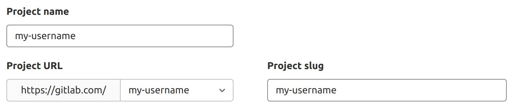



- Tier: 基础版，专业版，旗舰版
- Offering: JihuLab.com，私有化部署



每个极狐GitLab 账户都有一个用户资料，其中包含关于您和您的极狐GitLab 活动的信息。

您的资料也包含设置，您可以使用这些设置自定义您的极狐GitLab 体验。

<a id="access-your-user-profile"></a>

## 访问您的用户资料



- 在极狐GitLab 17.11 中引入了使用用户 ID 访问资料的功能。



要访问您的资料：

1. 在右上角，选择您的头像。
1. 选择您的姓名或用户名。

您也可以使用 ID 而非用户名通过 `https://gitlab.example.com/-/u/<id>` 访问用户的资料页。例如，如果您的用户名是 `gitlab-user`，ID 是 `12345`，您可以通过 `https://gitlab.example.com/gitlab-user` 或 `https://gitlab.example.com/-/u/12345` 访问资料页。

<a id="find-the-user-id"></a>

## 查找用户 ID

如果您想使用 [极狐GitLab API](../../api/_index.md) 与之交互，可能需要用户 ID。

要查找用户 ID：

1. 转到用户的资料页。
1. 在资料页的右上角，选择 **操作** ()。
1. 选择 **复制用户 ID**。

<a id="access-your-user-settings"></a>

## 访问您的用户设置

要访问您的用户设置：

1. 在右上角，选择您的头像。
1. 选择 **编辑资料**。

<a id="generate-or-change-your-support-pin"></a>

## 生成或更改您的支持 PIN

极狐GitLab 支持可能会要求提供个人识别码 (PIN) 来验证您的身份。PIN 在创建七天后过期。

要生成新的支持 PIN：

1. 在右上角，选择您的头像。
1. 选择 **编辑资料**。
1. 在左侧边栏中，选择 **账户**。
1. 选择 **生成新 PIN**。

<a id="access-your-support-pin"></a>

## 访问您的支持 PIN

如果您之前创建过支持 PIN，该 PIN 可在您的资料中找到，并在创建七天后过期。

要访问您的支持 PIN：

1. 在右上角，选择您的头像。
1. 选择 **编辑资料**。
1. 在左侧边栏中，选择 **账户**。

<a id="change-your-username"></a>

## 更改您的用户名

您的用户名有一个唯一的[命名空间](../namespace/_index.md)，在您更改用户名时该命名空间会更新。在更改用户名之前，请阅读[重定向行为](../project/repository/_index.md#repository-path-changes)。如果您不想更新命名空间，可以创建一个新用户或群组并将项目转移过去。

先决条件：

- 您的命名空间不能：
  - 包含带有[容器镜像仓库](../packages/container_registry/_index.md)标签的项目。
  - 拥有托管[极狐GitLab Pages](../project/pages/_index.md)的项目。
- 您的用户名：
  - 长度必须在 2 到 255 个字符之间。
  - 只能包含非重音字母、数字、`_`、`-` 和 `.`。
  - 不能：
    - 以 `_`、`-` 或 `.` 开头。
    - 包含表情符号。
    - 以 `.` 或 `.<reserved file extension>` 结尾，例如 `jon.png`、`jon.git` 或 `jon.atom`。但是，`jonpng` 是有效的。

要更改您的用户名：

1. 在右上角，选择您的头像。
1. 选择 **编辑资料**。
1. 在左侧边栏中，选择 **账户**。
1. 在 **更改用户名** 部分，输入一个新的用户名作为路径。
1. 选择 **更新用户名**。

<a id="add-emails-to-your-user-profile"></a>

## 向您的用户资料添加电子邮件地址

要向您的账户添加新的电子邮件地址：

1. 在右上角，选择您的头像。
1. 选择 **编辑资料**。
1. 在左侧边栏中，选择 **电子邮件**。
1. 选择 **添加新电子邮件**。
1. 在 **电子邮件** 文本框中，输入新电子邮件地址。
1. 选择 **添加电子邮件地址**。
1. 使用收到的验证邮件验证您的电子邮件地址。

新的电子邮件地址将作为次要电子邮件地址添加。您可以使用次要电子邮件地址重置密码，但不能用于身份验证。您可以更新您的[主要电子邮件地址](#change-your-primary-email)。

> [!note]
> [将您的电子邮件设为非公开](#set-your-public-email) 并不会阻止它被用于提交匹配和[群组及项目导入](../import/_index.md)。

<a id="delete-email-addresses-from-your-user-profile"></a>

## 从您的用户资料中删除电子邮件地址



- 在极狐GitLab 17.0 中引入了自动删除未验证的次要电子邮件地址的功能。



您可以从您的账户中删除次要电子邮件地址。您不能删除主要电子邮件地址。

如果删除的电子邮件地址用于任何用户电子邮件，这些用户电子邮件将改为发送到主要电子邮件地址。

未验证的次要电子邮件地址将在三天后自动删除。

> [!note]
> 由于一个问题，群组通知仍会发送到已删除的电子邮件地址。

要从您的账户中删除电子邮件地址：

1. 在右上角，选择您的头像。
1. 选择 **编辑资料**。
1. 在左侧边栏中，选择 **电子邮件**。
1. 选择 **删除** () 并确认您想要 **移除**。

您也可以[使用 API 删除次要电子邮件地址](../../api/user_email_addresses.md#delete-an-email-address)。

<a id="make-your-user-profile-page-private"></a>

## 将您的用户资料页设为私有

您可以将您的用户资料设为仅您自己和极狐GitLab 管理员可见。

> [!note]
> 极狐GitLab 管理员可以[禁用](../../administration/settings/account_and_limit_settings.md#prevent-users-from-making-their-profiles-private)此设置，强制所有资料公开。

要将您的资料设为私有：

1. 在右上角，选择您的头像。
1. 选择 **编辑资料**。
1. 选中 **私有资料** 复选框。
1. 选择 **更新资料设置**。

以下内容将从您的用户资料页 (`https://gitlab.example.com/username`) 中隐藏：

- Atom 订阅源
- 账户创建日期
- 活动、群组、贡献项目、个人项目、星标项目、片段选项卡

> [!note]
> 将您的用户资料页设为私有并不会通过 REST 或 GraphQL API 隐藏所有您的公共资源。例如，与您的提交签名关联的电子邮件地址是可访问的，除非您[使用自动生成的私有提交电子邮件](#use-an-automatically-generated-private-commit-email)。

<a id="user-visibility"></a>

### 用户可见性

用户的公开页面，位于 `/username`，无论您是否登录都始终可见。

当访问用户的公开页面时，您只能看到您有权限访问的项目。

如果[公开级别受限](../../administration/settings/visibility_and_access_controls.md#restrict-visibility-levels)，用户资料仅对已认证用户可见。

<a id="add-details-to-your-profile-with-a-readme"></a>

## 使用 README 为您的资料添加详细信息

您可以使用 README 文件为您的资料页添加更多信息。当您在 README 文件中填充信息时，它会包含在您的资料页中。

<a id="from-a-new-project"></a>

### 从新项目添加

要创建新项目并将其 README 添加到您的资料中：

1. 在右上角，选择 **新建** () 和 **新建项目/仓库**。
1. 选择 **创建空白项目**。
1. 输入项目详情：
   - 在 **项目名称** 字段中，输入新项目的名称。
   - 在 **项目 URL** 字段中，选择您的极狐GitLab 用户名。
   - 在 **项目别名** 字段中，输入您的极狐GitLab 用户名。
     所有这些字段都区分大小写。如果您的用户名包含大写字母，请在项目别名字段中输入时包含大写字母。
1. 对于 **可见性级别**，选择 **公开**。
   
1. 对于 **项目配置**，确保选中 **使用 README 初始化仓库**。
1. 选择 **创建项目**。
1. 在此项目中创建一个 README 文件。该文件可以是任何有效的 [README 或索引文件](../project/repository/files/_index.md#readme-and-index-files)。
1. 使用 [Markdown](../markdown.md) 或其他[支持的标记语言](../project/repository/files/_index.md#supported-markup-languages)填充 README 文件。

极狐GitLab 在您的贡献图下方显示您的 README 内容。

<a id="from-an-existing-project"></a>

### 从现有项目添加

要将现有项目的 README 添加到您的资料中，请[更新项目路径](../project/working_with_projects.md#rename-a-repository)以匹配您的用户名。

<a id="add-external-accounts-to-your-user-profile-page"></a>

## 向您的用户资料页添加外部账户

您可以添加指向您可能拥有的某些其他外部账户的链接，例如 Discord 和 X (前身为 Twitter)。它们可以帮助其他用户在其他平台上与您联系。

要添加指向其他账户的链接：

1. 在右上角，选择您的头像。
1. 选择 **编辑资料**。
1. 在 **主要设置** 部分，添加您的：
   - Discord [用户 ID](https://support.discord.com/hc/en-us/articles/206346498-Where-can-I-find-my-User-Server-Message-ID-)。
   - BlueSky [`did:plc` 标识符](https://atproto.com/specs/did)。要找到您的标识符，[解析您的用户句柄](https://bsky.social/xrpc/com.atproto.identity.resolveHandle?handle=USER_HANDLE)。
   - GitHub 用户名。
   - LinkedIn 资料名称。
   - [Mastodon 句柄](#add-a-mastodon-handle)。
   - [ORCID](https://orcid.org/)。
   - X (前身为 Twitter) @用户名。

   您的用户 ID 或用户名不得超过 500 个字符。
1. 选择 **更新资料设置**。

<a id="add-a-mastodon-handle"></a>

### 添加 Mastodon 句柄



- 在极狐GitLab 16.6 中引入了 Mastodon 用户账户，有一个叫 `mastodon_social_ui` 的功能标志。默认禁用。
- 在极狐GitLab 16.7 中，Mastodon 用户账户[正式发布]()。功能标志 `mastodon_social_ui` 已移除。
- 在极狐GitLab 17.4 中，添加了使用您的极狐GitLab 用户资料验证 Mastodon 账户的功能，有一个叫 `verify_mastodon_user` 的功能标志。默认禁用。
- 在极狐GitLab 18.8 中，使用您的极狐GitLab 用户资料验证 Mastodon 账户的功能[正式发布]()。功能标志 `verify_mastodon_user` 已移除。



要添加 Mastodon 句柄：

1. 将 Mastodon 句柄添加到您的极狐GitLab 资料中。
   1. 登录到极狐GitLab。
   1. 在右上角，选择您的头像。
   1. 选择 **编辑资料**。
   1. 在 **社交账户** 部分，转到 **Mastodon** 并输入您的句柄。例如：`@alex.garcia@exampleServer`。
   1. 选择 **更新资料设置**。
1. 获取验证 URI。
   1. 在右上角，选择您的头像。
   1. 选择您的姓名或用户名。
   1. 在右侧，选择您的 Mastodon 句柄。
   1. 从打开的页面中复制 URI。
1. 向 Mastodon 添加验证。
   1. 转到您的 Mastodon 资料设置。
   1. 在 **额外字段** 部分，输入之前获得的 URI。
   1. 保存您的 Mastodon 资料更改。

验证在 Mastodon 中极狐GitLab 站点的额外字段旁边是否显示绿色对勾。如果没有显示绿色对勾，您可能需要进行额外的故障排除。

<a id="show-private-contributions-on-your-user-profile-page"></a>

## 在您的用户资料页上显示私有贡献

在用户贡献日历图和最近活动列表中，您可以查看您对私有项目的[贡献操作](contributions_calendar.md#user-contribution-events)。

要显示私有贡献：

1. 在右上角，选择您的头像。
1. 选择 **编辑资料**。
1. 在 **主要设置** 部分，选中 **在资料中包含私有贡献** 复选框。
1. 选择 **更新资料设置**。

<a id="add-your-gender-pronouns"></a>

## 添加您的性别代词

您可以将您的性别代词添加到您的极狐GitLab 账户中，它们会显示在您资料中姓名旁边。

要指定您的代词：

1. 在右上角，选择您的头像。
1. 选择 **编辑资料**。
1. 在 **代词** 文本框中，输入您的代词。文本不得超过 50 个字符。
1. 选择 **更新资料设置**。

<a id="add-your-name-pronunciation"></a>

## 添加您的姓名发音

您可以将您的姓名发音添加到您的极狐GitLab 账户中。它将显示在您的资料中，姓名下方。

要添加您的姓名发音：

1. 在右上角，选择您的头像。
1. 选择 **编辑资料**。
1. 在 **发音** 文本框中，输入您姓名的发音。发音必须为纯文本，且不得超过 255 个字符。
1. 选择 **更新资料设置**。

<a id="set-your-status"></a>

## 设置您的状态

设置您的状态可以让其他人了解您的可用性。其他人将鼠标悬停在您的头像、姓名或用户名上时可以看到您的状态。即使您[将用户资料页设为私有](#make-your-user-profile-page-private)，您的状态也是公开可见的。

您的状态包含以下元素。您可以单独使用每个元素来表明您的状态。

- 一个表情符号来指示您的状态。
- 一条描述您可用性的消息。您可以包含表情符号代码，如 `:palm_tree:` 或 `:bulb:`。最多 100 个字符。
- 一个复选框，可为您的状态添加 `忙碌` 徽标。

要设置您当前的状态：

1. 在右上角，选择您的头像。
1. 选择 **设置状态**。如果您之前设置过状态，请选择 **编辑状态**。
1. 可选。输入一条状态消息。
1. 可选。选中 **将自己设为忙碌** 复选框。
1. 可选。从 **清除状态于** 下拉列表中选择一个值。
1. 选择 **设置状态**。

您的状态已更新。您也可以从[用户设置](#access-your-user-settings)页面或使用 [Users API](../../api/users.md#set-your-user-status) 来设置您的状态。

<a id="set-your-time-zone"></a>

## 设置您的时区

您可以设置您的本地时区以：

- 在您的资料上以及将鼠标悬停在您的姓名上显示信息的地方显示您的本地时间。
- 将您的贡献日历与您的本地时间对齐，以更好地反映您做出贡献的时间。

要设置您的时区：

1. 在右上角，选择您的头像。
1. 选择 **编辑资料**。
1. 在 **时间设置** 部分，从下拉列表中选择您的时区。

<a id="change-the-email-displayed-on-your-commits"></a>

## 更改您提交上显示的电子邮件地址

提交电子邮件是在通过极狐GitLab 界面执行的每个 Git 相关操作中显示的电子邮件地址。

您的任何已验证的电子邮件地址都可以用作提交电子邮件。默认使用您的主要电子邮件。

要更改您的提交电子邮件：

1. 在右上角，选择您的头像。
1. 选择 **编辑资料**。
1. 在 **提交电子邮件** 下拉列表中，选择一个电子邮件地址。
1. 选择 **更新资料设置**。

<a id="change-your-primary-email"></a>

## 更改您的主要电子邮件

您的主要电子邮件是您登录、提交电子邮件和通知电子邮件的默认电子邮件地址。如果您的主要电子邮件发生更改，您原来的主要电子邮件将作为次要电子邮件添加。此功能允许使用原来主要电子邮件做出的提交仍与您的账户关联。

要更改您的主要电子邮件：

1. 在右上角，选择您的头像。
1. 选择 **编辑资料**。
1. 在 **电子邮件** 字段中，输入您的新电子邮件地址。
1. 选择 **更新资料设置**。
1. 可选。如果您之前未将此电子邮件添加到您的 JihuLab.com 账户，请选择确认电子邮件。

<a id="set-your-public-email"></a>

## 设置您的公开电子邮件

您可以选择一个[已配置的电子邮件地址](#add-emails-to-your-user-profile)在您的公开资料上显示：

1. 在右上角，选择您的头像。
1. 选择 **编辑资料**。
1. 在 **公开电子邮件** 字段中，选择一个可用的电子邮件地址。
1. 选择 **更新资料设置**。

<a id="use-an-automatically-generated-private-commit-email"></a>

### 使用自动生成的私有提交电子邮件

极狐GitLab 提供一个自动生成的私有提交电子邮件地址，以便您可以保持电子邮件信息的私密性。

要使用私有提交电子邮件：

1. 在右上角，选择您的头像。
1. 选择 **编辑资料**。
1. 在 **提交电子邮件** 下拉列表中，选择 **使用私有电子邮件**。
1. 选择 **更新资料设置**。

每个 Git 相关操作都将使用该私有提交电子邮件。为了完全匿名，您还可以复制该私有提交电子邮件并使用以下命令在本地机器上进行配置：

```shell
git config --global user.email <your email address>
```

<a id="follow-users"></a>

## 关注用户

您可以通过以下方式关注或取消关注用户：

- 他们的[用户资料](#access-your-user-profile)。
- 将鼠标悬停在用户姓名上时出现的小弹窗（在极狐GitLab 15.0 中引入）。

在极狐GitLab 15.5 及更高版本中，您可以关注的用户数量上限为 300。

在极狐GitLab 16.10 及更高版本中，被屏蔽的用户不会出现在用户资料的关注者列表中。

<a id="disable-following-and-being-followed-by-other-users"></a>

### 禁用关注和被其他用户关注



- 在极狐GitLab 16.0 中引入了此功能，有一个叫 `disable_follow_users` 的功能标志。
- 在极狐GitLab 16.3 中[功能标志已移除]()。



您可以禁用关注和被其他用户关注。

1. 在右上角，选择您的头像。
1. 选择 **编辑资料**。
1. 选择 **偏好设置**。
1. 清除 **启用关注用户** 复选框。
1. 选择 **保存更改**。

> [!note]
> 当此功能被禁用时，所有当前的关注/被关注关系都会被删除。

<a id="view-a-users-activity"></a>

## 查看用户的活动

极狐GitLab 跟踪[用户贡献活动](contributions_calendar.md)。要查看用户的活动：

1. 转到用户的资料。
1. 在极狐GitLab 菜单中，选择 **活动**。

将显示一个 **最近活动** 贡献列表。

<a id="view-your-activity"></a>

## 查看您的活动

要查看您的活动：

1. 在顶部栏中，选择 **搜索或跳转到**。
1. 选择 **您的工作**。
1. 选择 **活动**。
1. 可选。要按贡献类型筛选您的活动，在 **您的活动** 选项卡中，选择一个选项卡：

   - **全部**：您在群组和项目中做出的所有贡献。
   - **推送事件**：您在项目中做出的推送事件。
   - **合并事件**：您在项目中接受的合并请求。
   - **议题事件**：您在项目中打开和关闭的议题。
   - **评论**：您在项目中发表的评论。
   - **Wiki**：您在项目中创建和更新的 Wiki 页面。
   - **设计**：您在项目中添加、更新和移除的设计。
   - **团队**：您加入和退出的项目。

<a id="sign-in-services"></a>

## 登录服务

除了使用常规的用户名和密码登录极狐GitLab，您也可以使用登录服务。

<a id="connect-a-sign-in-service"></a>

### 连接登录服务

要连接用于登录极狐GitLab 的登录服务：

1. 在右上角，选择您的头像。
1. 选择 **编辑资料**。
1. 在左侧边栏中，选择 **访问** > **密码和身份验证**。
1. 找到 **服务登录** 部分。
1. 在 **已连接账户** 部分，选择与您想用来登录的服务对应的按钮。
1. 按照所选服务的指示开始使用它登录。

<a id="disconnect-a-sign-in-service"></a>

### 断开登录服务

要断开用于登录极狐GitLab 的登录服务：

1. 在右上角，选择您的头像。
1. 选择 **编辑资料**。
1. 在左侧边栏中，选择 **访问** > **密码和身份验证**。
1. 找到 **服务登录** 部分。
1. 在 **已连接账户** 部分，在您不想再用其登录的服务对应的按钮旁边，选择 **断开连接**。

<a id="session-duration"></a>

## 会话持续时间

<a id="stay-signed-in-for-one-week"></a>

### 保持登录一周

默认情况下，您在七天的非活动状态后（10080 分钟）或关闭浏览器窗口时（以先到者为准）会被登出极狐GitLab。

极狐GitLab 管理员可以[更改此默认设置](../../administration/settings/account_and_limit_settings.md#customize-the-default-session-duration)。

<a id="stay-signed-in-indefinitely"></a>

### 无限期保持登录



- 在极狐GitLab 16.0 中引入了开启和关闭 **记住我** 设置的功能。



要无限期保持登录，请在极狐GitLab 登录页面上选中 **记住我** 复选框。

您会保持登录，因为尽管服务器设置了一周的会话时间，但您的浏览器会存储一个安全令牌以实现自动重新认证。

对于出于安全或合规原因需要会话定期过期的环境，极狐GitLab 管理员可以[关闭 **记住我** 设置](../../administration/settings/account_and_limit_settings.md#session-duration)。

<a id="cookies-used-for-sign-in"></a>

### 用于登录的 Cookies

当您登录时，会设置三个 cookie：

- 一个名为 `_gitlab_session` 的会话 cookie。
  此 cookie 没有设置的过期日期。但是，它会根据其 `session_expire_delay` 过期。
- 一个名为 `gitlab_user` 的会话 cookie。
  此 cookie 被[营销网站](https://about.gitlab.com/)用于确定用户是否有活动的极狐GitLab 会话。没有用户信息传递到 cookie，它在登录后两周过期。
- 一个名为 `remember_user_token` 的持久 cookie，仅在您在登录页面选择 **记住我** 时设置。

当您关闭浏览器时，`_gitlab_session` 和 `gitlab_user` cookies 通常在客户端被清除。当它过期或不可用时，极狐GitLab：

- 使用 `remember_user_token` cookie 为您获取一个新的 `_gitlab_session` cookie 并保持您登录，即使您关闭浏览器也是如此。
- 将 `gitlab_user` 设置为 `true`。

当 `remember_user_token` 和 `_gitlab_session` cookies 都消失或过期时，您必须重新登录。

> [!note]
> 当任何会话退出时，或者当会话从[活动会话列表](active_sessions.md)中被撤销时，所有 **记住我** 令牌都会被撤销。
> 虽然其他会话保持活动，但如果浏览器关闭或现有会话过期，**记住我** 功能不会恢复会话。

