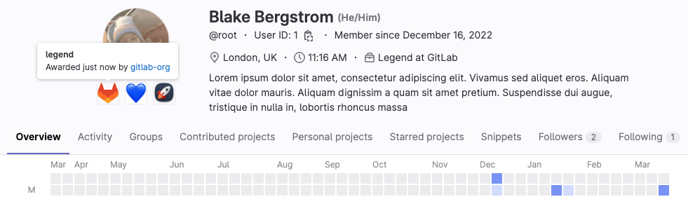



- Tier: 基础版，专业版，旗舰版
- Offering: JihuLab.com，私有化部署
- Status: Experiment





- 在极狐GitLab 15.10 中引入，[使用功能标志](../../administration/feature_flags/_index.md) 命名为 `achievements`。默认禁用。



> [!flag]
> 对于极狐GitLab 私有化部署，默认情况下此功能不可用。要使其可用，管理员可以[启用功能标志](../../administration/feature_flags/_index.md) 名为 `achievements` 的功能标志。

成就是一种奖励用户在极狐GitLab 上活动的方式。
作为命名空间的维护者或所有者，您可以针对特定贡献创建自定义成就。您可以根据定义的标准将这些成就授予用户或撤销这些成就。

作为用户，您可以收集成就，在您的个人资料上突出显示您对不同项目或群组的贡献。
一个成就由名称、描述和头像组成。



成就被视为归用户所有。无论创建该成就的命名空间的可见性设置如何，成就都是可见的。

此功能为实验性功能。
有关计划工作的更多信息，请参阅[史诗 9429](https://jihulab.com/groups/gitlab-cn/-/epics/9429)。
通过在史诗中留言，告诉我们您的使用场景。

<a id="types-of-achievement"></a>

## 成就类型

从编程的角度看，创建、授予、撤销或删除成就只有一种方式。

实际上，您可以根据授予方式区分成就：

- 一次性且不可撤销。例如，“首次合并贡献”成就。
- 一次性且可撤销。例如，“核心团队成员”成就。
- 可多次授予。例如，“月度贡献者”成就。

<a id="view-group-achievements"></a>

## 查看群组成就

要查看某个群组所有可用和已授予的成就：

- 访问 `https://jihulab.com/groups/<group-path>/-/achievements`。

该页面会显示成就列表以及被授予该成就的成员。

<a id="view-a-users-achievements"></a>

## 查看用户的成就

您可以在用户的个人资料页面查看其成就。

前提条件：

- 用户个人资料必须是公开的。

要查看用户的成就：

1. 访问用户的个人资料页面。
1. 在用户头像下方，查看其成就。
1. 要查看成就详情，请将鼠标悬停在成就上。
   会显示以下信息：

   - 成就名称
   - 成就描述
   - 成就授予用户的日期
   - 如果用户是该命名空间的成员或该命名空间是公开的，则显示授予成就的命名空间

要获取用户的成就列表，请查询 [`user` GraphQL 类型](../../api/graphql/reference/_index.md#user)。

```graphql
query {
  user(username: "<username>") {
    userAchievements {
      nodes {
        achievement {
          name
          description
          avatarUrl
          namespace {
            fullPath
            name
          }
        }
      }
    }
  }
}
```

<a id="create-an-achievement"></a>

## 创建成就

您可以创建自定义成就，用于奖励特定贡献。

前提条件：

- 您必须具有该命名空间的维护者或所有者角色。

要创建成就：

- 在 UI 中：
  1. 在[成就页面](#查看群组成就)上，选择 **新建成就**。
  1. 输入成就名称。
  1. 可选。输入描述并上传成就头像。
  1. 选择 **保存更改**。

- 使用 GraphQL API，调用 [`achievementsCreate` GraphQL 变更](../../api/graphql/reference/_index.md#mutationachievementscreate)：

  ```graphql
  mutation achievementsCreate($file: Upload!) {
    achievementsCreate(
      input: {
        namespaceId: "gid://gitlab/Namespace/<namespace id>",
        name: "<name>",
        description: "<description>",
        avatar: $file}
    ) {
      errors
      achievement {
        id
        name
        description
        avatarUrl
      }
    }
  }
  ```

  要提供头像文件，请使用 `curl` 调用此变更：

  ```shell
  curl "https://jihulab.com/api/graphql" \
    -H "Authorization: Bearer <your-pat-token>" \
    -H "Content-Type: multipart/form-data" \
    -F operations='{ "query": "mutation ($file: Upload!) { achievementsCreate(input: { namespaceId: \"gid://gitlab/Namespace/<namespace-id>\", name: \"<name>\", description: \"<description>\", avatar: $file }) { achievement { id name description avatarUrl } } }", "variables": { "file": null } }' \
    -F map='{ "0": ["variables.file"] }' \
    -F 0='@/path/to/your/file.jpg'
  ```

  成功时，响应会返回成就 ID：

  ```shell
  {"data":{"achievementsCreate":{"achievement":{"id":"gid://gitlab/Achievements::Achievement/1","name":"<name>","description":"<description>","avatarUrl":"https://jihulab.com/uploads/-/system/achievements/achievement/avatar/1/file.jpg"}}}}
  ```

<a id="update-an-achievement"></a>

## 更新成就

您可以随时更改成就的名称、描述和头像。

前提条件：

- 您必须具有该命名空间的维护者或所有者角色。

要更新成就，请调用 [`achievementsUpdate` GraphQL 变更](../../api/graphql/reference/_index.md#mutationachievementsupdate)。

```graphql
mutation achievementsUpdate($file: Upload!) {
  achievementsUpdate(
    input: {
      achievementId: "gid://gitlab/Achievements::Achievement/<achievement id>",
      name: "<new name>",
      description: "<new description>",
      avatar: $file}
  ) {
    errors
    achievement {
      id
      name
      description
      avatarUrl
    }
  }
}
```

<a id="award-an-achievement"></a>

## 授予成就

您可以将成就授予用户，以表彰其贡献。
用户被授予成就时会收到电子邮件通知。

前提条件：

- 您必须具有该命名空间的维护者或所有者角色。

要向用户授予成就，请调用 [`achievementsAward` GraphQL 变更](../../api/graphql/reference/_index.md#mutationachievementsaward)。

```graphql
mutation {
  achievementsAward(input: {
    achievementId: "gid://gitlab/Achievements::Achievement/<achievement id>",
    userId: "gid://gitlab/User/<user id>" }) {
    userAchievement {
      id
      achievement {
        id
        name
      }
      user {
        id
        username
      }
    }
    errors
  }
}
```

<a id="revoke-an-achievement"></a>

## 撤销成就

如果您认为用户不再满足授予标准，可以撤销该用户的成就。

前提条件：

- 您必须具有该命名空间的维护者或所有者角色。

要撤销成就，请调用 [`achievementsRevoke` GraphQL 变更](../../api/graphql/reference/_index.md#mutationachievementsrevoke)。

```graphql
mutation {
  achievementsRevoke(input: {
    userAchievementId: "gid://gitlab/Achievements::UserAchievement/<user achievement id>" }) {
    userAchievement {
      id
      achievement {
        id
        name
      }
      user {
        id
        username
      }
      revokedAt
    }
    errors
  }
}
```

<a id="delete-an-awarded-achievement"></a>

## 删除已授予的成就

如果您错误地向用户授予了成就，可以将其删除。

前提条件：

- 您必须具有该命名空间的所有者角色。

要删除已授予的成就，请调用 [`userAchievementsDelete` GraphQL 变更](../../api/graphql/reference/_index.md#mutationuserachievementsdelete)。

```graphql
mutation {
  userAchievementsDelete(input: {
    userAchievementId: "gid://gitlab/Achievements::UserAchievement/<user achievement id>" }) {
    userAchievement {
      id
      achievement {
        id
        name
      }
      user {
        id
        username
      }
    }
    errors
  }
}
```

<a id="delete-an-achievement"></a>

## 删除成就

如果您认为不再需要某个成就，可以将其删除。
这将删除该成就所有相关的已授予和已撤销实例。

前提条件：

- 您必须具有该命名空间的维护者或所有者角色。

要删除成就，请调用 [`achievementsDelete` GraphQL 变更](../../api/graphql/reference/_index.md#mutationachievementsdelete)。

```graphql
mutation {
  achievementsDelete(input: {
    achievementId: "gid://gitlab/Achievements::Achievement/<achievement id>" }) {
    achievement {
      id
      name
    }
    errors
  }
}
```

<a id="hide-achievements"></a>

## 隐藏成就

如果您不想在个人资料中显示成就，可以选择退出。操作步骤如下：

1. 在右上角，选择您的头像。
1. 选择 **编辑个人资料**。
1. 在 **主设置** 部分，清除 **在您的个人资料中显示成就** 复选框。
1. 选择 **更新个人资料设置**。

<a id="change-visibility-of-specific-achievements"></a>

## 更改特定成就的可见性



- 在极狐GitLab 17.3 中引入。



如果您不想在个人资料上显示所有成就，可以更改特定成就的可见性。

要隐藏您的某个成就，请调用 [`userAchievementsUpdate` GraphQL 变更](../../api/graphql/reference/_index.md#mutationuserachievementsupdate)。

```graphql
mutation {
  userAchievementsUpdate(input: {
    userAchievementId: "gid://gitlab/Achievements::UserAchievement/<user achievement id>"
    showOnProfile: false
  }) {
    userAchievement {
      id
      showOnProfile
    }
    errors
  }
}
```

要再次显示您的某个成就，请使用相同的变更，并将 `showOnProfile` 参数的值设为 `true`。

<a id="reorder-achievements"></a>

## 重新排序成就

默认情况下，您个人资料上的成就按授予日期的升序显示。

要更改成就的顺序，请调用 [`userAchievementPrioritiesUpdate` GraphQL 变更](../../api/graphql/reference/_index.md#mutationuserachievementprioritiesupdate) 并传入所有需排序成就的有序列表。

```graphql
mutation {
  userAchievementPrioritiesUpdate(input: {
    userAchievementIds: ["gid://gitlab/Achievements::UserAchievement/<first user achievement id>", "gid://gitlab/Achievements::UserAchievement/<second user achievement id>"],
    }) {
    userAchievements {
      id
      priority
    }
    errors
  }
}
```