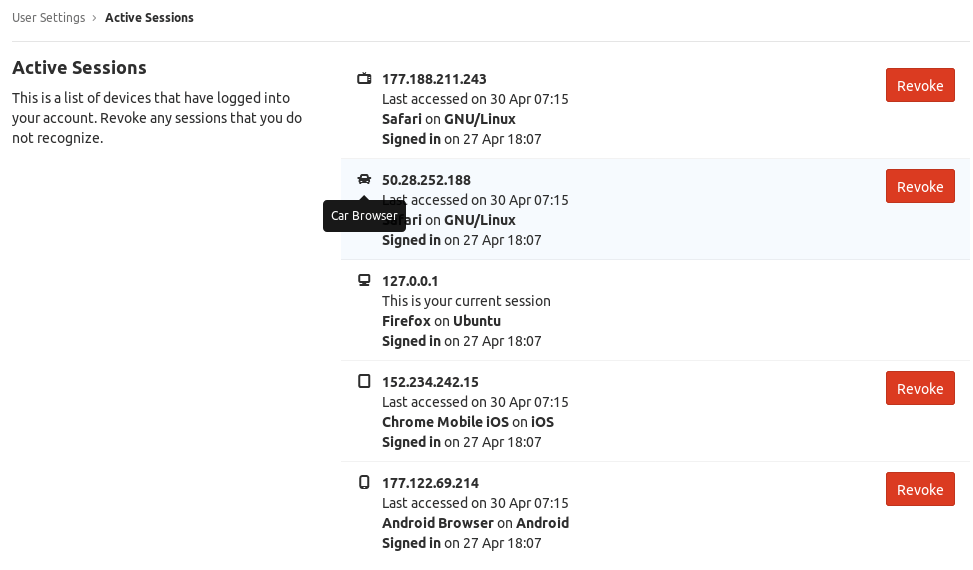



- Tier: 基础版，专业版，旗舰版
- Offering: JihuLab.com，私有化部署



极狐GitLab 列出所有已登录你账号的设备。你可以查看这些会话，并撤销任何你不认识的会话。

## 列出所有活跃会话

<a id="list-all-active-sessions"></a>

要列出所有活跃会话：

1. 在右上角，选择你的头像。
1. 选择 **编辑个人资料**。
1. 在左侧边栏中，选择 **访问权限** > **活跃会话**。



## 活跃会话数量限制

<a id="active-sessions-limit"></a>

极狐GitLab 允许用户同时拥有最多 100 个活跃会话。如果活跃会话数量超过 100，最旧的会话将被删除。

## 撤销会话

<a id="revoke-a-session"></a>

要撤销一个活跃会话：

1. 在右上角，选择你的头像。
1. 选择 **编辑个人资料**。
1. 在左侧边栏中，选择 **访问权限** > **活跃会话**。
1. 在会话旁选择 **撤销**。当前会话无法撤销，因为这会导致你登出极狐GitLab。

> [!note]
> 当任何会话被撤销时，所有设备上的所有 **记住我** 令牌都会被撤销。关于 **记住我** 的详细信息，请参阅
> [用于登录的 cookies](_index.md#cookies-used-for-sign-in)。

## 通过 Rails 控制台撤销会话

<a id="revoke-sessions-through-the-rails-console"></a>

你也可以通过 Rails 控制台撤销用户会话。你可以使用此方法同时撤销多个会话。

### 撤销所有用户的所有会话

<a id="revoke-all-sessions-for-all-users"></a>

要撤销所有用户的所有会话：

1. [启动 Rails 控制台会话](../../administration/operations/rails_console.md#starting-a-rails-console-session)。
1. 可选。使用以下命令列出所有活跃会话：

   ```ruby
   # 显示所有活跃会话的用户
    puts "=== 当前已登录用户 ==="
    User.find_each do |user|
        sessions = ActiveSession.list(user)
        if sessions.any?
            puts "\n#{user.username} (#{user.name}):"
            sessions.each do |session|
                puts "  - IP: #{session.ip_address}, 浏览器: #{session.browser}, 最近活跃: #{session.updated_at}"
            end
        end
    end
   ```

1. 使用以下命令撤销所有会话：

   ```ruby
   User.find_each do |user|
      ActiveSession.destroy_all_but_current(user, nil)
   end
   ```

1. 可选。通过再次运行“列出所有活跃会话”命令来确认所有会话已被撤销。

### 撤销群组中所有用户的所有会话

<a id="revoke-all-sessions-for-all-users-of-a-group"></a>

1. 将以下脚本保存到你的极狐GitLab 实例中。例如，`scripts/session_revocation/revoke_group_sessions.rb`。

   ```ruby
   # frozen_string_literal: true
   #
   # 撤销群组成员的所有活跃会话，包括：
   # - 顶层群组的直接成员和继承成员
   # - 所有子群组的直接成员
   # - 通过群组共享在顶层和子群组级别邀请的成员
   #
   # 用法 (Rails 控制台):
   #   DRY_RUN = true
   #   GROUP_IDENTIFIER = 'your-group-path' # 或数字 ID
   #   load 'scripts/session_revocation/revoke_group_sessions.rb'

   DRY_RUN = true unless defined?(DRY_RUN)
   # 将 `your-group-path` 替换为你的群组 ID 或群组的完整路径
   GROUP_IDENTIFIER = 'your-group-path' unless defined?(GROUP_IDENTIFIER)

   # ---------------------------------------------------------------

   def find_group(identifier)
      # 首先尝试通过完整路径查找（处理数字群组名称）
      group = Group.find_by_full_path(identifier.to_s)
      return group if group

      # 如果路径未找到且标识符是数字，则回退到 ID 查找
      if identifier.is_a?(Integer) || identifier.to_s.match?(/\A\d+\z/)
         Group.find_by(id: identifier)
      end
   end

   def collect_member_user_ids(group)
      user_ids = Set.new

      # 顶层群组的直接成员和继承成员
      user_ids.merge(group.members_with_parents.pluck(:user_id))

      # 通过群组共享邀请到顶层群组的成员
      group.shared_with_group_links.each do |link|
         user_ids.merge(link.shared_with_group.members_with_parents.pluck(:user_id))
      end

      # 遍历所有子群组
      group.descendants.find_each do |subgroup|
         # 每个子群组的直接成员
         user_ids.merge(subgroup.members.pluck(:user_id))

         # 通过群组共享邀请到每个子群组的成员
         subgroup.shared_with_group_links.each do |link|
            user_ids.merge(link.shared_with_group.members_with_parents.pluck(:user_id))
         end
      end

      user_ids.to_a
   end

   def revoke_sessions_for_group(group, dry_run:)
      member_user_ids = collect_member_user_ids(group)

      puts "在群组 '#{group.full_path}' (包括子群组和群组共享) 中找到 #{member_user_ids.count} 个唯一成员"

      # 只处理活跃、非机器人的人类用户，以避免不必要的 Redis 查找
      users = User.active.human.id_in(member_user_ids)

      revoked_sessions = 0
      affected_users = []
      skipped_users = []

      users.find_each do |user|
         sessions = ActiveSession.list(user)

         if sessions.empty?
            skipped_users << user.username
            next
         end

         session_ids = sessions.map(&:session_private_id).compact

         if session_ids.empty?
            puts "  [WARN] 用户 #{user.username} 有会话但所有 session_private_ids 都为 nil，跳过。"
            skipped_users << user.username
            next
         end

         unless dry_run
            Gitlab::Redis::Sessions.with do |redis|
               ActiveSession.destroy_sessions(redis, user, session_ids)
            end

            # 发出审计事件以确保安全可追溯
            Gitlab::AppLogger.info(
               message: "会话通过管理脚本撤销",
               user_id: user.id,
               username: user.username,
               session_count: session_ids.size,
               group: group.full_path,
               performed_at: Time.current.iso8601
            )
         end

         revoked_sessions += session_ids.size
         affected_users << user.username
      end

      [revoked_sessions, affected_users, skipped_users]
   end

   # ---------------------------------------------------------------

   group = find_group(GROUP_IDENTIFIER)

   if group.nil?
      puts "错误: 群组 '#{GROUP_IDENTIFIER}' 未找到。中止。"
   end

   puts "=== 会话撤销 #{DRY_RUN ? '(演练)' : '(正式执行)'} ==="
   puts "群组: #{group.full_path} (ID: #{group.id})"
   puts

   revoked_sessions, affected_users, skipped_users = revoke_sessions_for_group(group, dry_run: DRY_RUN)

   prefix = DRY_RUN ? "[演练] 将会撤销" : "已撤销"
   puts "#{prefix} #{revoked_sessions} 个会话，涉及 #{affected_users.size} 个用户"
   puts "受影响的用户: #{affected_users.sort.join(', ')}" if affected_users.any?
   puts "跳过的用户 (无活跃会话): #{skipped_users.size}" if skipped_users.any?

   if DRY_RUN && revoked_sessions.positive?
      puts "\n要实际撤销会话，请设置 DRY_RUN = false 并再次运行。"
   end
   ```

1. [启动 Rails 控制台会话](../../administration/operations/rails_console.md#starting-a-rails-console-session)。
1. 运行以下命令来指定目标群组。将 `your-group-path` 替换为你的群组 ID 或群组的完整路径：

   ```ruby
   GROUP_IDENTIFIER = 'your-group-path'
   ```

1. 运行以下命令列出群组中的所有活跃会话：

   ```ruby
   DRY_RUN = true
   load 'scripts/session_revocation/revoke_group_sessions.rb'
   ```

1. 运行以下命令撤销群组中的所有会话：

   ```ruby
   DRY_RUN = false
   load 'scripts/session_revocation/revoke_group_sessions.rb'
   ```

1. 运行以下命令验证所有会话都已被关闭。输出应列出 0 个活跃会话：

   ```ruby
   DRY_RUN = true
   load 'scripts/session_revocation/revoke_group_sessions.rb'
   ```

### 撤销单个用户的所有会话

<a id="revoke-all-sessions-for-a-user"></a>

要撤销特定用户的所有会话：

1. [启动 Rails 控制台会话](../../administration/operations/rails_console.md#starting-a-rails-console-session)。
1. 使用以下命令查找用户：

   - 按用户名：

     ```ruby
     user = User.find_by_username 'exampleuser'
     ```

   - 按用户 ID：

     ```ruby
     user = User.find(123)
     ```

   - 按邮箱地址：

     ```ruby
     user = User.find_by(email: 'user@example.com')
     ```

1. 可选。使用以下命令列出该用户的所有活跃会话：

   ```ruby
   ActiveSession.list(user)
   ```

1. 使用以下命令撤销所有会话：

   ```ruby
   ActiveSession.list(user).each { |session| ActiveSession.destroy_session(user, session.session_private_id) }
   ```

1. 使用以下命令验证所有会话都已关闭：

   ```ruby
   # 如果所有会话都已关闭，返回一个空数组。
   ActiveSession.list(user)
   ```