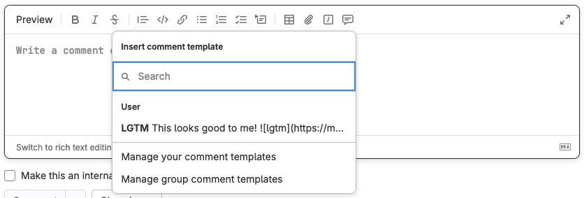



- Tier: 基础版，专业版，旗舰版
- Offering: JihuLab.com，私有化部署





- 功能标志 `saved_replies` 在极狐GitLab 16.0 中于 JihuLab.com 和私有化部署实例上启用。
- 在极狐GitLab 16.6 中 GA。功能标志 `saved_replies` 已移除。
- 群组评论模板：
  - 在极狐GitLab 16.11 中引入 [使用一个标志](../../administration/feature_flags/_index.md) 名为 `group_saved_replies_flag`。默认禁用。
  - 在极狐GitLab 17.8 中 GA。功能标志 `group_saved_replies_flag` 已移除。
- 项目评论模板：
  - 在极狐GitLab 17.0 中引入 [使用一个标志](../../administration/feature_flags/_index.md) 名为 `project_saved_replies_flag`。默认启用。
  - 在极狐GitLab 17.8 中 GA。功能标志 `project_saved_replies_flag` 已移除。



借助评论模板，你可以为以下任何文本区域创建并重用文本：

- 合并请求，包括差异比较。
- 议题，包括设计管理评论。
- 史诗。
- 工作项。

评论模板可以很短小，比如批准一个合并请求并取消自己的指派，
也可以很庞大，比如你经常使用的样板文本片段：

## 在文本区域中使用评论模板

要在你的评论中包含评论模板的文本：

1. 在评论的编辑器工具栏中，选择 **评论模板** ()。
1. 选择你想要的评论模板。

## 创建评论模板

你可以为自己创建评论模板，也可以创建与群组所有成员共享的评论模板。

要为自己创建评论模板：

1. 在右上角，选择你的头像。
1. 在下拉列表中，选择 **偏好设置**。
1. 在左侧边栏中，选择 **评论模板** ()。
1. 选择 **添加新模板**。
1. 为你的评论模板提供一个 **名称**。
1. 输入回复的 **内容**。你可以使用在任何其它极狐GitLab 文本区域中使用的任何格式。
1. 选择 **保存**，页面将重新加载并显示你的评论模板。

### 针对群组



- Tier: 专业版，旗舰版



要创建与群组所有成员共享的评论模板：

1. 在评论编辑器工具栏中，选择 **评论模板**
   ()，然后选择 **管理群组评论模板**。
1. 选择 **添加新模板**。
1. 为你的评论模板提供一个 **名称**。
1. 输入回复的 **内容**。你可以使用在任何其它极狐GitLab 文本区域中使用的任何格式。
1. 选择 **保存**，页面将重新加载并显示你的评论模板。

### 针对项目



- Tier: 专业版，旗舰版



要创建与项目所有成员共享的评论模板：

1. 在评论编辑器工具栏中，选择 **评论模板**
   ()，然后选择 **管理项目评论模板**。
1. 选择 **添加新模板**。
1. 为你的评论模板提供一个 **名称**。
1. 输入回复的 **内容**。你可以使用在任何其它极狐GitLab 文本区域中使用的任何格式。
1. 选择 **保存**，页面将重新加载并显示你的评论模板。

## 查看评论模板

要查看已有的评论模板：

1. 在右上角，选择你的头像。
1. 在下拉列表中，选择 **偏好设置**。
1. 在左侧边栏中，选择 **评论模板** ()。
1. 滚动到 **评论模板**。

### 针对群组



- Tier: 专业版，旗舰版



1. 在评论编辑器工具栏中，选择 **评论模板**
   ()。
1. 选择 **管理群组评论模板**。

### 针对项目



- Tier: 专业版，旗舰版



1. 在评论编辑器工具栏中，选择 **评论模板**
   ()。
1. 选择 **管理项目评论模板**。

## 编辑或删除评论模板

要编辑或删除已有的评论模板：

1. 在右上角，选择你的头像。
1. 在下拉列表中，选择 **偏好设置**。
1. 在左侧边栏中，选择 **评论模板** ()。
1. 滚动到 **评论模板**，并找到你想要编辑的评论模板。
1. 要编辑，选择 **编辑** ()。
1. 要删除，选择 **删除** ()，然后在对话框中选择再次 **删除**。

### 针对群组



- Tier: 专业版，旗舰版



1. 在评论编辑器工具栏中，选择 **评论模板**
   ()，然后选择 **管理群组评论模板**。
1. 要编辑，选择 **编辑** ()。
1. 要删除，选择 **删除** ()，然后在对话框中选择再次 **删除**。

### 针对项目



- Tier: 专业版，旗舰版



1. 在评论编辑器工具栏中，选择 **评论模板**
   ()，然后选择 **管理项目评论模板**。
1. 要编辑，选择 **编辑** ()。
1. 要删除，选择 **删除** ()，然后在对话框中选择再次 **删除**。