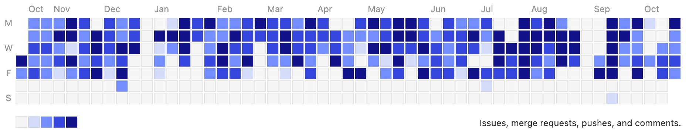



- Tier: 基础版，专业版，旗舰版
- Offering: JihuLab.com，私有化部署



贡献日历显示过去 12 个月内的[用户事件](#user-contribution-events)。这包括在派生和[私有](#show-private-contributions-on-your-user-profile-page)仓库中所做的贡献。

瓦片的渐变颜色代表每天贡献的次数。渐变范围从空白（0 次贡献）到深蓝色（超过 30 次贡献）。

要全面查看所有群组成员的贡献事件，您可以使用[贡献分析](../group/contribution_analytics/_index.md)。

## 用户贡献事件

极狐GitLab 追踪以下贡献事件：

| 事件 | 贡献 |
| ----- | ------------ |
| `批准` | 合并请求 |
| `关闭` | [史诗](../group/epics/_index.md)，议题，合并请求，里程碑，工作项 |
| `评论` | 告警，提交，设计，议题，合并请求，代码片段 |
| `创建` | 设计，史诗，议题，合并请求，里程碑，项目，Wiki 页面，工作项 |
| `删除` | 设计，里程碑，Wiki 页面 |
| `过期` | 项目成员资格 |
| `加入` | 项目成员资格 |
| `离开` | 项目成员资格 |
| `合并` | 合并请求 |
| `推送` 提交到仓库或从仓库删除提交（单独或批量） | 项目 |
| `重新打开` | 史诗，议题，合并请求，里程碑 |
| `更新` | 设计，Wiki 页面 |

### 查看每日贡献

要查看您的每日贡献：

1. 在右上角，选择您的头像。
1. 在下拉列表中选择您的姓名。
1. 在贡献日历中：
   - 要查看某天的贡献次数，将光标悬停在该瓦片上。
   - 要查看某天的所有贡献，选择该瓦片。将显示一个列表，包含所有贡献及其发生时间。

### 在用户个人资料页面显示私有贡献

贡献日历图表和最近活动列表会显示您在私有项目中的[贡献操作](#user-contribution-events)。

要查看私有贡献：

1. 在右上角，选择您的头像。
1. 选择 **编辑资料**。
1. 在 **主要设置** 部分，勾选 **在我的个人资料中包含私有贡献** 复选框。
1. 选择 **更新资料设置**。

## 用户动态

### 关注用户动态

您可以关注感兴趣的用户动态。在极狐GitLab 15.5 及更高版本中，您最多可以关注 300 个用户。

要关注一个用户，可以：

- 在用户的个人资料页面，选择 **关注**。
- 将光标悬停在用户名上，然后选择 **关注**（极狐GitLab 15.0 引入）。

要查看您关注的用户动态：

1. 在极狐GitLab 菜单中，选择 **动态**。
1. 选择 **已关注用户** 标签页。

### 以 Feed 形式获取用户动态

极狐GitLab 提供用户动态的 RSS feed。要订阅用户动态的 RSS feed：

1. 转到[用户个人资料](_index.md#access-your-user-profile)。
1. 在右上角，选择 feed 符号 () 以 Atom 格式显示为 RSS feed 的结果。

结果 URL 包含一个 feed 令牌，以及您有权查看的用户动态。您可以将此 URL 添加到您的 feed 阅读器中。

### 重置用户动态 feed 令牌

Feed 令牌是敏感的，可能会泄露机密议题的信息。如果您认为您的 feed 令牌已暴露，您应当重置它。

要重置您的 feed 令牌：

1. 在右上角，选择您的头像。
1. 选择 **编辑资料**。
1. 在左侧边栏中，选择 **访问** > **个人访问令牌**。
1. 向下滚动。在 **Feed 令牌** 部分，选择 **重置此令牌** 链接。
1. 在确认对话框中，选择 **确定**。

将生成一个新的令牌。

### 事件时间限制

出于性能考虑，极狐GitLab 会从事件表中删除超过 3 年的用户动态事件。