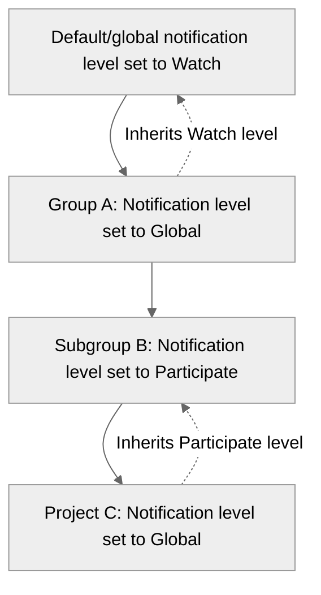



- Tier: 基础版，专业版，旗舰版
- Offering: JihuLab.com，私有化部署



通过电子邮件通知，随时了解极狐GitLab 中发生的情况。
您可以收到关于议题、合并请求、史诗和设计中活动的更新。

有关极狐GitLab 管理员可用于向用户发送消息的工具，请阅读
[从极狐GitLab 发送电子邮件](../../administration/email_from_gitlab.md)。

在极狐GitLab 17.2 及更高版本中，[通知受到速率限制](../../rate_limits/non_configurable.md)，
限制为每个用户每 24 小时每个项目或群组。

<a id="who-receives-notifications"></a>

## 谁接收通知

当议题、合并请求或史诗的通知启用时，极狐GitLab 会通知您其中发生的操作。

您可能因以下原因之一收到通知：

- 您参与了议题、合并请求、史诗或设计。当您评论或编辑，或有人提及您的用户名时，您即成为参与者。
- 您已在议题、合并请求或史诗中[启用通知](#issue-merge-request-and-epic-events)。
- 您已为[项目](#change-level-of-project-notifications)或[群组](#group-notifications)配置了通知。
- 您通过流水线电子邮件[集成](../project/integrations/_index.md)订阅了群组或项目流水线通知。

极狐GitLab 在以下情况下不会发送通知：

- 账户是项目机器人。
- 账户是使用默认电子邮件地址的服务账号。
- 账户已被阻止（封禁）或停用。
- 管理员已阻止通知。

<a id="global-notification-settings"></a>

## 全局通知设置

您的全局通知设置是默认设置，除非您为特定项目或群组指定了不同的设置。
例如，您可能希望收到特定项目中所有活动的通知。
对于其他项目，您只希望在有人提及您的名字时收到通知。

这些通知设置仅适用于您自己。它们不会影响其他任何人收到的通知。

<a id="edit-notification-settings"></a>

### 编辑通知设置

要编辑您的通知设置：

1. 在右上角，选择您的头像。
1. 选择 **偏好设置**。
1. 在左侧边栏中，选择 **通知**。
1. 在 **全局通知电子邮件** 中，输入您的通知发送到的电子邮件地址。
   默认为您的主电子邮件地址。
1. 对于 **全局通知级别**，选择要应用于您的通知的默认[通知级别](#notification-levels)。
1. 选中 **接收关于您自己活动的通知** 复选框，以接收关于您自己活动的通知。默认不选中。

<a id="notification-levels"></a>

### 通知级别

在每个项目和群组的右侧，您可以选择一个通知级别：

| 级别           | 描述 |
|-----------------|-------------|
| **全局**      | 应用您的默认全局设置。 |
| **关注**       | 接收大多数活动的通知。 |
| **参与** | 接收您[参与](#who-receives-notifications)的条目的通知。 |
| **提及**  | 当有人在描述或评论中[提及](../discussions/_index.md#mentions)您时接收通知。 |
| **禁用**    | 不接收任何通知。 |
| **自定义**      | 接收您[参与](#who-receives-notifications)的条目的通知，以及您选择的[议题、合并请求和史诗事件](#issue-merge-request-and-epic-events)或[流水线事件](#cicd-pipeline-events)。某些事件仅在您选择时才会发送，即使您参与其中。 |

<a id="notification-scope"></a>

### 通知范围

您可以通过为每个项目和群组选择不同的通知级别来调整通知范围。

通知范围从最广泛到最具体的级别应用：

- 如果您未对发生活动的项目或群组选择通知级别，则应用您的全局或_默认_通知级别。
- 您的群组设置会覆盖您的默认设置。
- 您的项目设置会覆盖群组设置。

当您为项目或子群组将通知级别设置为 **全局** 时，它不会直接继承您的全局通知设置。
相反，它会沿层级向上，并按以下顺序继承配置的下一个非全局通知级别：

1. 项目设置。
1. 父群组设置。
1. 祖先群组的设置（沿层级向上）。
1. 全局通知设置作为最终回退设置。

例如，您将默认全局通知设置设为 **关注**，并将群组和项目通知级别设置如下：



项目 C 继承子群组 B 的 **参与** 通知级别。
它不会继承您的全局通知设置中的 **关注** 通知级别。

<a id="group-notifications"></a>

### 群组通知

您可以为每个群组选择一个通知级别和电子邮件地址。

<a id="change-level-of-group-notifications"></a>

#### 更改群组通知级别

要为群组选择通知级别，请使用以下任一方法：

1. 在右上角，选择您的头像。
1. 选择 **偏好设置**。
1. 在左侧边栏中，选择 **通知**。
1. 在 **群组** 部分找到该群组。
1. 选择所需的[通知级别](#notification-levels)。

或者：

1. 在顶部栏中，选择 **搜索或跳转到** 并找到您的群组。
1. 选择铃铛图标 () 旁边的通知下拉列表。
1. 选择所需的[通知级别](#notification-levels)。

<a id="change-email-address-used-for-group-notifications"></a>

#### 更改用于群组通知的电子邮件地址

您可以为所属的每个群组选择一个电子邮件地址来接收通知。
例如，如果您是自由职业者，并希望将有关客户项目的电子邮件分开，则可以使用群组通知。

1. 在右上角，选择您的头像。
1. 选择 **偏好设置**。
1. 在左侧边栏中，选择 **通知**。
1. 在 **群组** 部分找到该群组。
1. 选择所需的电子邮件地址。

<a id="change-level-of-project-notifications"></a>

### 更改项目通知级别

为帮助您及时了解最新信息，您可以为每个项目选择一个通知级别。

要为项目选择通知级别，请使用以下任一方法：

1. 在右上角，选择您的头像。
1. 选择 **偏好设置**。
1. 在左侧边栏中，选择 **通知**。
1. 在 **项目** 部分找到该项目。
1. 选择所需的[通知级别](#notification-levels)。

或者：

1. 在顶部栏中，选择 **搜索或跳转到** 并找到您的项目。
1. 选择铃铛图标 () 旁边的通知下拉列表。
1. 选择所需的[通知级别](#notification-levels)。


<a id="notification-events"></a>

## 通知事件

通知针对用户、项目或群组事件以及工作项上的活动发送。

<a id="user-events"></a>

### 用户事件

用户通知事件：

| 事件                                    | 发送给 | 详细信息 |
|------------------------------------------|---------|---------|
| 电子邮件已更改                            | 用户    | 安全电子邮件，始终发送。 |
| 群组访问级别已更改               | 用户    |         |
| 已添加新电子邮件地址                  | 用户    | 安全电子邮件，发送到新添加的电子邮件地址。 |
| 已添加新电子邮件地址                  | 用户    | 安全电子邮件，发送到主电子邮件地址。 |
| 已添加新 SSH 密钥                        | 用户    | 安全电子邮件，始终发送。 |
| 已创建新用户                         | 用户    | 在创建用户时发送，OmniAuth (LDAP) 除外。 |
| 密码已更改                         | 用户    | 安全电子邮件，当用户更改自己的密码时始终发送。 |
| 管理员已更改密码        | 用户    | 安全电子邮件，当管理员更改其他用户的密码时始终发送。 |
| 个人访问令牌已被撤销   | 用户    | 安全电子邮件，始终发送。 |
| 个人访问令牌已被轮换   | 用户    | 安全电子邮件，始终发送。 |
| 个人访问令牌即将过期     | 用户    | 安全电子邮件，始终发送。 |
| 个人访问令牌已创建 | 用户    | 安全电子邮件，始终发送。 |
| 个人访问令牌已过期      | 用户    | 安全电子邮件，始终发送。 |
| SSH 密钥已过期                      | 用户    | 安全电子邮件，始终发送。 |
| 双因素认证已禁用       | 用户    | 安全电子邮件，始终发送。 |

<a id="project-events"></a>

### 项目事件

项目通知事件：

| 事件                               | 发送给                               | 详细信息 |
|-------------------------------------|---------------------------------------|---------|
| 新版本                         | 项目成员                       | 仅在选择 **版本已创建** 自定义通知级别时发送。 |
| 项目访问已过期              | 项目成员                       | 当用户的某个项目访问权限在七天后过期时发送。 |
| 项目访问级别已更改        | 项目成员                       | 当用户的项目访问级别被更改时发送。 |
| 项目访问令牌即将过期 | 直接项目所有者和维护者 | 安全电子邮件，始终发送。 |
| 项目部署令牌即将过期 | 项目所有者和维护者        | 安全电子邮件，始终发送。 |
| 项目已移动                       | 项目成员                       | 除禁用外的所有通知级别均发送，或当选择 **项目已移动** 自定义通知级别时发送。 |
| 项目计划删除      | 项目所有者                        | 当项目计划删除时发送。 |
| 用户已添加到项目               | 用户                                  | 当用户被添加到项目时发送。 |

<a id="group-events"></a>

### 群组事件

群组通知事件：

| 事件                             | 发送给             | 详细信息 |
|-----------------------------------|---------------------|---------|
| 群组访问已过期              | 群组成员       | 当用户的某个群组访问权限在七天后过期时发送。 |
| 群组访问令牌即将过期 | 直接群组所有者 | 安全电子邮件，始终发送。 |
| 群组计划删除      | 群组所有者        | 当群组计划删除时发送。 |
| 用户已添加到群组               | 用户                | 当用户被添加到群组时发送。 |
| 新 SAML/SCIM 用户已预配    | 用户                | 当用户通过 SAML/SCIM 预配时发送。 |

<a id="issue-merge-request-and-epic-events"></a>

### 议题、合并请求和史诗事件

事件根据所选的[通知级别](#notification-levels)生成通知。
某些通知可以通过选择 **自定义** 通知级别并选择所需事件来可选启用。您也可以手动[订阅通知](#subscribe-to-notifications-for-a-specific-issue-merge-request-or-epic)
以获取史诗、议题或合并请求的通知。

默认情况下，您不会收到您创建的议题、合并请求或史诗的通知。
您可以开启[关于您自己活动的通知](#global-notification-settings)。

史诗事件通知在以下通知级别下发送：

| 事件       | 关注 | 参与 | 提及 | 已订阅 | 自定义   | 附加详细信息 |
|-------------|-------|-------------|------------|------------|----------|--------------------|
| 已关闭      | 是   | 是         |            | 是        | 是      |                    |
| 新史诗    | 是   | 是         | 是        |            | 是      | 当有人在描述中通过用户名提及某人时发送。 |
| 新评论 | 是   | 是         | 是        | 是        | 如果选择了 **已添加评论** | 当有人在评论中通过用户名提及某人时也会发送。 |
| 已重新打开    | 是   | 是         |            | 是        | 是      |                    |

议题事件通知在以下通知级别下发送：

| 事件                        | 关注 | 参与 | 提及 | 已订阅 | 自定义   | 附加详细信息 |
|------------------------------|-------|-------------|------------|------------|----------|--------------------|
| 已关闭                       | 是   | 是         |            | 是        | 如果选择了 **议题已关闭** |                    |
| 明天到期                 |       | 是         |            |            | 如果选择了 **议题明天到期** | 通知在服务器时区（JihuLab.com 为 UTC）的 00:50 发送，针对截止日期为下一个日历日的未结议题。 |
| 里程碑已更改            | 是   | 是         |            | 是        | 是      |                    |
| 里程碑已移除            | 是   | 是         |            | 是        | 是      |                    |
| 新议题                    | 是   | 是         | 是        |            | 如果选择了 **已创建议题** | 当有人在描述中通过用户名提及某人时也会发送。 |
| 新评论                  | 是   | 是         | 是        | 是        | 如果选择了 **已添加评论** | 当有人在评论中通过用户名提及某人时也会发送。 |
| 标题或描述已更改 | 是   |             | 是        |            |          | 任何新的用户名提及。 |
| 已重新指派                   | 是   | 是         |            | 是        | 如果选择了 **议题已重新指派** | 也会发送给之前的指派人。 |
| 已重新打开                     | 是   | 是         |            | 是        | 如果选择了 **议题已重新打开** |                    |

<!-- For issue due timing source, see 'issue_due_scheduler_worker' in <https://gitlab.com/gitlab-org/gitlab/-/blob/master/config/initializers/1_settings.rb> -->

合并请求通知在以下通知级别下发送：

| 事件                                                  | 关注 | 参与 | 提及 | 已订阅 | 自定义   | 附加详细信息 |
|--------------------------------------------------------|-------|-------------|------------|------------|----------|--------------------|
| 已关闭                                                 | 是   | 是         |            | 是        | 如果选择了 **合并请求已关闭** |                    |
| 冲突                                               | 是   |             |            |            |          | 作者和任何已将该合并请求设置为自动合并的用户。 |
| [标记为就绪](../project/merge_requests/drafts.md) | 是   | 是         |            |            | 是      |                    |
| 已合并                                                 | 是   | 是         |            | 是        | 如果选择了 **合并请求已合并** |                    |
| 设置为自动合并                                      | 是   | 是         |            | 是        | 如果选择了 **合并请求设置为自动合并** | 对于作者、关注者和订阅者，自定义通知级别将被忽略。 |
| 里程碑已更改                                      | 是   | 是         |            | 是        | 是      |                    |
| 里程碑已移除                                      | 是   | 是         |            | 是        | 是      |                    |
| 新合并请求                                      | 是   | 是         | 是        |            | 如果选择了 **已创建合并请求** | 任何在描述中通过用户名被提及的人。 |
| 新评论                                            | 是   | 是         | 是        | 是        | 如果选择了 **已添加评论** | 任何在评论中通过用户名被提及的人。 |
| 新推送                                               |       | 是         |            |            | 如果选择了 **合并请求收到推送** |                    |
| 已重新指派                                             | 是   | 是         |            | 是        | 如果选择了 **合并请求已重新指派** | 也会发送给之前的指派人。 |
| 审核人已更改                                  | 是   | 是         |            | 是        | 如果选择了 **合并请求审核人已更改** | 也会发送给之前的审核人。 |
| 已重新打开                                               | 是   | 是         |            | 是        | 如果选择了 **合并请求已重新打开** |                    |
| 标题或描述已更改                           | 是   |             | 是        |            |          | 任何新的用户名提及。 |
| 您有资格批准的新合并请求。          |       |             |            |            | 如果选择了 **创建了您有资格批准的合并请求** |                    |

<a id="subscribe-to-notifications-for-a-specific-issue-merge-request-or-epic"></a>

#### 订阅特定议题、合并请求或史诗的通知

要在特定议题、合并请求或史诗上切换通知：

1. 在右侧边栏顶部，选择：
   - **通知开启** () 以启用通知。
   - **通知关闭** () 以禁用通知。

<a id="moved-notifications"></a>

#### 已移动的通知



- Offering: JihuLab.com，私有化部署



当您**开启**通知时，您会开始收到每次更新的通知，即使您尚未参与讨论。
当您在史诗中开启通知时，您不会自动订阅与该史诗关联的议题。

当您**关闭**通知时，您将停止接收更新的通知。
关闭此开关只会取消您订阅与此议题、合并请求或史诗相关的更新。
了解如何[选择退出所有来自极狐GitLab 的电子邮件](#opt-out-of-all-gitlab-emails)。

<a id="cicd-pipeline-events"></a>

### CI/CD 流水线事件

CI/CD 流水线事件通知在以下通知级别下发送给流水线创建者：

| 事件      | 关注 | 自定义                                    | 附加详细信息 |
|------------|-------|-------------------------------------------|--------------------|
| 失败     | 是   | 如果选择了 **流水线失败**         |                    |
| 已修复      |       | 如果选择了 **流水线已修复**      |                    |
| 成功 | 是   | 如果选择了 **流水线成功** | 如果流水线之前失败，则在失败后的第一次成功流水线时发送“已修复流水线”消息，然后对任何后续成功的流水线发送“成功流水线”消息。 |

服务账号流水线事件通知在以下通知级别下发送：

| 事件      | 关注 | 自定义 |
|------------|-------|--------|
| 失败     | 是   | 如果选择了 **服务账号的流水线失败** |
| 已修复      |       | 如果选择了 **服务账号的流水线已修复** |
| 成功 | 是   | 如果选择了 **服务账号的流水线成功** |

议题 [501083](https://gitlab.com/gitlab-org/gitlab/-/issues/501083) 跟踪将所有事件添加到 **关注** 级别。

<a id="disable-specific-events"></a>

### 禁用特定事件

要在极狐GitLab 私有化部署上禁用`always sent`安全电子邮件，
实例管理员可以禁用单个[后台作业](../../administration/maintenance_mode/_index.md#background-jobs)。

例如：

- `personal_access_tokens_expiring_worker`
- `personal_access_tokens_expired_notification_worker`
- `ssh_keys_expiring_soon_notification_worker`
- `ssh_keys_expired_notification_worker`
- `deploy_tokens_expiring_worker`
- `members_expiring_worker`

<a id="notifications-for-unknown-sign-ins"></a>

## 未知登录通知

> [!note]
> 此功能在极狐GitLab 私有化部署实例上默认启用。管理员可以通过 UI 的 [登录限制](../../administration/settings/sign_in_restrictions.md#email-notification-for-unknown-sign-ins) 部分禁用此功能。
> 此功能在 JihuLab.com 上始终启用。

当用户从以前未知的 IP 地址或设备成功登录时，
极狐GitLab 会通过电子邮件通知该用户。通过这种方式，极狐GitLab 主动提醒用户注意潜在的
恶意或未经授权的登录。此通知电子邮件包括：

- 主机名。
- 用户的姓名和用户名。
- IP 地址。
- 地理位置。
- 登录的日期和时间。

极狐GitLab 使用多种方法来识别已知登录。必须所有方法都失败才会发送通知电子邮件。

- 上次登录 IP：将当前登录 IP 地址与上次登录
  IP 地址进行核对。
- 当前活动会话：如果用户存在来自
  相同 IP 地址的现有活动会话。请参阅 [活动会话](active_sessions.md)。
- Cookie：成功登录后，浏览器中会存储一个加密的 Cookie。
  此 Cookie 设置为在上次成功登录后 14 天过期。

<a id="notifications-for-attempted-sign-ins-using-incorrect-verification-codes"></a>

## 使用错误验证码尝试登录的通知

如果极狐GitLab 检测到有人尝试使用错误的双因素
认证 (2FA) 代码登录您的账户，它会向您发送电子邮件通知。这可以帮助您检测到恶意行为者已获取您的用户名和密码，并正在尝试
暴力破解 2FA。

<a id="notifications-on-designs"></a>

## 设计上的通知

当有人在设计上评论时，会向参与者发送电子邮件通知。

参与者包括：

- 设计的作者（如果不同作者上传了不同版本的设计，则可能有多人）。
- 设计评论的作者。
- 任何在设计评论中被[提及](../discussions/_index.md#mentions)的人。

<a id="notifications-on-group-or-project-access-expiration"></a>

## 群组或项目访问过期通知

如果用户的某个群组或项目访问权限在七天后过期，极狐GitLab 会发送电子邮件通知。
这会提醒群组或项目成员，如果他们愿意，可以延长其访问时长。

<a id="opt-out-of-all-gitlab-emails"></a>

## 选择退出所有极狐GitLab 电子邮件

如果您不再希望接收任何电子邮件通知：

1. 在右上角，选择您的头像。
1. 选择 **偏好设置**。
1. 在左侧边栏中，选择 **通知**。
1. 将您的 **全局通知级别** 设置为 **禁用**。
1. 清除 **接收关于您自己活动的通知** 复选框。
1. 如果您属于任何群组或项目，请将其通知设置设为 **全局** 或
   **禁用**。

在极狐GitLab 私有化部署实例上，即使执行此操作后，某些事件通知仍会发送：

- 您的实例管理员[仍然可以给您发送电子邮件](../../administration/email_from_gitlab.md)
- [通知事件](#notification-events)中`always sent`的事件

<a id="unsubscribe-from-notification-emails"></a>

## 取消订阅通知电子邮件

您可以按资源（例如特定议题）取消订阅来自极狐GitLab 的通知电子邮件。

<a id="using-the-unsubscribe-link"></a>

### 使用取消订阅链接

来自极狐GitLab 的每封通知电子邮件底部都包含一个取消订阅链接。

要取消订阅：

1. 选择电子邮件中的取消订阅链接。
1. 如果您已在浏览器中登录极狐GitLab，您将立即取消订阅。
1. 如果您未登录，则需要确认该操作。

<a id="using-an-email-client-or-other-software"></a>

### 使用电子邮件客户端或其他软件

当您查看来自极狐GitLab 的电子邮件时，您的电子邮件客户端可能会显示一个 **取消订阅** 按钮。
要取消订阅，请选择此按钮。

来自极狐GitLab 的通知电子邮件包含特殊标头。
这些标头允许受支持的电子邮件客户端和其他软件
自动取消订阅用户。以下是一个示例：

```plaintext
List-Unsubscribe: <https://gitlab.com/-/sent_notifications/[REDACTED]/unsubscribe>,<mailto:incoming+[REDACTED]-unsubscribe@incoming.gitlab.com>
List-Unsubscribe-Post: List-Unsubscribe=One-Click
```

`List-Unsubscribe` 标头有两个条目：

- 一个供软件发送 `POST` 请求的链接。
  此操作直接取消用户对该资源的订阅。
  向此链接发送 `GET` 请求会显示确认对话框，而不是取消订阅。
- 一个供软件发送取消订阅电子邮件的电子邮件地址。
  电子邮件的内容将被忽略。

通过电子邮件取消订阅与通过电子邮件回复一样，受相同的两年
[保留策略](../../administration/reply_by_email.md#retention-policy-for-notifications)约束。

<a id="email-headers-you-can-use-to-filter-email"></a>

## 可用于过滤电子邮件的电子邮件标头

通知电子邮件消息包含极狐GitLab 特定的标头。为了更好地管理您的通知，
您可以根据这些标头的内容过滤通知电子邮件。

例如，您可以过滤来自特定项目的所有电子邮件，其中您被指派了
合并请求或议题。

下表列出了所有极狐GitLab 特定的电子邮件标头：

| 标头                        | 描述 |
|-------------------------------|-------------|
| `List-Id`                     | RFC 2919 邮件列表标识符中项目的路径。您可以将其用于通过过滤器组织电子邮件。 |
| `X-GitLab-(Resource)-ID`      | 通知所针对资源的 ID。例如，资源可以是`Issue`、`MergeRequest`、`Commit`或其他此类资源。 |
| `X-GitLab-(Resource)-State`   | 通知所针对资源的状态。例如，资源可以是`Issue`或`MergeRequest`。值可以是`opened`、`closed`、`merged`或`locked`。 |
| `X-GitLab-ConfidentialIssue`  | 指示通知的议题机密性的布尔值。 |
| `X-GitLab-Discussion-ID`      | 评论所属线程的 ID，用于评论的通知电子邮件中。 |
| `X-GitLab-Group-Id`           | 群组的 ID。仅出现在[史诗](../group/epics/_index.md)的通知电子邮件中。 |
| `X-GitLab-Group-Path`         | 群组的路径。仅出现在[史诗](../group/epics/_index.md)的通知电子邮件中。 |
| `X-GitLab-NotificationReason` | 通知的原因。[查看可能的值](#x-gitlab-notificationreason)。 |
| `X-GitLab-Pipeline-Id`        | 通知所针对的流水线的 ID，用于流水线的通知电子邮件中。 |
| `X-GitLab-Project-Id`         | 项目的 ID。 |
| `X-GitLab-Project-Path`       | 项目的路径。 |
| `X-GitLab-Project`            | 通知所属项目的名称。 |
| `X-GitLab-Group-Id`         | 群组的 ID。 |
| `X-GitLab-Group-Path`       | 群组的路径。 |
| `X-GitLab-Group`            | 通知所属群组的名称。 |
| `X-GitLab-Reply-Key`          | 支持通过电子邮件回复的唯一令牌。 |

<a id="x-gitlab-notificationreason"></a>

### X-GitLab-NotificationReason

`X-GitLab-NotificationReason` 标头包含通知的原因。
该值是以下值之一，按优先级顺序排列：

- `own_activity`
- `assigned`
- `review_requested`
- `mentioned`
- `subscribed`

通知的原因也包含在通知电子邮件的页脚中。
例如，原因值为`assigned`的电子邮件在页脚中有以下句子：

```plaintext
You are receiving this email because you have been assigned an item on <configured GitLab hostname>.
```

<a id="on-call-alerts-notifications"></a>

#### 待命告警通知



- Tier: 专业版，旗舰版
- Offering: JihuLab.com，私有化部署



[待命告警](../../operations/incident_management/oncall_schedules.md)
通知电子邮件可以具有[告警](../../operations/incident_management/alerts.md)的以下状态之一：

- `alert_triggered`
- `alert_acknowledged`
- `alert_resolved`
- `alert_ignored`

<a id="incident-escalation-notifications"></a>

#### 事件升级通知



- Tier: 专业版，旗舰版
- Offering: JihuLab.com，私有化部署



[事件升级](../../operations/incident_management/escalation_policies.md)
通知电子邮件可以具有[事件](../../operations/incident_management/incidents.md)的以下状态之一：

- `incident_triggered`
- `incident_acknowledged`
- `incident_resolved`
- `incident_ignored`

扩展`X-GitLab-NotificationReason`标头中包含的事件列表正在
[议题 20689](https://gitlab.com/gitlab-org/gitlab/-/issues/20689) 中跟踪。

<a id="troubleshooting"></a>

## 故障排查

<a id="pull-a-list-of-recipients-for-notifications"></a>

### 获取通知收件人列表

如果您想获取从项目接收通知的收件人列表
（主要用于自定义通知的故障排查），
请在 Rails 控制台中运行 `sudo gitlab-rails c`，并确保更新项目名称：

```plaintext
project = Project.find_by_full_path '<project_name>'
merge_request = project.merge_requests.find_by(iid: 1)
current_user = User.first
recipients = NotificationRecipients::BuildService.build_recipients(merge_request, current_user, action: "push_to"); recipients.count
recipients.each { |notify| puts notify.user.username }
```

<a id="notifications-about-failed-pipeline-that-doesnt-exist"></a>

### 关于不存在的失败流水线的通知

如果您收到关于已不存在的失败流水线的通知（通过电子邮件或 Slack），请仔细检查是否存在可能触发该消息的重复极狐GitLab 实例。

<a id="email-notifications-are-enabled-but-not-received"></a>

### 电子邮件通知已启用，但未收到

如果您已在极狐GitLab 中启用电子邮件通知，但用户未按预期收到通知，请确保受影响用户的电子邮件在极狐GitLab 中已验证，并且您的电子邮件提供商没有阻止来自您的极狐GitLab 实例的电子邮件。许多电子邮件提供商（如 Outlook）会阻止
来自不太知名的自管理邮件服务器 IP 地址的电子邮件。要验证，请尝试直接从您的实例的 SMTP 服务器发送电子邮件。例如，来自 Sendmail 的测试电子邮件可能如下所示：

```plaintext
# (echo subject: test; echo) | $(which sendmail) -v -Am -i <valid email address>
```

如果您的电子邮件提供商阻止了该消息，您可能会得到类似以下的输出（取决于您的电子邮件提供商和 SMTP 服务器）：

```plaintext
Diagnostic-Code: smtp; 550 5.7.1 Unfortunately, messages from [xx.xx.xx.xx]
weren't sent. For more information, please go to
http://go.microsoft.com/fwlink/?LinkID=526655 (http://go.microsoft.com/fwlink/?LinkID=526655) AS(900)
```

通常，可以通过将您的 SMTP 服务器的 IP 地址添加到您的
邮件提供商的允许列表来解决此问题。请查阅您的邮件提供商的文档以获取说明。
