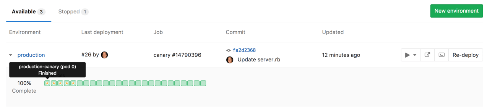
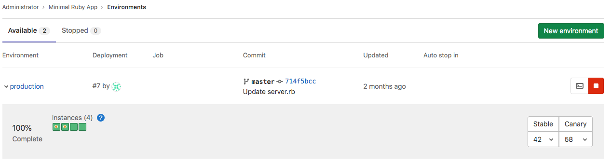



- Tier: 基础版，专业版，旗舰版
- Offering: JihuLab.com，私有化部署



金丝雀部署是一种流行的[持续部署](https://en.wikipedia.org/wiki/Continuous_deployment)策略，其中一小部分服务器会更新到应用程序的新版本。

在采用[持续交付](https://gitlab.cn/blog/continuous-integration-delivery-and-deployment-with-gitlab/)时，组织需要决定使用哪种部署策略。最流行的策略之一就是金丝雀部署，即先让一小部分服务器更新到新版本。这部分服务器（即“金丝雀”）就充当了众所周知的[“煤矿中的金丝雀”](https://en.wiktionary.org/wiki/canary_in_a_coal_mine)角色。

如果应用程序的新版本出现问题，只有一小部分用户会受到影响，并且可以修复或快速回滚更改。

<a id="use-cases"></a>

## 使用场景

当你希望仅将功能发布到部分 Pod 集群，并观察其行为（随着一定比例的用户访问临时部署的功能）时，可以使用金丝雀部署。如果一切正常，你就可以放心地将功能部署到生产环境，因为你知道它不会引起任何问题。

金丝雀部署对于后端重构、性能改进或其他用户界面不变但需要确保性能保持不变或有所提升的更改尤其必要。开发者在使用涉及用户界面更改的金丝雀部署时需要小心，因为默认情况下，来自同一用户的请求会随机分配到金丝雀 Pod 和非金丝雀 Pod，这可能导致用户困惑甚至出错。如有需要，你可以考虑[在 Kubernetes 服务定义中将 `service.spec.sessionAffinity` 设置为 `ClientIP`](https://kubernetes.io/docs/concepts/services-networking/service/#virtual-ips-and-service-proxies)，但这超出了本文档的范围。

<a id="advanced-traffic-control-with-canary-ingress"></a>

## 使用金丝雀 Ingress 进行高级流量控制

通过[金丝雀 Ingress](https://kubernetes.github.io/ingress-nginx/user-guide/nginx-configuration/annotations/#canary)，金丝雀部署可以更具策略性。金丝雀 Ingress 是一种高级流量路由服务，可根据权重、会话、Cookie 等因素控制稳定部署和金丝雀部署之间的传入 HTTP 请求。极狐GitLab 在其[自动部署架构](../../topics/autodevops/upgrading_auto_deploy_dependencies.md#v2-chart-resource-architecture)中使用此服务，让用户能够快速、安全地推出新部署。

<a id="how-to-set-up-a-canary-ingress-in-a-canary-deployment"></a>

### 如何在金丝雀部署中设置金丝雀 Ingress

如果你的 Auto DevOps 流水线使用 [`v2.0.0+` 版本的 `auto-deploy-image`](../../topics/autodevops/upgrading_auto_deploy_dependencies.md#verify-dependency-versions)，则默认会安装金丝雀 Ingress。当你创建新的金丝雀部署时，金丝雀 Ingress 会变为可用，并在金丝雀部署被提升到生产环境时销毁。

以下是从头开始的示例设置流程：

1. 准备一个[启用了 Auto DevOps](../../topics/autodevops/_index.md) 的项目。
1. 在你的项目中设置一个 [Kubernetes 集群](../infrastructure/clusters/_index.md)。
1. 在你的集群中安装 [NGINX Ingress](https://github.com/kubernetes/ingress-nginx/tree/master/charts/ingress-nginx)。
1. 根据上面分配的 Ingress 端点设置[基础域名](clusters/gitlab_managed_clusters.md#base-domain)。
1. 检查你的 Auto DevOps 流水线中[是否使用了 `v2.0.0+` 版本的 `auto-deploy-image`](../../topics/autodevops/upgrading_auto_deploy_dependencies.md#verify-dependency-versions)。如果不是，请按照文档指定镜像版本。
1. [运行一个新的 Auto DevOps 流水线](../../ci/pipelines/_index.md#run-a-pipeline-manually)，并确保 `production` 作业成功并创建了生产环境。
1. 为 Auto DevOps 流水线配置一个 [`canary` 部署作业](../../topics/autodevops/cicd_variables.md#deploy-policy-for-canary-environments)。
1. [运行一个新的 Auto DevOps 流水线](../../ci/pipelines/_index.md#run-a-pipeline-manually)，并确保 `canary` 作业成功并创建了带有金丝雀 Ingress 的金丝雀部署。

<a id="show-canary-ingress-deployments-on-deploy-boards-deprecated"></a>

### 在部署看板上显示金丝雀 Ingress 部署（已弃用）

> [!warning]
> 此功能在极狐GitLab 14.5 中[已弃用](https://jihulab.com/groups/gitlab-org/configure/-/epics/8)。

要查看金丝雀部署，你必须正确配置部署看板：

1. 按照步骤[启用部署看板](deploy_boards.md#enabling-deploy-boards)。
1. 要跟踪金丝雀部署，你必须使用 `track: canary` 标签标记你的 Kubernetes 部署和 Pod。为了快速开始，你可以使用极狐GitLab 提供的用于金丝雀部署的 [Auto Deploy](../../topics/autodevops/stages.md#auto-deploy) 模板。

根据部署情况，标签应为 `stable` 或 `canary`。如果标签为空或缺失，极狐GitLab 会假定跟踪标签为 `stable`。任何其他跟踪标签都被视为 `canary`（临时）。这使极狐GitLab 能够判断部署是稳定的还是临时的（金丝雀）。

配置好部署看板并且流水线至少运行一次后，转到 **流水线** > **环境** 下的环境页面。随着流水线的执行，部署看板会清晰地标记金丝雀 Pod，让你能够快速、清晰地了解每个环境和部署的状态。

金丝雀部署在部署看板中用黄点标记，以便你快速注意到它们。



<a id="how-to-check-the-current-traffic-weight-on-a-canary-ingress-deprecated"></a>

#### 如何检查金丝雀 Ingress 上的当前流量权重（已弃用）

> [!warning]
> 此功能在极狐GitLab 14.5 中[已弃用](https://jihulab.com/groups/gitlab-org/configure/-/epics/8)。

1. 访问[部署看板](deploy_boards.md)。
1. 查看右侧的当前权重。

   

<a id="how-to-change-the-traffic-weight-on-a-canary-ingress-deprecated"></a>

#### 如何更改金丝雀 Ingress 上的流量权重（已弃用）

> [!warning]
> 此功能在极狐GitLab 14.5 中[已弃用](https://jihulab.com/groups/gitlab-org/configure/-/epics/8)。

你可以通过使用 [GraphiQL](../../api/graphql/getting_started.md#graphiql) 或向 [GraphQL API](../../api/graphql/getting_started.md#command-line) 发送请求，在环境的部署看板中更改流量权重。

要使用你的[部署看板](deploy_boards.md)：

1. 转到项目的 **运维** > **环境**。
1. 使用右侧的下拉列表设置新权重。
1. 确认你的选择。

以下是使用 [GraphiQL](../../api/graphql/getting_started.md#graphiql) 的示例：

1. 访问 [GraphiQL 浏览器](https://jihulab.com/-/graphql-explorer)。
1. 执行 `environmentsCanaryIngressUpdate` GraphQL 变更：

   ```shell
   mutation {
     environmentsCanaryIngressUpdate(input:{
       id: "gid://gitlab/Environment/29",              # 你的环境 ID。你可以从环境页面的 URL 中获取 ID。
       weight: 45                                      # 新的流量权重。例如，如果你设置为 `45`，则 45% 的流量会流向金丝雀部署，55% 的流量会流向稳定部署。
     }) {
       errors
     }
   }
   ```

1. 如果请求成功，`errors` 响应会包含一个空数组。极狐GitLab 会向你的 Kubernetes 集群发送一个 `PATCH` 请求，以更新金丝雀 Ingress 上的权重参数。