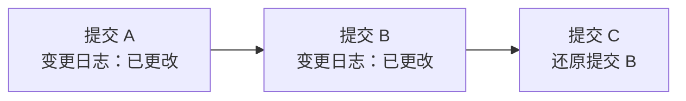
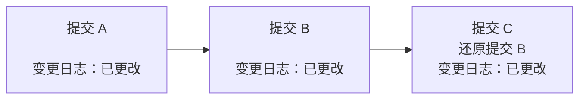



- Tier: 基础版，专业版，旗舰版
- Offering: JihuLab.com，私有化部署



变更日志根据提交标题和 Git 尾部标记生成。要包含在变更日志中，提交必须包含特定的 Git 尾部标记。变更日志从提交标题生成，并按 Git 尾部标记类型分类。您可以使用额外数据丰富变更日志条目，例如合并请求的链接或提交作者的详细信息。变更日志格式[可以自定义](#customize-the-changelog-output)使用模板。

默认变更日志中的每个部分都有一个包含版本号和发布日期的标题，如下所示：

```markdown
## 1.0.0 (2021-01-05)

### 功能 (4 项变更)

- [功能 1](gitlab-org/gitlab@123abc) 由 @alice ([合并请求](gitlab-org/gitlab!123))
- [功能 2](gitlab-org/gitlab@456abc) ([合并请求](gitlab-org/gitlab!456))
- [功能 3](gitlab-org/gitlab@234abc) 由 @steve
- [功能 4](gitlab-org/gitlab@456)
```

部分的日期格式可以自定义，但标题的其余部分不能。添加新部分时，极狐GitLab 会解析这些标题以确定将新信息放置在文件中的位置。极狐GitLab 根据版本而非日期对部分进行排序。

每个部分包含按类别排序的变更（如“功能”），并且这些部分的格式可以更改。部分名称源自用于包含或排除提交的 Git 尾部标记的值。

当在镜像上操作时，可以检索变更日志的提交。极狐GitLab 本身使用此功能，因为补丁版本可以包含来自公共项目和私有安全镜像的变更。

<a id="add-a-trailer-to-a-git-commit"></a>

## 向 Git 提交添加尾部标记

您可以在编写提交信息时手动添加尾部标记。要使用默认尾部标记 `Changelog` 包含提交并将其归类为功能，请将字符串 `Changelog: feature` 添加到您的提交信息中，如下所示：

```plaintext
<提交信息主题>

<提交信息描述>

变更日志：功能
```

如果您的合并请求有多个提交，请将 `Changelog` 条目添加到第一个提交。这可确保在压缩提交时生成正确的条目。

`Changelog` 尾部标记接受以下值：

- `added`：新功能
- `fixed`：错误修复
- `changed`：功能变更
- `deprecated`：新弃用
- `removed`：功能移除
- `security`：安全修复
- `performance`：性能改进
- `other`：其他

<a id="create-a-changelog"></a>

## 创建变更日志

变更日志通过命令行生成，可以使用 API 或极狐GitLab CLI。变更日志输出格式为 Markdown，并且[您可以自定义它](#customize-the-changelog-output)。

<a id="from-the-api"></a>

### 从 API

要使用 API 通过 `curl` 命令生成变更日志，请参阅 API 文档中的[将变更日志数据添加到变更日志文件](../../api/repositories.md#add-changelog-data-to-file)。

<a id="from-the-gitlab-cli"></a>

### 从极狐GitLab CLI



- 在 `glab` 版本 1.30.0 中引入。



先决条件：

- 您已安装并配置[极狐GitLab CLI](../../editor_extensions/gitlab_cli/_index.md)，版本 1.30.0 或更高。
- 您的仓库的标签命名方案符合[预期的标签命名格式](#customize-the-tag-format-when-extracting-versions)。
- 提交包含[变更日志尾部标记](#add-a-trailer-to-a-git-commit)。

要生成变更日志：

1. 使用 `git fetch` 更新仓库的本地副本。
1. 要使用默认选项为当前版本（由 `git describe --tags` 确定）生成变更日志：
   - 运行命令 `glab changelog generate`。
   - 要将输出保存到文件，运行命令 `glab changelog generate > <文件名>.md`。
1. 要使用自定义选项生成变更日志，运行命令 `glab changelog generate` 并附加所需选项。一些选项包括：

   - `--config-file [string]`：项目 Git 仓库中变更日志配置文件的路径。此文件必须存在于项目 Git 仓库中。默认为 `.gitlab/changelog_config.yml`。
   - 提交范围：
     - `--from [string]`：用于生成变更日志的提交范围的起始（作为 SHA）。此提交本身不包含在变更日志中。
     - `--to [string]`：用于生成变更日志的提交范围的结束（作为 SHA）。此提交包含在列表中。默认为默认项目分支的 `HEAD`。
   - `--date [string]`：发布的日期和时间，采用 ISO 8601 (`2016-03-11T03:45:40Z`) 格式。默认为当前时间。
   - `--trailer [string]`：用于包含提交的 Git 尾部标记。默认为 `Changelog`。
   - `--version [string]`：要为其生成变更日志的版本。

要了解有关极狐GitLab CLI 中可用参数的更多信息，请运行 `glab changelog generate --help`。有关定义和用法，请参阅[仓库 API](../../api/repositories.md#add-changelog-data-to-file)。

<a id="customize-the-changelog-output"></a>

## 自定义变更日志输出

要自定义变更日志输出，请编辑变更日志配置文件，并将这些更改提交到项目的 Git 仓库。此配置的默认位置是 `.gitlab/changelog_config.yml`。

出于性能和安全原因，解析变更日志配置的时间限制为 `2` 秒。如果解析配置导致超时错误，请考虑减小配置的大小。该文件支持以下变量：

- `date_format`：日期格式，采用 `strftime` 格式，用于新添加的变更日志数据的标题。
- `template`：生成变更日志数据时使用的自定义模板。
- `include_groups`：群组完整路径列表，其中包含无论项目成员身份如何都应予以致谢的用户。生成变更日志的用户必须有权访问每个群组才能给予致谢。
- `categories`：一个哈希，将原始类别名称映射到变更日志中使用的名称。要更改变更日志中显示的名称，请将这些行添加到您的配置文件并根据需要进行编辑。此示例将类别标题呈现为 `### 功能`、`### 错误修复` 和 `### 性能改进`：

  ```yaml
  ---
  categories:
    feature: 功能
    bug: 错误修复
    performance: 性能改进
  ```

<a id="custom-templates"></a>

### 自定义模板



- 默认模板在极狐GitLab 17.1 中从使用 `commit.reference` 和 `merge_request.reference` 改为使用 `commit.web_url` 和 `merge_request.web_url`。



类别部分使用模板生成。默认模板：

```plaintext


### {{ title }} (1 项变更{{ count }} 项变更)


- [{{ title }}]({{ commit.web_url }})\
 由 {{ author.reference }}\
 ([合并请求]({{ merge_request.web_url }}))





无变更。

```

`` 标签用于语句，`{{ ... }}` 用于打印数据。语句必须使用 `` 标签终止。`if` 和 `each` 语句都需要一个参数。

例如，对于一个名为 `valid` 的变量，当该值为真时，您可以显示“是”，否则通过以下方式显示“否”：

```plaintext

是

否

```

`else` 的使用是可选的。当值为非空值或布尔值 `true` 时，该值被视为真。空数组和哈希被视为假。

循环使用 `each` 完成，循环内的变量作用域仅限于该循环。在循环中引用当前值使用变量标签 `{{ it }}`。其他变量从当前循环值中读取其值。以下面的模板为例：

```plaintext

{{name}}

```

假设 `users` 是一个对象数组，每个对象都有一个 `name` 字段，这将打印每个用户的名称。

使用变量标签，您可以访问嵌套对象。例如，`{{ users.0.name }}` 打印 `users` 变量中第一个用户的名称。

如果一行以反斜杠结尾，则忽略下一个换行符。这允许您将代码换行到多行，而不会在 Markdown 输出中引入不必要的换行符。

使用 `` 的标签（称为表达式标签）会消耗直接跟随它们的换行符（如果有）。这意味着：

```plaintext
---

bar

---
```

编译为：

```plaintext
---
bar
---
```

而不是：

```plaintext
---

bar

---
```

您可以在配置中指定自定义模板，如下所示：

```yaml
---
template: |
  
  
  ### {{ title }}

  
  - [{{ title }}]({{ commit.web_url }})\
   由 {{ author.reference }}

  

  
  
  无变更。
  
```

指定模板时，应使用 `template: |` 而不是 `template: >`，因为后者不会保留模板中的换行符。

<a id="template-data"></a>

### 模板数据



- `commit.web_url` 和 `merge_request.web_url` 在极狐GitLab 17.1 中引入。



在顶层，以下变量可用：

- `categories`：一个对象数组，每个变更日志类别一个。

在类别中，以下变量可用：

- `count`：此类别中的条目数。
- `entries`：属于此类别的条目。
- `single_change`：一个布尔值，指示是否只有一个变更（`true`），还是多个变更（`false`）。
- `title`：类别的标题（重新映射后）。

在条目中，以下变量可用（这里 `foo.bar` 表示 `bar` 是 `foo` 的子字段）：

- `author.contributor`：一个布尔值，当作者不是项目成员时设置为 `true`，否则为 `false`。
- `author.credit`：一个布尔值，当 `author.contributor` 为 `true` 或配置了 `include_groups` 且作者是其中一个群组的成员时设置为 `true`。
- `author.reference`：对提交作者的引用（例如，`@alice`）。
- `commit.reference`：对提交的引用，例如 `gitlab-org/gitlab@0a4cdd86ab31748ba6dac0f69a8653f206e5cfc7`。
- `commit.web_url`：提交的 URL，例如 `https://gitlab.com/gitlab-org/gitlab/-/commit/0a4cdd86ab31748ba6dac0f69a8653f206e5cfc7`。
- `commit.trailers`：一个对象，包含提交正文中存在的所有 Git 尾部标记。

  可以使用 `commit.trailers.<name>` 引用这些尾部标记。例如，假设有以下提交：

  ```plaintext
  添加一些令人印象深刻的新功能

  Changelog: added
  Issue: https://gitlab.com/gitlab-org/gitlab/-/issues/1234
  Status: important
  ```

  可以在模板中按如下方式访问 `Changelog`、`Issue` 和 `Status` 尾部标记：

  ```yaml
  
   ([链接到议题]({{ commit.trailers.Issue }}))
  状态：{{ commit.trailers.Status }}
  
  ```

- `merge_request.reference`：对首次引入变更的合并请求的引用（例如，`gitlab-org/gitlab!50063`）。
- `merge_request.web_url`：首次引入变更的合并请求的 URL（例如，`https://gitlab.com/gitlab-org/gitlab/-/merge_requests/50063`）。
- `title`：变更日志条目的标题（即提交标题）。

如果无法确定数据，`author` 和 `merge_request` 对象可能不存在。例如，当创建提交时没有相应的合并请求，则不显示合并请求。

<a id="customize-the-tag-format-when-extracting-versions"></a>

### 自定义提取版本时的标签格式

极狐GitLab 使用正则表达式（使用 [re2](https://github.com/google/re2/) 引擎和语法）从标签名称中提取语义版本。默认正则表达式为：

```plaintext
^v?(?P<major>0|[1-9]\d*)\.(?P<minor>0|[1-9]\d*)\.(?P<patch>0|[1-9]\d*)(?:-(?P<pre>(?:0|[1-9]\d*|\d*[a-zA-Z-][0-9a-zA-Z-]*)(?:\.(?:0|[1-9]\d*|\d*[a-zA-Z-][0-9a-zA-Z-]*))*))?(?:\+(?P<meta>[0-9a-zA-Z-]+(?:\.[0-9a-zA-Z-]+)*))?$
```

此正则表达式基于官方的[语义版本控制](https://semver.org/)正则表达式，并且还支持以字母 `v` 开头的标签名称。

如果您的项目使用不同的标签格式，您可以指定不同的正则表达式。使用的正则表达式必须产生以下捕获组。如果缺少任何这些捕获组，则忽略该标签：

- `major`
- `minor`
- `patch`

以下捕获组是可选的：

- `pre`：如果设置，则忽略该标签。忽略 `pre` 标签可确保在确定要为其生成变更日志的提交范围时，不考虑候选发布标签和其他预发布标签。
- `meta`：可选。指定构建元数据。

利用这些信息，极狐GitLab 构建 Git 标签及其发布版本的映射。然后根据从每个标签提取的版本确定最新标签。

要指定自定义正则表达式，请在变更日志配置 YAML 文件中使用 `tag_regex` 设置。例如，此模式匹配诸如 `version-1.2.3` 的标签名称，但不匹配 `version-1.2`。

```yaml
---
tag_regex: '^version-(?P<major>\d+)\.(?P<minor>\d+)\.(?P<patch>\d+)$'
```

要测试您的正则表达式是否有效，您可以使用诸如 [regex101](https://regex101.com/) 的网站。如果正则表达式语法无效，则在生成变更日志时会产生错误。

<a id="reverted-commit-handling"></a>

## 还原提交处理

要被视作还原提交，提交信息必须包含字符串 `This reverts commit <SHA>`，其中 `SHA` 是要还原的提交的 SHA。

在为某个范围生成变更日志时，极狐GitLab 会忽略在该范围内既添加又还原的提交。在此示例中，提交 C 还原了提交 B。由于提交 C 没有其他尾部标记，因此只有提交 A 被添加到变更日志中：



但是，如果还原提交（提交 C）也包含变更日志尾部标记，则提交 A 和 C 都包含在变更日志中：



提交 B 被跳过。