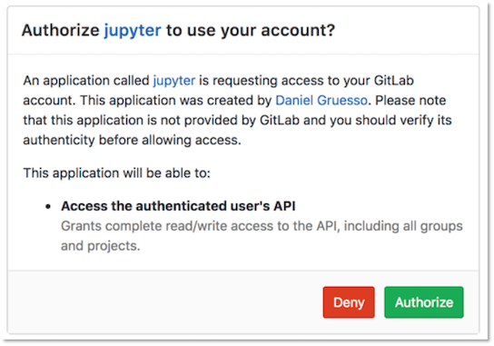
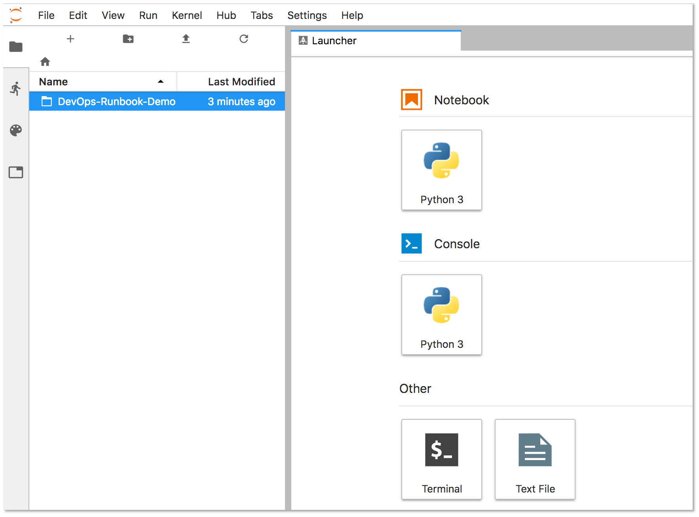
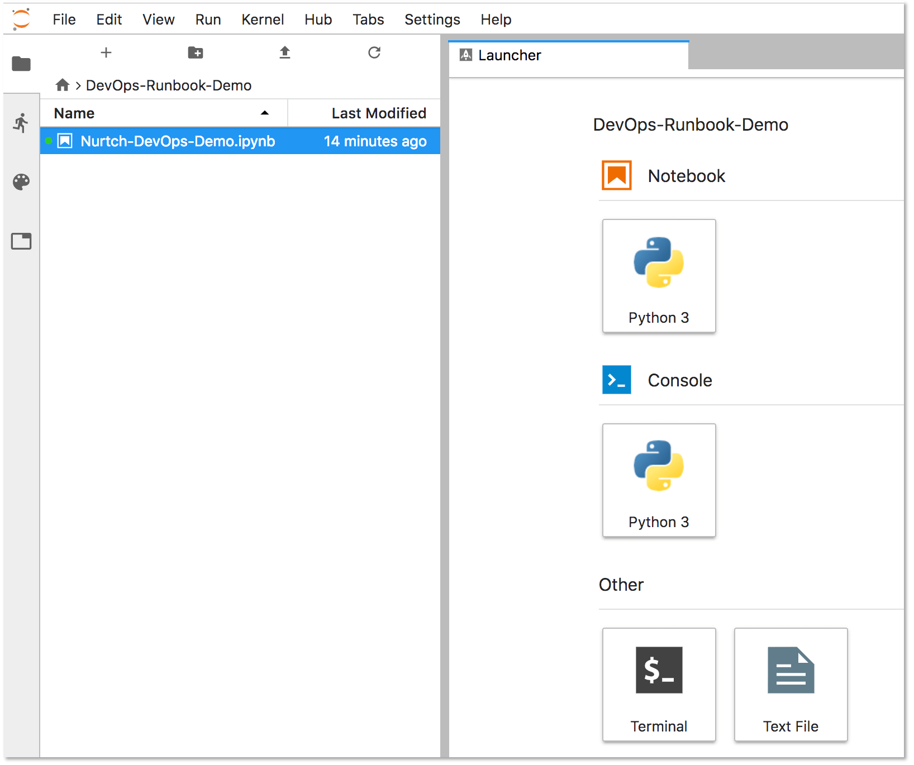
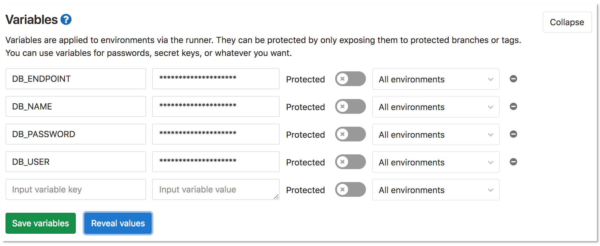
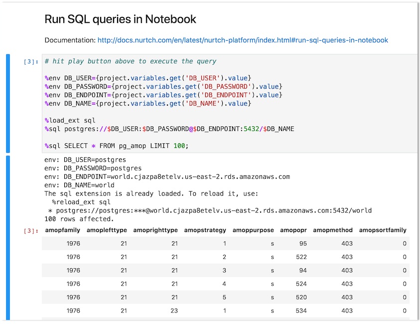



- Tier: 基础版，专业版，旗舰版
- Offering: JihuLab.com，私有化部署



Runbooks 是一系列文档化流程的集合，用于说明如何执行特定流程，无论是启动、停止、调试还是排查特定系统的问题。

借助 [Jupyter Notebooks](https://jupyter.org/) 和 [Rubix 库](https://github.com/Nurtch/rubix)，用户可以开始编写自己的可执行 Runbooks。

从历史上看，Runbooks 采用决策树或详细的分步指南形式，具体取决于条件或系统。

现代实现引入了“可执行 Runbook”的概念，在这种 Runbook 中，除了定义明确的流程外，操作员还可以针对特定环境执行预先编写的代码块或数据库查询。

<a id="executable-runbooks"></a>

## 可执行 Runbooks

极狐GitLab Kubernetes 集成提供的 JupyterHub 应用现在内置了 Nurtch Rubix 库，为创建 DevOps Runbooks 提供了一种简单的方法。其中提供了一个示例 Runbook，展示了常见操作。虽然 Rubix 简化了创建常见 Kubernetes 和 AWS 工作流的过程，但您也可以在不使用 Rubix 的情况下手动创建它们。

<a id="requirements"></a>

## 要求

要创建可执行 Runbook，您需要：

- **Kubernetes** - 需要一个 Kubernetes 集群来部署其余应用程序。最简单的入门方法是使用 [极狐GitLab agent for Kubernetes](../../../clusters/agent/_index.md) 连接集群。
- **Ingress** - Ingress 可以提供负载均衡、SSL 终止和基于名称的虚拟主机。它充当您的应用程序的 Web 代理。
- **JupyterHub** - [JupyterHub](https://jupyterhub.readthedocs.io/en/stable/) 是一项多用户服务，用于在团队中管理 Notebooks。Jupyter Notebooks 提供了一个基于 Web 的交互式编程环境，用于数据分析、可视化和机器学习。

<a id="nurtch"></a>

## Nurtch

Nurtch 是 [Rubix 库](https://github.com/Nurtch/rubix) 背后的公司。Rubix 是一个开源 Python 库，可以轻松地在 Jupyter Notebooks 中执行常见的 DevOps 任务。诸如绘制 Cloudwatch 指标和滚动更新您的 ECS/Kubernetes 应用等任务，现在只需几行代码即可完成。有关更多信息，请参阅 [Nurtch 文档](https://docs.nurtch.com/en/latest/)。

<a id="configure-an-executable-runbook-with-gitlab"></a>

## 使用极狐GitLab 配置可执行 Runbook

按照此分步指南，使用前面概述的组件和预加载的演示 Runbook，在极狐GitLab 中配置可执行 Runbook。

1. 创建 [JupyterHub 的 OAuth 应用程序](../../../../integration/oauth_provider.md)。
1. 使用 [Helm 安装 JupyterHub](https://zero-to-jupyterhub.readthedocs.io/en/latest/jupyterhub/installation.html) 时，请使用以下值：

   ```yaml
   #-----------------------------------------------------------------------------
   # The hub.config.GitLabOAuthenticator section must be customized!
   #-----------------------------------------------------------------------------

   hub:
     config:
       GitLabOAuthenticator:
         # Limit access to members of specific projects or groups or to specific users:
         # allowedGitlabGroups: [ "my-group-1", "my-group-2" ]
         # allowedProjectIds: [ 12345, 6789 ]
         # allowed_users: ["user-1", "user-2"]
         client_id: <Your OAuth Application ID>
         client_secret: <Your OAuth Application ID>
         enable_auth_state: true
         gitlab_url: https://gitlab.example.com
         oauth_callback_url: http://<Jupyter Hostname>/hub/oauth_callback
         scope:
           - read_user
           - read_api
           - openid
           - profile
           - email
       JupyterHub:
         authenticator_class: gitlab
      extraConfig:
        gitlab-config: |
           c.KubeSpawner.cmd = ['jupyter-labhub']
           c.GitLabOAuthenticator.scope = ['api read_repository write_repository']

           async def add_auth_env(spawner):
              '''
              Set user's id, login and access token on single user image to
              enable repository integration for JupyterHub.
              See: https://gitlab.com/gitlab-org/gitlab-foss/-/issues/47138#note_154294790
              '''
              auth_state = await spawner.user.get_auth_state()

              if not auth_state:
                 spawner.log.warning("No auth state for %s", spawner.user)
                 return

              spawner.environment['GITLAB_ACCESS_TOKEN'] = auth_state['access_token']
              spawner.environment['GITLAB_USER_EMAIL'] = auth_state['gitlab_user']['email']
              spawner.environment['GITLAB_USER_ID'] = str(auth_state['gitlab_user']['id'])
              spawner.environment['GITLAB_USER_LOGIN'] = auth_state['gitlab_user']['username']
              spawner.environment['GITLAB_USER_NAME'] = auth_state['gitlab_user']['name']

           c.KubeSpawner.pre_spawn_hook = add_auth_env

   singleuser:
      defaultUrl: "/lab"
      image:
         name: registry.gitlab.com/gitlab-org/jupyterhub-user-image
         tag: latest
      lifecycleHooks:
         postStart:
            exec:
            command:
               - "sh"
               - "-c"
               - >
                  git clone https://gitlab.com/gitlab-org/nurtch-demo.git DevOps-Runbook-Demo || true;
                  echo "https://oauth2:${GITLAB_ACCESS_TOKEN}@${GITLAB_HOST}" > ~/.git-credentials;
                  git config --global credential.helper store;
                  git config --global user.email "${GITLAB_USER_EMAIL}";
                  git config --global user.name "${GITLAB_USER_NAME}";
                  jupyter serverextension enable --py jupyterlab_git

   proxy:
      service:
         type: ClusterIP
   ```

1. JupyterHub 成功安装后，在浏览器中打开 **Jupyter 主机名**。选择 **使用极狐GitLab 登录** 按钮登录 JupyterHub 并启动服务器。极狐GitLab 实例的任何用户都可以通过 OAuth2 进行身份验证。此按钮会将您重定向到极狐GitLab 上的一个页面，请求授权 JupyterHub 使用您的极狐GitLab 账户。

   

1. 选择 **授权**，极狐GitLab 会将您重定向到 JupyterHub 应用程序。
1. 选择 **启动我的服务器** 以在几秒钟内启动服务器。
1. 要配置 Runbook 对您的极狐GitLab 项目的访问权限，您必须在演示 Runbook 的 **设置** 部分输入您的 [极狐GitLab 访问令牌](../../../profile/personal_access_tokens.md) 和项目 ID：

   1. 选择左侧面板上的 **DevOps-Runbook-Demo** 文件夹。

      

   1. 选择 `Nurtch-DevOps-Demo.ipynb` Runbook。

      

      Jupyter 会在屏幕右侧显示 Runbook 的内容。**设置** 部分会显示您的 `PRIVATE_TOKEN` 和 `PROJECT_ID`。输入这些值，并保持单引号如下：

      ```sql
      PRIVATE_TOKEN = '<your_access_token>'
      PROJECT_ID = '1234567'
      ```

   1. 更新此部分最后一行的 `VARIABLE_NAME`，使其与您用于访问令牌的变量名称匹配。在此示例中，变量名为 `PRIVATE_TOKEN`。

      ```sql
      VARIABLE_VALUE = project.variables.get('PRIVATE_TOKEN').value
      ```

1. 要配置 Runbook 的操作，请创建并配置变量。此示例使用示例 Runbook 中的 **在 Notebook 中运行 SQL 查询** 部分来查询 PostgreSQL 数据库。以下代码块的前四行定义了此查询正常运行所需的变量：

   ```sql
   %env DB_USER={project.variables.get('DB_USER').value}
   %env DB_PASSWORD={project.variables.get('DB_PASSWORD').value}
   %env DB_ENDPOINT={project.variables.get('DB_ENDPOINT').value}
   %env DB_NAME={project.variables.get('DB_NAME').value}
   ```

   1. 转到 **设置** > **CI/CD** > **变量** 以在您的项目中创建变量。

      

   1. 选择 **保存变量**。

   1. 在 Jupyter 中，选择 **在 Notebook 中运行 SQL 查询** 标题，然后选择 **运行**。结果将内联显示如下：

      

您可以尝试其他操作，例如运行 shell 脚本或与 Kubernetes 集群交互。有关更多信息，请访问 [Nurtch 文档](https://docs.nurtch.com/en/latest/)。
