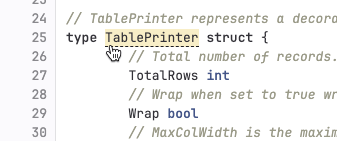
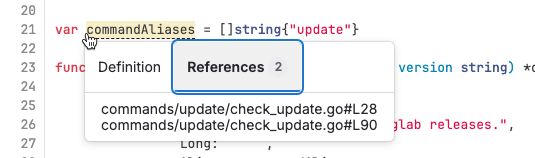



- Tier: 基础版，专业版，旗舰版
- Offering: JihuLab.com，私有化部署



代码智能为您提供交互式开发环境 (IDE) 中常见的代码导航功能，包括：

- 类型签名和符号文档。
- 跳转到定义。

代码智能已内置于极狐GitLab，并由 [LSIF](https://lsif.dev/)（语言服务器索引格式）提供支持，这是一种用于预计算代码智能数据的文件格式。极狐GitLab 为每个项目处理一个 LSIF 文件，并且代码智能不支持每个分支使用不同的 LSIF 文件。

[SCIP](https://github.com/sourcegraph/scip/) 是源代码索引工具的下一个演进。您可以使用它来支持代码导航功能，例如：

- 跳转到定义
- 查找引用

极狐GitLab 不支持 SCIP 的原生代码智能功能。但是，您可以使用 [SCIP CLI](https://github.com/sourcegraph/scip/blob/main/docs/CLI.md) 将 SCIP 工具生成的索引转换为与 LSIF 兼容的文件。有关原生 SCIP 支持的讨论，请参见 [议题 412981](https://jihulab.com/gitlab-cn/gitlab/-/issues/412981)。

对于即将推出的代码智能增强功能的进展，请参见 [史诗 4212](https://jihulab.com/groups/gitlab-cn/-/epics/4212)。

<a id="configure-code-intelligence"></a>

## 配置代码智能

前提条件：

- 您已确认项目语言有兼容的索引器：
  - [LSIF 索引器](https://lsif.dev/#implementations-server)
  - [SCIP 索引器](https://github.com/sourcegraph/scip/#tools-using-scip)

要了解如何最佳支持您的语言，请参考 [Sourcegraph 推荐的索引器](https://sourcegraph.com/docs/code-search/code-navigation/writing_an_indexer#sourcegraph-recommended-indexers)。

<a id="with-the-cicd-component"></a>

### 使用 CI/CD 组件



- Python 支持在极狐GitLab 17.9 中引入。
- .Net/C# 支持在极狐GitLab 18.0 中引入。



极狐GitLab 提供了一个 [CI/CD 组件](../../ci/components/_index.md)，用于在您的 `.gitlab-ci.yml` 文件中配置代码智能。该组件支持以下语言：

- Go 版本 1.21 及更高版本。
- TypeScript 或 JavaScript。
- Java 8、11、17 和 21。
- Python
- .Net/C#

如需为该组件贡献更多语言支持，请在 [代码智能组件项目](https://gitlab.com/components/code-intelligence) 中发起合并请求。

1. 将极狐GitLab CI/CD 组件添加到项目的 `.gitlab-ci.yml` 文件中。例如，以下任务为 Go 生成 LSIF 产物：

   ```yaml
   include:
     - component: ${CI_SERVER_FQDN}/components/code-intelligence/golang-code-intel@v0.0.3
       inputs:
         golang_version: ${GO_VERSION}
   ```

1. 有关 [代码智能组件](https://gitlab.com/components/code-intelligence) 的配置说明，请查阅每种支持语言的 `README`。
1. 更多信息，请参见 [使用组件](../../ci/components/_index.md#use-a-component)。

<a id="add-cicd-jobs-for-code-intelligence"></a>

### 添加 CI/CD 任务以启用代码智能

要为项目启用代码智能，请将极狐GitLab CI/CD 任务添加到项目的 `.gitlab-ci.yml` 文件中。





1. 在您的 `.gitlab-ci.yml` 配置中添加一个任务。该任务生成 SCIP 索引，并将其转换为 LSIF 格式以便在极狐GitLab 中使用：

   ```yaml
   "code_navigation":
      rules:
      - if: $CI_COMMIT_REF_NAME == $CI_DEFAULT_BRANCH # the job only needs to run against the default branch
      image: node:latest
      stage: test
      allow_failure: true # recommended
      script:
         - npm install -g @sourcegraph/scip-typescript
         - npm install
         - scip-typescript index
         - |
            env \
            TAG="v0.4.0" \
            OS="$(uname -s | tr '[:upper:]' '[:lower:]')" \
            ARCH="$(uname -m | sed -e 's/x86_64/amd64/')" \
            bash -c 'curl --location "https://github.com/sourcegraph/scip/releases/download/$TAG/scip-$OS-$ARCH.tar.gz"' \
            | tar xzf - scip
         - chmod +x scip
         - ./scip convert --from index.scip --to dump.lsif
      artifacts:
         reports:
            lsif: dump.lsif
   ```

1. 根据您的 CI/CD 配置，您可能需要手动运行该任务，或者等待其作为现有流水线的一部分运行。





1. 在您的 `.gitlab-ci.yml` 配置中添加一个任务（`code_navigation`）以生成索引：

   ```yaml
   code_navigation:
      rules:
      - if: $CI_COMMIT_REF_NAME == $CI_DEFAULT_BRANCH # the job only needs to run against the default branch
     image: sourcegraph/lsif-go:v1
     allow_failure: true # recommended
     script:
       - lsif-go
     artifacts:
       reports:
         lsif: dump.lsif
   ```

1. 根据您的 CI/CD 配置，您可能需要手动运行该任务，或者等待其作为现有流水线的一部分运行。





> [!note]
> 极狐GitLab 通过 [(`ci_max_artifact_size_lsif`)](../../administration/instance_limits.md#maximum-file-size-per-type-of-artifact) 产物应用限制，将代码生成任务产生的产物大小限制为 200 MB。在私有化部署的极狐GitLab 实例上，实例管理员可以更改此值。

<a id="view-code-intelligence-results"></a>

## 查看代码智能结果

任务成功后，浏览仓库即可查看代码智能信息：

1. 在顶部栏中，选择 **搜索或跳转到** 并找到您的项目。
1. 在左侧边栏中，选择 **代码** > **代码仓**。
1. 转到仓库中的文件。如果您知道文件名，可以：
   - 输入 `/~` 键盘快捷键打开文件查找器，然后输入文件名。
   - 在右上角，选择 **查找文件**。
1. 指向代码行。该行中具有代码智能信息的条目下方会显示虚线：

   

1. 选择该条目以了解更多信息。

<a id="find-references"></a>

## 查找引用

使用代码智能查看对象的所有使用位置：

1. 在顶部栏中，选择 **搜索或跳转到** 并找到您的项目。
1. 在左侧边栏中，选择 **代码** > **代码仓**。
1. 转到仓库中的文件。如果您知道文件名，可以：
   - 输入 `/~` 键盘快捷键打开文件查找器，然后输入文件名。
   - 在右上角，选择 **查找文件**。
1. 指向对象，然后选择它。
1. 在对话框中，选择：
   - **定义** 以查看此对象的定义。
   - **引用** 以查看使用此对象的文件列表。

   