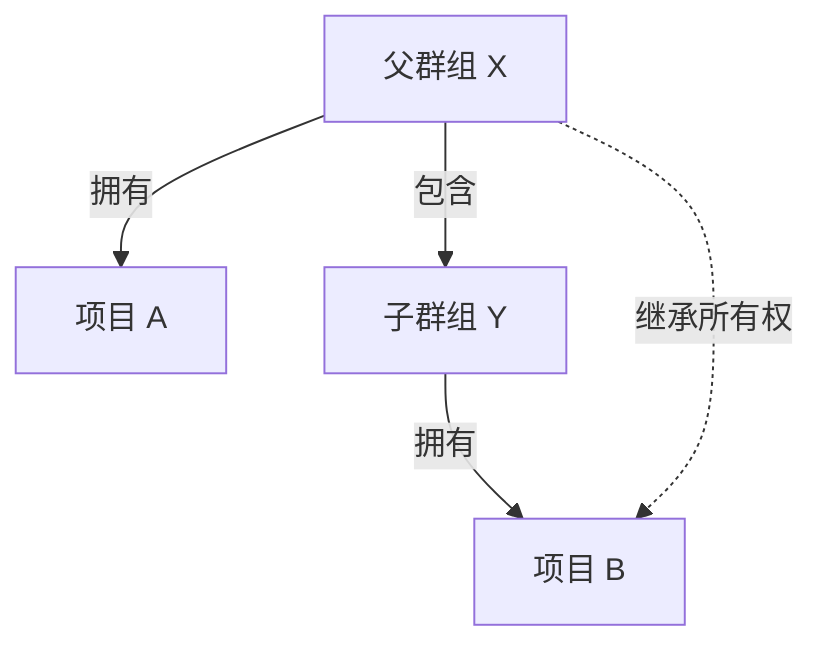



- Tier: 专业版，旗舰版
- Offering: JihuLab.com，私有化部署



`CODEOWNERS` 文件帮助您定义谁对特定文件和目录负责。
您可以使用模式匹配、节和继承规则为合并请求分配审查者，并在合并之前要求他们的批准。

<a id="pattern-matching"></a>

## 模式匹配

极狐GitLab 使用 `File::fnmatch`，并设置了 `File::FNM_DOTMATCH` 和 `File::FNM_PATHNAME` 标志进行模式匹配：

- 仓库结构被视为一个孤立的文件系统。
- 模式遵循 shell 文件名通配规则的一个子集，而不是正则表达式。
- `File::FNM_DOTMATCH` 标志允许 `*` 匹配像 `.gitignore` 这样的点文件。
- `File::FNM_PATHNAME` 标志防止 `*` 匹配 `/` 路径分隔符。
- `**` 递归匹配目录。例如，`**/*.rb` 匹配 `config/database.rb` 和 `app/controllers/users/stars_controller.rb`。

<a id="default-code-owners-and-optional-sections"></a>

## 默认代码所有者和可选节

要将默认所有者的语法与[可选节](reference.md#optional-sections)和所需批准相结合，请将默认所有者放在末尾：

```plaintext
[Documentation][2] @docs-team
docs/
README.md

^[Database] @database-team
model/db/
config/db/database-setup.md @docs-team
```

<a id="regular-entries-and-sections"></a>

## 常规条目和节

如果您为节外的路径设置了默认代码所有者，他们的批准总是必需的。
此类条目不会被节覆盖。
没有节的条目被视为另一个未命名的节：

```plaintext
# 所有文件都需要
* @general-approvers

[Documentation] @docs-team
docs/
README.md
*.txt

[Database] @database-team
model/db/
config/db/database-setup.md @docs-team
```

在这个例子中：

- `@general-approvers` 拥有所有地方的条目，没有覆盖。
- `@docs-team` 拥有 `Documentation` 节中的所有条目。
- `@database-team` 拥有 `Database` 节中的所有条目，除了 `config/db/database-setup.md`，后者有一个覆盖将其分配给 `@docs-team`。
- 修改 `model/db/CHANGELOG.txt` 的合并请求将需要三个批准：分别来自 `@general-approvers`、`@docs-team` 和 `@database-team` 群组。

将此行为与您仅使用[节的默认所有者](reference.md#set-default-code-owner-for-a-section)时进行比较，那时节中的特定条目会覆盖节默认所有者。

<a id="sections-with-duplicate-names"></a>

## 名称重复的节

如果多个节具有相同的名称，它们将被合并。
此外，节标题不区分大小写。例如：

```plaintext
[Documentation]
ee/docs/    @docs
docs/       @docs

[Database]
README.md  @database
model/db/   @database

[DOCUMENTATION]
README.md  @docs
```

这段代码导致在 `Documentation` 节标题下有三个条目，在 `Database` 下有两个条目。在 `Documentation` 和 `DOCUMENTATION` 节下定义的条目被合并，使用第一个节的大小写。

<a id="define-code-owners-for-specific-files-or-directories"></a>

## 为特定文件或目录定义代码所有者

当文件或目录匹配 `CODEOWNERS` 文件中的多个条目时，使用最后一个匹配文件或目录的模式中的用户。这使您能够以合理的方式排序条目，从而为更具体定义的文件或目录定义更具体的所有者。

例如，在以下 `CODEOWNERS` 文件中：

```plaintext
# 该行将匹配文件 terms.md
*.md @doc-team

# 该行也将匹配文件 terms.md
terms.md @legal-team
```

`terms.md` 的代码所有者将是 `@legal-team`。

<a id="require-multiple-approvals-from-code-owners"></a>

## 要求代码所有者多重批准

您可以在合并请求的批准区域中为代码所有者节要求多重批准。
将节名称追加括号中的数字 `n`，例如 `[2]` 或 `[3]`。
这需要该节中代码所有者的 `n` 个批准。
`n` 的有效条项是 `≥ 1` 的整数。`[1]` 是可选的，因为它是默认值。无效的 `n` 值被视为 `1`。

> [!warning]
> 议题 384881 建议对此设置的行为进行更改。请勿故意设置无效值。它们可能在未来变得有效并导致意外行为。

要从代码所有者要求多重批准：

1. 在顶部栏中，选择 **搜索或跳转到** 并找到您的项目。
1. 在左侧边栏中，选择 **设置** > **代码仓**。
1. 展开 **分支规则**。
1. 在默认分支旁边，选择 **查看详情**。
1. 打开 **代码所有者批准** 下的切换开关。
1. 编辑 `CODEOWNERS` 文件以添加多重批准规则。

例如，要为 `[Documentation]` 节要求两个批准：

```plaintext
[Documentation][2]
*.md @tech-writer-team

[Ruby]
*.rb @dev-team
```

在批准区域中，`Documentation` 代码所有者节显示需要两个批准：


<a id="group-inheritance-and-eligibility"></a>

## 群组继承和资格



在这个例子中：

- 父群组 X（`group-x`）拥有项目 A。
- 父群组 X 还包含一个子群组，子群组 Y（`group-x/subgroup-y`）。
- 子群组 Y 拥有项目 B。

合格的代码所有者是：

- 项目 A：仅群组 X 的成员，因为项目 A 不属于子群组 Y。
- 项目 B：群组 X 和子群组 Y 的成员。

<a id="groups-shared-with-parent-groups"></a>

### 与父群组共享的群组



- 在极狐GitLab 18.5 [启用了一个功能标志](../../../administration/feature_flags/_index.md) 命名为 `check_inherited_groups_for_codeowners`。默认禁用。
- 在极狐GitLab 18.6 在 JihuLab.com、私有化部署上启用。
- 在极狐GitLab 18.8 GA。功能标志 `check_inherited_groups_for_codeowners` 已移除。



要使不属于他们的项目的群组成员有资格成为代码所有者，您可以[邀请群组](../members/sharing_projects_groups.md#invite-a-group-to-a-group)到项目的父群组。当您邀请一个群组时，其直接成员将有资格成为父群组层级中所有项目的代码所有者。

先决条件：

- 您必须对您要邀请其他群组的群组具有所有者角色。
- 邀请群组时，您必须分配开发者、维护者或所有者角色。

例如，在以下层级中：

```plaintext
group-x
├── engineering-group
└── product-group
    └── project-a
```

如果您邀请 `engineering-group` 到 `product-group`，`engineering-group` 的成员将有资格成为 `project-a` 的代码所有者。
您无需直接邀请 `engineering-group` 到 `project-a`。

只有被邀请群组的直接成员才有资格成为代码所有者。
继承成员资格到被邀请群组的成员则没有资格。

<a id="error-handling"></a>

## 错误处理



- 错误验证在极狐GitLab 16.3 引入。



<a id="entries-with-spaces"></a>

### 带空格的条目

使用反斜杠转义路径中的空格：

```plaintext
path\ with\ spaces/*.md @owner
```

如果不转义，极狐GitLab 将 `folder with spaces/*.md @group` 解析为：`path: "folder", owners: " with spaces/*.md @group"`。

<a id="unparsable-sections"></a>

### 无法解析的节

如果节标题无法解析，该节会：

1. 被解析为一个条目。
1. 添加到前一个节。
1. 如果没有前一个节，该节添加到默认节。

<a id="after-the-default-section"></a>

#### 在默认节之后

```plaintext
* @group

[Section name
docs/ @docs_group
```

极狐GitLab 将标题 `[Section name` 识别为一个条目。默认节包含 3 条规则：

- 默认节
  - `*` 由 `@group` 拥有
  - `[Section` 由 `name` 拥有
  - `docs/` 由 `@docs_group` 拥有

<a id="after-a-named-section"></a>

#### 在已命名节之后

```plaintext
[Docs]
docs/**/* @group

[Section name
docs/ @docs_group
```

极狐GitLab 将标题 `[Section name` 识别为一个条目。`[Docs]` 节包含 3 条规则：

- `docs/**/*` 由 `@group` 拥有
- `[Section` 由 `name` 拥有
- `docs/` 由 `@docs_group` 拥有

<a id="malformed-owners"></a>

### 格式错误的所有者

每个条目必须包含一个或多个所有者。格式错误的所有者无效并被忽略：

```plaintext
/path/* @group user_without_at_symbol @user_with_at_symbol
```

该条目由 `@group` 和 `@user_with_at_symbol` 拥有。

<a id="inaccessible-or-incorrect-owners"></a>

### 无法访问或不正确的所有者

极狐GitLab 忽略无法访问或不正确的所有者。例如：

```plaintext
* @group @grou @username @i_left @i_dont_exist example@gitlab.com invalid@gitlab.com
```

如果只有 `@group`、`@username` 和 `example@gitlab.com` 是可访问的，极狐GitLab 将忽略其他的。

<a id="zero-owners"></a>

### 零所有者

如果一个条目不包含所有者，或者存在零个[可访问的所有者](#inaccessible-or-incorrect-owners)，则该条目无效。由于此规则永远无法满足，极狐GitLab 在合并请求中自动批准它。

> [!note]
> 当受保护分支启用了 `Require code owner approval` 时，具有零所有者的规则仍然会被遵守。

<a id="minimum-approvals"></a>

### 最小批准数

当[定义节的批准数](advanced.md#require-multiple-approvals-from-code-owners)时，最小批准数为 `1`。将批准数设置为 `0` 会导致极狐GitLab 要求一个批准。