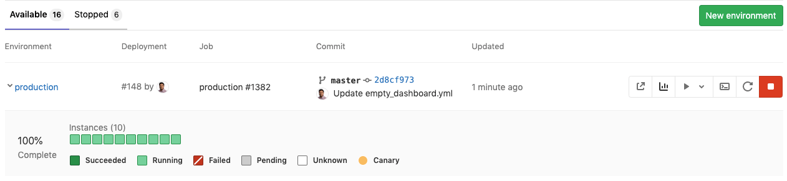



- Tier: 基础版，专业版，旗舰版
- Offering: JihuLab.com，私有化部署





- 在极狐GitLab 15.0 中[在私有化部署实例上禁用](https://gitlab.com/gitlab-org/gitlab/-/issues/353410)。



> [!flag]
> 在私有化部署的极狐GitLab 上，此功能默认不可用。要使其可用，管理员可以[启用功能标志](../../administration/feature_flags/_index.md)，名称为 `certificate_based_clusters`。

极狐GitLab 部署看板提供了一个统一视图，用于查看在 [Kubernetes](https://kubernetes.io) 上运行的每个 CI [环境](../../ci/environments/_index.md) 的当前健康状况和状态，并显示部署中 Pod 的状态。开发者和其他团队成员可以在他们惯用的工作流程中，逐个 Pod 地查看部署的进度和状态，无需任何对 Kubernetes 的访问权限。

> [!warning]
> 此功能在极狐GitLab 14.5 中[被弃用](https://gitlab.com/groups/gitlab-org/configure/-/epics/8)。
> [有一个史诗](https://gitlab.com/groups/gitlab-org/-/epics/2493)旨在将此功能添加到 [Agent](../clusters/agent/_index.md) 中。

如果你有 Kubernetes 集群，可以使用 [Auto DevOps](../../topics/autodevops/_index.md) 将应用程序自动部署到生产环境。

通过部署看板，你可以更深入地了解部署情况，它具有以下好处：

- 从部署开始就进行跟踪，而不仅仅是在部署完成时
- 跨多台服务器查看构建的部署过程
- 更精细的状态详情（成功、运行中、失败、待定、未知）
- 查看[金丝雀部署](canary_deployments.md)

以下是生产环境部署看板的示例。



方块代表 Kubernetes 集群中与给定环境关联的 Pod。将鼠标悬停在每个方块上，你可以看到部署的滚动状态。百分比是已更新到最新版本的 Pod 的百分比。

部署看板与 Kubernetes 紧密耦合，因此你应该熟悉：

- [Kubernetes Pods](https://kubernetes.io/docs/concepts/workloads/pods/)
- [Kubernetes 标签](https://kubernetes.io/docs/concepts/overview/working-with-objects/labels/)
- [Kubernetes 命名空间](https://kubernetes.io/docs/concepts/overview/working-with-objects/namespaces/)
- [Kubernetes 金丝雀部署](https://kubernetes.io/docs/concepts/workloads/management/#canary-deployments)

## 使用场景

部署看板是特定环境的 Kubernetes Pod 的可视化表示，因此有很多使用场景。仅举几例：

- 你想将预发布环境 (staging) 中正在运行的内容提升到生产环境 (production)。因此，你转到环境列表，验证在预发布环境中运行的正是你所预期的，然后选择[手动任务](../../ci/jobs/job_control.md#create-a-job-that-must-be-run-manually)部署到生产环境。
- 你触发了一个部署，并且你有很多容器要升级，所以你知道这需要一段时间（你还限制了部署，一次只下线 X 个容器）。但是你需要告诉某人何时部署完成，因此你转到环境列表，查看生产环境，以实时了解每个 Pod 的部署进度。
- 你收到一个报告，说生产环境出了些怪事，所以你看一下生产环境，看看正在运行什么，以及是否有正在进行、卡住或失败的部署。
- 你有一个看起来不错的 MR，但你想先在预发布环境 (staging) 运行它，因为预发布环境的某些设置更接近生产环境。因此，你转到环境列表，找到你感兴趣的[审查应用](../../ci/review_apps/_index.md)，然后选择手动操作将其部署到预发布环境。

## 启用部署看板

要显示特定[环境](../../ci/environments/_index.md)的部署看板，你应该：

1. [定义一个环境](../../ci/environments/_index.md)，并包含一个部署阶段。
1. 有一个正在运行的 Kubernetes 集群。

   > [!note]
   > 如果你正在使用 OpenShift，请确保你正在使用 `Deployment` 资源，而不是 `DeploymentConfiguration`。否则，部署看板将无法正确渲染。有关更多信息，请阅读
   > [OpenShift 文档](https://docs.openshift.com/container-platform/3.7/dev_guide/deployments/kubernetes_deployments.html#kubernetes-deployments-vs-deployment-configurations)。

1. 使用 [`docker`](https://docs.gitlab.com/runner/executors/docker/) 或 [`kubernetes`](https://docs.gitlab.com/runner/executors/kubernetes/) 执行器[配置极狐GitLab Runner](../../ci/runners/_index.md)。
1. 在你的项目中为集群配置 [Kubernetes 集成](../infrastructure/clusters/_index.md)。Kubernetes 命名空间尤其重要，因为你的部署脚本需要它（由 `KUBE_NAMESPACE` 部署变量暴露）。
1. 确保 Kubernetes 注解 `app.gitlab.com/env: $CI_ENVIRONMENT_SLUG` 和 `app.gitlab.com/app: $CI_PROJECT_PATH_SLUG` 应用于部署、副本集和 Pod，其中 `$CI_ENVIRONMENT_SLUG` 和 `$CI_PROJECT_PATH_SLUG` 是 CI/CD 变量的值。极狐GitLab 使用这些变量在可能包含多个环境的集群/命名空间中查找正确的环境。这些资源应包含在 Kubernetes 服务设置中定义的命名空间内。你可以使用 [Auto deploy](../../topics/autodevops/stages.md#auto-deploy) `.gitlab-ci.yml` 模板，该模板具有预定义的阶段和命令，并能自动应用注解。每个项目也必须在 Kubernetes 中具有唯一的命名空间。下图演示了这在 Kubernetes 内部是如何显示的。

   一旦完成所有上述设置，并且流水线至少运行过一次，就转到 **Operate > Environments** 下的环境页面。

部署看板默认可见。你可以明确地选择各自环境名称旁边的三角图标来隐藏它们。

### 示例清单文件

以下示例是 Kubernetes 清单部署文件的摘录，使用 `app.gitlab.com/env` 和 `app.gitlab.com/app` 两个注解来启用**部署看板**：

```yaml
apiVersion: apps/v1
kind: Deployment
metadata:
  name: "APPLICATION_NAME"
  annotations:
    app.gitlab.com/app: ${CI_PROJECT_PATH_SLUG}
    app.gitlab.com/env: ${CI_ENVIRONMENT_SLUG}
spec:
  replicas: 1
  selector:
    matchLabels:
      app: "APPLICATION_NAME"
  template:
    metadata:
      labels:
        app: "APPLICATION_NAME"
      annotations:
        app.gitlab.com/app: ${CI_PROJECT_PATH_SLUG}
        app.gitlab.com/env: ${CI_ENVIRONMENT_SLUG}
```

注解应用于部署、副本集和 Pod。通过更改副本数量，例如 `kubectl scale --replicas=3 deploy APPLICATION_NAME -n ${KUBE_NAMESPACE}`，你可以从看板上跟踪实例的 Pod。

> [!note]
> YAML 文件是静态的。如果你使用 `kubectl apply` 应用它，你必须手动提供项目和环境的 slug，或者创建一个脚本在应用前替换 YAML 中的变量。

## 金丝雀部署

一种流行的 CI 策略，其中一小部分实例被更新到应用程序的新版本。

[阅读有关金丝雀部署的更多信息。](canary_deployments.md)

## 延伸阅读

- [极狐GitLab Auto deploy](../../topics/autodevops/stages.md#auto-deploy)
- [极狐GitLab CI/CD 变量](../../ci/variables/_index.md)
- [环境和部署](../../ci/environments/_index.md)
- [Kubernetes 部署示例](https://gitlab.com/gitlab-examples/kubernetes-deploy)