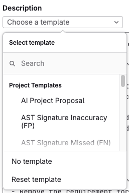



- Tier: 基础版，专业版，旗舰版
- Offering: JihuLab.com，私有化部署



描述模板可标准化并自动化极狐GitLab 中议题和合并请求的创建方式。

描述模板可以：

- 为跨项目的议题和合并请求创建一致的布局。
- 为不同的工作流阶段和目的提供专门的模板。
- 支持为项目、群组和整个实例自定义模板。
- 使用变量和快速操作自动填充字段。
- 确保对缺陷、功能和其他工作项进行正确跟踪。
- 格式化 [服务台邮件回复](service_desk/configure.md#use-a-custom-template-for-service-desk-tickets)。

您可以为以下对象定义用作描述的模板：

- [议题](issues/_index.md)
- [史诗](../group/epics/_index.md)（需要[群组级描述模板](#set-group-level-description-templates)）
- [任务](../tasks.md)
- [目标与关键结果](../okrs.md)
- [事件](../../operations/incident_management/manage_incidents.md)
- [服务台工单](service_desk/_index.md)
- [合并请求](merge_requests/_index.md)

项目会继承其群组和实例的模板。

模板必须满足以下要求：

- 使用 `.md` 扩展名保存。
- 存储在项目代码仓库的 `.gitlab/issue_templates` 或 `.gitlab/merge_request_templates` 目录中。
- 存在于默认分支上。

<a id="create-a-description-template"></a>

## 创建描述模板

在代码仓库的 `.gitlab/issue_templates/` 目录中，创建一个新的 Markdown（`.md`）文件作为描述模板。

要创建工作项描述模板：

1. 在顶部栏中，选择 **搜索或跳转到** 并找到您的项目。
1. 在左侧边栏中，选择 **代码** > **代码仓库**。
1. 在默认分支旁边，选择 。
1. 选择 **新建文件**。
1. 在默认分支旁边，在 **文件名** 文本框中，输入 `.gitlab/issue_templates/mytemplate.md`，
   其中 `mytemplate` 是您的模板名称。
1. 提交到您的默认分支。

要检查此操作是否成功：

1. [创建新议题](issues/create_issues.md) 或
   [创建新史诗](../group/epics/manage_epics.md#create-an-epic)。
1. 查看是否可以在 **选择模板** 下拉列表中找到您的描述模板。

<a id="create-a-merge-request-template"></a>

## 创建合并请求模板

与议题模板类似，在代码仓库的
`.gitlab/merge_request_templates/` 目录中创建一个新的 Markdown（`.md`）文件。
与议题模板不同，合并请求具有额外的继承规则，这些规则取决于提交消息和分支名称的内容。
有关更多信息，请参阅[创建合并请求](merge_requests/creating_merge_requests.md)。

要为项目创建合并请求描述模板：

1. 在顶部栏中，选择 **搜索或跳转到** 并找到您的项目。
1. 在左侧边栏中，选择 **代码** > **代码仓库**。
1. 在默认分支旁边，选择 。
1. 选择 **新建文件**。
1. 在默认分支旁边，在 **文件名** 文本框中，输入 `.gitlab/merge_request_templates/mytemplate.md`，
   其中 `mytemplate` 是您的合并请求模板的名称。
1. 提交到您的默认分支。

要检查此操作是否成功，请[创建新的合并请求](merge_requests/creating_merge_requests.md)
并查看是否可以在 **选择模板** 下拉列表中找到您的描述模板。

<a id="use-the-templates"></a>

## 使用模板

当您创建或编辑议题或合并请求时，它会显示在 **选择模板** 下拉列表中。

要应用模板：

1. 创建或编辑议题、工作项或合并请求。
1. 选择 **选择模板** 下拉列表。
1. 如果 **描述** 文本框不为空，请选择 **应用模板** 进行确认。
1. 选择 **保存更改**。

当您选择描述模板时，其内容会复制到描述文本框中。

要放弃选择模板后对描述所做的任何更改：展开 **选择模板** 下拉列表并选择 **重置模板**。



> [!note]
> 您可以创建快捷链接，使用指定模板创建议题。
> 例如：`https://gitlab.com/gitlab-org/gitlab/-/work_items/new?description_template=Feature%20proposal`。详细了解[使用带预填值的 URL 创建议题](issues/create_issues.md#using-a-url-with-prefilled-values)。

<a id="supported-variables-in-merge-request-templates"></a>

### 合并请求模板中支持的变量

> [!note]
> 此功能仅适用于
> [默认模板](#set-a-default-template-for-merge-requests-and-issues)。

当您首次保存合并请求时，极狐GitLab 会将合并请求模板中的这些变量替换为其值：

| 变量                                | 描述                                                                                                                                                 | 输出示例                                                                                                                                                                                   |
|-----------------------------------------|-------------------------------------------------------------------------------------------------------------------------------------------------------------|--------------------------------------------------------------------------------------------------------------------------------------------------------------------------------------------------|
| `%{all_commits}`                        | 合并请求中所有提交的消息。限制为最近 100 个提交。跳过超过 100 KiB 的提交正文和合并提交消息。        | `* Feature introduced` <br><br> `This commit implements feature` <br> `Changelog:added` <br><br> `* Bug fixed` <br><br> `* Documentation improved` <br><br>`This commit introduced better docs.` |
| `%{co_authored_by}`                     | 以 `Co-authored-by` Git 提交尾注格式显示的提交作者姓名和电子邮件。限制为合并请求中最近 100 个提交的作者。         | `Co-authored-by: Zane Doe <zdoe@example.com>` <br> `Co-authored-by: Blake Smith <bsmith@example.com>`                                                                                            |
| `%{first_commit}`                       | 合并请求差异中第一个提交的完整消息。                                                                                                     | `Update README.md`                                                                                                                                                                               |
| `%{first_multiline_commit}`             | 第一个非合并提交且消息正文多于一行时的完整消息。如果所有提交都不是多行，则使用合并请求标题。 | `Update README.md` <br><br> `Improved project description in readme file.`                                                                                                                       |
| `%{first_multiline_commit_description}` | 第一个非合并提交且消息正文多于一行时的描述（不含第一行/标题）。                        | `Improved project description in readme file.`                                                                                                                                                   |
| `%{source_branch}`                      | 正在合并的分支名称。                                                                                                                        | `my-feature-branch`                                                                                                                                                                              |
| `%{target_branch}`                      | 应用更改的目标分支名称。                                                                                                     | `main`                                                                                                                                                                                           |

<a id="set-instance-level-description-templates"></a>

### 设置实例级描述模板



- Tier: 专业版，旗舰版
- Offering: 私有化部署



您可以通过使用[实例模板代码仓库](../../administration/settings/instance_template_repository.md)在**实例级别**为议题和合并请求设置描述模板。
您也可以将实例模板代码仓库用于文件模板。

您可能还对[项目模板](../../administration/project_templates.md)感兴趣，
在实例中创建新项目时可以使用这些模板。

<a id="set-group-level-description-templates"></a>

### 设置群组级描述模板



- Tier: 专业版，旗舰版
- Offering: JihuLab.com，私有化部署



使用**群组级**描述模板，您可以选择群组内的一个项目来存储模板。然后，您可以在群组内的其他项目中访问这些模板。
因此，您可以在群组所有项目的议题和合并请求中使用相同的模板。

先决条件：

- 您必须具有该群组的所有者角色。
- 该项目必须是该群组的直接子项目。

要重用[您已创建](#create-a-description-template)的模板：

1. 在顶部栏中，选择 **搜索或跳转到** 并找到您的群组。
1. 在左侧边栏中，选择 **设置** > **通用**。
1. 展开 **模板**。
1. 从下拉列表中，选择您的模板项目作为群组级别的模板代码仓库。
1. 选择 **保存更改**。


您可能还对群组中各种[文件类型的模板](../group/manage.md#group-file-templates)感兴趣。

<a id="set-a-default-template-for-merge-requests-and-issues"></a>

### 为合并请求和议题设置默认模板

在项目中，您可以为新议题和合并请求选择默认描述模板。
因此，每次创建新的合并请求或议题时，都会使用您在模板中输入的文本进行预填充。

先决条件：

- 在项目的左侧边栏中，选择 **设置** > **通用** 并展开 **可见性、项目功能、权限**。
  确保议题或合并请求设置为 **所有具有访问权限的人** 或 **仅项目成员**。

要为合并请求设置默认描述模板，请执行以下任一操作：

- [创建名为 `Default.md`（不区分大小写）的合并请求模板](#create-a-merge-request-template)
  并将其保存在 `.gitlab/merge_request_templates/` 中。
  `Default.md` 模板的优先级不高于项目设置中设置的默认模板。
  有关更多信息，请参阅[默认描述模板的优先级](#priority-of-default-description-templates)。
- 极狐GitLab 专业版和旗舰版用户：在项目设置中设置默认模板：

  1. 在顶部栏中，选择 **搜索或跳转到** 并找到您的项目。
  1. 选择 **设置** > **合并请求**。
  1. 在 **合并请求的默认描述模板** 部分，填写文本区域。
  1. 选择 **保存更改**。

要为工作项设置默认描述，请执行以下任一操作：

- [创建名为 `Default.md`（不区分大小写）的描述模板](#create-a-description-template)
  并将其保存在 `.gitlab/issue_templates/` 中。
  `Default.md` 模板的优先级不高于项目设置中设置的默认描述。
  有关更多信息，请参阅[默认描述模板的优先级](#priority-of-default-description-templates)。
- 极狐GitLab 专业版和旗舰版用户：在项目设置中设置默认模板：

  1. 在顶部栏中，选择 **搜索或跳转到** 并找到您的项目。
  1. 选择 **设置** > **通用**。
  1. 展开 **工作项的默认描述**。
  1. 填写文本区域。
  1. 选择 **保存更改**。

由于极狐GitLab 合并请求和议题支持 [Markdown](../markdown.md)，您可以使用它来格式化标题、列表等。

您还可以在 [Projects REST API](../../api/projects.md) 中提供 `issues_template` 和 `merge_requests_template` 属性，以保持您的默认议题和合并请求模板为最新状态。

<a id="priority-of-default-description-templates"></a>

#### 默认描述模板的优先级

当您在不同位置设置[议题描述模板](#set-a-default-template-for-merge-requests-and-issues)时，它们在项目中的优先级如下。
优先级较高的会覆盖优先级较低的：

1. 在项目设置中设置的模板。
1. 来自父群组的 `Default.md`（不区分大小写）。
1. 来自项目代码仓库的 `Default.md`（不区分大小写）。

合并请求具有[额外的继承规则](merge_requests/creating_merge_requests.md)，
这些规则取决于提交消息和分支名称的内容。

<a id="example-description-template"></a>

## 描述模板示例

GitLab 项目在 [`.gitlab` 文件夹](https://gitlab.com/gitlab-org/gitlab/-/tree/master/.gitlab)中为议题和合并请求使用了描述模板，您可以参考其中的一些示例。

> [!note]
> 可以在描述模板中使用[快速操作](quick_actions.md)来快速添加标记、指派人和里程碑。仅当提交议题或合并请求的用户具有执行相关操作的权限时，快速操作才会执行。

以下是一个缺陷报告模板的示例：

```markdown
## Summary

<!-- HTML comments are not displayed -->
(Summarize the bug encountered concisely)

## Steps to reproduce

(How one can reproduce the issue - this is very important)

## Example Project

(If possible, create an example project here on GitLab.com that exhibits the problematic
behavior, and link to it here in the bug report.
If you are using an older version of GitLab, this will also determine whether the bug has been fixed
in a more recent version)

## What is the current bug behavior?

(What actually happens)

## What is the expected correct behavior?

(What you should see instead)

## Relevant logs and/or screenshots

(Paste any relevant logs - use code blocks (```) to format console output, logs, and code, as
it's very hard to read otherwise.)

## Possible fixes

(If you can, link to the line of code that might be responsible for the problem)

/label ~bug ~reproduced ~needs-investigation
/cc @project-manager
/assign @qa-tester
```
