

- Tier: 基础版，专业版，旗舰版
- Offering: JihuLab.com，私有化部署



您可以利用 Gitee 的 API（导出方）、极狐GitLab 的 API（导入方）以及 git 命令来快速完成项目从 Gitee 到极狐GitLab 的迁移。

整体的迁移可以分为三步：仓库的迁移、Issue 与 PR 的迁移以及最后用户的迁移。

## Repo 迁移

### 前期准备

- Gitee 账号、Demo Repo（本例为 https://gitee.com/majinghe/dev-ops）
- 极狐GitLab 账号（本文以正在内测、即将上线的极狐GitLab SaaS 为例，地址为 https://jihulab.com）

### Repo 迁移

在极狐GitLab 创建新项目时，选择 **`import-project`**：

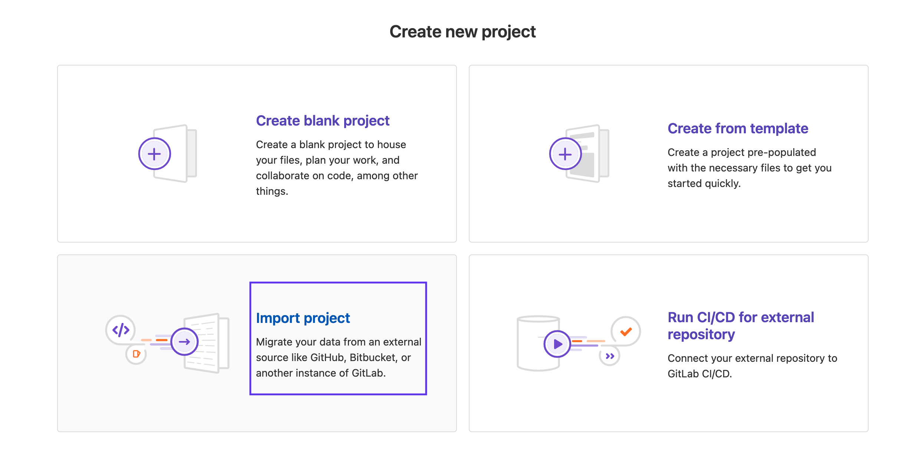

在出现的界面中选择 **`Repo by URL`**：

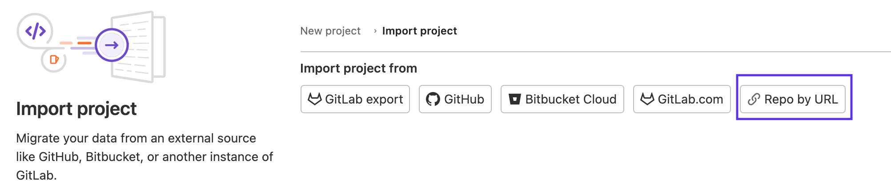

接着需要输入需要导出的 Gitee Repo 的地址以及 Gitee 账号对应的用户名和密码：

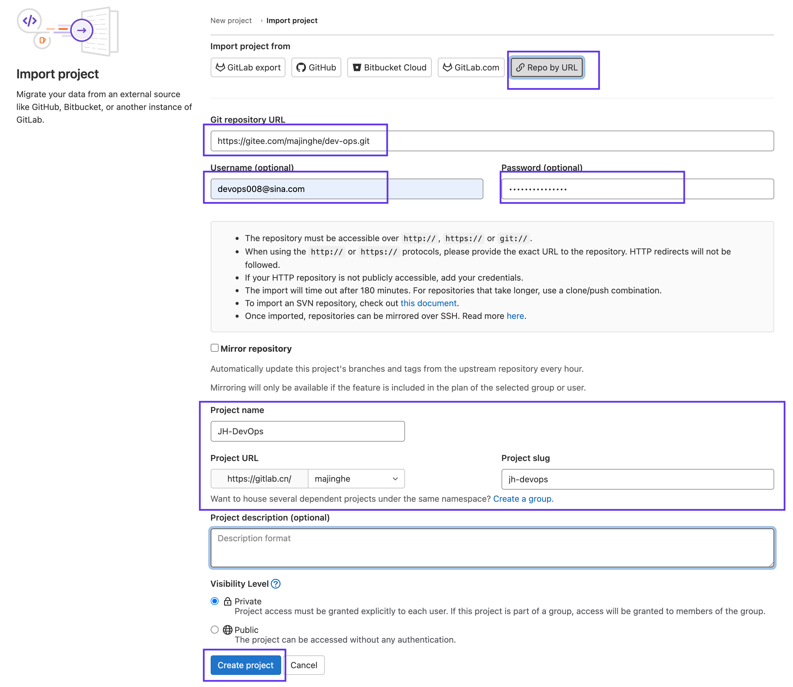

最后点击 **`Create project`** 即可开始 Gitee 项目的迁移。随后可以在极狐GitLab 实例界面看到导入的项目：

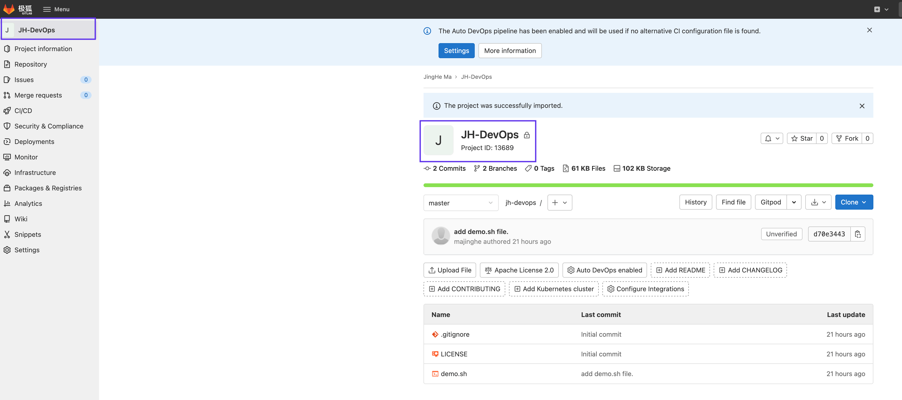

> 由于 Gitee 会对 Repo 的路径加分隔符 '-'（比如 DevOps 变成 dev-ops，DevSecOps 变成 dev-sec-ops，AISecOps 变成 aisec-ops 等等），最终会导致迁移过来的 Project 名称里面会包含空格，这一点需要注意，在点击 `Create project` 按钮之前最好检查一下 Project 名称。

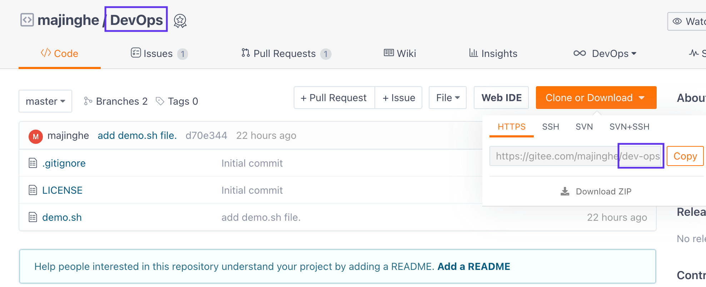

此外，在迁移的时候可以选择将 Gitee 的项目迁移到极狐GitLab 的用户名下还是某个 Group 下面。

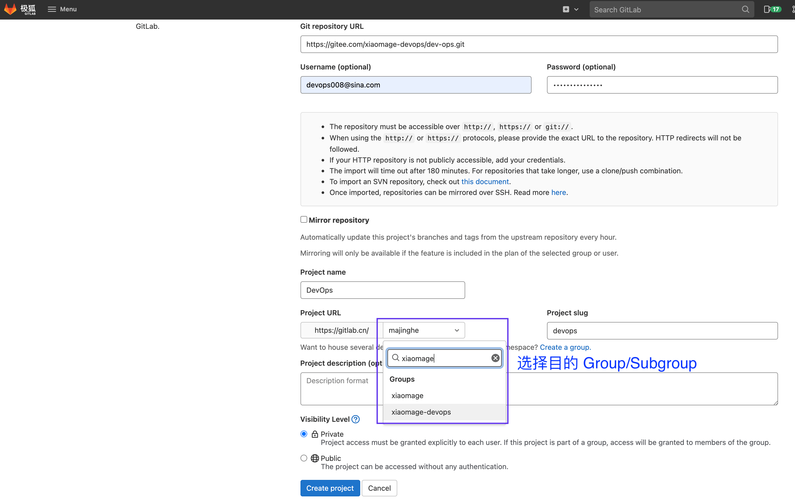

下面先选择将 Gitee Repo 迁移到极狐GitLab 的用户下面（不在某一个特定的 Group/Subgroup）下面，最后在演示 Gitee Organization 迁移的时候会选择迁移到特定的 Group/Subgroup。

## Issue 迁移

上述方法只迁移了代码库到极狐GitLab 实例，但是并没有把 Issue 及 Pull Request 迁移过来。下面演示一下如何把 Issue 迁移过来。Demo Issue 如下图所示：

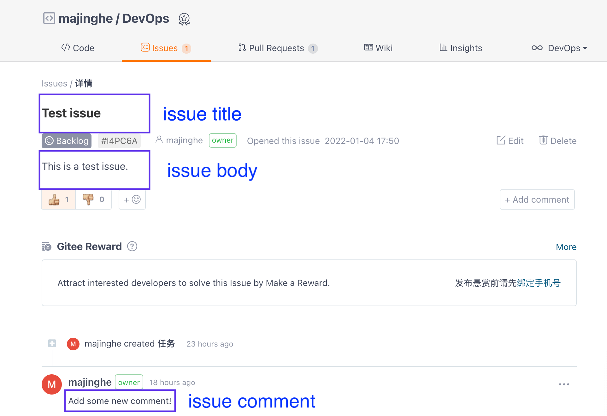

Issue 的迁移分两步走：

### 从 Gitee 导出 Issue

使用如下的 API 可以直接导出对应项目的 Issue：

```
$ curl -X GET --header 'Content-Type: application/json;charset=UTF-8' \
 'https://gitee.com/api/v5/repos/your-gitee-username/your-gitee-repo/issues?access_token=gitee-personal-access-token&state=open'
```

只要把 `your-gitee-username/your-gitee-rep` 以及 `gitee-personal-access-token` 进行真实值替换即可。返回值如下：

```
[
  {
    "id": 7900642,
    "url": "https://gitee.com/api/v5/repos/majinghe/dev-ops/issues/I4PC6A",
    "repository_url": "https://gitee.com/api/v5/repos/majinghe/dev-ops",
    "labels_url": "https://gitee.com/api/v5/repos/majinghe/dev-ops/issues/I4PC6A/labels",
    "comments_url": "https://gitee.com/api/v5/repos/majinghe/dev-ops/issues/I4PC6A/comments",
    "html_url": "https://gitee.com/majinghe/dev-ops/issues/I4PC6A",
    "parent_url": null,
    "number": "I4PC6A",
    "parent_id": 0,
    "depth": 0,
    "state": "open",
    "title": "Test issue",
    "body": "This is a test issue.",
    ......太长，保留演示所需要的内容......
  }
]
```

在返回值中可以得到 `title` 、 `body` 等内容。这些值是 issue 的中重要内容，需要导入极狐GitLab。

由于上述命令并不能列取出 `issue` 中的 `comment`，所以需要再用如下命令获取该 `issue` 对应的 `comment`：

```
$ curl -X GET --header 'Content-Type: application/json;charset=UTF-8' \
  'https://gitee.com/api/v5/repos/majinghe/dev-ops/issues/issue-id/comments?access_token=gitee-personal-access-token'
```
返回值如下：

```
[
  {
    "id": 8159705,
    "body": "Add some new comment!",
    ......太长，保留演示所需要的内容......
    "created_at": "2022-01-04T22:08:43+08:00",
    "updated_at": "2022-01-04T22:08:43+08:00"
  }
]
```

`body` 即为 `issue` 对应的 `comment` 内容。

### 把 Issue 导入极狐GitLab

使用如下命令，将 Gitee Repo issue 的 `title` 以及 `body` 导入迁移过来的极狐GitLab Project：

```
$ curl --request POST --header "PRIVATE-TOKEN: jh-personal-access-token" \
  "https://jihulab.com/api/v4/projects/project-id/issues?title=Title-Content&description=Issue-body"
```
参数说明：

- **PRIVATE-TOKEN**：极狐GitLab Personal Access Token;
- **project-id**：导入过来的极狐GitLab Project；
- **title**：issue title 内容；
- **description**：issue body 内容；

极狐GitLab Personal Access Token 的获取方法参考如下视频：

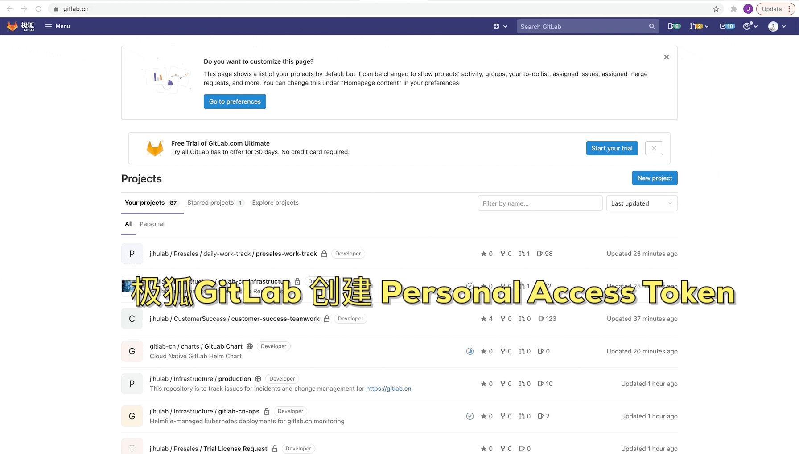

极狐GitLab Project ID 可以直接在极狐GitLab Project 获取：


可以看到 Project ID 为 **`13689`**。

使用上述信息，将以上面的 issue 用如下命令导入：

```
$ curl --request POST --header "PRIVATE-TOKEN: jh-personal-access-token" \
"https://jihulab.com/api/v4/projects/13689/issues?title=Test%20issue&description=This%20is%20a%20test%20issue."
```
返回值如下：

```
{
  "id": 64292,
  "iid": 1,
  "project_id": 13689,
  "title": "Test issue",
  "description": "This is a test issue.",
  "state": "opened",
  "created_at": "2022-01-05T16:39:49.742+08:00",
  "updated_at": "2022-01-05T16:39:49.742+08:00",
    ......太长，保留演示所需要的内容......
}
```
在极狐GitLab Project 上面可以看到 issue 已经导入成功：

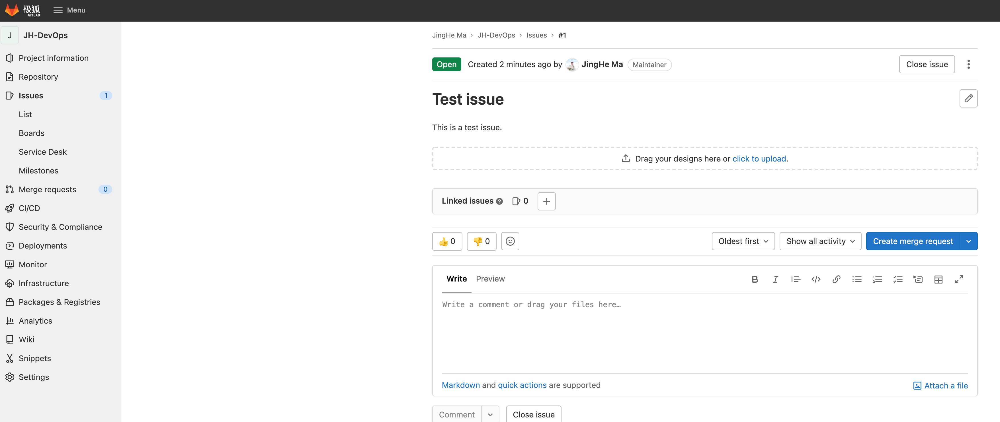

再用如下命令导入 issue comment 即可：

```
$ curl --request POST --header "PRIVATE-TOKEN: jh-personal-access-token" \
"https://jihulab.com/api/v4/projects/13689/issues/1/notes?body=Add%20some%20new%20comment\!" 
```

返回结果如下：

```
{
  "id": 391898,
  "type": null,
  "body": "Add some new comment!",
  "attachment": null,
  "author": {
    "id": 204,
    "username": "majinghe",
    "name": "JingHe Ma",
    "state": "active",
    "avatar_url": "https://jihulab.com/uploads/-/system/user/avatar/204/avatar.png",
    "web_url": "https://jihulab.com/majinghe"
  },
  "created_at": "2022-01-05T16:49:48.092+08:00",
  "updated_at": "2022-01-05T16:49:48.092+08:00",
    ......太长，保留演示所需要的内容......
}
```
继续查看 issue 界面：

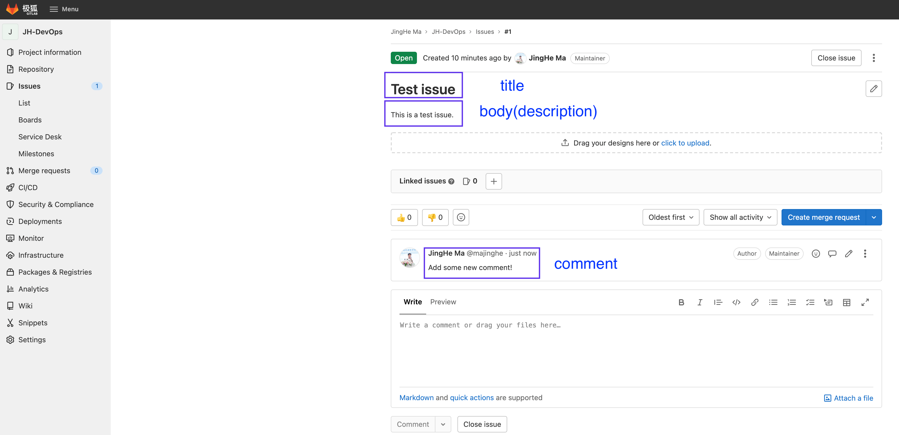

至此 issue 也从 Gitee 迁移到了极狐GitLab。接下来进行 PR 的迁移。

## Pull Request 迁移

PR 的本质是两个分支的文件差异对比。迁移方法有多种，下面将一一演示。


### 方法一：在极狐GitLab 界面上直接操作

当将仓库从 Gitee 迁移到极狐GitLab 的时候，所有的 branch 也被迁移过来了，在极狐GitLab 界面上可以查看到：

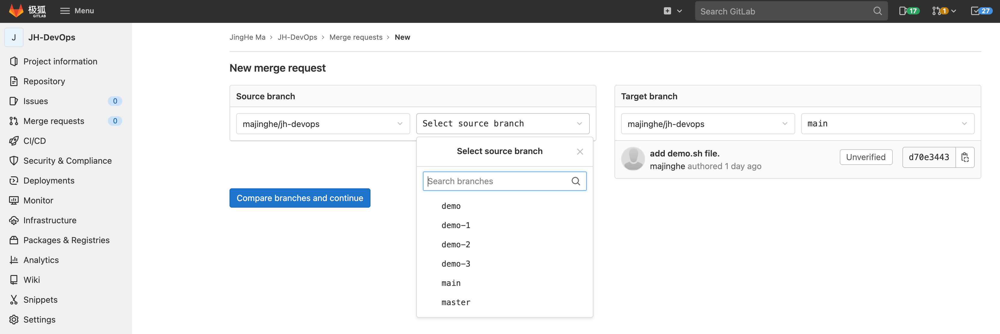

可以看到 Gitee 上用于创建 PR 的四个分支（demo，demo-1，demo-2，demo-3，分别对应四个 PR）都存在，接下来只需要在极狐GitLab 界面上创建相应的 PR 即可：

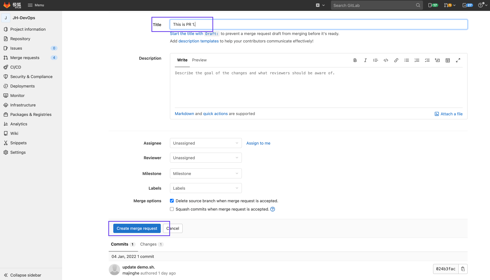

重复相同的操作即可完成 PR 的全部创建，结果如下：

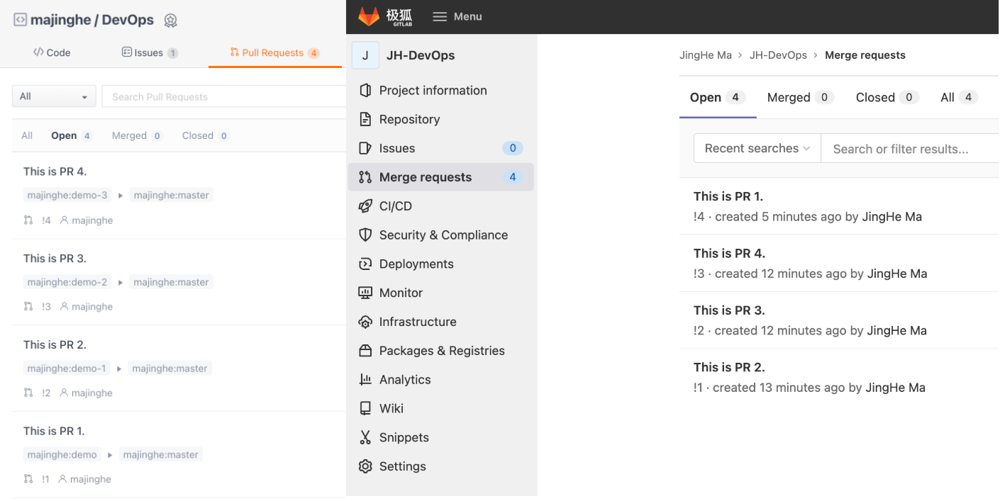

可以看到已经完成了 PR 的顺利迁移。

### 方法二：git 命令来完成 Pull Request 迁移 

git 命令的迁移本质是对于 git 的操作，需要对于 git 原理、代码托管有比较深的认识。核心原理就是**找到 Gitee PR 所对应的 commit 信息，然后用 cherry-pick 将 commit 信息提交到极狐GitLab 的新建分支上，然后创建 PR 即可**。下面进行演示。

首先 clone Gitee Repo 到本地：

```
$ git clone git@gitee.com:majinghe/dev-ops.git
```

进入代码目录，查看远端分支：

```
$ git remote -v
origin	git@gitee.com:majinghe/dev-ops.git (fetch)
origin	git@gitee.com:majinghe/dev-ops.git (push)
```

接下来将最开始迁移过来的库添加为上述库的远端仓库：

```
$ git remote add jh git@jihulab.com:majinghe/jh-devops.git
```
接着查看上述仓库的远端分支并拉取分支信息

```
$ git remote -v
jh	git@jihulab.com:majinghe/jh-devops.git (fetch)
jh	git@jihulab.com:majinghe/jh-devops.git (push)
origin	git@gitee.com:majinghe/dev-ops.git (fetch)
origin	git@gitee.com:majinghe/dev-ops.git (push)

$ git fetch jh main
From jihulab.com:majinghe/jh-devops
 * branch            main       -> FETCH_HEAD
 * [new branch]      main       -> jh/main
```
可以看到**极狐GitLab 的 Project 已经为 Gitee Repo 的远端仓库了**。接着先获取 Gitee PR 所对应的 source branch 上的 commit 信息即可：

```
$ git ck demo
$ git log
commit 024b3fac1751c03cbaa9ac54f24edd2aa3ac7957 (HEAD -> demo, origin/demo)
Author: majinghe <devops008@sina.com>
Date:   Tue Jan 4 09:49:12 2022 +0000

    update demo.sh.

commit d70e3443357b6d497c489da78efe97610d242806 (origin/master, origin/HEAD, jh/main, master)
Author: majinghe <devops008@sina.com>
Date:   Tue Jan 4 09:47:36 2022 +0000

    add demo.sh file.

commit df7aa835192c9846f69c0bef1f90e2173fdc2bb4
Author: majinghe <devops008@sina.com>
Date:   Tue Jan 4 09:45:22 2022 +0000
```
其中第一个 commit 即为创建 PR 的代码变更，记住 commit id：`024b3fac1751c03cbaa9ac54f24edd2aa3ac7957`。然后将代码切回到极狐GitLab 远端仓库分支：

```
$ git ck -b jh-demo jh/main
```
上述命令基于极狐GitLab 远端仓库（jh）的 main 分支，新建了一个 jh-demo 分支，接下来使用 `cherry-pick` 命令将 Gitee PR 分支上的 commit 提交到极狐GitLab 的 jh-demo 分支上：

```
$ git cherry-pick 024b3fac1751c03cbaa9ac54f24edd2aa3ac7957
[jh-demo 66d67ca] update demo.sh.
 Author: majinghe <devops008@sina.com>
 Date: Tue Jan 4 09:49:12 2022 +0000
 1 file changed, 1 insertion(+), 1 deletion(-)
```

然后将代码推送到极狐GitLab 远端仓库即可：

```
$ git push jh jh-demo
Enumerating objects: 5, done.
Counting objects: 100% (5/5), done.
Delta compression using up to 16 threads
Compressing objects: 100% (3/3), done.
Writing objects: 100% (3/3), 328 bytes | 328.00 KiB/s, done.
Total 3 (delta 1), reused 1 (delta 0), pack-reused 0
remote:
remote: To create a merge request for jh-demo, visit:
remote:   https://jihulab.com/majinghe/jh-devops/-/merge_requests/new?merge_request%5Bsource_branch%5D=jh-demo
remote:
To jihulab.com:majinghe/jh-devops.git
 * [new branch]      jh-demo -> jh-demo
```

最后可以在极狐GitLab 界面上看到提交的代码：

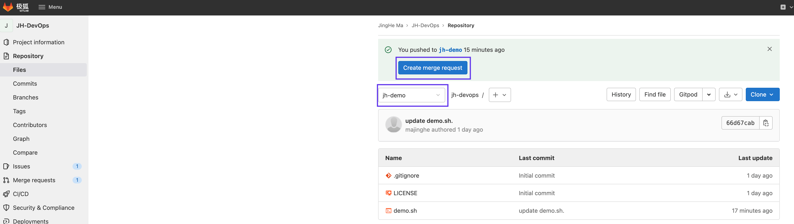

点击创建 Merge Request 即可：

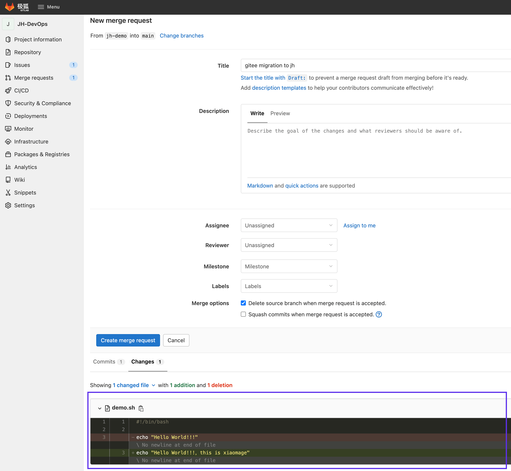

最终完成 Gitee Pull Request 到极狐GitLab Merge Request 的迁移： 

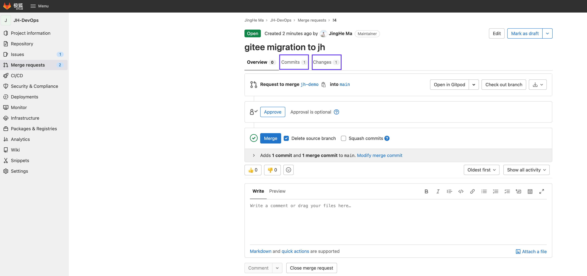


### 方法三：用 API 来迁移 PR 

可以用如下 API 查看到 Gitee 上 PR 的变更内容：

```
$ curl -X GET --header 'Content-Type: application/json;charset=UTF-8' \
'https://gitee.com/api/v5/repos/your-gitee-username/your-gitee-repo/pulls/1/files?access_token=gitee-personal-access-token'
```

返回结果如下：

```
[
  {
    "sha": "024b3fac1751c03cbaa9ac54f24edd2aa3ac7957",
    "filename": "demo.sh",
    "status": null,
    "additions": "1",
    "deletions": "1",
    "blob_url": "https://gitee.com/majinghe/dev-ops/blob/024b3fac1751c03cbaa9ac54f24edd2aa3ac7957/demo.sh",
    "raw_url": "https://gitee.com/majinghe/dev-ops/raw/024b3fac1751c03cbaa9ac54f24edd2aa3ac7957/demo.sh",
    "patch": {
      "diff": "@@ -1,3 +1,3 @@\n #!/bin/bash\r\n \r\n-echo \"Hello World!!!\"\n\\ No newline at end of file\n+echo \"Hello World!!!，this is xiaomage\"\n\\ No newline at end of file\n",
      "new_path": "demo.sh",
      "old_path": "demo.sh",
      "a_mode": "100644",
      "b_mode": "100644",
      "new_file": false,
      "renamed_file": false,
      "deleted_file": false,
      "too_large": false
    }
  }
]
```

可以看到该 PR 变更的文件为 `demo.sh`，变更内容为：

```
"diff": "@@ -1,3 +1,3 @@\n #!/bin/bash\r\n \r\n-echo \"Hello World!!!\"\n\\ No newline at end of file\n+echo \"Hello World!!!，this is xiaomage\"\n\\ No newline at end of file\n",
```

也即把 `"Hello World!!!"` 变更为了 `"Hello World!!!，this is xiaomage"`。

接着用极狐GitLab 的如下 API 创建一个 `commit`：

```
PAYLOAD=$(cat << 'JSON'
{
  "branch": "demo",
  "commit_message": "some commit message",
  "actions": [
    {
      "action": "update",
      "file_path": "demo.sh",
      "content": "echo \"Hello World!!!，this is xiaomage\""
    }
  ]
}
JSON
)

$ curl --request POST --header "PRIVATE-TOKEN: jh-personal-access-token" --header "Content-Type: application/json" \
     --data "$PAYLOAD" "https://jihulab.com/api/v4/projects/13689/repository/commits"
```
上述命令在 `demo` 分支上添加一个 `commit`，内容为更新 `demo.sh` 文件，内容变更为 `"echo "Hello World!!!，this is xiaomage"`。上述命令的返回结果为：

```
{
  "id": "2086ce1d8bf2774bd2da8f79962b72fda974f0ba",
  "short_id": "2086ce1d",
  "created_at": "2022-01-05T14:07:27.000+00:00",
  "parent_ids": [
    "19978f8a29b19a368509d3563533cccb108bca88"
  ],
  "title": "some commit message",
  "message": "some commit message",
  "author_name": "JingHe Ma",
  "author_email": "jhma@jihulab.com",
  "authored_date": "2022-01-05T14:07:27.000+00:00",
  "committer_name": "JingHe Ma",
  "committer_email": "jhma@jihulab.com",
  "committed_date": "2022-01-05T14:07:27.000+00:00",
  "trailers": {},
  "web_url": "https://jihulab.com/majinghe/jh-devops/-/commit/2086ce1d8bf2774bd2da8f79962b72fda974f0ba",
  "stats": {
    "additions": 0,
    "deletions": 0,
    "total": 0
  },
  "status": null,
  "project_id": 13689,
  "last_pipeline": null
}
```
可以看到 commit 信息为：https://jihulab.com/majinghe/jh-devops/-/commit/2086ce1d8bf2774bd2da8f79962b72fda974f0ba。可以看到的内容如下：

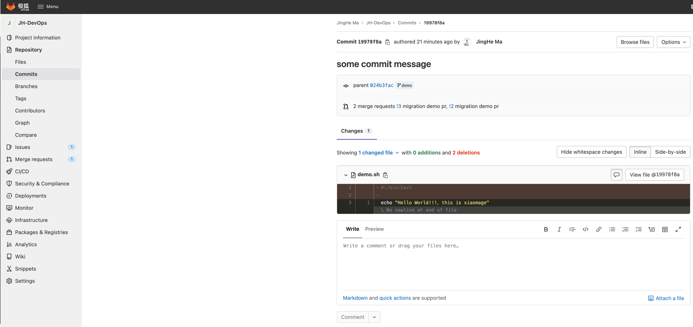

接着用如下命令创建 Merge Request 即可：

```
$ curl --request POST --header "PRIVATE-TOKEN: jh-personal-access-token" "https://jihulab.com/api/v4/projects/13689/merge_requests?source_branch=demo&target_branch=main&id=13689&title=migration%20demo%20pr" | jq .
```
返回结果如下： 

```
{
  "id": 32125,
  "iid": 3,
  "project_id": 13689,
  "title": "migration demo pr",
  "description": null,
  "state": "opened",
  "created_at": "2022-01-05T22:11:29.058+08:00",
  "updated_at": "2022-01-05T22:11:29.058+08:00",
  "merged_by": null,
  "merged_at": null,
  "closed_by": null,
  "closed_at": null,
  "target_branch": "main",
  "source_branch": "demo",
  "user_notes_count": 0,
  "upvotes": 0,
  "downvotes": 0,
  "author": {
    "id": 204,
    "username": "majinghe",
    "name": "JingHe Ma",
    "state": "active",
    "avatar_url": "https://jihulab.com/uploads/-/system/user/avatar/204/avatar.png",
    "web_url": "https://jihulab.com/majinghe"
  },
  "assignees": [],
  "assignee": null,
  "reviewers": [],
  "source_project_id": 13689,
  "target_project_id": 13689,
  "labels": [],
  "draft": false,
  "work_in_progress": false,
  "milestone": null,
  "merge_when_pipeline_succeeds": false,
  "merge_status": "checking",
  "sha": "2086ce1d8bf2774bd2da8f79962b72fda974f0ba",
  "merge_commit_sha": null,
  "squash_commit_sha": null,
  "discussion_locked": null,
  "should_remove_source_branch": null,
  "force_remove_source_branch": null,
  "reference": "!3",
  "references": {
    "short": "!3",
    "relative": "!3",
    "full": "majinghe/jh-devops!3"
  },
  "web_url": "https://jihulab.com/majinghe/jh-devops/-/merge_requests/3",
  "time_stats": {
    "time_estimate": 0,
    "total_time_spent": 0,
    "human_time_estimate": null,
    "human_total_time_spent": null
  },
  "squash": false,
  "task_completion_status": {
    "count": 0,
    "completed_count": 0
  },
  "has_conflicts": false,
  "blocking_discussions_resolved": true,
  "approvals_before_merge": null,
  "subscribed": true,
  "changes_count": "1",
  "latest_build_started_at": null,
  "latest_build_finished_at": null,
  "first_deployed_to_production_at": null,
  "pipeline": null,
  "head_pipeline": null,
  "diff_refs": {
    "base_sha": "d70e3443357b6d497c489da78efe97610d242806",
    "head_sha": "2086ce1d8bf2774bd2da8f79962b72fda974f0ba",
    "start_sha": "d70e3443357b6d497c489da78efe97610d242806"
  },
  "merge_error": null,
  "user": {
    "can_merge": true
  }
}
```
此时在极狐GitLab Merge Request 界面上可以看到创建的 MR：

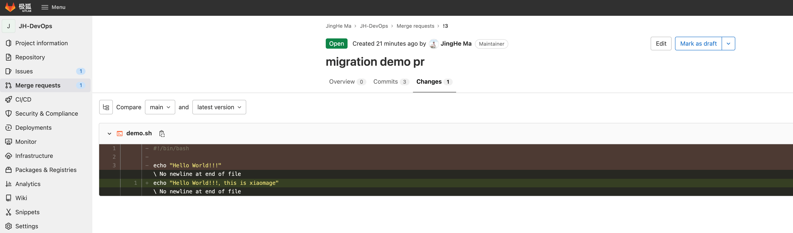

## 用户的迁移

由于 Gitee 也有 Organization 的概念，Organization 下面可以添加用户。下面以 https://gitee.com/xiaomage-devops/dev-ops.git 为例演示整个迁移过程。

可以用如下命令 list 出某个 Gitee Organization 下的 user 信息为：

```
$ curl -X GET --header 'Content-Type: application/json;charset=UTF-8' 'https://gitee.com/api/v5/orgs/organization-name/members?access_token=gitee-personal-access-token'
```

输入 Organization 名称以及 Gitee personal access token，即可列取出该 Organization 下面的 user。返回值如下： 

```
[
  {
    "id": 146619,
    "login": "hiveer",
    "name": "hiveer",
    ......太长，保留迁移所需信息......
    "type": "User",
    "member_role": "member"
  },
  {
    "id": 9684289,
    "login": "majinghe",
    "name": "majinghe",
    ......太长，保留迁移所需信息......
    "type": "User",
    "member_role": "admin"
  },
  {
    "id": 10292540,
    "login": "tiaotiaott",
    "name": "tiaotiao",
    ......太长，保留迁移所需信息......
    "type": "User",
    "member_role": "member"
  }
]
```

可以看到有三个 user 信息。将上述 list 出的 user 信息作信息匹配（如果需要，比如为了方便识别用户，确定对应用户的 email 等），然后可以将用户加入到极狐GitLab 中。可以找 Admin 人员在极狐GitLab 界面上添加 user，也可以利用下面的 API 直接调用 API 添加。不管是哪种方法，都需要确定有 Admin 权限或者找 Admin 人员完成。

```
$ curl --request POST --header "PRIVATE-TOKEN: jh-gitlab-personal-acess-token" \
       "https://your-jh-gitlab-url/api/v4/users?email=devops008@sina.com&password=user-pasword&username=username&name=name"
```

返回值为：

```
{
  "id": 4,
  "username": "xiaomage",
  "name": "xiaomage",
  "state": "active",
  "avatar_url": "https://secure.gravatar.com/avatar/784477b59c09d7731bd613f1c9a5555a?s=80&d=identicon",
  "web_url": "https://your-jh-gitlab-url/xiaomage",
  "created_at": "2021-12-30T07:44:24.241Z",
 ...... 太长，删除其他信息......
}
```
可以看到 user 添加成功，ID 为 `4`，username 和 name 都是 `xiaomage`。可以在极狐GitLab 界面上看到： 

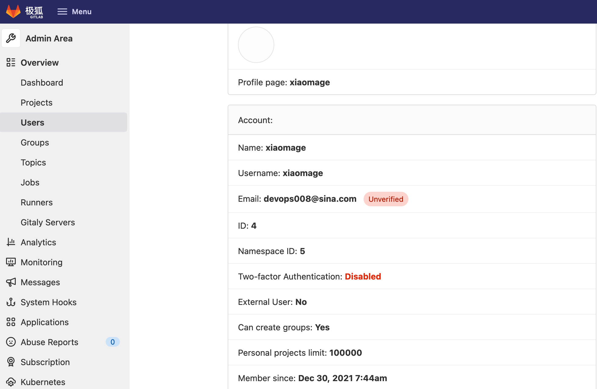

接着可以将上述 user 添加到极狐GitLab 的 Group 中（极狐GitLab 用 Group/Subgroup 来对 Project 进行多层级安全管理）。此 Group/Subgroup 用来对应 Gitee 中要迁移过来的 Organization。可以在极狐GitLab 上创建一个 Group：

```
$ curl --request POST \
--url "https://jihulab.com/api/v4/groups" \
--header "PRIVATE-TOKEN: jh-personal-access-token" \
--header "Content-Type: application/json" \
--data '{"name": "xiaomage-devops", "path": "xiaomage-devops", "description": "Create Group using API" }'
```
返回值如下： 

```
{
  "id": 5149,
  "web_url": "https://jihulab.com/groups/xiaomage-devops",
  "name": "xiaomage-devops",
  "path": "xiaomage-devops",
  ......太长，保留演示所需要的内容......
}
```
名为 xiaomage-devops 的 Group 已经创建起来了，在极狐GitLab 实例界面上可以看到：

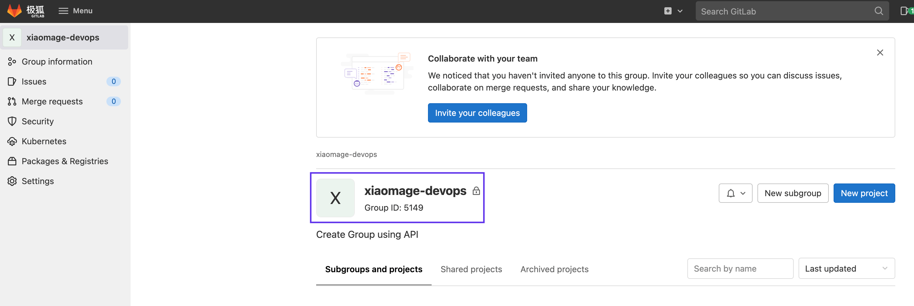

接下来，将 user 添加到 Group 中，可以在极狐GitLab 界面上，直接添加：

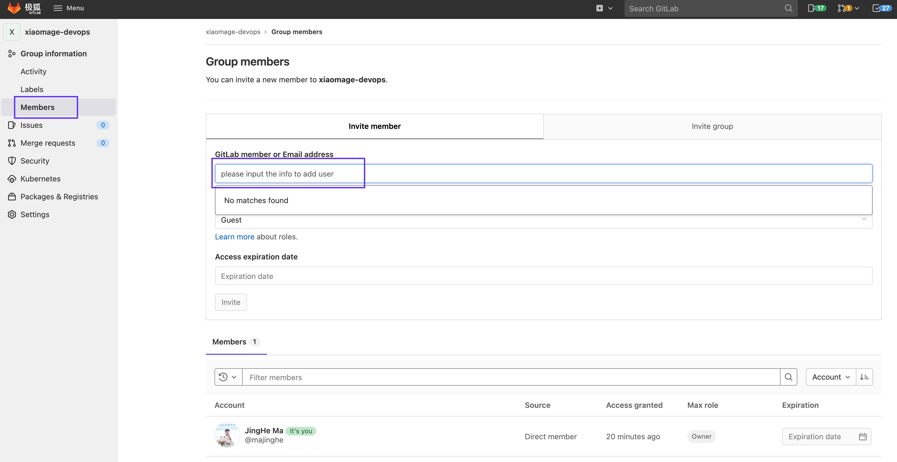

也可以用如下的 API 进行添加：

```
$ curl --request POST --header "PRIVATE-TOKEN: jh-personal-access-token" \
     --data "user_id=user-id&access_level=30" "https://jihulab.com/api/v4/groups/your-group-id/members"
```
将需要添加的 user 的 user-id 以及极狐GitLab token、目的 Group 替换完毕，执行命令即可。可在极狐GitLab 界面上，看到新增了一个用户：

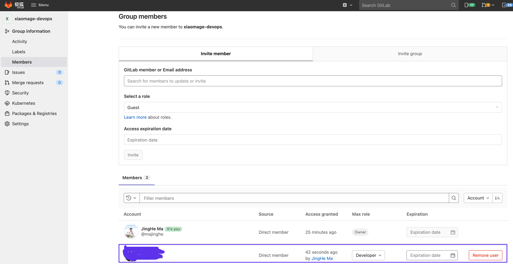

接下来就可以把 Gitee Organization 下面的项目按照最开始的方法迁移过来，在导入的时候可以选择要导入的目的 Group/Subgroup：


选择完毕，点击 `Create Project` 即可完成项目导入，结果如下：

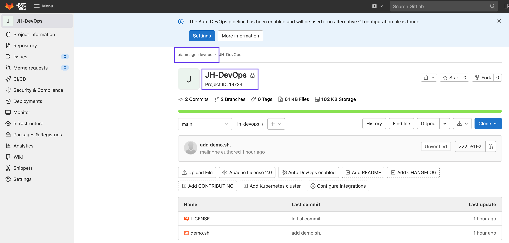

接着就可以用上面的方法导入其他的 Repo 以及对应的 Issue 与 PR 了。赶快开启你的极狐GitLab 之旅吧。
