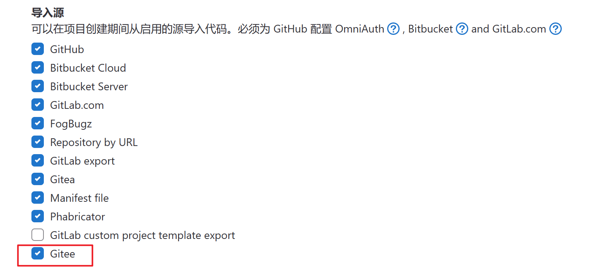



- Tier: 基础版，专业版，旗舰版
- Offering: JihuLab.com，私有化部署



> - 引入于 15.4 版本。[功能标志](../../../administration/feature_flags.md)为 `gitee_import`。默认禁用。
> - 一般可用于 15.8 版本，功能标志 `gitee_import` 删除。

本文介绍如何通过极狐GitLab 用户界面，将项目从 Gitee 迁移到 JihuLab.com 的简要过程。

NOTE:
仅支持从 Gitee SaaS 导入，不支持从 Gitee 私有化部署版本中导入。

## 迁移前准备

- 账户申请：使用极狐GitLab 前，请确保您已拥有已实名认证的账户；若您还没有账户，请先[注册](https://jihulab.com/users/sign_up)，并完成实名认证。
- 要导入 Gitee 的私人项目，需要在 Gitee 上申请私人令牌，参考 [Gitee 文档](https://gitee.com/help/articles/4336#article-header12)。
- 对于私有化部署版，在 15.8 及更早版本中，管理员必须已在 **管理员 > 设置 > 通用 > 可见性与访问控制 > 导入源** 中，手动启用 **Gitee**。
     

## 迁移操作步骤

1. 在顶部导航栏中，单击 **+** 并选择 **新建项目**。
1. 选择 **导入项目** 选项卡，然后选择 **Gitee**。
1. 在 **个人访问凭证** 框中，输入您的 Gitee 私人令牌，然后单击 **验证**。
1. 验证通过后，在导入项目页面中，选择任意数量的仓库旁边的 **导入** 按钮，或选择 **导入所有仓库**。此外，您可以按名称过滤项目。如果应用过滤器，**导入所有仓库** 仅导入匹配的仓库。并输入每个导入项目的命名空间。默认情况下，建议的仓库命名空间与 Gitee 中存在的名称匹配，但根据您的权限，您可以选择编辑这些名称。
1. 导入完成后，选择 **跳转到项目**，查看项目的内容。

## 导入的数据

支持导入以下 Gitee 数据：

- 仓库描述
- Git 仓库数据
- Issues
- Issues Notes
- Pull requests
- Wiki 页面
- 里程碑
- 标签
- Release note 描述
