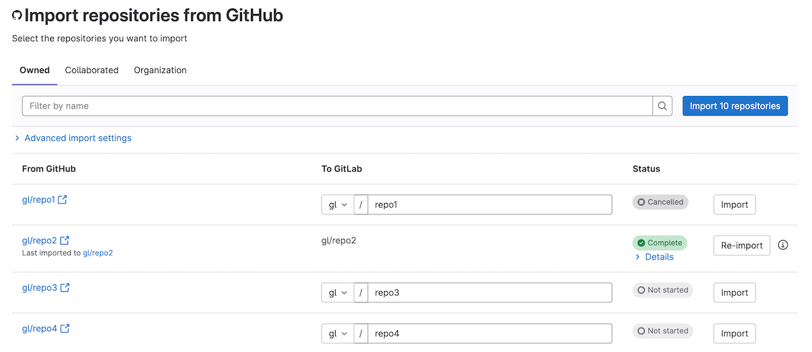



- Tier: 基础版，专业版，旗舰版
- Offering: JihuLab.com，私有化部署



您可以从 GitHub.com 或 GitHub Enterprise 导入您的 GitHub 项目。导入项目不会将任何类型的群组或组织从 GitHub 迁移或导入到极狐GitLab。

导入的议题、合并请求、评论和事件在极狐GitLab 中带有 **已导入** 徽章。

命名空间是极狐GitLab 中的用户或群组，例如 `gitlab.com/sidney-jones` 或
`gitlab.com/customer-success`。

使用极狐GitLab UI 时，GitHub 导入器始终从
`github.com` 域导入。如果您要从自托管的 GitHub Enterprise Server 域导入，请使用
[导入 API](#use-the-api) GitHub 端点，并使用具有 `api` 权限范围的极狐GitLab 访问令牌。

您可以在导入前更改目标命名空间和目标代码仓库名称。

<a id="estimating-import-duration"></a>

## 估算导入时长

每次从 GitHub 导入都不同，这会影响您执行的导入时长。然而，在测试中，极狐GitLab
在 76 小时内导入了 `https://github.com/kubernetes/kubernetes`。测试表明该项目包含：

- 80,000 个拉取请求。
- 45,000 个议题。
- 约 150 万条评论。

<a id="prerequisites"></a>

## 先决条件

要从 GitHub 导入项目，您必须启用
[GitHub 导入源](../../../administration/settings/import_and_export_settings.md#configure-allowed-import-sources)。
如果该导入源未启用，请您的极狐GitLab 管理员启用它。GitHub 导入源在 JihuLab.com 上默认启用。

<a id="permissions-and-roles"></a>

### 权限和角色

要使用 GitHub 导入器，您必须拥有：

- 对源 GitHub 项目的访问权限
- 目标极狐GitLab 群组的维护者或所有者角色

此外，GitHub 代码仓库所属的组织不得对您导入到的极狐GitLab 实例施加
[第三方应用程序访问策略](https://docs.github.com/en/organizations/managing-oauth-access-to-your-organizations-data/about-oauth-app-access-restrictions)
限制。

<a id="known-issues"></a>

## 已知问题

- 2017 年之前创建的 GitHub 拉取请求评论（在极狐GitLab 中称为差异评论）会以单独的讨论串导入。
  这是因为 GitHub API 的限制，2017 年之前的评论不包含 `in_reply_to_id`。
- [在极狐GitLab 18.3 及更早版本中](https://gitlab.com/gitlab-org/gitlab/-/issues/424400)，来自 GitHub Enterprise Server 实例上代码仓库的 Markdown 附件不会被导入。
  [在极狐GitLab 18.4 及更高版本中](https://gitlab.com/gitlab-org/gitlab/-/issues/553386)：
  - 仅导入 Markdown 附件中的视频和图像文件。
  - 其他文件附件不会被导入。
- 由于一个[已知问题](https://gitlab.com/gitlab-org/gitlab/-/issues/418800)，当导入使用了
  [GitHub 自动合并](https://docs.github.com/en/pull-requests/collaborating-with-pull-requests/incorporating-changes-from-a-pull-request/automatically-merging-a-pull-request) 的项目时，如果提交是使用 GitHub 内部 GPG 密钥签名的，则极狐GitLab 中导入的项目可能包含标记为 `unverified` 的合并提交。
- 极狐GitLab [无法导入](https://gitlab.com/gitlab-org/gitlab/-/issues/424046) 在 2023-05-09 之前上传到私有代码仓库的 GitHub Markdown 图片附件。如果您遇到此问题并愿意提供示例代码仓库，
  请在[议题 424046](https://gitlab.com/gitlab-org/gitlab/-/issues/424046) 中添加评论，极狐GitLab 将与您联系。
- 对于 [极狐GitLab 特定引用](../../markdown.md#gitlab-specific-references)，极狐GitLab 对议题使用 `#` 字符，对合并请求使用 `!` 字符。
  但是，GitHub 对议题和拉取请求都只使用 `#` 字符。导入时：

  - 对于评论，极狐GitLab 仅创建指向议题的链接，因为极狐GitLab 无法确定引用是指向议题还是合并请求。
  - 对于议题或合并请求描述，极狐GitLab 不会为任何引用创建链接，因为其导入的对应项可能尚未在目标位置创建。

- 从启用了 SAML 单点登录 (SSO) 的 GitHub 账户导入时，Markdown 附件可能导入失败。此问题由 GitHub
  API 限制引起，即在强制启用 SSO 时无法使用个人访问令牌下载资源。要解决此问题，请将执行导入的极狐GitLab 用户添加为 GitHub 代码仓库的
  [外部协作者](https://docs.github.com/en/organizations/managing-user-access-to-your-organizations-repositories/managing-outside-collaborators/adding-outside-collaborators-to-repositories-in-your-organization)。
  这允许在导入期间访问私有附件。

<a id="import-your-github-repository-into-gitlab"></a>

## 将您的 GitHub 代码仓库导入极狐GitLab

您可以通过以下任一方式导入您的 GitHub 代码仓库：

- [使用 GitHub OAuth](#use-github-oauth)
- [使用 GitHub 个人访问令牌](#use-a-github-personal-access-token)
- [使用 API](#use-the-api)

如果从 `github.com` 导入，您可以使用任何方法进行导入。自托管的 GitHub Enterprise Server 客户必须使用 API。

<a id="use-github-oauth"></a>

### 使用 GitHub OAuth

如果您要导入到 JihuLab.com 或已[配置](../../../integration/github.md) GitHub OAuth 的极狐GitLab 私有化部署，您可以使用 GitHub OAuth 导入您的代码仓库。

此方法比使用 [个人访问令牌 (PAT)](#use-a-github-personal-access-token) 更有优势，
因为后端会使用适当的权限交换访问令牌。

1. 在右上角，选择 **新建** () 和 **新建项目/代码仓库**。
1. 选择 **导入项目**，然后选择 **GitHub**。
1. 选择 **使用 GitHub 授权**。
1. 继续[选择要导入的代码仓库](#select-which-repositories-to-import)。

如果在执行这些步骤后想使用其他方法执行导入，请退出您的极狐GitLab 账户并重新登录。

<a id="use-a-github-personal-access-token"></a>

### 使用 GitHub 个人访问令牌

要使用 GitHub 个人访问令牌导入您的 GitHub 代码仓库：

1. 生成 GitHub 个人访问令牌。仅支持经典个人访问令牌。
   1. 转到 <https://github.com/settings/tokens/new>。
   1. 在 **说明** 字段中，输入令牌描述。
   1. 选择 `repo` 权限范围。
   1. 可选。要[导入协作者](#select-additional-items-to-import)，或者如果您的项目有 [Git LFS 文件](../../../topics/git/lfs/_index.md)，请选择 `read:org` 权限范围。
   1. 选择 **生成令牌**。
1. 在右上角，选择 **新建** () 和 **新建项目/代码仓库**。
1. 选择 **导入项目**，然后选择 **GitHub**。
1. 选择 **使用 GitHub 授权**。
1. 在 **个人访问令牌** 字段中，粘贴 GitHub 个人访问令牌。
1. 选择 **验证**。
1. 继续[选择要导入的代码仓库](#select-which-repositories-to-import)。

如果在执行这些步骤后想使用其他令牌执行导入，请退出您的极狐GitLab 账户并重新登录，或在 GitHub 中撤销旧令牌。

<a id="use-the-api"></a>

### 使用 API

[导入 API](../../../api/import.md#import-repository-from-github) 可用于导入 GitHub 代码仓库。与使用极狐GitLab UI 相比，它有一些优势：

- 可用于导入您不拥有的公共 GitHub 代码仓库。
- 可用于从自托管的 GitHub Enterprise Server 导入。
- 可用于设置 UI 中不可用的 `timeout_strategy` 选项。

REST API 仅限于使用极狐GitLab 个人访问令牌进行身份验证。

要使用极狐GitLab REST API 导入您的 GitHub 代码仓库：

1. 生成 GitHub 个人访问令牌。仅支持经典个人访问令牌。
   1. 转到 <https://github.com/settings/tokens/new>。
   1. 在 **说明** 字段中，输入令牌描述。
   1. 选择 `repo` 权限范围。
   1. 可选。要[导入协作者](#select-additional-items-to-import)，或者如果您的项目有 [Git LFS 文件](../../../topics/git/lfs/_index.md)，请选择 `read:org` 权限范围。
   1. 选择 **生成令牌**。
1. 使用 [导入 API](../../../api/import.md#import-repository-from-github) 导入您的 GitHub 代码仓库。

<a id="filter-repositories-list"></a>

### 筛选代码仓库列表

在您授权访问您的 GitHub 代码仓库后，极狐GitLab 会将您重定向到导入器页面，
您的 GitHub 代码仓库会列出来。

使用以下选项卡之一筛选代码仓库列表：

- **所有者**（默认）：将列表筛选为您拥有的代码仓库。
- **协作**：将列表筛选为您贡献过的代码仓库。
- **组织**：将列表筛选为您是其成员的组织所拥有的代码仓库。

选择 **组织** 选项卡时，您可以通过从下拉列表中选择可用的 GitHub 组织来进一步缩小搜索范围。

<a id="select-additional-items-to-import"></a>

### 选择要导入的其他项

为了尽可能快地导入，默认情况下不会从 GitHub 导入以下项：

- 来自代码仓库评论、发布帖子、议题描述和拉取请求描述的 Markdown 附件。这些可能包括图片、文本或二进制附件。如果未导入，在您从 GitHub 中删除附件后，Markdown 中指向附件的链接将会断开。

您可以选择导入这些项，但这可能会显著增加导入时间。要导入这些项，请在 UI 中选择相应的字段：

- **导入 Markdown 附件**。
- **导入协作者**（默认选中）。保持选中可能会导致新用户占用群组或命名空间中的席位，
  并被授予[最高为项目所有者的权限](#collaborators-members)。仅导入直接协作者。
  外部协作者永远不会被导入。
  [在极狐GitLab 18.4 及更高版本中](https://gitlab.com/gitlab-org/gitlab/-/issues/559224)，当您导入协作者时，
  会遵循 [**禁止将用户添加到该群组的项目中** 设置](../../group/access_and_permissions.md#prevent-members-from-being-added-to-projects-in-a-group)。

<a id="select-which-repositories-to-import"></a>

### 选择要导入的代码仓库

默认情况下，建议的代码仓库命名空间与 GitHub 中的名称匹配，但根据您的权限，您可以在继续导入任何代码仓库之前选择编辑这些名称。

要选择要导入的代码仓库，请在任意数量的代码仓库旁边选择 **导入** 或选择 **导入所有代码仓库**。

此外，您可以按名称筛选项目。如果应用了筛选器，**导入所有代码仓库**
只会导入匹配的代码仓库。

**状态** 列显示每个代码仓库的导入状态。您可以选择保持页面打开并实时查看更新，也可以稍后返回。

要取消待处理或进行中的导入，请在导入的项目旁边选择 **取消**。
如果导入已经开始，导入的文件会被保留。

要在导入后以极狐GitLab URL 打开代码仓库，请选择其极狐GitLab 路径。

已完成的导入可以通过选择 **重新导入** 并指定新名称来重新导入。这会创建源项目的新副本。



<a id="check-status-of-imports"></a>

### 检查导入状态

导入完成后，它们可以处于以下三种状态之一：

- **完成**：极狐GitLab 导入了所有代码仓库实体。
- **部分完成**：极狐GitLab 未能导入某些代码仓库实体。
- **失败**：发生严重错误后，极狐GitLab 中止了导入。

展开 **详细信息** 以查看[代码仓库实体](#imported-data)中导入失败的列表。

<a id="username-mentions"></a>

## 用户名提及

极狐GitLab 会在议题、合并请求和评论中的用户名提及处添加反引号。
这些反引号可防止在极狐GitLab 实例上链接到具有相同用户名的错误用户。

<a id="user-contribution-and-membership-mapping"></a>

## 用户贡献和成员资格映射

GitHub 导入器使用 [部署后迁移方法](../../import/mapping/post_migration_mapping.md)
来映射 JihuLab.com 和极狐GitLab 私有化部署的用户贡献。

<a id="alternative-method-of-mapping"></a>

### 替代映射方法

在极狐GitLab 18.7 及更早版本中，您可以禁用 `github_user_mapping` 功能标志，以使用替代的用户贡献映射方法进行导入。

> [!flag]
> 此功能的可用性由功能标志控制。不建议使用此功能，并且此功能在以下情况下不可用：
>
> - 迁移到 JihuLab.com。
> - 迁移到极狐GitLab 私有化部署 18.8 及更高版本。
>
> 在此映射方法中发现的问题不太可能被修复。请使用
> [部署后迁移方法](../../import/mapping/post_migration_mapping.md)，该方法没有这些限制。
>
> 有关更多信息，请参阅[议题 510963](https://gitlab.com/gitlab-org/gitlab/-/work_items/510963)。

要求：

- 代码仓库中的每个 GitHub 作者和指派人必须有一个
  [公开的电子邮件地址](https://docs.github.com/en/account-and-profile/setting-up-and-managing-your-personal-account-on-github/managing-email-preferences/setting-your-commit-email-address)。
  GitHub Enterprise 不要求公开电子邮件地址，因此您可能必须将其添加到现有账户中。
- GitHub 用户的电子邮件地址必须与其极狐GitLab 电子邮件地址匹配。
- 如果用户的电子邮件地址在 GitHub 中设置为他们在极狐GitLab 中的辅助电子邮件地址，则他们必须确认该地址。

使用此方法，用户会在导入期间被映射。

如果未满足要求，导入器将无法映射特定用户的贡献。在这种情况下：

- 项目创建者被设置为议题和合并请求的作者和指派人。项目创建者通常是发起导入过程的用户。对于某些具有描述或评论（如拉取请求、议题、评论）的贡献，导入器会修改文本，并附上最初创建该贡献的用户详细信息。
- 在 GitHub 的拉取请求上添加的审核人和批准无法导入。在这种情况下，导入器会创建评论，
  描述不存在的用户被添加为审核人和批准人。但是，实际的审核人状态和批准不会应用于极狐GitLab 中的合并请求。

<a id="mirror-a-repository-and-share-pipeline-status"></a>

## 镜像代码仓库并共享流水线状态



- Tier: 专业版，旗舰版



根据您的极狐GitLab 版本，可以设置[代码仓库镜像](../repository/mirror/_index.md)以保持您导入的代码仓库与其 GitHub 副本同步。

此外，您可以配置极狐GitLab 通过
[GitHub 项目集成](../integrations/github.md)将流水线状态更新发送回 GitHub。

如果您使用 [外部代码仓库的 CI/CD](../../../ci/ci_cd_for_external_repos/_index.md) 导入您的项目，则这两个功能都会自动配置。

> [!note]
> 镜像不会同步来自您的 GitHub 项目的任何新的或更新的拉取请求。

<a id="improve-the-speed-of-imports-on-gitlab-self-managed-instances"></a>

## 提高极狐GitLab 私有化部署实例上的导入速度

这些步骤需要极狐GitLab 服务器上的管理员访问权限。

<a id="increase-the-number-of-sidekiq-workers"></a>

### 增加 Sidekiq 工作进程的数量

对于大型项目，导入所有数据可能需要一段时间。为减少所需时间，您可以增加处理以下队列的
Sidekiq 工作进程的数量：

- `github_importer`
- `github_importer_advance_stage`

为获得最佳体验，建议至少使用 4 个 Sidekiq 进程（每个进程运行的线程数等于
CPU 核心数）仅处理这些队列。还建议这些进程在单独的服务器上运行。对于 4 台 8 核服务器，这意味着您可以并行导入多达 32 个对象（例如，议题）。

可以通过提高网络吞吐量、CPU 容量和存储 Git 代码仓库的磁盘性能（例如，使用高性能 SSD）来减少克隆代码仓库所花费的时间（对于您的极狐GitLab 实例）。
增加 Sidekiq 工作进程的数量不会减少克隆代码仓库所花费的时间。

<a id="enable-github-oauth-using-a-github-enterprise-cloud-oauth-app"></a>

### 使用 GitHub Enterprise Cloud OAuth 应用启用 GitHub OAuth

如果您属于 [GitHub Enterprise Cloud 组织](https://docs.github.com/en/enterprise-cloud@latest/get-started/onboarding)，您可以配置极狐GitLab 私有化部署以获得更高的 [GitHub API 速率限制](https://docs.github.com/en/rest/using-the-rest-api/rate-limits-for-the-rest-api?apiVersion=2022-11-28#primary-rate-limit-for-authenticated-users)。

GitHub API 请求通常受限于每小时 5,000 个请求的速率限制。使用以下步骤，您可以获得更高的每小时 15,000 个请求的速率限制，从而加快整体导入时间。

先决条件：

- 您可以访问
  [GitHub Enterprise Cloud 组织](https://docs.github.com/en/enterprise-cloud@latest/get-started/onboarding/getting-started-with-github-enterprise-cloud)。
- 极狐GitLab 已配置为启用 [GitHub OAuth](../../../integration/github.md#enable-github-oauth-in-gitlab)。

要启用更高的速率限制：

- [在 GitHub 中创建 OAuth 应用](../../../integration/github.md#create-an-oauth-app-in-github)。确保 OAuth 应用归 Enterprise Cloud 组织所有，而不是您的个人 GitHub 账户。
- 使用 [GitHub OAuth](#use-github-oauth) 执行项目导入。
- 可选。默认情况下，所有已配置的 OAuth 提供商都启用了登录。
  如果您想为导入启用 GitHub OAuth，但希望阻止用户使用 GitHub 登录到您的极狐GitLab 实例，
  您可以
  [禁用使用 GitHub 登录](../../../integration/omniauth.md#enable-or-disable-sign-in-with-an-omniauth-provider-without-disabling-import-sources)。

<a id="imported-data"></a>

## 导入的数据

项目的以下内容会被导入：

- 与打开的拉取请求相关的项目的所有分叉分支

  > [!note]
  > 分叉分支以类似于 `GH-SHA-username/pull-request-number/fork-name/branch` 的命名方案导入。

- 所有项目分支
- 以下内容的附件：
  - 评论
  - 议题描述
  - 拉取请求描述
  - 发布说明
- 分支保护规则
- [协作者（成员）](#collaborators-members)
- [Git LFS 对象](../../../topics/git/lfs/_index.md)
- Git 代码仓库数据
- 议题和拉取请求评论
- 议题和拉取请求事件（可以作为[附加项](#select-additional-items-to-import)导入）
- 议题
- 标记
- 里程碑
- 拉取请求指派的审核人
- 拉取请求合并人信息
- 拉取请求审查
- 拉取请求审查评论
- 拉取请求对讨论的审查回复
- 拉取请求审查建议
- 拉取请求
- 发布说明内容
- 代码仓库描述
- Wiki 页面

对拉取请求和议题的引用会被保留。每个导入的代码仓库都保持可见性级别，除非该
[可见性级别受到限制](../../public_access.md#restrict-use-of-public-or-internal-projects)，在这种情况下，它默认为默认的项目可见性。

<a id="branch-protection-rules-and-project-settings"></a>

### 分支保护规则和项目设置

导入的 GitHub 分支保护规则映射到以下之一：

- 极狐GitLab 分支保护规则
- 项目级极狐GitLab 设置

| GitHub 规则                                                                                         | 极狐GitLab 规则                                                                                                                                                                                                                                                          |
|:----------------------------------------------------------------------------------------------------|:---------------------------------------------------------------------------------------------------------------------------------------------------------------------------------------------------------------------------------------------------------------------|
| 项目默认分支的 **合并前要求解决对话**                 | **所有讨论串必须已解决** [项目设置](../merge_requests/_index.md#prevent-merge-unless-all-threads-are-resolved)                                                                                                                                         |
| **合并前要求拉取请求**                                                           | **允许推送和合并** [分支保护设置](../repository/branches/protected.md#protect-a-branch) 中的 **无** 选项                                                                                                            |
| 项目默认分支的 **要求签名提交**                                         | **拒绝未签名提交** 极狐GitLab [推送规则](../repository/push_rules.md#require-signed-commits)                                                                                                                                                          |
| **允许强制推送 - 所有人**                                                                   | **允许强制推送** [分支保护设置](../repository/branches/protected.md#allow-force-push)                                                                                                                                               |
| **合并前要求拉取请求 - 要求代码所有者审查**                         | **要求代码所有者批准** [分支保护设置](../repository/branches/protected.md#require-code-owner-approval)                                                                                                                        |
| **合并前要求拉取请求 - 允许指定参与者绕过必需的拉取请求** | **允许推送和合并** [分支保护设置](../repository/branches/protected.md#protect-a-branch) 中的用户列表。如果没有极狐GitLab 专业版订阅，允许推送和合并的用户列表仅限于角色。 |

**合并前要求状态检查通过** GitHub 规则不会被导入。
您仍然可以手动创建[外部状态检查](../merge_requests/status_checks.md)。
有关更多信息，请参阅[议题 370948](https://gitlab.com/gitlab-org/gitlab/-/issues/370948)。

<a id="collaborators-members"></a>

### 协作者（成员）

这些 GitHub 协作者角色映射到这些极狐GitLab [成员角色](../../permissions.md#roles)：

| GitHub 角色 | 映射的极狐GitLab 角色 |
|:------------|:-------------------|
| 读取        | 访客              |
| 分类      | 报告者           |
| 写入       | 开发者          |
| 维护    | 维护者         |
| 管理员       | 所有者              |

GitHub Enterprise Cloud 具有
[自定义代码仓库角色](https://docs.github.com/en/enterprise-cloud@latest/organizations/managing-user-access-to-your-organizations-repositories/managing-repository-roles/about-custom-repository-roles)。
不支持这些角色，并会导致部分完成的导入。

要导入 GitHub 协作者，您必须对 GitHub 项目具有写入或维护角色。否则，协作者导入将被跳过。

<a id="import-from-github-enterprise-on-an-internal-network"></a>

## 从内部网络上的 GitHub Enterprise 导入

如果您的 GitHub Enterprise 实例位于互联网无法访问的内部网络上，您可以使用反向代理允许 JihuLab.com 访问该实例。

代理需要：

- 将请求转发到 GitHub Enterprise 实例。
- 将以下内容中所有出现的内部主机名转换为公共代理主机名：
  - API 响应正文。
  - API 响应 `Link` 标头。

GitHub API 使用 `Link` 标头进行分页。

配置代理后，通过发出 API 请求进行测试。以下是一些测试 API 的示例命令：

```shell
curl --header "Authorization: Bearer <YOUR-TOKEN>" "https://{PROXY_HOSTNAME}/user"

### URLs in the response body should use the proxy hostname

{
  "login": "example_username",
  "id": 1,
  "url": "https://{PROXY_HOSTNAME}/users/example_username",
  "html_url": "https://{PROXY_HOSTNAME}/example_username",
  "followers_url": "https://{PROXY_HOSTNAME}/api/v3/users/example_username/followers",
  ...
  "created_at": "2014-02-11T17:03:25Z",
  "updated_at": "2022-10-18T14:36:27Z"
}
```

```shell
curl --head --header "Authorization: Bearer <YOUR-TOKEN>" "https://{PROXY_DOMAIN}/api/v3/repos/{repository_path}/pulls?states=all&sort=created&direction=asc"

### Link header should use the proxy hostname

HTTP/1.1 200 OK
Date: Tue, 18 Oct 2022 21:42:55 GMT
Server: GitHub.com
Content-Type: application/json; charset=utf-8
Cache-Control: private, max-age=60, s-maxage=60
...
X-OAuth-Scopes: repo
X-Accepted-OAuth-Scopes:
github-authentication-token-expiration: 2022-11-22 18:13:46 UTC
X-GitHub-Media-Type: github.v3; format=json
X-RateLimit-Limit: 5000
X-RateLimit-Remaining: 4997
X-RateLimit-Reset: 1666132381
X-RateLimit-Used: 3
X-RateLimit-Resource: core
Link: <https://{PROXY_DOMAIN}/api/v3/repositories/1/pulls?page=2>; rel="next", <https://{PROXY_DOMAIN}/api/v3/repositories/1/pulls?page=11>; rel="last"
```

还要测试使用代理克隆代码仓库不会失败：

```shell
git clone -c http.extraHeader="Authorization: basic <base64 encode YOUR-TOKEN>" --mirror https://{PROXY_DOMAIN}/{REPOSITORY_PATH}.git
```

<a id="sample-reverse-proxy-configuration"></a>

### 示例反向代理配置

以下配置是配置 Apache HTTP Server 作为反向代理的示例。

> [!warning]
> 为简单起见，该片段没有配置用于加密客户端和代理之间连接的配置。但是，出于安全原因，您应该包含该
> 配置。请参阅[示例 Apache TLS/SSL 配置](https://ssl-config.mozilla.org/#server=apache&version=2.4.41&config=intermediate&openssl=1.1.1k&guideline=5.6)。

```plaintext
# Required modules
LoadModule filter_module lib/httpd/modules/mod_filter.so
LoadModule reflector_module lib/httpd/modules/mod_reflector.so
LoadModule substitute_module lib/httpd/modules/mod_substitute.so
LoadModule deflate_module lib/httpd/modules/mod_deflate.so
LoadModule headers_module lib/httpd/modules/mod_headers.so
LoadModule proxy_module lib/httpd/modules/mod_proxy.so
LoadModule proxy_connect_module lib/httpd/modules/mod_proxy_connect.so
LoadModule proxy_http_module lib/httpd/modules/mod_proxy_http.so
LoadModule ssl_module lib/httpd/modules/mod_ssl.so

<VirtualHost GITHUB_ENTERPRISE_HOSTNAME:80>
  ServerName GITHUB_ENTERPRISE_HOSTNAME

  # Enables reverse-proxy configuration with SSL support
  SSLProxyEngine On
  ProxyPass "/" "https://GITHUB_ENTERPRISE_HOSTNAME/"
  ProxyPassReverse "/" "https://GITHUB_ENTERPRISE_HOSTNAME/"

  # Replaces occurrences of the local GitHub Enterprise URL with the Proxy URL
  # GitHub Enterprise compresses the responses, the filters INFLATE and DEFLATE needs to be used to
  # decompress and compress the response back
  AddOutputFilterByType INFLATE;SUBSTITUTE;DEFLATE application/json
  Substitute "s|https://GITHUB_ENTERPRISE_HOSTNAME|https://PROXY_HOSTNAME|ni"
  SubstituteMaxLineLength 50M

  # GitHub API uses the response header "Link" for the API pagination
  # For example:
  #   <https://example.com/api/v3/repositories/1/issues?page=2>; rel="next", <https://example.com/api/v3/repositories/1/issues?page=3>; rel="last"
  # The directive below replaces all occurrences of the GitHub Enterprise URL with the Proxy URL if the
  # response header Link is present
  Header edit* Link "https://GITHUB_ENTERPRISE_HOSTNAME" "https://PROXY_HOSTNAME"
</VirtualHost>
```
