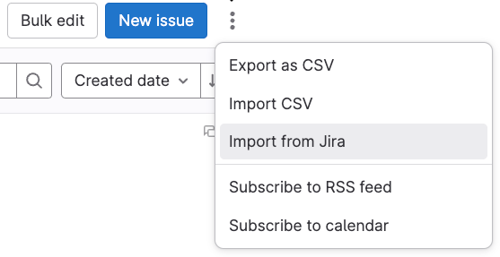
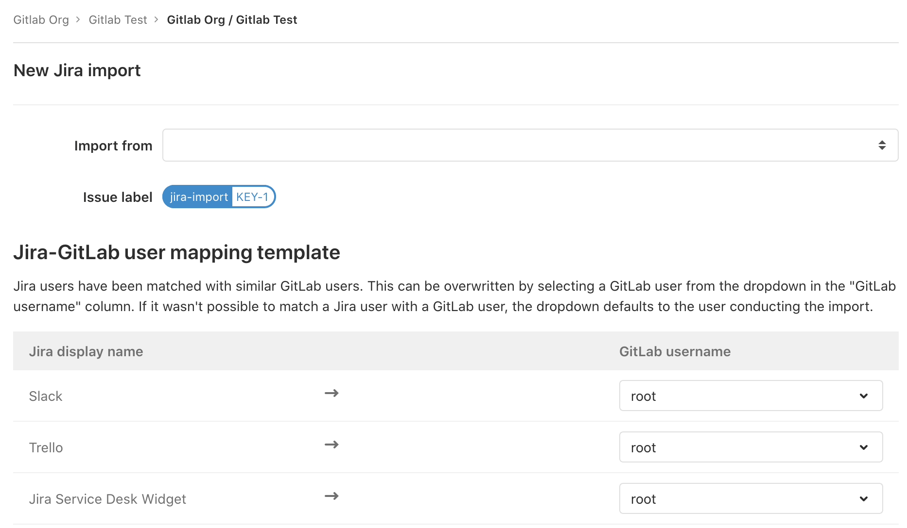



- Tier: 基础版，专业版，旗舰版
- Offering: JihuLab.com，私有化部署



使用极狐GitLab Jira 导入器，您可以将您的 Jira 议题导入到 JihuLab.com 或极狐GitLab 私有化部署。

Jira 议题导入是一个 MVC 模式、项目级功能，这意味着来自多个 Jira 项目的议题可以导入到一个极狐GitLab 项目中。MVC 版本会将议题标题、描述以及部分其他议题元数据作为议题描述中的一个章节导入。

## 已知限制

极狐GitLab 会直接导入以下信息：

- 议题的标题、描述和标签。
- 在准备导入时，您还可以将 Jira 用户映射到极狐GitLab 项目成员。

其他未正式映射到极狐GitLab 议题字段的 Jira 议题元数据将作为纯文本导入到极狐GitLab 议题的描述中。

Jira 议题中的文本不会解析为极狐GitLab 风格的 Markdown，这可能导致文本格式损坏。
详情请参见 [议题 379104](https://jihulab.com/gitlab-cn/gitlab/-/issues/379104)。

[史诗 2738](https://jihulab.com/groups/gitlab-cn/-/epics/2738) 跟踪了议题指派人、评论以及极狐GitLab Jira 导入器的其他迭代的添加情况。

## 先决条件

- 要能够从 Jira 项目导入议题，您必须拥有对 Jira 议题的读取权限，并且对于要导入到的极狐GitLab 项目，您必须具有维护者或所有者角色。
- 此功能使用的是现有的极狐GitLab [Jira 议题集成](../../../integration/jira/_index.md)。在尝试导入 Jira 议题之前，请确保已设置好此集成。

## 将 Jira 议题导入到极狐GitLab

> [!note]
> Jira 议题的导入以异步后台作业的形式进行，可能会因为导入队列负载、系统负载或其他因素导致延迟。根据导入规模的大小，导入大型项目可能需要几分钟时间。

要将 Jira 议题导入到极狐GitLab 项目：

1. 在  **工作项** 页面上，选择 **操作** () > **从 Jira 导入**。

   

   仅当您拥有[正确的权限](#先决条件)时，**从 Jira 导入** 选项才可见。

   将出现以下表单。
   如果您之前已设置好 [Jira 议题集成](../../../integration/jira/_index.md)，您便可在下拉列表中看到您有权限访问的 Jira 项目。

   

1. 选择 **导入自** 下拉列表，然后选择您希望从中导入议题的 Jira 项目。

   在 **Jira-极狐GitLab 用户映射模板** 部分，表格显示了您的 Jira 用户映射到了哪些极狐GitLab 用户。
   该表单出现时，下拉列表默认选择进行导入操作的用户。

1. 要更改任何映射，请在 **极狐GitLab 用户名** 列中选择下拉列表，然后选择您想要映射到每个 Jira 用户的用户。

   下拉列表可能不会显示所有用户，因此请使用搜索栏在此极狐GitLab 项目中查找特定用户。

1. 选择 **继续**，系统会显示导入已开始的确认信息。

   在导入在后台运行时，您可以导航到 **工作项** 页面，查看列表中显示的新议题（Issue 类型的工作项）。

1. 要检查您的导入状态，请再次前往 Jira 导入页面。