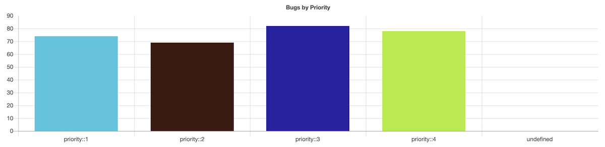
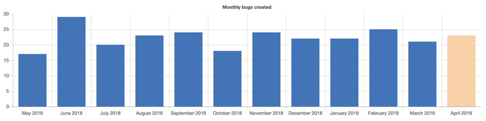
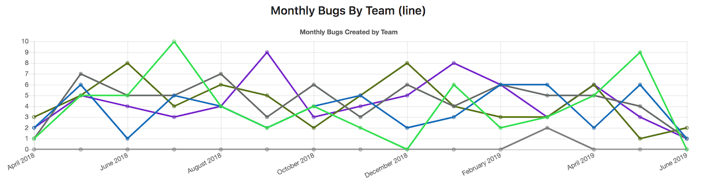
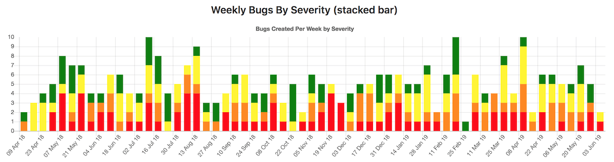



- Tier: 旗舰版
- Offering: JihuLab.com，私有化部署



洞察是交互式条形图，显示每月条目数量（例如，创建的 bug）。

配置洞察并为您的项目和群组创建自定义报告，以探索以下数据：

- 在指定时期内创建和关闭的议题。
- 合并请求的平均合并时间。
- 分类管理状况。

<a id="view-insights"></a>

## 查看洞察

先决条件：

- 对于项目洞察，您必须有权访问项目，并具有查看其合并请求和议题信息的权限。
- 对于群组洞察，您必须具有查看该群组的权限。

要查看项目或群组的洞察：

1. 在顶部栏中，选择 **搜索或跳转到** 并找到您的项目或群组。
1. 在左侧边栏中，选择 **分析** > **洞察**。
1. 要查看报告，请从 **选择报告** 下拉列表中选择要查看的报告。
   要查看注释，请将鼠标悬停在图表中的每个柱上。
1. 可选。筛选结果：
   - 要仅显示 90 天范围的子集数据，请选择暂停图标 () 并沿水平轴滑动它们。
   - 要从图表中排除维度，请在图表下方的图例中选择维度的名称。

<a id="drill-down-on-charts"></a>

### 图表下钻



- 在 极狐GitLab 16.7 中引入。
- 在 极狐GitLab 16.9 中更改为扩展对所有 `可议题` 图表的支持。



您可以下钻到所有 `查询.数据源` 为 `可议题` 的图表数据中。

要查看一个月内特定优先级或严重性的数据下钻报告：

- 在图表上，选择您要下钻的条形堆栈。

<a id="create-a-report-deep-link"></a>

### 创建报告深度链接

您可以使用深度链接 URL 将用户引导至洞察中的特定报告。

要创建深度链接，请将报告密钥附加到洞察报告 URL 的末尾。
例如，一个密钥为 `bugsCharts` 的极狐GitLab 报告具有深度链接 URL `https://jihulab.com/gitlab-cn/gitlab/insights/#/bugsCharts`。

<a id="configuration"></a>

## 配置

<a id="default-file"></a>

### 默认文件

极狐GitLab 从[默认配置文件](https://jihulab.com/gitlab-cn/gitlab/-/blob/master/ee/fixtures/insights/default.yml)中读取洞察数据。

项目洞察通过项目中的 [`.gitlab/insights.yml`](#configuration) 文件进行配置。如果项目没有配置文件，则使用 [群组配置](#for-groups)。

`.gitlab/insights.yml` 文件是一个 YAML 文件，您可以在其中定义：

- 报告中图表的结构和顺序。
- 项目或群组报告中显示的图表样式。

在 `.gitlab/insights.yml` 文件中：

- [配置参数](#parameters) 定义图表行为。
- 每个报告都有一个唯一的密钥和一组要获取和显示的图表。
- 每个图表定义由一个由键值对组成的哈希构成。

<a id="example"></a>

#### 示例

以下示例显示了一个报告定义，该报告包含一个图表：

```yaml
bugsCharts:
  title: "Charts for bugs"
  charts:
    - title: "Monthly bugs created"
      description: "Open bugs created per month"
      type: bar
      query:
        data_source: issuables
        params:
          issuable_type: issue
          issuable_state: opened
          filter_labels:
            - bug
          group_by: month
          period_limit: 24
```

以下示例显示了一个 `.gitlab/insights.yml` 文件的完整配置，其中显示三个图表：

```yaml
.projectsOnly: &projectsOnly
  projects:
    only:
      - 3
      - groupA/projectA
      - groupA/subgroupB/projectC

bugsCharts:
  title: "Charts for bugs"
  charts:
    - title: "Monthly bugs created"
      description: "Open bugs created per month"
      type: bar
      <<: *projectsOnly
      query:
        data_source: issuables
        params:
          issuable_type: issue
          issuable_state: opened
          filter_labels:
            - bug
          group_by: month
          period_limit: 24

    - title: "Weekly bugs by severity"
      type: stacked-bar
      <<: *projectsOnly
      query:
        data_source: issuables
        params:
          issuable_type: issue
          issuable_state: opened
          filter_labels:
            - bug
          collection_labels:
            - S1
            - S2
            - S3
            - S4
          group_by: week
          period_limit: 104

    - title: "Monthly bugs by team"
      type: line
      <<: *projectsOnly
      query:
        data_source: issuables
        params:
          issuable_type: merge_request
          issuable_state: opened
          filter_labels:
            - bug
          collection_labels:
            - Manage
            - Plan
            - Create
          group_by: month
          period_limit: 24
```

<a id="parameters"></a>

### 参数

以下表格列出了图表参数：

| 关键字 | 描述 |
| :--- | :--- |
| [`标题`](#title) | 图表的标题。此标题在洞察页面上显示。 |
| [`描述`](#description) | 单个图表的描述。此描述显示在相关图表上方。 |
| [`类型`](#type) | 图表类型：`bar`、`line` 或 `stacked-bar`。 |
| [`查询`](#query) | 定义图表数据源和筛选条件的哈希。 |

<a id="title"></a>

#### `标题`

使用 `标题` 更新图表标题。标题显示在洞察报告中。

**示例**：

```yaml
monthlyBugsCreated:
  title: "Monthly bugs created"
```

<a id="description"></a>

#### `描述`

使用 `描述` 添加图表描述。描述显示在图表上方，标题下方。

**示例**：

```yaml
monthlyBugsCreated:
  title: "Monthly bugs created"
  description: "Open bugs created per month"
```

<a id="type"></a>

#### `类型`

使用 `类型` 定义图表类型。

**支持的值**：

| 名称 | 示例 |
| ---- | -------- |
| `bar` |  |
| `bar` (time series with `group_by`) |  |
| `line` |  |
| `stacked-bar` |  |

`dora` 数据源支持 `bar` 和 `line` [图表类型](#type)。

**示例**：

```yaml
monthlyBugsCreated:
  title: "Monthly bugs created"
  type: bar
```

<a id="query"></a>

#### `查询`

使用 `查询` 定义图表的数据源和筛选条件。

**示例**：

```yaml
monthlyBugsCreated:
  title: "Monthly bugs created"
  description: "Open bugs created per month"
  type: bar
  query:
    data_source: issuables
    params:
      issuable_type: issue
      issuable_state: opened
      filter_labels:
        - bug
      collection_labels:
        - S1
        - S2
        - S3
        - S4
      group_by: week
      period_limit: 104
```

仍支持不带 `数据源` 参数的旧格式：

```yaml
monthlyBugsCreated:
  title: "Monthly bugs created"
  description: "Open bugs created per month"
  type: bar
  query:
    issuable_type: issue
    issuable_state: opened
    filter_labels:
      - bug
    collection_labels:
      - S1
      - S2
      - S3
      - S4
    group_by: week
    period_limit: 104
```

<a id="query.data_source"></a>

##### `查询.数据源`

使用 `数据源` 定义暴露数据的数据源。

**支持的值**：

- `issuables`: 暴露合并请求或议题数据。
- `dora`: 暴露 DORA 指标。

<a id="issuable-query-parameters"></a>

##### `可议题` 查询参数

<a id="query.params.issuable_type"></a>

###### `查询.参数.可议题类型`

使用 `查询.参数.可议题类型` 定义要创建图表的可议题类型。

**支持的值**：

- `issue`: 图表显示议题数据。
- `merge_request`: 图表显示合并请求数据。

<a id="query.params.issuable_state"></a>

###### `查询.参数.可议题状态`

使用 `查询.参数.可议题状态` 按查询到的可议题的当前状态进行筛选。

默认情况下，应用 `opened` 状态筛选。

**支持的值**：

- `opened`: 已打开的议题或合并请求。
- `closed`: 已关闭的议题或合并请求。
- `locked`: 讨论被锁定的议题或合并请求。
- `merged`: 已合并的合并请求。
- `all`: 所有状态的议题或合并请求。

<a id="query.params.filter_labels"></a>

###### `查询.参数.过滤标签`

使用 `查询.参数.过滤标签` 按应用于查询到的可议题的标签进行筛选。

默认情况下，不应用标签筛选。必须将所有定义的标签应用于可议题才能将其选中。

**示例**：

```yaml
monthlyBugsCreated:
  title: "Monthly regressions created"
  type: bar
  query:
    data_source: issuables
    params:
      issuable_type: issue
      issuable_state: opened
      filter_labels:
        - bug
        - regression
```

<a id="query.params.collection_labels"></a>

###### `查询.参数.收集标签`

使用 `查询.参数.收集标签` 根据配置的标签对可议题进行分组。默认不进行分组。

**示例**：

```yaml
weeklyBugsBySeverity:
  title: "Weekly bugs by severity"
  type: stacked-bar
  query:
    data_source: issuables
    params:
      issuable_type: issue
      issuable_state: opened
      filter_labels:
        - bug
      collection_labels:
        - S1
        - S2
        - S3
        - S4
```

<a id="query.group_by"></a>

###### `查询.分组依据`

使用 `查询.分组依据` 定义图表的 X 轴。

**支持的值**：

- `day`: 按天分组数据。
- `week`: 按周分组数据。
- `month`: 按月分组数据。

<a id="query.period_limit"></a>

###### `查询.周期限制`

使用 `查询.周期限制` 定义查询可议题的时间回溯多远（使用 `查询.周期字段`）。

单位与 `查询.分组依据` 中定义的值相关。例如，如果您指定了 `查询.分组依据: 'day'`，且 `查询.周期限制: 365`，则图表将显示最近 365 天的数据。

默认情况下，根据您定义的 `查询.分组依据` 应用默认值。

| `查询.分组依据` | 默认值 |
| ---------------- | ------------- |
| `day`            | 30            |
| `week`           | 4             |
| `month`          | 12            |

<a id="query.period_field"></a>

##### `查询.周期字段`

使用 `查询.周期字段` 定义用于对可议题进行分组的时间戳字段。

**支持的值**：

- `created_at` (默认): 使用 `created_at` 字段分组数据。
- `closed_at`: 使用 `closed_at` 字段分组数据（仅限议题）。
- `merged_at`: 使用 `merged_at` 字段分组数据（仅限合并请求）。

`周期字段` 自动设置为：

- 如果 `查询.可议题状态` 为 `closed`，则为 `closed_at`
- 如果 `查询.可议题状态` 为 `merged`，则为 `merged_at`
- 否则，为 `created_at`

> [!note]
> 在此缺陷解决之前，您可能会看到 `created_at` 代替 `merged_at`。此时使用 `created_at`。

<a id="dora-query-parameters"></a>

##### `DORA` 查询参数

使用特定于 DORA 的查询与 `dora` 数据源创建 DORA 图表定义。

**示例**：

```yaml
dora:
  title: "DORA charts"
  charts:
    - title: "DORA deployment frequency"
      type: bar # or line
      query:
        data_source: dora
        params:
          metric: deployment_frequency
          group_by: day
          period_limit: 10
      projects:
        only:
          - 38
    - title: "DORA lead time for changes"
      description: "DORA lead time for changes"
      type: bar
      query:
        data_source: dora
        params:
          metric: lead_time_for_changes
          group_by: day
          environment_tiers:
            - staging
          period_limit: 30
```

<a id="query.metric"></a>

###### `查询.指标`

使用 `查询.指标` 定义要查询的 DORA 指标。

**支持的值**：

- `deployment_frequency` (默认)
- `lead_time_for_changes`
- `time_to_restore_service`
- `change_failure_rate`

<a id="query.group_by-dora"></a>

###### `查询.分组依据`

使用 `查询.分组依据` 定义图表的 X 轴。

**支持的值**：

- `day` (默认): 按天分组数据。
- `month`: 按月分组数据。

<a id="query.period_limit-dora"></a>

###### `查询.周期限制`

使用 `查询.周期限制` 定义指标查询的历史回溯多远（默认：15）。最长期限为 180 天或 6 个月。

<a id="query.environment_tiers"></a>

###### `查询.环境层级`

使用 `查询.环境层级` 定义一个环境数组，以包含在计算中。

**支持的值**：

- `production`(默认)
- `staging`
- `testing`
- `development`
- `other`

<a id="projects"></a>

#### `项目`

使用 `项目` 限制查询可议题的来源：

- 如果为群组的洞察使用 `.gitlab/insights.yml`，请使用 `项目` 定义从中查询可议题的项目。默认情况下，使用该群组下的所有项目。
- 如果为项目的洞察使用 `.gitlab/insights.yml`，则指定其他项目不会产生结果。默认情况下，使用该项目。

<a id="projects.only"></a>

##### `项目.仅`

使用 `项目.仅` 指定从中查询可议题的项目。

在以下情况下，将忽略此参数中列出的项目：

- 它们不存在。
- 当前用户没有足够的权限读取它们。
- 它们位于群组之外。

**示例**：

```yaml
monthlyBugsCreated:
  title: "Monthly bugs created"
  description: "Open bugs created per month"
  type: bar
  query:
    data_source: issuables
    params:
      issuable_type: issue
      issuable_state: opened
      filter_labels:
        - bug
  projects:
    only:
      - 3                         # You can use the project ID
      - groupA/projectA           # Or full project path
      - groupA/subgroupB/projectC # Projects in subgroups can be included
      - groupB/project            # Projects outside the group will be ignored
```

<a id="configure-insights"></a>

### 配置洞察

您可以为项目和群组配置洞察。
在项目中创建 `.gitlab/insights.yml` 文件后，您也可以将其用于项目的群组。

> [!note]
> 自定义的 `.gitlab/insights.yml` 文件会覆盖默认配置。
> 要保留原始配置，请复制[默认配置文件](https://jihulab.com/gitlab-cn/gitlab/-/blob/master/ee/fixtures/insights/default.yml)的内容作为基础。

<a id="for-projects"></a>

#### 针对项目

先决条件：

- 您必须具有项目的开发者、维护者或所有者角色。

要配置项目洞察，请创建文件 `.gitlab/insights.yml`，方式如下：

- 在本地，在项目的根目录中，并推送您的更改。
- 从 UI：
  1. 在顶部栏中，选择 **搜索或跳转到** 并找到您的项目。
  1. 在文件列表上方，选择您要提交到的分支，选择加号图标，然后选择 **新建文件**。
  1. 对于 **文件名**，输入 `.gitlab/insights.yml`。
  1. 在文件编辑器中，输入配置。
     请参见[配置示例](#example)。
  1. 选择 **提交更改**。

<a id="for-groups"></a>

#### 针对群组

先决条件：

- 您的群组中必须有一个项目包含 `.gitlab/insights.yml` 文件。

要配置群组洞察：

1. 在顶部栏中，选择 **搜索或跳转到** 并找到您的群组。
1. 在左侧边栏中，选择 **设置** > **分析**。
1. 在 **洞察** 部分，选择包含 `.gitlab/insights.yml` 配置文件的项目。
1. 选择 **保存更改**。