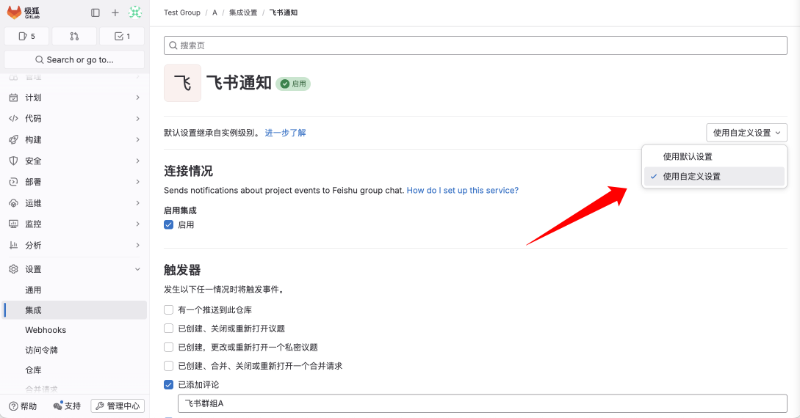



- Tier: 专业版, 旗舰版
- Offering: 私有化部署



> - [引入](https://jihulab.com/gitlab-cn/gitlab/-/issues/473)于极狐GitLab 15.2，功能标志为 `feishu_integration`。默认禁用。
> - 功能标志 `feishu_integration` [移除](https://jihulab.com/gitlab-cn/gitlab/-/issues/1325)于极狐GitLab 15.4。

如果您想在飞书的群组中查看极狐GitLab 项目中的事件变更，如创建议题、流水线故障或关闭合并请求等，您可以将飞书与极狐GitLab 进行集成。

## 飞书集成

### 配置飞书

* 在飞书中创建机器人
* 在飞书群组中添加机器人

在飞书中创建机器人：

1. 访问 [https://open.feishu.cn](https://open.feishu.cn)，进入 **飞书开放平台** 页面。
1. 使用飞书移动端扫描二维码，登录进入您的组织。
1. 在右上角，选择 **我的后台** > **开发者后台** 进入我的后台页面。
1. 选择 **企业自建应用** 选项卡。
1. 选择 **创建企业自建应用**，在弹出的窗口中填写名称和应用描述，并为应用上传一个图标，选择右下角的 **创建**。
1. 在左侧边栏中选择 **添加应用能力**，选择 **按能力添加** 选项卡。
1. 选择 **机器人** 下方的 **添加**。添加成功后，您也可以选择 **机器人** 下方的 **配置** 进行更多机器人相关配置。
1. 在左侧边栏中选择 **凭证与基础信息**，记录页面中显示的 **App ID** 和 **App Secret**，以便后续使用。
1. （可选）在左侧边栏中，选择 **成员管理**，添加协作人员。
1. 在左侧边栏中，选择 **权限管理**，选择 **API 权限** 选项卡。
1. 在 **权限配置** 列表中选择 **获取与更新群组信息** 和 **获取与发送单聊、群组消息** 最右侧的 **开通权限**，获取相应权限。
1. 在左侧边栏中，选择 **版本管理与发布**，在右侧页面中选择 **创建版本**，按照要求填写 **应用版本号** 和 **更新说明** 并在 **移动端的默认能力** 和 **桌面端的默认能力** 中选择 **机器人**，然后选择 **保存**。
1. 在弹出的确认对话框中选择 **申请线上发布**。

NOTE:
在飞书开放平台首页的右上角，单击 **我的后台** 旁边的功能菜单图标，选择 **管理后台** 进入飞书管理后台页面。在左侧边栏中选择 **工作台** > **应用审核**。在右侧页面中选择 **设置审核规则**，您可以查看 **自建应用审核规则** 下的 **开启免审** 开关是否开启。如果开启，您在[在飞书中创建机器人](#bot-creation-steps)申请线上发布后，您所创建的版本会自动通过审核，上线发布；如果未开启，在申请线上发布后，您需要在飞书管理后台页面中选择 **工作台** > **应用审核**，在右侧页面的审核列表中手动审核。

在飞书群组中添加机器人：

1. 打开您需要添加机器人的飞书群组，选择右上角的三个点图标，选择 **设置**。
1. 选择 **群机器人** > **添加机器人**，将您的机器人添加到群组中。

### 配置极狐GitLab

NOTE:
在极狐GitLab 15.4 之前的版本，您需要启用[功能标识](../../../administration/feature_flags.md) `feishu_integration`。
启动极狐GitLab Rails 控制台，在控制台中运行 `Feature.enable(:feishu_integration)`。

1. 以管理员身份登录极狐GitLab，在左侧边栏中选择 **管理中心** > **设置** > **通用**。
1. 在右侧页面中，选择 **飞书集成** 右侧的 **展开**，勾选 **启用飞书集成** 复选框，并填写 **飞书App ID** 和 **飞书App Secret**，选择 **保存更改**。
1. 在左侧边栏中，选择 **管理中心** > **设置** > **集成**。
1. 在右侧页面中，选择 **飞书通知** > **配置**，勾选 **启用集成** 下面的 **启用** 复选框。
1. 在 **触发器** 下面勾选您想在飞书群组中接收通知的事件类型。如推送、议题和评论等。

NOTE:
极狐GitLab 中需要填写的 **飞书App ID** 和 **飞书App Secret** 是[在飞书中创建机器人](#bot-creation-steps)步骤 8 中记录的 **App ID** 和 **App Secret**。

至此，您已经完成了飞书和极狐GitLab 集成所需的系统级配置工作。所有项目将默认按此配置对所配置事件发送飞书通知到相应的飞书群组。

#### 配置极狐GitLab 的不同群组/项目消息发送至不同的飞书群

极狐GitLab 的每个群组和项目都可以单独配置飞书集成。

例如，我们希望将极狐GitLab 的项目 A 的事件通知发送至飞书群组 “飞书群组A”：

1. 登录极狐GitLab，进入项目 A。
1. 在左侧边栏中，选择 **设置** > **集成**。
1. 在右侧页面中，选择 **飞书通知** > **配置**。
1. 在右侧页面中，如果看到“使用默认设置”的选项，将它切换至“使用自定义设置”。

    

1. 勾选 **启用集成** 下面的 **启用** 复选框。
1. 在 **触发器** 下面勾选您想在飞书群组中接收通知的事件类型，将飞书群组名称填写为 “飞书群组A”。
1. 点击 “保存更改” 按钮。

类似的，如果我们希望将项目 B 的推送事件通知发送到飞书群组 “飞书群组B“，可以通过如下步骤配置：

1. 登录极狐GitLab，进入项目 B。
1. 在左侧边栏中，选择 **设置** > **集成**。
1. 在右侧页面中，选择 **飞书通知** > **配置**。
1. 在右侧页面中，如果看到“使用默认设置”的选项，将它切换至“使用自定义设置”。
1. 勾选 **启用集成** 下面的 **启用** 复选框。
1. 在 **触发器** 下面勾选“有一个推送到此仓库”，将飞书群组名称填写为 “飞书群组B”。
1. 点击 “保存更改” 按钮。

## 飞书通知

当触发器的以下事件发生时，极狐GitLab 会向您配置成功的飞书群组中发送相关通知。

| 触发器名称   | 触发事件           |
|---------|----------------|
| 推送      | 向仓库推送新内容。      |
| 议题      | 创建、更新或关闭议题。    |
| 私密议题    | 创建、更新或关闭私密议题。  |
| 合并请求    | 创建、合并或更新合并请求。  |
| 评论      | 添加评论。          |
| 私密评论    | 添加私密评论。        |
| 标签推送    | 向仓库推送新标签。      |
| 流水线     | 流水线状态发生变更。     |
| Wiki 页面 | 创建或更新 Wiki 页面。 |
| 部署      | 开始或完成部署。       |
| 告警      | 记录新告警。         |
| 漏洞      | 记录新漏洞。         |

