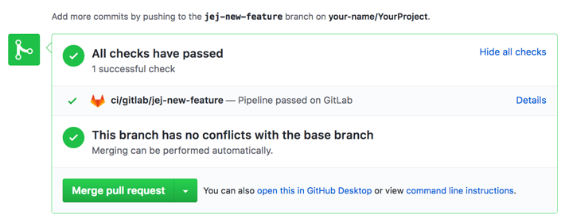



- Tier: 专业版，旗舰版
- Offering: JihuLab.com，私有化部署



你可以从极狐GitLab 向 GitHub 发送流水线状态更新。如果你使用极狐GitLab 进行 CI/CD，GitHub 集成可以提供帮助。

此项目集成与[实例级 GitHub 集成](../import/github.md#mirror-a-repository-and-share-pipeline-status)分开，并且在你导入 [GitHub 项目](../../../integration/github.md)时自动配置。

## 配置集成

此集成需要一个具有 `repo:status` 访问权限的 [GitHub API token](https://docs.github.com/en/authentication/keeping-your-account-and-data-secure/managing-your-personal-access-tokens)。

在 GitHub 上完成以下步骤：

1. 前往你的 **个人访问令牌** 页面：<https://github.com/settings/tokens>。
1. 选择 **生成新令牌**。
1. 在 **备注** 下，输入新令牌的名称。
1. 确保选中 `repo:status`，然后选择 **生成令牌**。
1. 复制生成的令牌，以便在极狐GitLab 中使用。

在极狐GitLab 中完成以下步骤：

1. 在顶部栏中，选择 **搜索或跳转到** 并找到你的项目。
1. 在左侧边栏中，选择 **设置** > **集成**。
1. 选择 **GitHub**。
1. 确保选中 **启用** 复选框。
1. 在 **令牌** 中，粘贴你在 GitHub 上生成的令牌。
1. 在 **仓库 URL** 中，输入你的项目在 GitHub 上的路径，例如 `https://github.com/username/repository`。
1. 可选。要禁用[静态状态检查名称](#static-or-dynamic-status-check-names)，请清除 **启用静态状态检查名称** 复选框。
1. 可选。选择 **测试设置**。
1. 选择 **保存更改**。

配置集成后，请参阅[外部拉取请求的流水线](../../../ci/ci_cd_for_external_repos/_index.md#pipelines-for-external-pull-requests)以配置流水线为打开的拉取请求运行。

### 静态或动态状态检查名称

状态检查名称可以是静态或动态的：

- **静态**：你的极狐GitLab 实例的主机名会附加到状态检查名称中。
- **动态**：分支名称会附加到状态检查名称中。

**启用静态状态检查名称** 选项使你能够在 GitHub 中配置所需的状态检查，这些检查需要一致（静态）的名称才能正常工作。

如果你[禁用此选项](#configure-the-integration)，极狐GitLab 将使用动态状态检查名称。