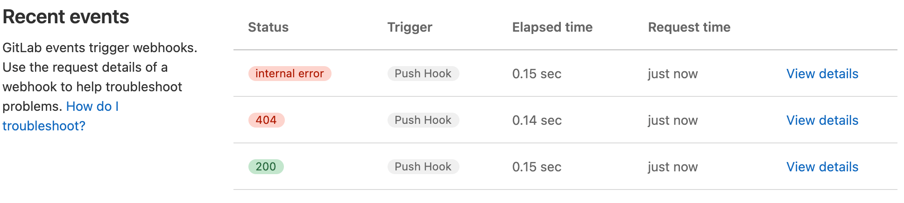
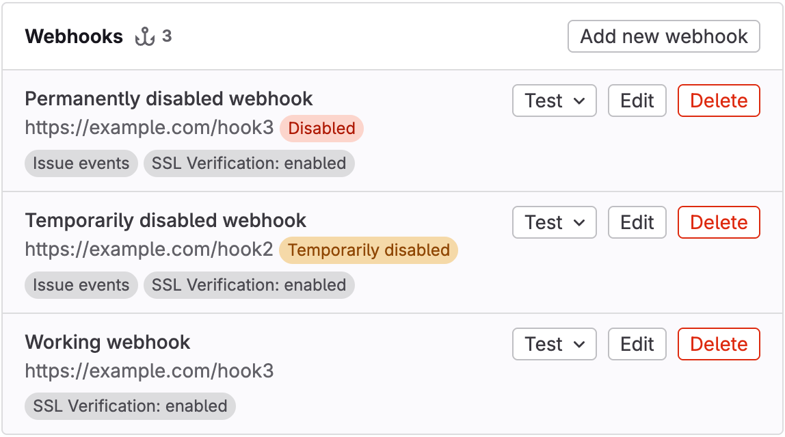



- Tier: 基础版，专业版，旗舰版
- Offering: JihuLab.com，私有化部署



Webhooks 通过实时通知将极狐GitLab 与您的其他工具和系统连接起来。
当极狐GitLab 中发生重要事件时，Webhooks 会将该信息直接发送到您的外部应用程序。
通过响应合并请求、代码推送和议题更新来构建自动化工作流。

借助 Webhooks，您的团队可以在变更发生时保持同步：

- 当极狐GitLab 议题变更时，外部议题跟踪器会自动更新。
- 聊天应用程序会通知团队成员流水线已完成。
- 当代码到达主分支时，自定义脚本会部署应用程序。
- 监控系统会跟踪您整个组织的开发活动。

<a id="webhook-events"></a>

## Webhook 事件

极狐GitLab 中的各种事件都可以触发 Webhooks。例如：

- 向代码仓库推送代码。
- 在议题上发布评论。
- 创建合并请求。

<a id="webhook-limits"></a>

## Webhook 限制

JihuLab.com 强制执行 [Webhook 限制](../../jihulab_com/_index.md#webhooks)，包括：

- 每个项目或群组的最大 Webhook 数量。
- 每分钟的 Webhook 调用次数。
- Webhook 超时时间。

对于极狐GitLab 私有化部署，管理员可以修改这些限制。

<a id="push-event-limits"></a>

### 推送事件限制

极狐GitLab 限制了包含多个变更的推送事件的 Webhook 触发：

- 默认限制：每次推送最多 3 个分支或标签。
- 超出限制时的行为：整个推送事件不会触发任何 Webhook。
- 适用于：项目 Webhooks 和系统钩子。
- 配置：极狐GitLab 私有化部署管理员可以通过应用程序设置 API 修改 `push_event_hooks_limit` 设置。

如果您经常同时推送多个标签或分支，并且需要 Webhook 通知，请联系您的极狐GitLab 管理员以提高此限制。

<a id="group-webhooks"></a>

## 群组 Webhooks



- Tier: 专业版，旗舰版



群组 Webhooks 是自定义 HTTP 回调，用于向群组及其子群组中所有项目的事件发送通知。

<a id="types-of-group-webhook-events"></a>

### 群组 Webhook 事件类型

您可以配置群组 Webhooks 以监听：

- 群组和子群组中项目发生的所有事件
- 群组特定事件，包括群组成员事件、项目事件和子群组事件

<a id="webhooks-in-both-a-project-and-a-group"></a>

### 项目和群组中的 Webhooks

如果您在群组和该群组内的项目中配置了相同的 Webhooks，
则该项目的相关事件会同时触发这两个 Webhooks。
这允许您在极狐GitLab 组织的不同层级进行灵活的事件处理。

<a id="configure-webhooks"></a>

## 配置 Webhooks

在极狐GitLab 中创建和配置 Webhooks，以集成到您项目的工作流中。
使用这些功能来设置满足您特定需求的 Webhooks。

<a id="create-a-webhook"></a>

### 创建 Webhook

对于新的 Webhooks，请使用签名令牌而不是密钥令牌。签名令牌会计算负载的 HMAC-SHA256 签名，因此您的端点可以验证请求的真实性和完整性。密钥令牌仅在标头中提供纯文本值，其提供的保证较弱。不建议在新的 Webhooks 中使用密钥令牌。

创建一个 Webhook，以发送有关您项目或群组中事件的通知。

先决条件：

- 对于项目 Webhooks，您必须具有该项目的维护者或所有者角色。
- 对于群组 Webhooks，您必须具有该群组的所有者角色。

要创建 Webhook：

1. 在顶部栏中，选择 **搜索或跳转到** 并找到您的项目或群组。
1. 在左侧边栏中，选择 **设置** > **Webhooks**。
1. 选择 **添加新的 Webhook**。
1. 在 **URL** 中，输入 Webhook 端点的 URL。
   对特殊字符使用百分号编码。
1. 可选。为 Webhook 输入 **名称** 和 **描述**。
1. 可选。配置请求身份验证。使用签名令牌以获得更强的安全性：
   - **签名令牌**（推荐）：选择 **生成签名令牌**。
     立即复制并保存该令牌，因为它只显示一次。
     您的 Webhook 端点可以使用此令牌来 [验证 HMAC-SHA256 签名](#verify-the-signature)。
   - **密钥令牌**（不推荐）：在 **密钥令牌** 字段中输入一个令牌。
     此令牌以纯文本形式在 `X-Gitlab-Token` HTTP 标头中发送，其提供的安全保证比签名令牌弱。对于新的 Webhooks，请改用签名令牌。
1. 在 **触发器** 部分，选择要触发 Webhook 的事件。
1. 可选。要禁用 SSL 验证，请清除 **启用 SSL 验证** 复选框。
1. 选择 **添加 Webhook**。

<a id="signing-tokens"></a>

### 签名令牌

使用签名令牌来验证 Webhook 负载确实来自极狐GitLab 且未被篡改。
与密钥令牌不同，签名令牌用于计算负载的 HMAC-SHA256 签名。这意味着接收方可以独立验证所接收负载的真实性和完整性。

极狐GitLab Webhook 投递遵循 [Standard Webhooks](https://www.standardwebhooks.com/)
规范。每个 Webhook 请求都包含 `webhook-id` 和 `webhook-timestamp` 标头。
当配置了签名令牌时，极狐GitLab 还会在 `webhook-signature` 标头中包含
HMAC-SHA256 签名。每个签名的格式为 `v1,{base64_signature}`。该标头可能包含多个以空格分隔的签名。极狐GitLab 目前发送一个签名，但这种情况将来可能会改变。签名是基于字符串
`{message_id}.{timestamp}.{body}` 计算的，其中：

- `{message_id}` 是 `webhook-id` 标头的值。
- `{timestamp}` 是 `webhook-timestamp` 标头的值。
- `{body}` 是原始的 JSON 请求体。

<a id="verify-the-signature"></a>

#### 验证签名

要在您的 Webhook 端点中验证签名：

1. 获取 `webhook-id`、`webhook-timestamp` 和 `webhook-signature` 标头的值。
1. 按空格拆分 `webhook-signature` 值以获取签名列表。
1. 构造消息字符串：`"{message_id}.{timestamp}.{body}"`。
1. 解码签名令牌：去除 `whsec_` 前缀，然后对剩余部分进行 base64 解码。
1. 使用解码后的密钥计算 HMAC-SHA256 摘要。
1. 将摘要编码为 base64，并加上 `v1,` 前缀。
1. 检查计算出的签名是否与签名列表中的任何条目匹配。
   使用恒定时间比较以防止时序攻击。

Ruby 示例：

```ruby
require 'base64'
require 'openssl'

def valid_signature?(signing_token, message_id, timestamp, body, received_signatures)
  raw_key = Base64.strict_decode64(signing_token.delete_prefix('whsec_'))
  message = "#{message_id}.#{timestamp}.#{body}"
  digest = OpenSSL::HMAC.digest('sha256', raw_key, message)
  expected = "v1,#{Base64.strict_encode64(digest)}"
  received_signatures.split(' ').any? do |sig|
    ActiveSupport::SecurityUtils.secure_compare(expected, sig)
  end
end
```

Python 示例：

```python
import base64
import hashlib
import hmac

def valid_signature(signing_token, message_id, timestamp, body, received_signatures):
    raw_key = base64.b64decode(signing_token.removeprefix('whsec_'))
    message = f"{message_id}.{timestamp}.{body}".encode('utf-8')
    digest = hmac.new(raw_key, message, hashlib.sha256).digest()
    expected = "v1," + base64.b64encode(digest).decode('utf-8')
    return any(
        hmac.compare_digest(expected, sig)
        for sig in received_signatures.split(' ')
    )
```

<a id="backward-compatibility"></a>

#### 向后兼容性

签名令牌与现有的密钥令牌可以同时使用。您可以在同一个 Webhook 上配置两者：

- 如果配置了密钥令牌，仍会发送 `X-Gitlab-Token` 标头。
- 如果配置了签名令牌，则会发送 `webhook-signature` 和 `webhook-id` 标头。

要在不中断服务的情况下将使用密钥令牌的现有 Webhook 迁移到签名令牌，请在过渡期间在同一个
Webhook 上配置两个令牌。更新您的接收器，使其在存在 `webhook-signature` 时验证签名，
否则回退到密钥令牌。

一旦您的接收器能正确处理签名，您就可以从 Webhook 设置中移除密钥令牌。

<a id="security-considerations"></a>

#### 安全注意事项

为防止重放攻击，请在处理负载之前验证 `webhook-timestamp` 中的时间戳是否为近期时间。

API 永远不会返回签名令牌。

<a id="mask-sensitive-portions-of-webhook-urls"></a>

### 掩码 Webhook URL 中的敏感部分

掩码 Webhook URL 中的敏感部分以增强安全性。
掩码部分在执行 Webhooks 时会被替换为配置的值，不会被记录，并且在数据库中以加密形式存储。

要掩码 Webhook URL 中的敏感部分：

1. 在顶部栏中，选择 **搜索或跳转到** 并找到您的项目或群组。
1. 在左侧边栏中，选择 **设置** > **Webhooks**。
1. 在 **URL** 中，输入 Webhook 的完整 URL。
1. 要定义掩码部分，请选择 **添加 URL 掩码**。
1. 在 **URL 的敏感部分** 中，输入您要掩码的 URL 部分。
1. 在 **在 UI 中的显示方式** 中，输入要代替掩码部分显示的值。
   变量名只能包含小写字母 (`a-z`)、数字 (`0-9`) 或下划线 (`_`)。
1. 选择 **保存更改**。

掩码值在 UI 中会隐藏显示。
例如，如果您定义了变量 `path` 和 `value`，Webhook URL 可能如下所示：

```plaintext
https://webhook.example.com/{path}?key={value}
```

<a id="custom-headers"></a>

### 自定义标头

为 Webhook 请求添加自定义标头，以用于外部服务的身份验证。
每个 Webhook 最多可以配置 20 个自定义标头。

自定义标头必须：

- 不覆盖投递标头的值。
- 仅包含字母数字字符、句点、破折号或下划线。
- 以字母开头，以字母或数字结尾。
- 没有连续的句点、破折号或下划线。

自定义标头会在 **最近事件** 中显示为掩码值。

<a id="custom-webhook-template"></a>

### 自定义 Webhook 模板

为您的 Webhook 创建自定义负载模板，以控制请求体中发送的数据。

<a id="create-a-custom-webhook-template"></a>

#### 创建自定义 Webhook 模板

- 对于项目 Webhooks，您必须具有该项目的维护者或所有者角色。
- 对于群组 Webhooks，您必须具有该群组的所有者角色。

要创建自定义 Webhook 模板：

1. 转到您的 Webhook 配置。
1. 设置自定义 Webhook 模板。
1. 确保模板渲染为有效的 JSON。

在模板中使用事件负载中的字段。例如：

- `{{build_name}}` 用于作业事件
- `{{deployable_url}}` 用于部署事件

要访问嵌套属性，请使用句点分隔路径段。

<a id="example-custom-webhook-template"></a>

#### 自定义 Webhook 模板示例

对于此自定义负载模板：

```json
{
  "event": "{{object_kind}}",
  "project_name": "{{project.name}}"
}
```

`push` 事件产生的请求负载为：

```json
{
  "event": "push",
  "project_name": "Example"
}
```

自定义 Webhook 模板无法访问数组中的属性。

<a id="filter-push-events-by-branch"></a>

### 按分支过滤推送事件

按分支名称过滤发送到您的 Webhook 端点的 `push` 事件。
使用以下过滤选项之一：

- **所有分支**：接收来自所有分支的推送事件。
- **通配符模式**：接收与通配符模式匹配的分支的推送事件。
- **正则表达式**：接收与正则表达式（regex）匹配的分支的推送事件。

<a id="use-a-wildcard-pattern"></a>

#### 使用通配符模式

要使用通配符模式进行过滤：

1. 在 Webhook 配置中，选择 **通配符模式**。
1. 输入一个模式。
   例如：
   - `*-stable` 匹配以 `-stable` 结尾的分支。
   - `production/*` 匹配 `production/` 命名空间中的分支。

<a id="use-a-regular-expression"></a>

#### 使用正则表达式

要使用正则表达式进行过滤：

1. 在 Webhook 配置中，选择 **正则表达式**。
1. 输入遵循 [RE2 语法](https://github.com/google/re2/wiki/Syntax) 的正则表达式模式。

例如，要排除 `main` 分支，请使用：

```plaintext
^(?:.{0,3}|.{5,}|[^m].*|m[^a].*|ma[^i].*|mai[^n].*)$
```

<a id="configure-webhooks-to-support-mutual-tls"></a>

### 配置 Webhooks 以支持双向 TLS



- Offering: 私有化部署



通过设置 PEM 格式的全局客户端证书，配置 Webhooks 以支持双向 TLS。

先决条件：

- 您必须是极狐GitLab 管理员。

要为 Webhooks 配置双向 TLS：

1. 准备 PEM 格式的客户端证书。
1. 可选。使用 PEM 口令保护证书。
1. 配置极狐GitLab 以使用该证书。





1. 编辑 `/etc/gitlab/gitlab.rb`：

   ```ruby
   gitlab_rails['http_client']['tls_client_cert_file'] = '<PATH TO CLIENT PEM FILE>'
   gitlab_rails['http_client']['tls_client_cert_password'] = '<OPTIONAL PASSWORD>'
   ```

1. 保存文件并重新配置极狐GitLab：

   ```shell
   sudo gitlab-ctl reconfigure
   ```





1. 编辑 `docker-compose.yml`：

   ```yaml
   version: "3.6"
   services:
     gitlab:
       image: 'registry.gitlab.cn/omnibus/gitlab-jh:latest'
       restart: always
       hostname: 'gitlab.example.com'
       environment:
         GITLAB_OMNIBUS_CONFIG: |
            gitlab_rails['http_client']['tls_client_cert_file'] = '<PATH TO CLIENT PEM FILE>'
            gitlab_rails['http_client']['tls_client_cert_password'] = '<OPTIONAL PASSWORD>'
   ```

1. 保存文件并重启极狐GitLab：

   ```shell
   docker compose up -d
   ```





1. 编辑 `/home/git/gitlab/config/gitlab.yml`：

   ```yaml
   production: &base
     http_client:
       tls_client_cert_file: '<PATH TO CLIENT PEM FILE>'
       tls_client_cert_password: '<OPTIONAL PASSWORD>'
   ```

1. 保存文件并重启极狐GitLab：

   ```shell
   # For systems running systemd
   sudo systemctl restart gitlab.target

   # For systems running SysV init
   sudo service gitlab restart
   ```





配置完成后，极狐GitLab 会在 Webhook 连接的 TLS 握手期间向服务器出示此证书。

<a id="configure-firewalls-for-webhook-traffic"></a>

### 为 Webhook 流量配置防火墙

根据极狐GitLab 发送 Webhooks 的方式为 Webhook 流量配置防火墙：

- 从 Sidekiq 节点异步发送（最常见）
- 从 Rails 节点同步发送（特定情况下）

当您在 UI 中测试或重试 Webhook 时，Webhooks 会从 Rails 节点同步发送。

配置防火墙时，请确保 Sidekiq 和 Rails 节点都能发送 Webhook 流量。

<a id="manage-webhooks"></a>

## 管理 Webhooks

在极狐GitLab 中监控和维护您配置的 Webhooks。

<a id="view-webhook-request-history"></a>

### 查看 Webhook 请求历史

查看 Webhook 请求的历史记录，以监控其性能并排查问题。

先决条件：

- 对于项目 Webhooks，您必须具有该项目的维护者或所有者角色。
- 对于群组 Webhooks，您必须具有该群组的所有者角色。

要查看 Webhook 的请求历史：

1. 在顶部栏中，选择 **搜索或跳转到** 并找到您的项目或群组。
1. 在左侧边栏中，选择 **设置** > **Webhooks**。
1. 为 Webhook 选择 **编辑**。
1. 转到 **最近事件** 部分。

**最近事件** 部分显示过去两天内向 Webhook 发出的所有请求。
该表格包括：

- HTTP 状态码：
  - 绿色表示 `200`-`299` 代码
  - 红色表示其他代码
  - `internal error` 表示投递失败
- 触发的事件
- 请求的耗时
- 请求发出的相对时间



<a id="inspect-request-and-response-details"></a>

#### 检查请求和响应详情

先决条件：

- 对于项目 Webhooks，您必须具有该项目的维护者或所有者角色。
- 对于群组 Webhooks，您必须具有该群组的所有者角色。

**最近事件** 中的每个 Webhook 请求都有一个 **请求详情** 页面。
此页面包含以下内容的正文和标头：

- 极狐GitLab 从 Webhook 接收器端点收到的响应
- 极狐GitLab 发送的 Webhook 请求

要检查 Webhook 事件的请求和响应详情：

1. 在顶部栏中，选择 **搜索或跳转到** 并找到您的项目或群组。
1. 在左侧边栏中，选择 **设置** > **Webhooks**。
1. 为 Webhook 选择 **编辑**。
1. 转到 **最近事件** 部分。
1. 为事件选择 **查看详情**。

要使用相同的数据和相同的 `Idempotency-Key` 标头再次发送请求，请选择 **重新发送请求**。
如果 Webhook URL 已更改，则无法重新发送请求。
您也可以通过项目 Webhooks API 以编程方式重新发送请求。

<a id="test-a-webhook"></a>

### 测试 Webhook

测试 Webhook 以确保其正常工作，或重新启用已禁用的 Webhook。

先决条件：

- 对于项目 Webhooks，您必须具有该项目的维护者或所有者角色。
- 对于群组 Webhooks，您必须具有该群组的所有者角色。
- 要测试 `push events`，您的项目必须至少有一个提交。

要测试 Webhook：

1. 在顶部栏中，选择 **搜索或跳转到** 并找到您的项目或群组。
1. 在左侧边栏中，选择 **设置** > **Webhooks** 以查看此项目的所有 Webhooks。
1. 直接从已配置的 Webhooks 列表中测试 Webhook：
   1. 找到您要测试的 Webhook。
   1. 从 **测试** 下拉列表中，选择要测试的事件类型。
1. 在编辑 Webhook 时进行测试：
   1. 找到您要测试的 Webhook，然后选择 **编辑**。
   1. 对 Webhook 进行更改。
   1. 选择 **测试** 下拉列表，然后选择要测试的事件类型。

项目 Webhooks 和群组 Webhooks 的某些事件类型不支持测试。
有关更多信息，请参阅 [议题 379201](https://gitlab.com/gitlab-org/gitlab/-/issues/379201)。

<a id="webhook-reference"></a>

## Webhook 参考

使用此技术参考来：

- 了解极狐GitLab Webhooks 的工作原理。
- 将 Webhooks 与您的系统集成。
- 设置、排查和优化您的 Webhook 配置。

<a id="webhook-receiver-requirements"></a>

### Webhook 接收器要求

实现快速稳定的 Webhook 接收器端点，以确保可靠的 Webhook 投递。

缓慢、不稳定或配置错误的接收器可能会被自动禁用。
无效的 HTTP 响应被视为失败的请求。

要优化您的 Webhook 接收器：

1. 使用 `200` 或 `201` 状态快速响应：
   - 避免在同一请求中处理 Webhooks。
   - 使用队列在接收 Webhooks 后处理它们。
   - 在超时限制之前响应，以防止在 JihuLab.com 上被自动禁用。
1. 处理潜在的重复事件：
   - 如果 Webhook 超时，请为重复事件做好准备。
   - 确保您的端点始终快速且稳定。
1. 最小化响应标头和正文：
   - 极狐GitLab 会存储响应标头和正文以供后续检查。
   - 限制返回标头的数量和大小。
   - 考虑使用空正文进行响应。
1. 使用适当的状态码：
   - 仅对配置错误的 Webhooks 返回客户端错误状态响应（`4xx` 范围）。
   - 对于不支持的事件，返回 `400` 或忽略该负载。
   - 避免对已处理的事件返回 `500` 服务器错误响应。

<a id="auto-disabled-webhooks"></a>

### 自动禁用的 Webhooks

> [!flag]
> 此功能的可用性由功能标志控制。

极狐GitLab 会自动禁用连续失败四次的项目或群组 Webhooks。

要查看自动禁用的 Webhooks：

1. 在顶部栏中，选择 **搜索或跳转到** 并找到您的项目或群组。
1. 在左侧边栏中，选择 **设置** > **Webhooks**。

在 Webhook 列表中，自动禁用的 Webhooks 显示为：

- 如果连续失败四次，则显示 **暂时禁用**
- 如果连续失败 40 次，则显示 **已禁用**



<a id="temporarily-disabled-webhooks"></a>

#### 暂时禁用的 Webhooks

如果 Webhooks 连续失败四次，则会被暂时禁用。
如果 Webhooks 连续失败 40 次，则会被永久禁用。

以下情况视为失败：

- Webhook 接收器返回 `4xx` 或 `5xx` 范围内的响应代码。
- Webhook 在尝试连接到 Webhook 接收器时发生超时。
- Webhook 遇到其他 HTTP 错误。

暂时禁用的 Webhooks 最初会禁用一分钟，
后续失败时持续时间会延长，最长可达 24 小时。
此时间段过后，这些 Webhooks 会自动重新启用。

<a id="permanently-disabled-webhooks"></a>

#### 永久禁用的 Webhooks

如果 Webhooks 连续失败 40 次，则会被永久禁用。
与暂时禁用的 Webhooks 不同，这些 Webhooks 不会自动重新启用。

在极狐GitLab 17.10 及更早版本中被永久禁用的 Webhooks 经历了数据迁移。
这些 Webhooks 在 **最近事件** 中可能显示四次失败，
即使 UI 可能显示它们有 40 次失败。

<a id="re-enable-disabled-webhooks"></a>

#### 重新启用已禁用的 Webhooks

要重新启用已禁用的 Webhook，请发送测试请求。
如果测试请求返回 `2xx` 范围内的响应代码，则 Webhook 会被重新启用。

<a id="delivery-headers"></a>

### 投递标头

极狐GitLab 在发送到您端点的 Webhook 请求中包含以下标头。

| 标头                   | 描述                                                                                                                                                     | 示例 |
|:-------------------------|:----------------------------------------------------------------------------------------------------------------------------------------------------------------|:--------|
| `Idempotency-Key`        | 在 Webhook 重试中保持一致性的唯一 ID。为兼容旧版而提供。优先使用 `webhook-id`。                                                                 | `"f5e5f430-f57b-4e6e-9fac-d9128cd7232f"` |
| `User-Agent`             | 格式为 `"Gitlab/<VERSION>"` 的用户代理。                                                                                                                  | `"GitLab/15.5.0-pre"` |
| `webhook-id`             | 在 Webhook 重试中保持一致性的唯一消息 ID。等于 `Idempotency-Key`。                                                                                | `"f5e5f430-f57b-4e6e-9fac-d9128cd7232f"` |
| `webhook-signature`      | 以空格分隔的 HMAC-SHA256 签名列表，每个签名的格式为 `v1,{base64_signature}`。仅在配置了 [签名令牌](#signing-tokens) 时包含。 | `"v1,abc123def456=="` |
| `webhook-timestamp`      | 生成请求时的 Unix 时间戳（自纪元以来的秒数）。                                                                                            | `"1744578123"` |
| `X-Gitlab-Event-UUID`    | 非递归 Webhooks 的唯一 ID。递归 Webhooks（由较早的 Webhooks 触发）共享相同的值。                                                  | `"13792a34-cac6-4fda-95a8-c58e00a3954e"` |
| `X-Gitlab-Event`         | Webhook 类型名称。对应于格式为 `"<EVENT> Hook"` 的事件类型。                                                                                   | `"Push Hook"` |
| `X-Gitlab-Instance`      | 发送 Webhook 的极狐GitLab 实例的主机名。                                                                                                          | `"https://gitlab.com"` |
| `X-Gitlab-Token`         | Webhook 的密钥令牌，以纯文本形式发送。仅在配置了密钥令牌时包含。                                                              | `"my-secret-token"` |
| `X-Gitlab-Webhook-UUID`  | 每个 Webhook 的唯一 ID。                                                                                                                                     | `"02affd2d-2cba-4033-917d-ec22d5dc4b38"` |

<a id="image-url-display-in-webhook-body"></a>

### Webhook 正文中的图片 URL 显示

极狐GitLab 会将 Webhook 正文中的相对图片引用重写为绝对 URL。

<a id="image-url-rewriting-example"></a>

#### 图片 URL 重写示例

如果合并请求、评论或 Wiki 页面中的原始图片引用为：

```markdown

```

Webhook 正文中重写后的图片引用将是：

```markdown

```

此示例假设：

- 极狐GitLab 安装在 `gitlab.example.com`。
- 项目 ID 为 `123`。

<a id="exceptions-to-image-url-rewriting"></a>

#### 图片 URL 重写的例外情况

在以下情况下，极狐GitLab 不会重写图片 URL：

- 它们已经使用 HTTP、HTTPS 或协议相对 URL。
- 它们使用高级 Markdown 功能，例如链接标签。
