

- Tier: 基础版，专业版，旗舰版
- Offering: JihuLab.com，私有化部署





- 议题卡片上显示的里程碑和迭代在极狐GitLab 16.11 中引入。
- 在群组或项目中删除最后一个议题板的功能在极狐GitLab 17.6 中引入。
- 管理议题板的最低角色从报告者变更为计划者在极狐GitLab 17.7 中。



议题板为管理和跟踪极狐GitLab 中的工作提供了可视化的方式。
议题板的功能包括：

- 将议题作为卡片显示在可基于标签、里程碑或指派人定制的列表中。
- 通过工作流的不同阶段追踪议题。
- 支持敏捷方法论，例如看板和 Scrum。
- 为不同的团队和项目组织多个议题板。
- 在整个流程中可视化工作负载和进度。

您的议题以卡片的形式出现在垂直列表中，按照其分配的[标签](labels.md)、[里程碑](#milestone-lists)、[迭代](#iteration-lists)、[指派人](#assignee-lists)或[状态](#status-lists)进行组织。

为您的议题添加元数据，然后为现有议题创建对应的列表。
准备就绪后，您就可以将议题卡片从一个列表拖放到另一个列表。

议题板可以为常见的框架提供支持，例如[看板](https://en.wikipedia.org/wiki/Kanban_(development))和[Scrum](https://en.wikipedia.org/wiki/Scrum_(software_development))。

要让团队成员组织自己的工作流，可以使用[多个议题板](#multiple-issue-boards)。这允许在同一个项目中创建多个议题板。

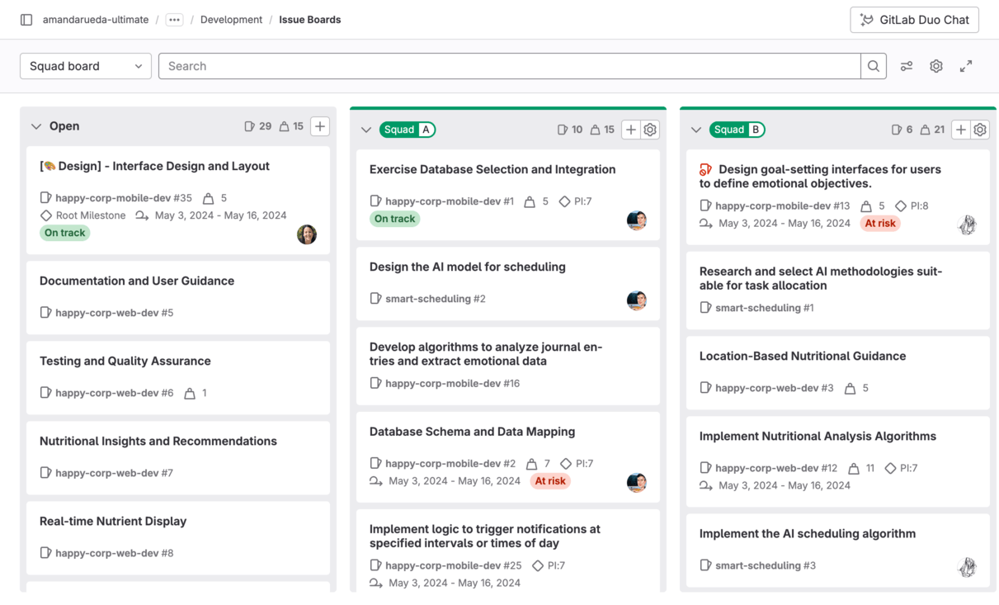

在不同的[极狐GitLab 版本](https://gitlab.cn/pricing/)中，可以使用不同的议题板功能：

| 版本     | 项目议题板数量 | 群组议题板数量 | 可配置议题板 | 指派人列表 |
| -------- | -------------- | -------------- | ------------ | ---------- |
| 基础版   | 多个           | 1              | 否           | 否         |
| 专业版   | 多个           | 多个           | 是           | 是         |
| 旗舰版   | 多个           | 多个           | 是           | 是         |

详细了解[极狐GitLab 企业版议题板功能](#gitlab-enterprise-features-for-issue-boards)。

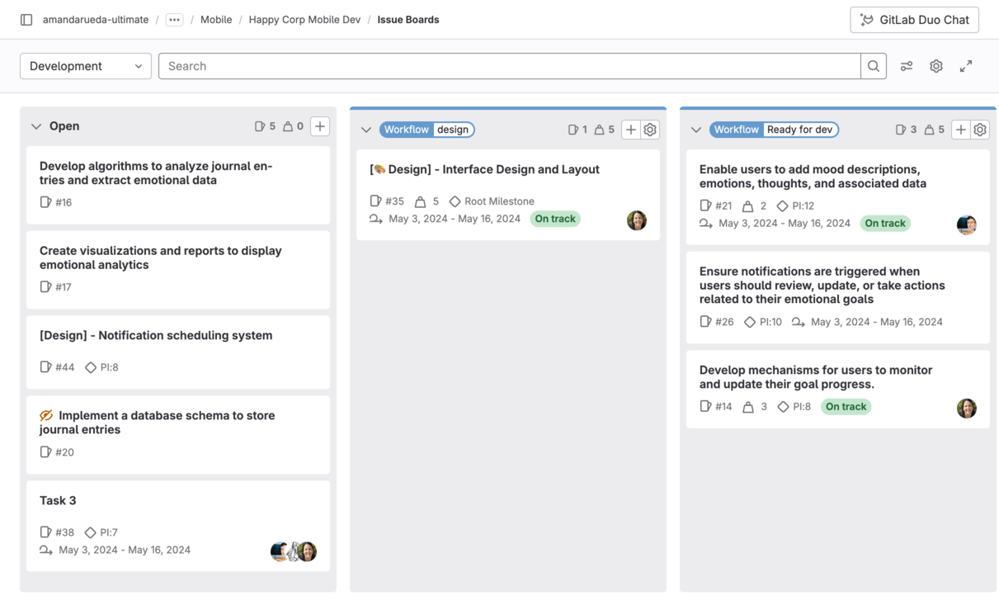

<a id="multiple-issue-boards"></a>

## 多个议题板

多个议题板允许以下情况拥有多个议题板：

- 所有版本中的项目
- 专业版和旗舰版中的群组

多个议题板非常适合拥有多个团队的大型项目，其中仓库托管了多个产品的代码，而您希望创建议题板来支撑软件开发生命周期中的不同工作流。

使用菜单顶部的搜索框，您可以过滤列出的议题板。

当您有十个或更多可用议题板时，菜单中还会显示**最近使用**部分，并提供最近访问的四个议题板的快捷方式。

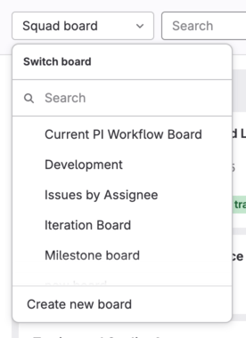

当您重新访问具有多个议题板的项目或群组中的议题板时，极狐GitLab 会自动加载您上次访问的议题板。

### 创建议题板

先决条件：

- 您必须对项目具有计划者、报告者、开发者、维护者或所有者角色。

要创建新的议题板：

1. 在议题板页面的左上角，选择带有当前议题板名称的下拉列表。
1. 选择**创建新议题板**。
1. 输入新议题板的名称并选择其范围：里程碑、迭代、标签、指派人或权重。
1. 选择**创建议题板**

### 删除议题板

先决条件：

- 您必须对保存议题板的项目或群组具有计划者、报告者、开发者、维护者或所有者角色。

要删除打开的议题板：

1. 在议题板页面的右上角，选择**配置议题板** ()。
1. 选择**删除议题板**。
1. 选择**删除**以确认。

如果您删除的议题板是最后一个，则会创建一个新的 `Development` 议题板。

<a id="issue-boards-use-cases"></a>

## 议题板使用案例

您可以根据自己偏好的工作流定制极狐GitLab 议题板。有关基于工作流的文档，请参阅[规划和跟踪工作教程](../../tutorials/plan_and_track.md)。

<a id="use-cases-for-a-single-issue-board"></a>

### 单个议题板的使用案例

借助[极狐GitLab Flow](https://gitlab.cn/topics/version-control/what-is-gitlab-flow/)，您可以在议题中讨论提案，为它们打上标签，并使用议题板进行组织和优先级排序。

例如，我们考虑这样一个简化的开发工作流：

1. 您有一个存放应用程序代码库的仓库，您的团队积极贡献代码。
1. 您的**后端**团队开始进行新的实现，在收集反馈和批准后，将其转交给**前端**团队。
1. 当前端完成后，新功能被部署到**预发布**环境中进行测试。
1. 测试成功后，它被部署到**生产**环境。

如果您拥有**后端**、**前端**、**预发布**和**生产**标签，并且为每个标签配置了对应列表的议题板，您可以：

- 可视化从开发生命周期开始到部署到生产的整个实现流程。
- 通过垂直移动议题来对列表中的议题进行优先级排序。
- 通过在列表之间移动议题，根据您设置的标签对它们进行组织。
- 通过选择一个或多个现有议题，将多个议题添加到议题板的列表中。

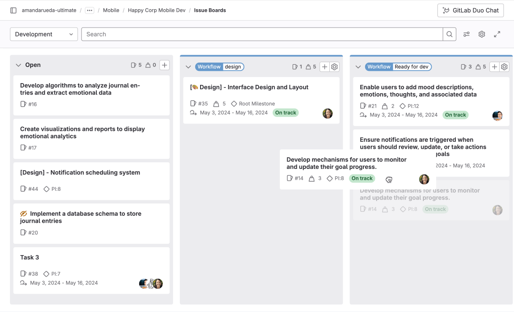

<a id="scrum-team"></a>

### Scrum 团队

在 Scrum 团队中，使用[多个议题板](#multiple-issue-boards)，以便每个 Scrum 团队都有自己的议题板。在 Scrum 板上，您可以在流程的每个阶段移动议题。例如：**待办**、**进行中**和**已完成**。

<a id="quick-assignments"></a>

### 快速指派

要快速将议题指派给团队成员：

1. 为每个团队成员创建[指派人列表](#assignee-lists)。
1. 将议题拖放到团队成员的列表中。

<a id="issue-board-terminology"></a>

## 议题板术语

一个**议题板**代表您议题的一个独特视图。它可以有多个列表，每个列表由以卡片形式呈现的议题组成。

一个**列表**是议题板上显示符合特定属性议题的列。除了默认的“打开”和“已关闭”列表外，每个额外的列表显示匹配您所选标签、指派人或里程碑的议题。在列表顶部，您可以看到属于该列表的议题数量。列表类型包括：

- **打开**（默认）：所有不属于其他列表的打开议题。总是作为最左侧的列表出现。
- **已关闭**（默认）：所有已关闭的议题。总是作为最右侧的列表出现。
- **标签列表**：显示具有某个标签的所有打开议题。
- [**指派人列表**](#assignee-lists)：显示分配给某个用户的所有打开议题。
- [**里程碑列表**](#milestone-lists)：显示属于某个里程碑的所有打开议题。
- [**迭代列表**](#iteration-lists)：显示属于某个迭代的所有打开议题。
- [**状态列表**](#status-lists)：显示具有特定状态的所有议题。

一个**卡片**是列表上的一个框，代表一个议题。您可以将卡片从一个列表拖到另一个列表，以更改其标签、指派人或里程碑。在卡片上您可以查看的信息包括：

- 议题标题
- 关联的标签
- 议题编号
- 指派人
- 权重
- 里程碑
- 迭代（专业版和旗舰版）
- 截止日期
- 时间跟踪估算
- 健康状态

一个**泳道**是议题板上议题的水平分组，例如按父史诗分组。

<a id="ordering-issues-in-a-list"></a>

## 列表中的议题排序

先决条件：

- 您必须对项目具有计划者、报告者、开发者、维护者或所有者角色。

当创建一个议题时，系统会分配一个相对顺序值，该值大于该议题所属项目或顶级群组的最大值。这意味着该议题在任何列表中都处于最底部。

当您访问议题板时，议题在每个列表中按顺序显示。您可以通过拖动议题来更改顺序。更改后的顺序会被保存，以便后续访问同一议题板的任何人看到重新排序，但有一些例外情况。

每当您拖动并重新排序议题时，其相对顺序值会相应更改。此后，每当该议题出现在任何议题板中时，都会根据更新后的相对顺序值进行排序。如果您的极狐GitLab 实例中的用户将议题 `A` 拖到议题 `B` 上方，则当这两个议题随后在同一实例的任何议题板中加载时，该排序将保持不变。例如，这可以是另一个项目议题板或另一个群组议题板。

此排序也会影响[议题列表](issues/sorting_issue_lists.md)。更改议题板中的顺序会更改议题列表中的顺序，反之亦然。

<a id="focus-mode"></a>

## 专注模式

在专注模式下，导航 UI 被隐藏，使您能够专注于议题板中的议题。要启用或禁用专注模式，请在右上角选择**切换专注模式** ()。

<a id="group-issue-boards"></a>

## 群组议题板

在群组导航级别可访问，群组议题板提供与项目级别议题板相同的功能。它可以显示属于该群组及其子群组的所有项目的议题。

极狐GitLab 基础版用户可以使用一个群组议题板。

<a id="gitlab-enterprise-features-for-issue-boards"></a>

## 极狐GitLab 企业版议题板功能

极狐GitLab 议题板在基础版中可用，但一些高级功能仅在[更高版本](https://gitlab.cn/pricing/)中提供。

<a id="configurable-issue-boards"></a>

### 可配置议题板



- Tier: 专业版，旗舰版
- Offering: JihuLab.com，私有化部署



议题板可以与[里程碑](milestones/_index.md)、[标签](labels.md)、指派人、权重和当前[迭代](../group/iterations/_index.md)关联，从而自动相应地筛选议题。这使您可以根据团队的需求创建独特的议题板。

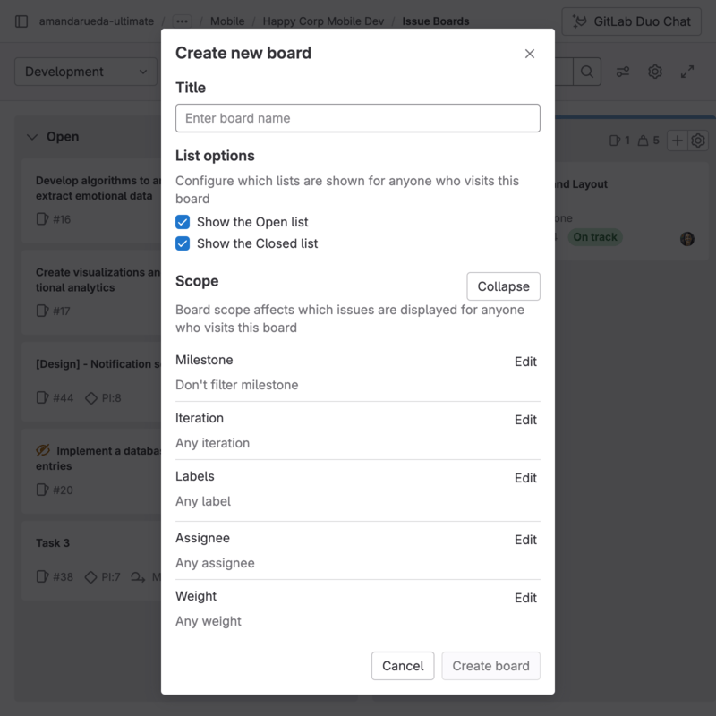

您可以在创建议题板时定义其范围，也可以通过选择**配置议题板** () 按钮来定义。在将里程碑、迭代、指派人或权重分配给议题板后，您将无法再通过搜索栏对这些属性进行筛选。要进行筛选，您需要从议题板中移除所需的范围（例如，里程碑、指派人或权重）。

如果您没有议题板的编辑权限，仍然可以通过选择**议题板配置** () 来查看配置。

<a id="assignee-lists"></a>

### 指派人列表



- Tier: 专业版，旗舰版
- Offering: JihuLab.com，私有化部署



与显示具有所选标签的所有议题的常规列表一样，您可以添加一个指派人列表，显示分配给某个用户的所有议题。您可以拥有一个同时包含标签列表和指派人列表的议题板。

先决条件：

- 您必须对项目具有计划者、报告者、开发者、维护者或所有者角色。

要添加指派人列表：

1. 选择**新建列表**。
1. 选择**指派人**。
1. 在下拉列表中，选择一个用户。
1. 选择**添加到议题板**。

现在已添加指派人列表，您可以通过[移动议题](#move-issues-and-lists)进出指派人列表来为相应用户分配或取消分配议题。要删除指派人列表，就像删除标签列表一样，选择垃圾桶图标。

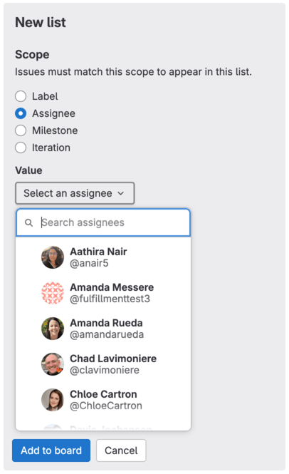

<a id="milestone-lists"></a>

### 里程碑列表



- Tier: 专业版，旗舰版
- Offering: JihuLab.com，私有化部署



您可以创建里程碑列表，按分配的里程碑筛选议题，为议题板提供更多自由度和可见性。

先决条件：

- 您必须对项目具有计划者、报告者、开发者、维护者或所有者角色。

要添加里程碑列表：

1. 选择**新建列表**。
1. 选择**里程碑**。
1. 在下拉列表中，选择一个里程碑。
1. 选择**添加到议题板**。

要更改议题的里程碑，[将议题卡片拖入或拖出](#move-issues-and-lists)里程碑列表。

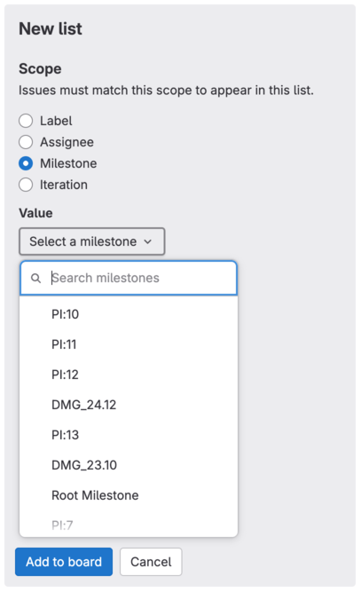

<a id="iteration-lists"></a>

### 迭代列表



- Tier: 专业版，旗舰版
- Offering: JihuLab.com，私有化部署



您可以创建迭代中的议题列表。

先决条件：

- 您必须对项目具有计划者、报告者、开发者、维护者或所有者角色。

要添加迭代列表：

1. 选择**新建列表**。
1. 选择**迭代**。
1. 在下拉列表中，选择一个迭代。
1. 选择**添加到议题板**。

要更改议题的迭代，[将议题卡片拖入或拖出](#move-issues-and-lists)迭代列表。

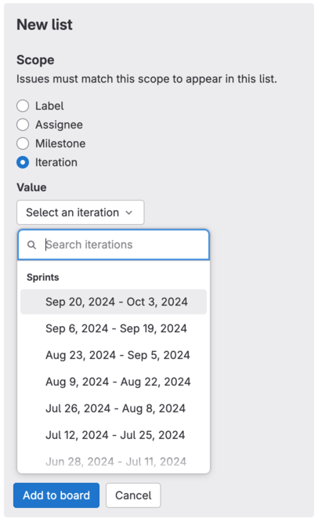

<a id="status-lists"></a>

### 状态列表



- Tier: 专业版，旗舰版
- Offering: JihuLab.com，私有化部署





- 在极狐GitLab 18.2 中引入，并带有名为 `work_item_status_feature_flag` 的功能标志。默认启用。
- 在极狐GitLab 18.4 中 GA。功能标志 `work_item_status_feature_flag` 已移除。



创建具有特定状态的议题列表。状态列表帮助您按工作流阶段（例如**进行中**或**已完成**）组织议题。

更多信息，请参阅[状态部分](../work_items/status.md)。

状态列表的行为与其他列表类型不同：

- **状态列表**：可以包括打开和已关闭的议题，具体取决于状态映射到打开还是关闭状态。
- **其他列表**（如指派人或里程碑）：始终仅显示打开的议题。

先决条件：

- 您必须对项目具有计划者、报告者、开发者、维护者或所有者角色。

要添加状态列表：

1. 选择**新建列表**。
1. 选择**状态**。
1. 从下拉列表中选择状态。
1. 选择**添加到议题板**。

状态列表被添加到议题板中，并显示具有该状态的议题。

要更改议题的状态，[将议题卡片拖入或拖出](#move-issues-and-lists)状态列表。


<a id="group-issues-in-swimlanes"></a>

### 在泳道中分组议题



- Tier: 专业版，旗舰版
- Offering: JihuLab.com，私有化部署



使用泳道，您可以可视化按史诗分组的议题。您的议题板保留所有其他功能，但采用不同的视觉组织方式。此功能在项目和群组级别均可用。

先决条件：

- 您必须对项目具有计划者、报告者、开发者、维护者或所有者角色。

要在议题板中按史诗分组议题：

1. 选择**查看选项** ()。
1. 选择**史诗泳道**。

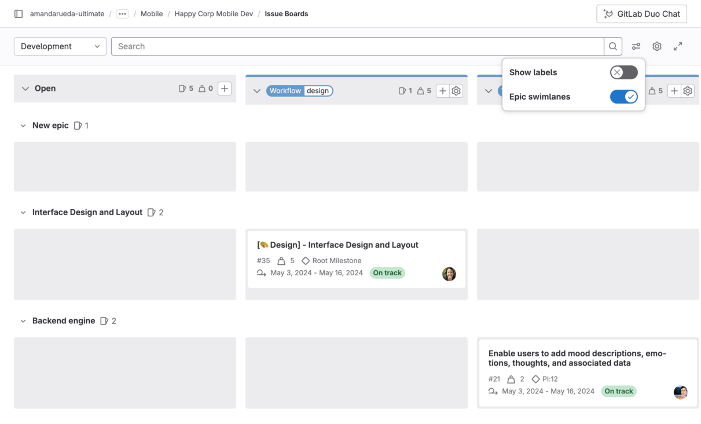

然后，您可以在不离开此视图的情况下[编辑](#edit-an-issue)议题，并[拖放](#move-issues-and-lists)议题以更改其位置和史诗分配：

- 要对议题重新排序，将其拖放到列表中的新位置。
- 要将议题分配给另一个史诗，将其拖放到该史诗的水平泳道。
- 要从史诗中移除议题，将其拖放到**未分配史诗的议题**泳道。
- 要同时将议题移至另一个史诗和另一个列表，沿对角线拖动议题。

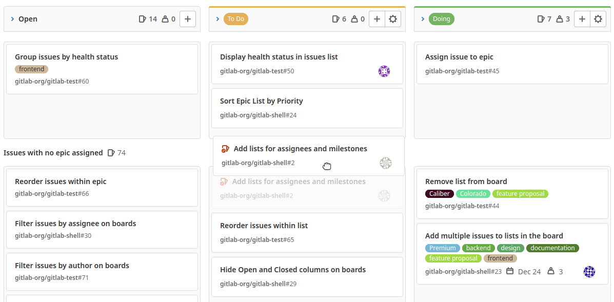

<a id="sum-of-issue-weights"></a>

### 议题权重总和



- Tier: 专业版，旗舰版
- Offering: JihuLab.com，私有化部署



每个列表的顶部显示属于该列表的议题的权重总和。这在将议题板用于容量分配时尤其有用，尤其是结合[指派人列表](#assignee-lists)使用时。

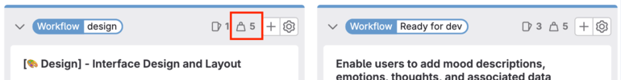

<a id="work-in-progress-limits"></a>

### 进行中工作限制



- Tier: 专业版，旗舰版
- Offering: JihuLab.com，私有化部署





- 按权重设置限制在极狐GitLab 17.11 中引入。



您可以为议题板上的每个议题列表设置进行中工作限制 (WIP)。设置限制后，当前状态和配置的限制会显示在议题板列表标题中。

列表中的一条线将限制内的条目与超出限制的条目分开。您无法在默认列表（**打开**和**已关闭**）上设置 WIP 限制。

<a id="types-of-limits"></a>

#### 限制类型

极狐GitLab 支持两种 WIP 限制：

- **条目数**：限制列表中议题的数量，不考虑其权重。议题板标题显示列表中的议题数量和条目数限制。

  例如，如果有 4 个议题且条目数限制为 3，标题显示 **4/3**。

  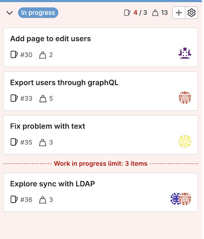

- **权重**：限制列表中议题的总权重。议题板标题显示列表中议题的总权重和权重限制。

  例如，如果议题权重总和为 8 且权重限制为 5，标题显示 **8/5**。

  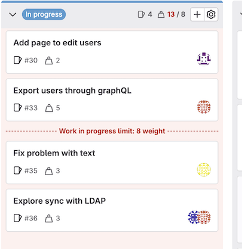

示例：

- 当列表中有 4 个议题且条目数限制为 5 时，标题显示 **4/5**。如果超出限制，当前议题数量会以红色显示。
- 当列表中有 5 个议题且条目数限制为 5 时，如果您将另一个议题移到该列表，列表标题会显示 **6/5**，其中 6 以红色显示。进行中工作限制线显示在第六个议题之前。
- 使用权重限制时，如果您有三个议题，权重分别为 1、2 和 5（总权重 8），而权重限制为 5，则标题显示 **8/5**，其中 8 以红色显示。进行中工作限制线出现在总权重在限制内的议题之后，将它们与超出限制的议题分隔。

<a id="set-work-in-progress-limit"></a>

#### 设置进行中工作限制

先决条件：

- 您必须对项目具有计划者、报告者、开发者、维护者或所有者角色。

要在议题板上为列表设置 WIP 限制：

1. 在要编辑的列表顶部，选择**编辑列表设置** ()。列表设置侧边栏在右侧打开。
1. 在**进行中工作限制**旁边，选择**编辑**。
1. 从下拉列表中选择限制类型：
   - **条目数**：按议题数量限制。
   - **权重**：按议题总权重限制。
1. 输入最大条目数或最大权重。
1. 按 <kbd>Enter</kbd> 保存。

要移除 WIP 限制，选择**移除限制**。

<a id="blocked-issues"></a>

### 被阻止的议题



- Tier: 专业版，旗舰版
- Offering: JihuLab.com，私有化部署



如果某个议题[被另一个议题阻止](issues/related_issues.md#blocking-issues)，其标题旁边会出现一个图标，表示其被阻止状态。

当您将鼠标悬停在被阻止图标 () 上时，会显示详细信息的弹出框。

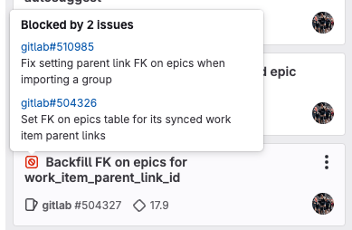

<a id="actions-you-can-take-on-an-issue-board"></a>

## 您可以在议题板上执行的操作

- [编辑议题](#edit-an-issue)。
- [创建新列表](#create-a-new-list)。
- [移除现有列表](#remove-a-list)。
- [从列表中移除议题](#remove-an-issue-from-a-list)。
- [筛选议题](#filter-issues)（出现在您的议题板上）。
- [移动议题和列表](#move-issues-and-lists)。
- 拖放并重新排序列表。
- 更改议题标签（通过在列表之间拖动议题）。
- 关闭议题（将其拖到**已关闭**列表）。

<a id="edit-an-issue"></a>

### 编辑议题

您无需离开议题板视图即可编辑议题。要打开右侧边栏，选择一个议题卡片（而非其标题）。

先决条件：

- 您必须对项目具有计划者、报告者、开发者、维护者或所有者角色。

您可以在右侧边栏中编辑以下议题属性：

- 指派人
- 机密性
- 截止日期
- [史诗](../group/epics/_index.md)
- [健康状态](issues/managing_issues.md#health-status)
- [迭代](../group/iterations/_index.md)
- 标签
- 里程碑
- 通知设置
- 标题
- [权重](../work_items/weight.md)
- 时间跟踪

当您从议题板中选择一个议题卡片时，该议题会打开一个详细信息面板。在那里，您可以编辑所有字段，包括描述、评论或相关条目。

<a id="create-a-new-list"></a>

### 创建新列表



- 在现有列表之间创建列表在极狐GitLab 17.5 中引入。



您可以在两个现有列表之间或议题板的右侧创建新列表。

要在两个列表之间创建新列表：

1. 在顶部栏中，选择**搜索或跳转到**并找到您的项目。
1. 在左侧边栏中，选择**计划** > **议题板**。
1. 将鼠标悬停或在两个列表之间移动键盘焦点。
1. 选择**新建列表**。新列表面板打开。

   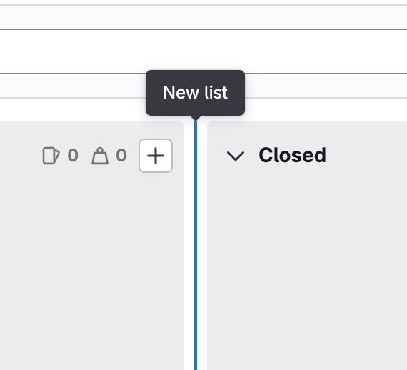

1. 选择作为新列表基础的标签、用户、里程碑、迭代或状态。
1. 选择**添加到议题板**。

新列表将插入到与新列表面板相同的位置。

要移动和重新排序列表，请拖动它们。

或者，您可以选择议题板右端的**新建列表**。新列表将插入到列表的最右端，位于**已关闭**列表之前。

<a id="remove-a-list"></a>

### 移除列表

移除列表不会对议题和标签产生任何影响，因为它仅仅移除了列表视图。如果需要，您可以随时重新创建它。

先决条件：

- 您必须对项目具有计划者、报告者、开发者、维护者或所有者角色。

要从议题板移除列表：

1. 在要移除的列表顶部，选择**编辑列表设置** ()。列表设置侧边栏在右侧打开。
1. 选择**移除列表**。
1. 在确认对话框中，再次选择**移除列表**。

<a id="add-issues-to-a-list"></a>

### 将议题添加到列表

先决条件：

- 您必须对项目具有计划者、报告者、开发者、维护者或所有者角色。

如果您的议题板范围限定为一个或多个属性，请转到您要添加的议题，并应用与议题板范围相同的属性。

例如，要将议题添加到范围限定为 `Doing` 标签的列表中，在群组议题板中：

1. 转到群组或其中一个子群组或项目中的某个议题。
1. 添加 `Doing` 标签。

该议题现在应显示在您议题板的 `Doing` 列表中。

<a id="remove-an-issue-from-a-list"></a>

### 从列表中移除议题

当某个议题不再属于某个列表时，您可以将其移除。

先决条件：

- 您必须对项目具有计划者、报告者、开发者、维护者或所有者角色。

具体步骤取决于列表的范围：

1. 要打开右侧边栏，选择议题卡片。
1. 移除使议题留在列表中的关联。如果是标签列表，移除标签；如果是指派人列表，取消分配用户。

<a id="filter-issues"></a>

### 筛选议题

您可以使用议题板顶部的筛选器，仅显示您想要的结果。这与[议题跟踪器](issues/_index.md)中使用的筛选类似。

先决条件：

- 您必须对项目具有计划者、报告者、开发者、维护者或所有者角色。

您可以按以下条件筛选：

- 指派人
- 作者
- [史诗](../group/epics/_index.md)
- [迭代](../group/iterations/_index.md)
- 标签
- 里程碑
- 我的反应
- 版本
- 类型（议题/事件）
- [权重](../work_items/weight.md)
- [状态](../work_items/status.md)

<a id="filtering-issues-in-a-group-board"></a>

#### 在群组议题板中筛选议题
当在 **群组** 看板中[筛选议题](#filter-issues)时，请注意以下行为：

- 里程碑：您可以按群组及其后代群组所属的里程碑进行筛选。
- 标签：您只能按群组所属的标签进行筛选，不能按其后代群组的标签筛选。

当您使用右侧边栏单独编辑议题时，还可以额外从议题所属的 **项目** 中选择里程碑和标签。

### 移动议题和列表

您可以通过拖拽来移动议题和列表。

前置条件：

- 您必须在极狐GitLab 中拥有项目的计划者、报告者、开发者、维护者或所有者角色。

要移动议题，请选中议题卡片并将其拖到当前列表中的其他位置，或拖到另一个列表中。了解[在列表之间拖拽议题](#dragging-issues-between-lists) 可能产生的影响。

要移动列表，请选中其顶部栏并水平拖拽。您不能移动 **开放** 和 **已关闭** 列表，但可以在编辑议题看板时将它们隐藏。

#### 将议题移至列表开头



- 于极狐GitLab 15.4 引入。



您可以通过菜单快捷方式将议题移至列表顶部。

即使其他议题被筛选器隐藏，您的议题也会被移至列表顶部。

前置条件：

- 您必须至少拥有项目的计划者角色。

要将议题移至列表开头：

1. 在议题看板中，将鼠标悬停在要移动的议题卡片上。
1. 选择 **卡片选项** ()，然后选择 **移至列表开头**。

#### 将议题移至列表末尾



- 于极狐GitLab 15.4 引入。



您可以通过菜单快捷方式将议题移至列表底部。

即使其他议题被筛选器隐藏，您的议题也会被移至列表底部。

前置条件：

- 您必须至少拥有项目的计划者角色。

要将议题移至列表末尾：

1. 在议题看板中，将鼠标悬停在要移动的议题卡片上。
1. 选择 **卡片选项** ()，然后选择 **移至列表末尾**。

#### 在列表之间拖拽议题

要将议题移到另一个列表，请选中议题卡片并将其拖到该列表上。

当您在列表之间拖拽议题时，结果会因来源列表和目标列表的不同而有所区别。

|                              | 到 开放        | 到 已关闭   | 到 标签B 列表                | 到 指派人Bob 列表          |
| ---------------------------- | -------------- | ----------- | ------------------------------ | ----------------------------- |
| **从 开放**                | -              | 关闭议题 | 添加标签B                    | 指派 Bob                    |
| **从 已关闭**              | 重新打开议题   | -           | 重新打开议题并添加标签B   | 重新打开议题并指派 Bob   |
| **从 标签A 列表**        | 移除标签A | 关闭议题 | 移除标签A并添加标签B | 指派 Bob                    |
| **从 指派人Alice 列表** | 取消指派 Alice | 关闭议题 | 添加标签B                    | 取消指派 Alice 并指派 Bob |

## 提示

请记住以下几点：

- 在列表之间移动议题会从来源列表中移除标签，并添加目标列表的标签。
- 如果议题有多个标签，它可以同时存在于多个列表中。
- 如果议题已添加标签，列表会自动填充这些议题。
- 选择卡片内的议题标题会跳转到该议题。
- 选择卡片内的标签会快速筛选整个议题看板，并仅显示所有列表中带有该标签的议题。
- 当议题从状态列表移到开放列表时，会应用默认的开放状态。同样，移至已关闭列表时，会应用默认的已关闭状态。
- 出于性能和可见性原因，每个列表默认仅显示前 20 个议题。如果议题超过 20 个，向下滚动后会出现下 20 个。

## 议题看板故障排除

### 按作者或指派人筛选时，群组议题看板出现 `获取用户时出现问题` 错误

如果在群组议题看板上按作者或指派人筛选时出现带有 `获取用户时出现问题` 的横幅错误，请确保您已被添加为当前群组的成员。非成员没有权限在议题看板上按作者或指派人筛选时列出群组成员。

要修复此错误，您应以访客、计划者、报告者、开发者、维护者或所有者角色将所有用户添加到顶级群组。

### 使用 Rails 控制台修复议题看板无法加载和超时的问题

如果议题看板在 UI 中不加载并超时，请使用 Rails 控制台调用议题再平衡服务来修复：

1. [启动 Rails 控制台会话](../../administration/operations/rails_console.md#starting-a-rails-console-session)。
1. 运行以下命令：

   ```ruby
   p = Project.find_by_full_path('<username-or-group>/<project-name>')

   Issues::RelativePositionRebalancingService.new(p.root_namespace.all_projects).execute
   ```

1. 要退出 Rails 控制台，请输入 `quit`。

