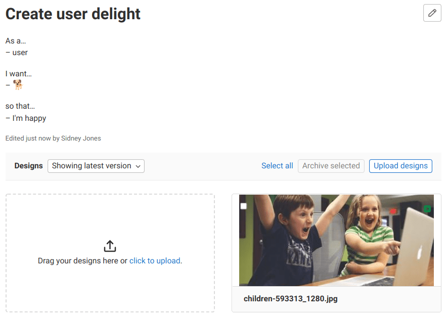
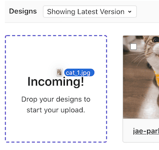

<!--- start_remove The following content will be removed on remove_date: '2027-05-15' -->



- Tier: 基础版，专业版，旗舰版
- Offering: JihuLab.com，私有化部署



> [!warning]
> 此功能已在极狐GitLab 18.6 中 [已弃用](../../../update/deprecations.md#design-management-deprecated)，
> 并计划在 20.0 中移除。
> 这是一个破坏性变更。
> 在极狐GitLab 20.0 及之后版本中，用户将不再能够上传新的设计。
> 现有设计将保持只读模式，直到极狐GitLab 21.0，给予用户根据需要保存设计的时间。
> 极狐GitLab 正在探索能够更好地与设计师现有工具集成的替代方案。

<!--- end_remove -->

通过设计管理，你可以将设计资产（包括线框图和模型图）上传到极狐GitLab 议题，并将它们集中存储。产品设计师、产品经理和工程师可以在一个单一信任来源上协作处理设计。

你可以与团队分享设计模型，也可以查看和处理视觉回归问题。

## 先决条件

<a id="prerequisites"></a>



- **相对路径** 字段在极狐GitLab 16.3 中从 **Gitaly 相对路径** [重命名](https://gitlab.com/gitlab-org/gitlab/-/merge_requests/128416)。



- [Git 大文件存储（LFS）](../../../topics/git/lfs/_index.md) 必须启用：
  - 在 JihuLab.com 上，LFS 已经启用。
  - 在私有化部署的极狐GitLab 实例上，极狐GitLab 管理员必须 [全局启用 LFS](../../../administration/lfs/_index.md)。
  - 在 JihuLab.com 和私有化部署的极狐GitLab 实例上，都必须为项目本身 [启用 LFS](../settings/_index.md#configure-project-features-and-permissions)。
    如果已全局启用，LFS 默认对所有项目启用。如果你的项目已禁用，你必须重新启用它。

  设计存储为 LFS 对象。
  图像缩略图存储为其他上传文件，并且不与项目关联，而是与特定的设计模型关联。

  极狐GitLab 管理员可以通过进入 **管理员** > **项目**，然后选择相应项目来验证哈希存储项目的相对路径。**相对路径** 字段的值中包含 `@hashed`。

如果未满足要求，**设计** 部分会通知你。

## 支持的文件类型

<a id="supported-file-types"></a>

你可以上传以下类型的文件作为设计：

- BMP
- GIF
- ICO
- JPEG
- JPG
- PNG
- TIFF
- WEBP

## 查看设计

<a id="view-a-design"></a>

**设计** 部分位于议题描述中。

先决条件：

- 你必须具有项目的访客、计划者、报告者、开发者、维护者或所有者角色。

要查看设计：

1. 进入一个议题。
1. 在 **设计** 部分，选择你想要查看的设计图像。

所选设计将打开。你可以随后 [放大该设计](#zoom-in-on-a-design) 或 [创建评论](#add-a-comment-to-a-design)。



查看设计时，你可以切换到其他设计。为此，可以：

- 在右上角选择 **转到上一个设计** () 或 **转到下一个设计** ()。
- 按下键盘上的 <kbd>Left</kbd> 或 <kbd>Right</kbd> 键。

要返回议题视图，可以：

- 在左上角选择关闭图标 ()。
- 按下键盘上的 <kbd>Esc</kbd> 键。

添加设计后，图像缩略图上会显示绿色图标 ()。当设计在当前版本中 [被更改](#add-a-new-version-of-a-design) 后，会显示蓝色图标 ()。

### 放大设计

<a id="zoom-in-on-a-design"></a>

你可以通过放大和缩小图像来更详细地探索设计：

- 要控制缩放比例，在图像底部选择加号（`+`）和减号（`-`）。
- 要重置缩放级别，选择重做图标 ()。

要在放大后移动图像，拖动图像即可。

## 向议题添加设计

<a id="add-a-design-to-an-issue"></a>



- 编辑描述 [引入](https://gitlab.com/gitlab-org/gitlab/-/issues/388449) 于极狐GitLab 16.1。
- 向议题添加设计的最低角色在极狐GitLab 16.11 中从开发者 [更改](https://gitlab.com/gitlab-org/gitlab/-/merge_requests/147053) 为报告者。
- 向议题添加设计的最低角色在极狐GitLab 17.7 中从报告者 [更改](https://gitlab.com/gitlab-org/gitlab/-/merge_requests/169256) 为计划者。



先决条件：

- 你必须具有项目的计划者、报告者、开发者、维护者或所有者角色。
- 上传文件的名称不能超过 255 个字符。

要向议题添加设计：

1. 进入一个议题。
1. 任选其一：
   - 选择 **上传设计**，然后从文件浏览器中选择图像。你一次最多可以选择 10 个文件。
     <!-- vale gitlab_base.SubstitutionWarning = NO -->
   - 选择 **点击上传**，然后从文件浏览器中选择图像。你一次最多可以选择 10 个文件。
     <!-- vale gitlab_base.SubstitutionWarning = YES -->

   - 从文件浏览器中拖动文件，并将其放到 **设计** 部分的放置区域。

     

   - 截取屏幕截图或将本地图像文件复制到剪贴板，将鼠标悬停在放置区域上，然后按下 <kbd>Control</kbd> 或 <kbd>Command</kbd>+<kbd>V</kbd>。

     像这样粘贴图像时，请注意以下几点：

     - 你每次只能粘贴一张图像。当你粘贴多个已复制的文件时，只有第一个会被上传。
     - 如果你粘贴的是屏幕截图，图像将以 PNG 格式添加，名称为：`design_<timestamp>.png`。
     - Internet Explorer 不支持此操作。

## 添加设计的新版本

<a id="add-a-new-version-of-a-design"></a>



- 添加设计新版本的最低角色在极狐GitLab 16.11 中从开发者 [更改](https://gitlab.com/gitlab-org/gitlab/-/merge_requests/147053) 为报告者。
- 添加设计新版本的最低角色在极狐GitLab 17.7 中从报告者 [更改](https://gitlab.com/gitlab-org/gitlab/-/merge_requests/169256) 为计划者。



随着有关设计的讨论继续，你可能想上传设计的新版本。

先决条件：

- 你必须具有项目的计划者、报告者、开发者、维护者或所有者角色。

为此，[添加一个设计](#add-a-design-to-an-issue) 并使用相同的文件名。

要浏览所有设计版本，请使用 **设计** 部分顶部的下拉列表。它会显示为 **显示最新版本** 或 **显示版本 #N**。

### 跳过的设计

<a id="skipped-designs"></a>

当你上传一个与现有已上传设计具有相同文件名且内容也相同的图像时，它会被跳过。这意味着不会创建设计的新版本。当设计被跳过时，会显示一条警告消息。

## 存档设计

<a id="archive-a-design"></a>



- 存档设计的最低角色在极狐GitLab 16.11 中从开发者 [更改](https://gitlab.com/gitlab-org/gitlab/-/merge_requests/147053) 为报告者。
- 存档设计的最低角色在极狐GitLab 17.7 中从报告者 [更改](https://gitlab.com/gitlab-org/gitlab/-/merge_requests/169256) 为计划者。



你可以单独存档一个设计，或选择多个一次存档。

存档的设计不会被永久删除。你可以浏览 [先前的版本](#add-a-new-version-of-a-design)。

当你存档一个设计后，它的 URL 会改变。如果该设计在最新版本中不可用，则只能通过包含版本的 URL 来链接它。

先决条件：

- 你必须具有项目的计划者、报告者、开发者、维护者或所有者角色。
- 你只能存档设计的最新版本。

要存档单个设计：

1. 选择要查看的设计以放大它。
1. 在右上角选择 **存档设计** ()。
1. 选择 **存档设计**。

要一次存档多个设计：

1. 选择要存档的设计上的复选框。
1. 选择 **存档所选**。

## 设计管理数据持久性

<a id="design-management-data-persistence"></a>

- 以下情况不会删除设计管理数据：
  - [删除项目](https://gitlab.com/gitlab-org/gitlab/-/issues/13429)。
  - [删除议题](https://gitlab.com/gitlab-org/gitlab/-/issues/13427)。

### 复制设计管理数据

<a id="replicate-design-management-data"></a>

设计管理数据 [可以被复制](../../../administration/geo/replication/datatypes.md#replicated-data-types)，在极狐GitLab 16.1 及之后版本中，它还可以 [被 Geo 验证](https://gitlab.com/gitlab-org/gitlab/-/issues/355660)。

## 用于描述的 Markdown 和富文本编辑器

<a id="markdown-and-rich-text-editors-for-descriptions"></a>



- [引入](https://gitlab.com/gitlab-org/gitlab/-/issues/388449) 于极狐GitLab 16.1，[带有功能标志](../../../administration/feature_flags/_index.md)，名为 `content_editor_on_issues`，默认禁用。
- 在极狐GitLab 16.2 中 [在 JihuLab.com 和私有化部署上启用](https://gitlab.com/gitlab-org/gitlab/-/issues/375172)。
- 功能标志 `content_editor_on_issues` 于极狐GitLab 16.5 中移除。



你可以在设计描述中使用 Markdown 和富文本编辑器。这与你在整个极狐GitLab 中评论时使用的编辑器相同。

## 重新排序设计

<a id="reorder-designs"></a>

你可以通过将它们拖拽到新位置来更改设计的顺序。

## 向设计添加评论

<a id="add-a-comment-to-a-design"></a>

你可以就上传的设计发起 [讨论](../../discussions/_index.md)。为此：

1. 进入一个议题。
1. 选择设计。
1. 点击图像。在该位置会创建一个图钉，标识讨论的位置。
1. 输入你的消息。
1. 选择 **评论**。

你可以通过在图钉周围拖动来调整其位置。当你的设计布局发生变化时，或为了移动图钉以便在其位置添加新的图钉时，可以使用此功能。

新的讨论串会获得不同的图钉编号，你可以使用它们进行引用。

新的讨论将输出到议题动态中，以便所有相关人员都能参与讨论。

## 从设计中删除评论

<a id="delete-a-comment-from-a-design"></a>



- 从设计中删除评论的最低角色在极狐GitLab 17.7 中从报告者 [更改](https://gitlab.com/gitlab-org/gitlab/-/merge_requests/169256) 为计划者。



先决条件：

- 你必须具有项目的计划者、报告者、开发者、维护者或所有者角色。

要从设计中删除评论：

1. 在要删除的评论上，选择 **更多操作**  > **删除评论**。
1. 在确认对话框中，选择 **删除评论**。

## 解决设计上的讨论串

<a id="resolve-a-discussion-thread-on-a-design"></a>

当你完成对设计某部分的讨论后，可以解决该讨论串。

要将线程标记为已解决或重新打开，可以：

- 在讨论的首条评论的右上角，选择 **解决讨论** 或 **重新打开讨论** ()。
- 向讨论添加一条新评论，并勾选或取消勾选 **解决讨论** 复选框。

解决讨论串也会将讨论中与笔记相关的任何待处理 [待办事项](../../todos.md) 标记为已完成。只有触发操作的用户的相关待办事项会受到影响。

你已解决的评论图钉将从设计中消失，以便为新的讨论腾出空间。要重新查看已解决的讨论，请展开可见线程下方的 **已解决的评论**。

## 为设计添加待办事项

<a id="add-a-to-do-item-for-a-design"></a>

要为设计添加 [待办事项](../../todos.md)，请在侧边栏中选择 **添加待办事项**。

## 在 Markdown 中引用设计

<a id="refer-to-a-design-in-markdown"></a>

你可以在 [Markdown](../../markdown.md) 文本框中引用设计。在评论或描述中粘贴设计的原始 URL，它将显示为一个简短的引用。

例如，如果你将设计引用为：

```markdown
See https://gitlab.com/gitlab-org/gitlab/-/issues/13195/designs/Group_view.png。
```

极狐GitLab 会自动将原始 URL 渲染为缩略的 [引用](../../markdown.md#gitlab-specific-references)：

> See [#13195[Group_view.png]](https://gitlab.com/gitlab-org/gitlab/-/issues/13195/designs/Group_view.png)。

链接到图像与在评论或描述中 [嵌入图像](../../markdown.md#images) 不同。无法以这种方式嵌入设计。

## 设计活动记录

<a id="design-activity-records"></a>

极狐GitLab 会跟踪设计上的用户活动事件（创建、删除和更新），并显示在 [用户个人资料](../../profile/_index.md#access-your-user-profile)、[群组](../../group/manage.md#view-group-activity) 和 [项目](../working_with_projects.md#view-project-activity) 活动页面上。

## 极狐GitLab-Figma 插件

<a id="gitlab-figma-plugin"></a>

你可以使用极狐GitLab-Figma 插件，直接从 Figma 将你的设计上传到极狐GitLab 的议题中。

要在 Figma 中使用该插件，请从 [Figma 目录](https://www.figma.com/community/plugin/860845891704482356/gitlab) 安装它，并通过个人访问令牌连接到极狐GitLab。

更多信息，请参阅 [插件文档](https://gitlab.com/gitlab-org/gitlab-figma-plugin/-/wikis/home)。

## 疑难解答

<a id="troubleshooting"></a>

在使用设计管理时，你可能会遇到以下问题。

### 找不到设计

<a id="could-not-find-design"></a>

你可能会收到一个错误，指出 `无法找到设计`。

当设计已被 [存档](#archive-a-design)，因此它在最新版本中不可用，且你跟踪的链接没有指定版本时，会出现此问题。

当你存档一个设计后，它的 URL 会改变。如果该设计在最新版本中不可用，则只能通过包含版本的 URL 来链接它。

例如，`https://gitlab.example.com/mygroup/myproject/-/issues/123456/designs/menu.png?version=503554`。你将无法再通过 `https://gitlab.example.com/mygroup/myproject/-/issues/123456/designs/menu.png` 访问 `menu.png`。

解决方法是从 **设计** 部分顶部的下拉列表中选择一个先前的版本。它会显示为 **显示最新版本** 或 **显示版本 #N**。