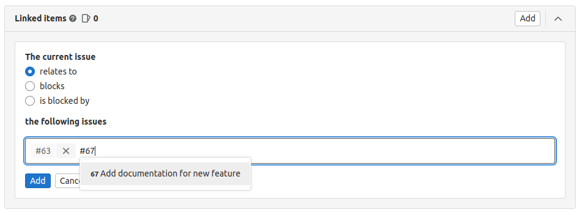
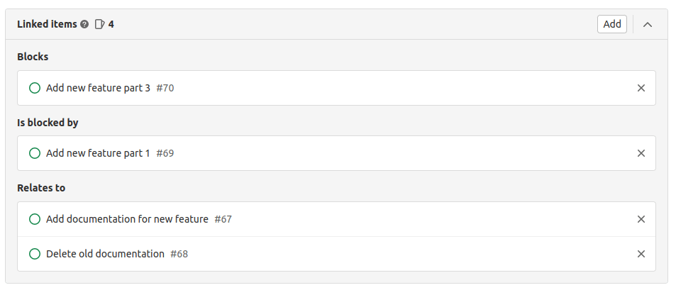
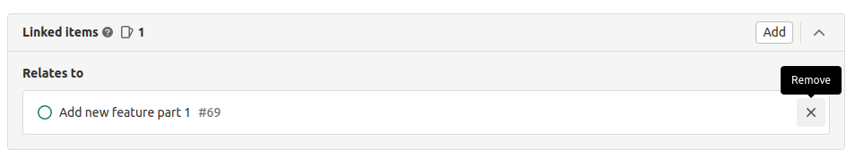



- Tier: 基础版，专业版，旗舰版
- Offering: JihuLab.com，私有化部署





- 在极狐GitLab 17.0 中，所需最低角色从报告者（如果为 true）变更为访客。



关联议题是任意两个议题之间的双向关系，并显示在议题描述下方的模块中。你可以在不同项目中关联议题。

只有当用户能同时看到两个议题时，这种关系才会在 UI 中显示。当你尝试关闭一个存在未解决阻塞的议题时，系统会显示警告。

> [!note]
> 要通过我们的 API 管理关联议题，请参阅 [议题链接 API](../../../api/issue_links.md)。

## 添加关联议题

先决条件：

- 你必须在这两个项目中都拥有访客、计划者、报告者、开发者、维护者或所有者角色。

要将一个议题关联到另一个议题：

1. 在议题的 **关联条目** 部分，
   选择添加关联议题按钮 ()。
1. 选择两个议题之间的关系。可以选：
   - **relates to**
   - [**blocks**](#blocking-issues)
   - [**is blocked by**](#blocking-issues)
1. 输入议题编号或粘贴议题的完整 URL。

   

   同一项目中的议题只需指定引用编号即可。
   不同项目的议题需要提供更多信息，例如群组和项目名称。例如：

   - 同一项目：`#44`
   - 同一群组：`project#44`
   - 不同群组：`group/project#44`

   有效的引用会被添加到一个临时列表中，供你审查。

1. 当你添加完所有关联议题后，选择 **添加**。

完成所有关联议题的添加后，你可以看到它们已被分类，以便更直观地理解它们之间的关系。

你也可以通过提交信息或另一个议题或 MR 的描述来添加关联议题。更多信息，请参阅 [交叉关联议题](crosslinking_issues.md)。

## 移除关联议题

在议题的 **关联条目** 部分，选择每个议题卡片右侧的移除按钮 () 进行移除。

由于是双向关系，这种关系将不再出现在任一议题中。

访问我们的 [权限](../../permissions.md) 页面获取更多信息。

## 阻塞议题



- Tier: 专业版，旗舰版
- Offering: JihuLab.com，私有化部署



当你 [添加关联议题](#add-a-linked-issue) 时，可以表明它 **阻塞** 或 **被另一个议题阻塞**。

被其他议题阻塞的议题，在其标题旁会有一个图标 ()，显示在议题列表和 [看板](../issue_board.md) 中。
当阻塞议题被关闭或它们的关系被更改或 [移除](#remove-a-linked-issue) 后，该图标会消失。

如果你尝试使用“关闭议题”按钮关闭一个被阻塞的议题，会出现一条确认信息。

另外，如果你在一个合并请求的描述中添加 `Closes #issue`，而 `#issue` 是阻塞了其他议题的议题，合并请求被合并时，被阻塞的议题不会自动关闭。

当项目通过点击“关闭议题”按钮无法关闭被阻塞的议题时，会出现一条消息，告知你需要关闭阻塞它的议题。

---

### 绕过阻塞



- 在极狐GitLab 18.8 中引入。



默认情况下，你不能通过合并请求自动关闭一个存在未解决阻塞的议题。例如，如果 `#feature` 被 `#bug` 阻塞，那么带有 `Closes #feature` 的 MR 将无法关闭 `#feature`，除非 `#bug` 已被关闭。

你可以启用“绕过阻塞”设置，即使议题仍有未解决的阻塞，也允许将其关闭。此设置位于议题或合并请求上的 **合并请求** 部分，提供了一种手动覆盖机制。

> [!note]
> 此功能的可用性由一个功能标志控制。更多信息，请参阅历史。


