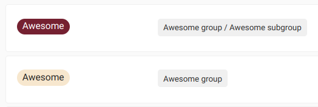
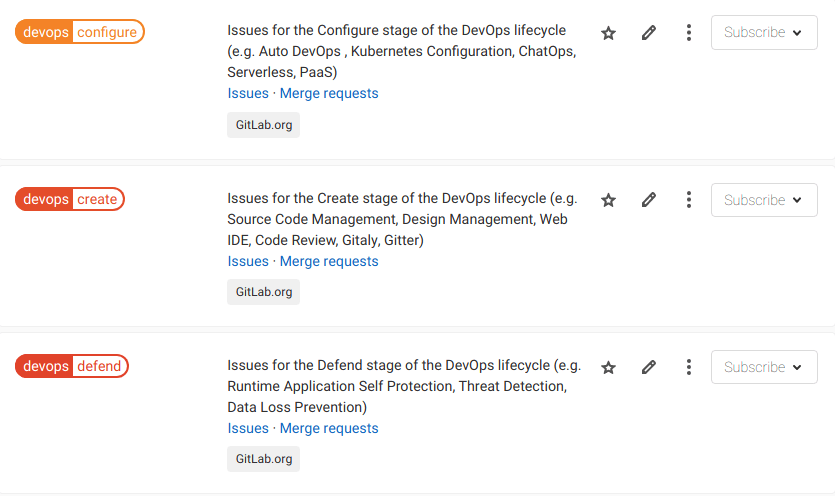
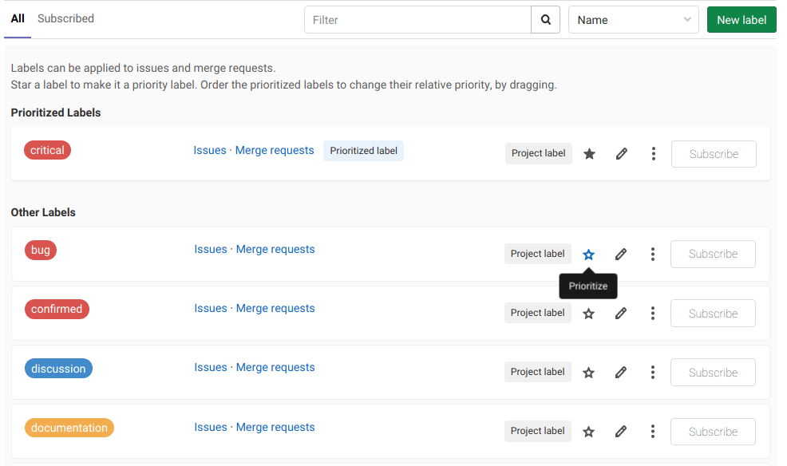



- Tier: 基础版，专业版，旗舰版
- Offering: JihuLab.com，私有化部署



标记用于在极狐GitLab 的各项功能中组织和跟踪工作。
随着项目从小团队成长为大组织，标记可帮助您跟踪和管理日益增长的工作量。
标记可以：

- 使用自定义属性对议题、合并请求和史诗进行分类。
- 在列表和看板中筛选内容。
- 使用颜色和描述性标题对工作项进行优先级排序。
- 使用范围标记跟踪优先级和严重性。
- 通过有组织的分组构建工作流。

## 标记类型

在极狐GitLab 中使用三种类型的标记：

- **项目标记** 只能分配给该项目中的议题和合并请求。
- **群组标记** 可以分配给所选群组或其子群组中任何项目的议题、合并请求和[史诗](../group/epics/_index.md)。
- **实例标记** 由实例[管理员创建](../../administration/labels.md)，并复制到所有新项目。

## 分配和取消分配标记

您可以将标记分配给任何议题、合并请求或史诗。

更改后的标记会立即对其他用户可见，无需刷新页面，适用于以下对象：

- 史诗
- 事件
- 议题
- 合并请求

要分配或取消分配标记：

1. 在侧边栏的 **标记** 部分，选择 **编辑**。
1. 在 **分配标记** 列表中，通过输入名称来搜索标记。
   您可以重复搜索以添加更多标记。
   选定的标记会带有复选标记。
1. 选择要分配或取消分配的标记。
1. 要应用对标记的更改，请选择 **分配标记** 旁边的 **X**，或选择标记部分外部的任意区域。

或者，要取消分配标记，请选择要取消分配的标记上的 **X**。

您还可以使用快速操作来分配和取消分配标记：

- 使用 [`/label`](quick_actions.md#label) 分配标记。
- 使用 [`/unlabel`](quick_actions.md#unlabel) 移除标记。
- 使用 [`/relabel`](quick_actions.md#relabel) 移除所有标记并分配新标记。

## 查看可用标记

### 查看项目标记

要查看**项目标记**：

1. 在顶部栏中，选择 **搜索或跳转到** 并找到您的项目。
1. 在左侧边栏中，选择 **管理** > **标记**。

或者：

1. 查看议题或合并请求。
1. 在右侧边栏的 **标记** 部分，选择 **编辑**。
1. 选择 **管理项目标记**。

标记列表包括在项目中创建的标记以及在该项目的祖先群组中创建的所有标记。对于每个标记，您可以查看其创建位置的项目或群组路径。

### 查看群组标记

要查看**群组标记**：

1. 在顶部栏中，选择 **搜索或跳转到** 并找到您的群组。
1. 在左侧边栏中，选择 **管理** > **标记**。

或者：

1. 查看史诗。
1. 在右侧边栏的 **标记** 部分，选择 **编辑**。
1. 选择 **管理群组标记**。

该列表仅包含在该群组中创建的所有标记。它不列出在该群组项目中创建的任何标记。

## 创建标记

先决条件：

- 您必须对该项目或群组具有计划者、报告者、开发者、维护者或所有者角色。

### 创建项目标记

要创建项目标记：

1. 在顶部栏中，选择 **搜索或跳转到** 并找到您的项目。
1. 在左侧边栏中，选择 **管理** > **标记**。
1. 选择 **新建标记**。
1. 在 **标题** 字段中，为标记输入一个简短、描述性的名称。您也可以使用此字段创建[范围标记，即互斥标记](#scoped-labels)。
1. 可选。在 **描述** 字段中，输入有关如何使用以及何时使用此标记的其他信息。
1. 可选。通过从可用颜色中选择，或在 **背景颜色** 字段中输入十六进制颜色值来选择颜色。
1. 选择 **创建标记**。

### 从议题或合并请求创建项目标记

您还可以从议题或合并请求创建新的项目标记。
通过这种方式创建的标记与议题或合并请求属于同一项目。

先决条件：

- 您必须对该项目具有计划者、报告者、开发者、维护者或所有者角色。

操作步骤如下：

1. 查看议题或合并请求。
1. 在右侧边栏的 **标记** 部分，选择 **编辑**。
1. 选择 **创建项目标记**。
1. 填写名称字段。通过这种方式创建标记时，您无法指定描述。您可以稍后通过[编辑标记](#edit-a-label)来添加描述。
1. 通过从可用颜色中选择或输入特定颜色的十六进制颜色值来选择颜色。
1. 选择 **创建**。您的标记将被创建并选中。

### 创建群组标记

要创建群组标记：

1. 在顶部栏中，选择 **搜索或跳转到** 并找到您的群组。
1. 在左侧边栏中，选择 **管理** > **标记**。
1. 选择 **新建标记**。
1. 在 **标题** 字段中，为标记输入一个简短、描述性的名称。您也可以使用此字段创建[范围标记，即互斥标记](#scoped-labels)。
1. 可选。在 **描述** 字段中，输入有关如何使用以及何时使用此标记的其他信息。
1. 可选。通过从可用颜色中选择，或在 **背景颜色** 字段中输入十六进制颜色值来选择颜色。
1. 选择 **创建标记**。

### 从史诗创建群组标记



- Tier: 专业版，旗舰版
- Offering: JihuLab.com，私有化部署



您还可以从史诗创建新的群组标记。
通过这种方式创建的标记与史诗属于同一群组。

先决条件：

- 您必须对该群组具有计划者、报告者、开发者、维护者或所有者角色。

操作步骤如下：

1. 查看史诗。
1. 在右侧边栏的 **标记** 部分，选择 **编辑**。
1. 选择 **创建群组标记**。
1. 填写名称字段。通过这种方式创建标记时，您无法指定描述。您可以稍后通过[编辑标记](#edit-a-label)来添加描述。
1. 通过从可用颜色中选择或输入特定颜色的十六进制颜色值来选择颜色。
1. 选择 **创建**。

## 编辑标记

先决条件：

- 您必须对该项目或群组具有计划者、报告者、开发者、维护者或所有者角色。

### 编辑项目标记

要编辑**项目**标记：

1. 在顶部栏中，选择 **搜索或跳转到** 并找到您的项目。
1. 在左侧边栏中，选择 **管理** > **标记**。
1. 在要编辑的标记旁边，选择垂直省略号 ()，然后选择 **编辑**。
1. 选择 **保存更改**。

### 编辑群组标记

要编辑**群组**标记：

1. 在顶部栏中，选择 **搜索或跳转到** 并找到您的群组。
1. 在左侧边栏中，选择 **管理** > **标记**。
1. 在要编辑的标记旁边，选择垂直省略号 ()，然后选择 **编辑**。
1. 选择 **保存更改**。

## 删除标记

> [!warning]
> 如果删除标记，它将被永久删除。系统中对该标记的所有引用都将被移除，并且您无法撤销删除操作。

先决条件：

- 您必须对该项目具有计划者、报告者、开发者、维护者或所有者角色。

### 删除项目标记

要删除**项目**标记：

1. 在顶部栏中，选择 **搜索或跳转到** 并找到您的项目。
1. 在左侧边栏中，选择 **管理** > **标记**。
1. 在 **订阅** 按钮旁边，选择 ()，然后选择 **删除**。

### 删除群组标记

要删除**群组**标记：

1. 在顶部栏中，选择 **搜索或跳转到** 并找到您的群组。
1. 在左侧边栏中，选择 **管理** > **标记**。
1. 执行以下任一操作：

   - 在 **订阅** 按钮旁边，选择 ()。
   - 在要编辑的标记旁边，选择 **编辑** ()。

1. 选择 **删除**。

## 已归档标记

您可以归档那些不再积极使用但出于历史视角和搜索目的需要保留的标记。

例如，您可以在发布完成后归档诸如 `Q4-25` 之类的发布标记，使其在搜索中可用，同时将其从标记选择下拉列表中移除。

归档标记时：

- 该标记将从议题、合并请求和史诗的标记选择下拉列表中隐藏。
- 该标记仍会显示在之前分配了它的现有议题、合并请求和史诗上。
- 您仍然可以搜索该标记并查看历史数据。
- 该标记会出现在 **标记** 页面上单独的 **已归档** 选项卡中。

### 归档标记

先决条件：

- 您必须对该项目或群组具有计划者、报告者、开发者、维护者或所有者角色。

要归档标记：

1. 在顶部栏中，选择 **搜索或跳转到** 并找到您的项目或群组。
1. 在左侧边栏中，选择 **管理** > **标记**。
1. 在要归档的标记旁边，选择 **编辑** ()。
1. 选中 **已归档** 复选框。
1. 选择 **保存更改**。

该标记将被归档并[降低优先级](#set-label-priority)。

### 查看已归档标记

要查看已归档标记：

1. 在顶部栏中，选择 **搜索或跳转到** 并找到您的项目或群组。
1. 在左侧边栏中，选择 **管理** > **标记**。
1. 转到您的项目或群组的标记页面。
1. 选择 **已归档** 选项卡。

### 取消归档标记

先决条件：

- 您必须对该项目或群组具有计划者、报告者、开发者、维护者或所有者角色。

要取消归档标记：

1. 在顶部栏中，选择 **搜索或跳转到** 并找到您的项目。
1. 在左侧边栏中，选择 **管理** > **标记**。
1. 选择 **已归档** 选项卡。
1. 在要取消归档的标记旁边，选择 **编辑** ()。
1. 清除 **已归档** 复选框。
1. 选择 **保存更改**。

## 将项目标记升级为群组标记

您可能希望使项目标记对同一群组中的其他项目可用。然后，您可以将该标记升级为群组标记。

如果同一群组中的其他项目具有相同标题的标记，则它们都会与新的群组标记合并。如果存在相同标题的群组标记，它也会被合并。

> [!warning]
> 升级标记是永久性操作，无法撤销。

先决条件：

- 您必须对该项目具有计划者、报告者、开发者、维护者或所有者角色。
- 您必须对该项目的父群组具有计划者、报告者、开发者、维护者或所有者角色。

要将项目标记升级为群组标记：

1. 在顶部栏中，选择 **搜索或跳转到** 并找到您的项目。
1. 在左侧边栏中，选择 **管理** > **标记**。
1. 在 **订阅** 按钮旁边，选择三个点 ()，然后选择 **升级为群组标记**。

所有带有旧标记的议题、合并请求、议题看板列表、议题看板筛选器和标记订阅都将分配给新的群组标记。

新的群组标记与之前的项目标记具有相同的 ID。

## 将子群组标记升级到父群组

无法直接将群组标记升级到父群组。要实现此目的，请使用以下变通方法。

先决条件：

- 必须存在一个包含子群组的群组（“父群组”）。
- 父群组中必须有一个子群组，其中包含您要升级的标记。
- 您必须对这两个群组都具有计划者、报告者、开发者、维护者或所有者角色。

要将标记“升级”到父群组：

1. 在父群组中，[创建一个标记](#create-a-group-label)，其名称与原始标记相同。您应该使用不同的颜色，以免在执行此操作时将两者混淆。
1. 在子群组中，[查看其标记](#view-group-labels)。您应该会看到这两个标记及其来源：

   

1. 在子群组标记（旧标记）旁边，选择 **议题**、**合并请求** 或 **史诗**。
1. 将新标记添加到带有旧标记的议题、合并请求和史诗中。要更快地完成此操作，请使用[批量编辑](issues/managing_issues.md#bulk-edit-issues)。
1. 在子群组或父群组中，[删除](#delete-a-group-label)属于较低层级群组的标记。

现在，您应该在父群组中拥有一个与旧标记同名的标记，并且已添加到相同的议题、合并请求和史诗中。

## 生成默认项目标记

如果项目或其父群组没有标记，您可以从标记列表页面生成一组默认的项目标记。

先决条件：

- 您必须对该项目具有计划者、报告者、开发者、维护者或所有者角色。
- 该项目必须不存在任何标记。

要向项目添加默认标记：

1. 在顶部栏中，选择 **搜索或跳转到** 并找到您的项目。
1. 在左侧边栏中，选择 **管理** > **标记**。
1. 选择 **生成一组默认标记**。

将创建以下标记：

- `bug`
- `confirmed`
- `critical`
- `discussion`
- `documentation`
- `enhancement`
- `suggestion`
- `support`

## 范围标记



- Tier: 专业版，旗舰版
- Offering: JihuLab.com，私有化部署



团队可以使用范围标记，通过互斥的标记来注释议题、合并请求和史诗。通过阻止某些标记同时使用，您可以创建更复杂的工作流。

范围标记在其标题中使用双冒号 (`::`) 语法，例如：`workflow::in-review`。

一个议题、合并请求或史诗不能同时拥有两个具有相同 `key` 的 `key::value` 形式范围标记。如果您添加一个具有相同 `key` 但不同 `value` 的新标记，则先前的 `key` 标记将被新标记替换。

### 按范围标记筛选

要按给定范围筛选议题、合并请求或史诗列表，请在搜索的标记名称中输入 `<scope>::*`。

例如，按 `platform::*` 标记筛选将返回带有 `platform::iOS`、`platform::Android` 或 `platform::Linux` 标记的议题。

> [!note]
> 在议题或合并请求仪表板页面上无法按范围标记进行筛选。

### 范围标记示例

**示例 1**。更新议题优先级：

1. 您确定某个议题的优先级较低，并为其分配 `priority::low` 标记。
1. 经过进一步审查，您意识到该议题的优先级更高，并为其分配 `priority::high` 标记。
1. 由于一个议题不应同时拥有两个优先级标记，极狐GitLab 会移除 `priority::low` 标记。

**示例 2**。您希望在议题中添加一个自定义字段，用于跟踪您的功能所针对的操作系统平台，并且每个议题应只针对一个平台。

您创建了三个标记：

- `platform::iOS`
- `platform::Android`
- `platform::Linux`

如果您将其中任何一个标记分配给议题，它将自动移除任何其他以 `platform::` 开头的现有标记。

**示例 3**。您可以使用范围标记来表示团队的工作流状态。

假设您有以下标记：

- `workflow::development`
- `workflow::review`
- `workflow::deployed`

如果某个议题已有 `workflow::development` 标记，而开发者想要表明该议题正在评审中，他们分配 `workflow::review` 标记，则 `workflow::development` 标记会被移除。

当您在[议题看板](issue_board.md)的标记列表之间移动议题时，也会发生同样的情况。使用范围标记，不在议题看板中工作的团队成员也可以在议题本身中一致地推进工作流状态。

### 嵌套范围

您可以在创建标记时使用多个双冒号 `::` 来创建具有嵌套范围的标记。在这种情况下，最后一个 `::` 之前的所有内容都是范围。

例如，如果您的项目有以下标记：

- `workflow::backend::review`
- `workflow::backend::development`
- `workflow::frontend::review`

一个议题不能同时拥有 `workflow::backend::review` 和 `workflow::backend::development` 标记，因为它们共享相同的范围：`workflow::backend`。

另一方面，一个议题可以同时拥有 `workflow::backend::review` 和 `workflow::frontend::review` 标记，因为它们具有不同的范围：`workflow::frontend` 和 `workflow::backend`。

## 标记被使用时接收通知

您可以订阅一个标记，以便在标记被分配给议题、合并请求或史诗时[接收通知](../profile/notifications.md)。

要订阅标记：

1. [查看标记列表页面。](#view-available-labels)
1. 在任何标记的右侧，选择 **订阅**。
1. 可选。如果您从项目订阅群组标记，请选择以下任一选项：
   - 选择 **在项目级别订阅** 以接收有关此项目事件的通知。
   - 选择 **在群组级别订阅** 以接收有关整个群组事件的通知。

## 设置标记优先级

标记可以具有相对优先级，当您按[标记优先级](issues/sorting_issue_lists.md#sorting-by-label-priority)和[优先级](issues/sorting_issue_lists.md#sorting-by-priority)对议题和合并请求列表进行排序时会用到这些优先级。

设置标记优先级时，您必须从项目中进行。无法从群组标记列表中进行设置。

> [!note]
> 优先级排序仅基于最高优先级的标记。
> [议题 14523](https://gitlab.com/gitlab-org/gitlab/-/issues/14523) 正在考虑更改此行为。

先决条件：

- 您必须对该项目具有计划者、报告者、开发者、维护者或所有者角色。

要设置标记优先级：

1. 在顶部栏中，选择 **搜索或跳转到** 并找到您的项目。
1. 在左侧边栏中，选择 **管理** > **标记**。
1. 在要设置优先级的标记旁边，选择星标 ()。

此标记现在会出现在标记列表顶部的 **已设置优先级的标记** 下。

要更改这些标记的相对优先级，请在列表中上下拖动它们。列表上方的标记具有更高的优先级。

要了解按优先级或标记优先级排序时会发生什么，请参阅[对议题列表进行排序和排列](issues/sorting_issue_lists.md)。

## 在合并请求合并时锁定标记



- Tier: 基础版，专业版，旗舰版
- Offering: 私有化部署
- Status: 测试版



> [!flag]
> 此功能的可用性由功能标志控制。
> 此功能可用于测试，但尚未准备好用于生产环境。

为满足某些审计要求，您可以设置标记为锁定状态。当带有锁定标记的合并请求被合并时，任何人都无法从该合并请求中移除它们。

当您将锁定标记添加到议题或史诗时，它们的行为与常规标记相同。

先决条件：

- 您必须对该项目或群组具有计划者、报告者、开发者、维护者或所有者角色。

> [!warning]
> 将标记设置为锁定后，任何人都无法撤销此操作或删除该标记。

要将标记设置为在合并时锁定：

1. 在顶部栏中，选择 **搜索或跳转到** 并找到您的群组或项目。
1. 选择 **管理** > **标记**。
1. 在要编辑的标记旁边，选择垂直省略号 ()，然后选择 **编辑**。
1. 选中 **在合并请求合并后锁定标记** 复选框。
1. 选择 **保存更改**。

## 标记的审计事件



- Tier: 专业版，旗舰版
- Offering: JihuLab.com，私有化部署



> - [引入](https://gitlab.com/gitlab-org/gitlab/-/issues/415036)于极狐GitLab 18.11。

当您创建、更新或删除项目和群组标记时，极狐GitLab 会记录[审计事件](../compliance/audit_event_types.md)。使用这些事件来跟踪标记更改，以用于调试或合规目的。

以下标记操作会生成审计事件：

- `label_created`：创建了项目或群组标记。
- `label_updated`：更新了项目或群组标记。当标题更改时，审计消息会包含旧标题和新标题（例如，`Changed label title from Foo to Bar`）。对于其他字段更改，消息是通用的（例如，`Updated label Foo`）。
- `label_deleted`：删除了项目或群组标记。

> [!note]
> 极狐GitLab 自动创建的标记（例如在 Jira 导入期间）不会生成审计事件。只有通过用户直接操作创建的标记才会被审计。
