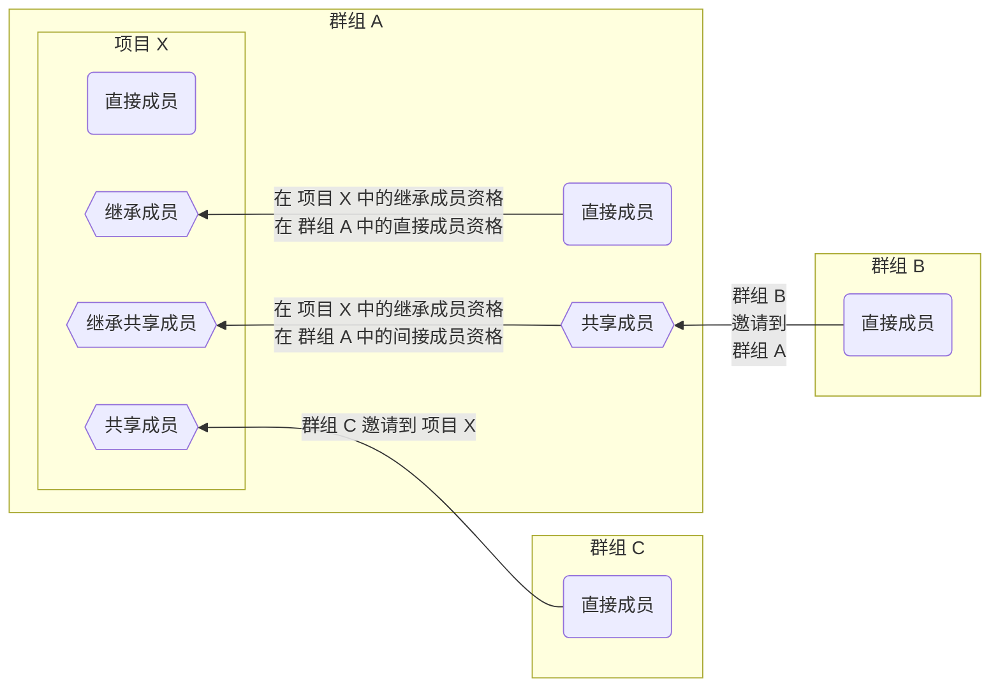
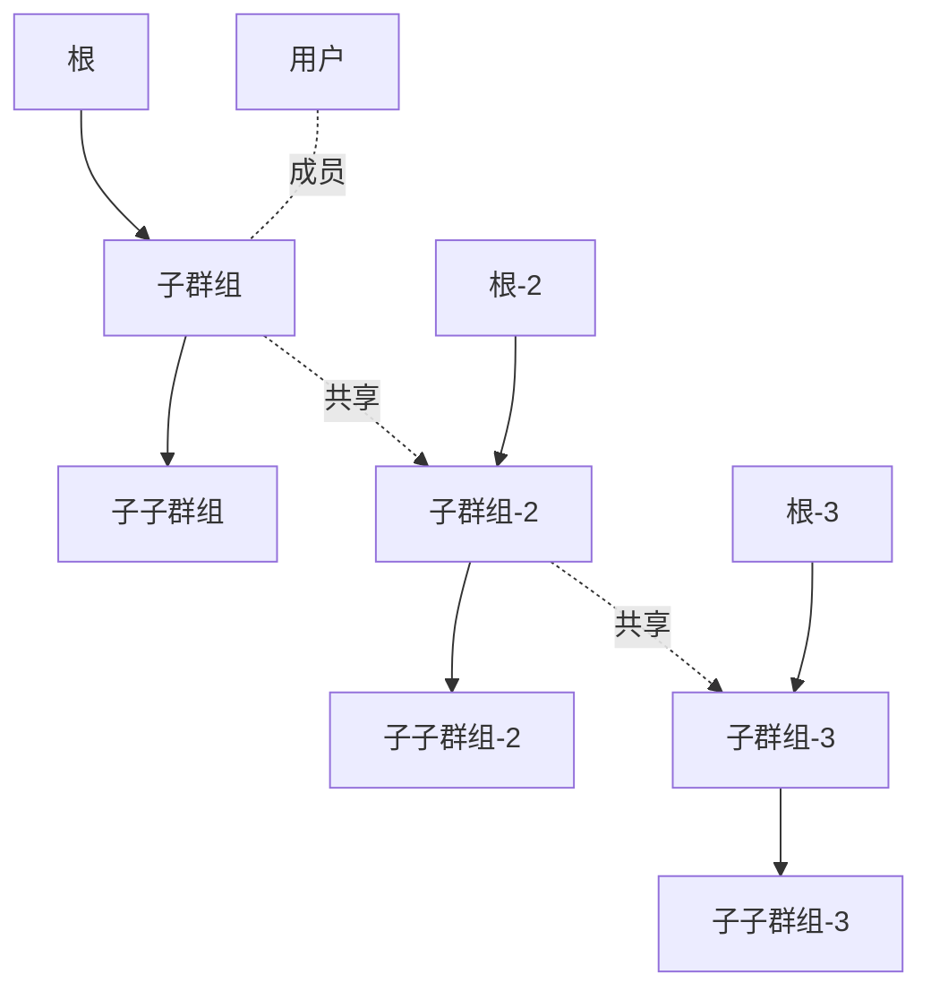



- Tier: 基础版，专业版，旗舰版
- Offering: JihuLab.com，私有化部署



成员是指可以访问您项目的用户和群组。成员可以直接添加到您的项目，或通过群组继承访问权限。

每个成员都有一个角色，决定了他们在项目中可以执行的操作。具有相应角色的项目成员可以向项目添加用户、从项目中移除用户以及管理访问请求，以控制对项目资源的访问。

## 成员类型



- 在极狐GitLab 16.10 中更改，以在成员页面的“成员”选项卡上显示受邀群组成员，通过一个名为 `webui_members_inherited_users` 的功能标志。默认禁用。
- 功能标志 `webui_members_inherited_users` 在极狐GitLab 17.0 中已在 JihuLab.com 和私有化部署上启用。
- 功能标志 `webui_members_inherited_users` 在极狐GitLab 17.4 中已移除。受邀群组成员默认显示。



用户可以成为群组或项目的直接或间接成员。间接成员可以是继承、共享或继承共享。

| 成员类型 | 成员加入方式 |
| --------------------------------------------- | ------------------ |
| 直接 | 用户直接被添加到当前群组或项目。 |
| 继承 | 用户是包含当前群组或项目的父群组的成员。 |
| [共享](sharing_projects_groups.md) | 用户是被邀请至当前群组或项目的群组的成员。 |
| [继承共享](sharing_projects_groups.md#invite-a-group-to-a-group) | 用户是被邀请至当前群组或项目祖先群组的群组的成员。 |
| 间接 | 是对继承、共享或继承共享成员的统称。 |

在上面的示例中：

- **管理员** 是来自 **demo** 群组的继承成员。
- **User 0** 是来自 **demo** 群组的继承成员。
- **User 1** 是受邀加入此项目的 **Acme** 群组的共享成员。
- **User 2** 是受邀加入 **demo** 群组的 **Toolbox** 群组的继承共享成员。
- **User 3** 是直接添加到此项目的直接成员。

## 安全考虑

Git 是一个分布式版本控制系统（DVCS）。每个使用源代码的人都有完整仓库的本地副本。

在极狐GitLab 中，每个具有报告者、开发者、维护者或所有者角色的项目成员都可以克隆仓库以创建本地副本。用户在获取本地副本后，可以将整个仓库上传到任何地方，包括：

- 他们控制下的另一个项目。
- 一个不同的服务器。
- 外部托管服务。

访问控制无法阻止已有仓库访问权限的用户有意共享源代码。所有 Git 管理平台都具有分布式版本控制系统的这一固有特性。

虽然无法阻止授权用户的有意共享，但您可以采取以下步骤来防止无意共享和信息破坏：

- 控制谁可以[向项目添加用户](#add-users-to-a-project)。
- 使用[受保护的分支](../repository/branches/protected.md)以防止未经授权的强制推送。
- 定期审查项目成员资格并移除不再需要访问权限的用户。

## 添加用户到项目



- 访问过期电子邮件通知在极狐GitLab 16.2 中引入。
- 对于直接成员的子群组和项目的访问过期日期在极狐GitLab 17.4 中已移除。



向项目添加用户，使其成为直接成员并拥有执行操作的权限。

前提条件：

- 您必须具有所有者或维护者角色。
- [群组成员锁定](../../group/access_and_permissions.md#prevent-members-from-being-added-to-projects-in-a-group) 必须被禁用。
- 对于私有化部署实例：
  - 如果[新用户账户创建被禁用](../../../administration/settings/sign_up_restrictions.md#disable-new-user-account-creation)，则管理员必须添加用户。
  - 如果[不允许用户邀请](../../../administration/settings/visibility_and_access_controls.md#prevent-invitations-to-groups-and-projects)，则管理员必须添加用户。
  - 如果[管理员审批已启用](../../../administration/settings/sign_up_restrictions.md#turn-on-administrator-approval-for-role-promotions)，则管理员必须批准邀请。

要向项目添加用户：

1. 在顶部栏中，选择 **搜索或跳转到** 并找到您的项目。
1. 在左侧边栏中，选择 **管理** > **成员**。
1. 选择 **邀请成员**。
1. 如果用户：

   - 拥有极狐GitLab 账户，请输入其用户名。
   - 没有极狐GitLab 账户，请输入其电子邮件地址。

1. 选择一个[默认角色](../../permissions.md)或[自定义角色](../../custom_roles/_index.md)。
1. 可选。选择一个 **访问过期日期**。
   从该日期起，用户将无法再访问项目。

   如果您选择了访问过期日期，项目成员将在其访问权限过期前七天收到电子邮件通知。

   > [!warning]
   > 维护者在角色过期前拥有完整权限，包括延长自己访问过期日期的能力。

1. 选择 **邀请**。
   如果您通过以下方式邀请用户：

   - 极狐GitLab 用户名，他们将被添加到成员列表中。
   - 电子邮件地址，系统将向该地址发送邀请，并提示他们创建一个账户。
     如果邀请未被接受，极狐GitLab 将在两天、五天和十天后发送提醒邮件。未被接受的邀请会在 90 天后自动删除。

### 您可以分配的角色

您可以分配的最大角色取决于您对群组是否拥有所有者或维护者角色。例如，您可以设置的最大角色是：

- 所有者（`50`），如果您拥有项目的所有者角色。
- 维护者（`40`），如果您在项目中拥有维护者角色。

所有者[角色](../../permissions.md#project-permissions)仅可为群组添加。

## 查看项目成员

要查看项目的成员：

1. 在顶部栏中，选择 **搜索或跳转到** 并找到您的项目。
1. 在左侧边栏中，选择 **管理** > **成员**。

表格显示成员的以下信息：

- **账户** 名称和用户名。
- 他们的[成员资格](#membership-types)的 **来源**。
  为透明起见，极狐GitLab 显示项目成员的所有成员资格来源。
  具有多个成员资格来源的成员会显示并计为单独成员。
  例如，如果一名成员通过直接和继承两种方式被添加到项目中，
  该成员会在 **成员** 表格中显示两次，具有不同的来源，
  并被计为项目的两名独立成员。
- 项目中的 [**角色**](#which-roles-you-can-assign)。
- 项目成员资格的 **过期** 日期。
- 与其账户相关的 **活动**。

### 查看待晋升的用户

如果[角色晋升的管理员审批](../../../administration/settings/sign_up_restrictions.md#turn-on-administrator-approval-for-role-promotions)已启用，那么将现有用户晋升为计费角色的成员请求需要管理员审批。

要查看待晋升的用户：

1. 在顶部栏中，选择 **搜索或跳转到** 并找到您的项目。
1. 在左侧边栏中，选择 **管理** > **成员**。
1. 选择 **角色晋升** 选项卡。

如果 **角色晋升** 选项卡未显示，则项目没有待处理的晋升。

## 更新过期和角色

如果用户是：

- 项目的直接成员，**过期** 和 **角色** 字段可以直接在项目上更新。
- 继承、共享或继承共享成员，则 **过期** 和 **角色** 字段必须在成员来源的群组上更新。

## 与群组共享项目

无需逐个添加用户，您可以[与整个群组共享项目](sharing_projects_groups.md)。

## 从另一个项目导入成员

您可以将另一个项目的直接成员导入到您自己的项目中。导入的项目成员保留与源项目相同的权限。

> [!note]
> 仅导入项目的直接成员。继承或共享的项目成员不会被导入。

前提条件：

- 您必须具有维护者或所有者角色。

如果导入成员的成员在目标项目上的角色是：

- 维护者，则源项目中具有所有者角色的成员将以维护者角色导入。
- 所有者，则源项目中具有所有者角色的成员将以所有者角色导入。

要导入项目成员：

1. 在顶部栏中，选择 **搜索或跳转到** 并找到您的项目。
1. 在左侧边栏中，选择 **管理** > **成员**。
1. 选择 **从项目导入**。
1. 选择项目。您只能查看您是其维护者的项目。
1. 选择 **导入项目成员**。

如果导入成功，则会显示成功消息。要查看 **成员** 选项卡上导入的成员，请刷新页面。

## 从项目移除成员

如果用户是：

- 项目的直接成员，您可以直接从项目中移除他们。
- 来自父群组的继承成员，您只能从父群组本身移除他们。

前提条件：

- 当移除不具有所有者角色的成员时，需要维护者或所有者角色。
- 当移除具有所有者角色的成员时，需要所有者角色。

要从项目中移除成员：

1. 在顶部栏中，选择 **搜索或跳转到** 并找到您的项目。
1. 在左侧边栏中，选择 **管理** > **成员**。
1. 在要移除的项目成员旁边，选择 **移除成员**。
1. 可选。在确认对话框中，选中 **同时从相关议题和合并请求中取消分配此用户** 复选框。
1. 为防止私有项目敏感信息泄露，请验证该成员未派生（fork）私有仓库或创建 webhook。现有的 fork 会继续接收上游项目的更改，webhook 会继续接收更新。您可能还希望配置项目，以防止群组中的项目[被派生到其群组之外](../../group/access_and_permissions.md#prevent-project-forking-outside-group)。
1. 选择 **移除成员**。

## 确保已移除的用户无法自行重新邀请

具有维护者或所有者角色的用户可能利用竞争条件，在管理员将其移除后重新加入群组或项目。

为避免此问题，极狐GitLab 管理员可以：

- 从[极狐GitLab Rails 控制台](../../../administration/operations/rails_console.md)移除恶意用户会话。
- 模拟恶意用户以：
  - 将用户从项目中移除。
  - 将该用户从极狐GitLab 中登出。
- 封锁恶意用户账户。
- 删除恶意用户账户。
- 更改恶意用户账户的密码。

## 筛选和排序项目成员

您可以对项目中的成员进行筛选和排序。

### 显示直接成员

1. 在顶部栏中，选择 **搜索或跳转到** 并找到您的项目。
1. 在左侧边栏中，选择 **管理** > **成员**。
1. 在 **筛选成员** 框中，选择 `成员资格` `=` `直接`。
1. 按 <kbd>Enter</kbd>。

### 显示间接成员

1. 在顶部栏中，选择 **搜索或跳转到** 并找到您的项目。
1. 在左侧边栏中，选择 **管理** > **成员**。
1. 在 **筛选成员** 框中，选择 `成员资格` `=` `间接`。
1. 按 <kbd>Enter</kbd>。

### 搜索项目成员

要搜索项目成员：

1. 在顶部栏中，选择 **搜索或跳转到** 并找到您的项目。
1. 在左侧边栏中，选择 **管理** > **成员**。
1. 在搜索框中，输入成员的姓名、用户名或电子邮件。
1. 按 <kbd>Enter</kbd>。

### 排序项目成员

您可以按以下方式对成员进行升序或降序排序：

- **账户** 名称
- **访问授予** 日期
- 在项目中的 **角色**
- **用户创建** 日期
- **最后活动** 日期
- **最后登录** 日期

要排序成员：

1. 在顶部栏中，选择 **搜索或跳转到** 并找到您的项目。
1. 在左侧边栏中，选择 **管理** > **成员**。
1. 在成员列表顶部，从下拉列表中选择您要排序的项目。

## 请求访问项目

极狐GitLab 用户可以请求成为项目成员。

1. 在顶部栏中，选择 **搜索或跳转到**。
1. 在右上角，选择垂直省略号（）并选择 **请求访问**。

系统会向最近活跃的项目维护者或所有者发送电子邮件。最多会通知十个项目维护者或所有者。任何项目所有者或维护者都可以批准或拒绝请求。项目维护者不能批准所有者角色的访问请求。

如果项目没有任何直接所有者或维护者，则项目父群组中最近活跃的所有者将收到该通知。

### 撤回项目访问请求

您可以在请求被批准前撤回对项目的访问请求。

要撤回访问请求：

1. 在顶部栏中，选择 **搜索或跳转到**。
1. 在项目名称旁边，选择 **撤回访问请求**。

## 禁止用户请求访问项目

您可以禁止用户请求访问项目。

前提条件：

- 您必须拥有项目的所有者角色。
- 项目必须是公开的。

1. 在顶部栏中，选择 **搜索或跳转到** 并找到您的项目。
1. 在左侧边栏中，选择 **设置** > **通用**。
1. 展开 **可见性，项目功能，权限**。
1. 在 **项目可见性** 下，确保未选中 **允许用户请求访问** 复选框。
1. 选择 **保存更改**。

> [!note]
> 禁用 **允许用户请求访问** 设置会阻止新的访问请求。现有的待处理请求不会被删除，仍然可以被批准或拒绝。

## 成员和可见性权限

根据他们的成员类型，群组或项目的成员被授予不同的[可见性级别](../../public_access.md)以及对群组或项目的权限。

下表列出了项目成员的成员资格和可见性权限。

| 操作 | 直接项目成员 | 继承项目成员 | 直接共享项目成员 | 继承共享项目成员 |
|-------------------------------------------|-----------------------|--------------------------|------------------------------|---------------------------------|
| 生成看板 |  |  |  |  |
| 查看父群组的议题 1 |  |  |  |  |
| 查看父群组的标签 |  |  |  |  |
| 查看父群组的里程碑 |  |  |  |  |
| 共享至其他群组 |  |  |  |  |
| 导入到其他项目 |  |  |  |  |
| 与其他成员共享项目 |  |  |  |  |

**注**：

1. 用户只能查看他们有访问权的项目的议题。

下表列出了群组成员资格和可见性权限。

| 操作 | 直接群组成员 | 继承群组成员 | 直接共享群组成员 | 继承共享群组成员 |
|----------------------------------|---------------------|------------------------|----------------------------|-------------------------------|
| 生成看板 |  |  |  |  |
| 查看父群组的议题 |  |  |  |  |
| 查看父群组的标签 |  |  |  |  |
| 查看父群组的里程碑 |  |  |  |  |

在以下示例中，`User` 是：

- `subgroup` 的直接成员。
- `subsubgroup` 的继承成员。
- `subgroup-2` 和 `subgroup-3` 的间接成员。
- `subsubgroup-2` 和 `subsubgroup-3` 的间接继承成员。

