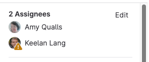



- Tier: 基础版、专业版、旗舰版
- Offering: JihuLab.com、私有化部署





- 在极狐GitLab 16.0中，侧边栏操作菜单已更改，现在也用于移动议题、事件和史诗的操作。
- 在极狐GitLab 16.9中 GA。功能标志 `moved_mr_sidebar` 已移除。



合并请求为您的团队提供了一个中心地点，用以审查代码、进行讨论和跟踪代码变更。
为了帮助说明进行变更的原因，您可以将合并请求链接到一个议题，并在合并请求合并时自动关闭该议题。

合并请求有助于确保主题专家审查您提议的变更，并满足您组织的安全要求。
当您在开发过程早期创建合并请求时，您的团队就有时间发现错误和代码质量问题。

查看合并请求时，您可以看到：

- 请求的描述。
- 代码变更和内联代码审查。
- CI/CD流水线信息。
- 可合并性报告。
- 评论。
- 提交列表。

## 创建合并请求

了解多种[创建合并请求](creating_merge_requests.md)的方法。

### 使用合并请求模板

创建合并请求时，极狐GitLab会检查是否存在[描述模板](../description_templates.md)以向合并请求添加数据。
极狐GitLab按从1到5的顺序检查以下位置，并将找到的第一个模板应用于您的合并请求：

| 名称 | 项目 UI 设置 | 群组 `default.md` | 实例 `default.md` | 项目 `default.md` | 无模板 |
|:-----|:---------------------:|:---------------------:|:------------------------:|:-----------------------:|:-----------:|
| 标准提交消息 | 1  |           2           |            3             |            4            |      5      |
| 带有议题关闭模式（如`Closes #1234`）的提交消息 | 1 | 2 | 3 | 4 | 5 \* |
| 分支名称[带有议题ID前缀](../repository/branches/_index.md#prefix-branch-names-with-a-number)，如`1234-example` | 1 \* | 2 \* | 3 \* | 4 \* | 5 \* |

> [!note]
> 标有星号（\*）的项目还会附加[议题关闭模式](../issues/managing_issues.md#closing-issues-automatically)。

## 查看合并请求

您可以查看项目、群组或您自己的合并请求。





要在主页上查看所有合并请求，请使用 <kbd>Shift</kbd>+<kbd>m</kbd> 键盘快捷键，或者：

1. 在左侧边栏中，选择 **合并请求** 图标。

或：

1. 在顶部栏中，选择 **搜索或跳转到**。
1. 从下拉列表中，选择 **合并请求**。





要查看项目的所有合并请求：

1. 在顶部栏中，选择 **搜索或跳转到** 并找到您的项目。
1. 在左侧边栏中，选择 **代码** > **合并请求**。

或者，使用键盘快捷键，按 <kbd>g</kbd>+<kbd>m</kbd>。





要查看群组中所有项目的合并请求：

1. 在顶部栏中，选择 **搜索或跳转到** 并找到您的群组。
1. 在左侧边栏中，选择 **代码** > **合并请求**。

如果您的群组包含子群组，此视图还会显示子群组项目的合并请求。





在查看仓库中的文件时，极狐GitLab会显示一个徽章，其中包含指向当前分支并修改该文件的打开合并请求的数量。这有助于您识别有未决更改的文件。

此功能的可用性由一个功能标志控制。
更多信息，请参见[查看文件的打开合并请求](../repository/files/_index.md#view-open-merge-requests-for-a-file)。

要查看文件的打开合并请求：

1. 在顶部栏中，选择 **搜索或跳转到** 并找到您的项目。
1. 转到您要查看的文件。
1. 在屏幕右上角，文件名旁边，查找带有  **打开** 合并请求数量的绿色徽章。
1. 选择该徽章以查看过去30天内创建的打开合并请求列表。
1. 选择列表中的任意合并请求以转到该合并请求。





## 过滤合并请求列表



- 按 `源分支` 过滤 [引入于](https://gitlab.com/gitlab-org/gitlab/-/merge_requests/134555) 极狐GitLab 16.6。
- 按 `合并者` 过滤 [引入于](https://gitlab.com/gitlab-org/gitlab/-/merge_requests/140002) 极狐GitLab 16.9。仅在功能标志 `mr_merge_user_filter` 启用时可用。
- 按 `合并者` 过滤 [在极狐GitLab 17.0中GA](https://gitlab.com/gitlab-org/gitlab/-/merge_requests/142666)。功能标志 `mr_merge_user_filter` 已移除。
- 按 `合并于之前` 和 `合并于之后` 过滤 [引入于](https://gitlab.com/gitlab-org/gitlab/-/merge_requests/209458) 极狐GitLab 18.6。



要过滤合并请求列表：

1. 在顶部栏中，选择 **搜索或跳转到** 并找到您的项目。
1. 在左侧边栏中，选择 **代码** > **合并请求**。
1. 在合并请求列表上方，选择 **搜索或过滤结果**。
1. 从下拉列表中，选择要过滤的属性。一些示例：
   - **按环境或部署日期**。
   - **ID**：输入过滤器 `#30` 仅返回合并请求30。
   - 用户过滤器：输入（或从下拉列表中选择）以下任何过滤器以显示用户列表：
     - **批准人**，用于已被用户批准的合并请求。仅限专业版和旗舰版。
     - **审批人**，用于该用户有资格批准的合并请求。（更多信息，请参见[代码所有者](../codeowners/_index.md)）。仅限专业版和旗舰版。
     - **合并者**，用于由此用户合并的合并请求。
     - **审核者**，用于由此用户审核的合并请求。
1. 选择或输入用于过滤属性的运算符。可用运算符如下：
   - `=`：是
   - `!=`：不是
1. 输入用于过滤属性的文本。
   您可以按 **无** 或 **任何** 过滤某些属性。
1. 重复此过程以按更多属性过滤，属性之间由逻辑 `AND` 连接。
1. 选择 **排序方向**， 表示降序，或  表示升序。

### 按环境或部署日期

要按部署数据（例如环境或日期）过滤合并请求，您可以输入（或从下拉列表中选择）以下内容：

- 环境
- 部署于之前
- 部署于之后

> [!note]
> 使用[快进合并方法](methods/_index.md#fast-forward-merge)的项目不会返回结果，因为此方法不会创建合并提交。

按环境过滤时，下拉列表会显示所有可供选择的环境。

按 `部署于之前` 或 `部署于之后` 过滤时：

- 日期是指（由合并提交触发的）到环境的部署成功完成的时间。
- 您必须手动输入部署日期。
- 部署日期使用 `YYYY-MM-DD` 格式。如果您想同时指定日期和时间（`"YYYY-MM-DD HH:MM"`），请用双引号将它们括起来。

## 向合并请求添加更改

如果您有权向合并请求添加更改，您可以通过多种方式将您的更改添加到现有合并请求。这些方式取决于更改的复杂性以及您是否需要访问开发环境：

- [从命令行推送更改](../../../topics/git/commands.md)，如果您熟悉 Git 和命令行。

## 为合并请求分配用户

要将合并请求分配给用户，请在合并请求的文本区域中使用 `/assign @user` 快速操作，或者：

1. 在顶部栏中，选择 **搜索或跳转到** 并找到您的项目。
1. 在左侧边栏中，选择 **代码** > **合并请求** 并找到您的合并请求。
1. 在右侧边栏中，展开右侧边栏并找到 **指派人** 部分。
1. 选择 **编辑**。
1. 搜索您要分配的用户，并选择该用户。极狐GitLab 基础版每个合并请求只允许一名指派人，但极狐GitLab 专业版和极狐GitLab 旗舰版允许多名指派人：

   

极狐GitLab会将合并请求添加到用户的 **已分配合并请求** 页面。

## 参与者

参与者是与合并请求进行过交互的用户。有关查看参与者的信息，请参见[参与者](../../participants.md)。

## 合并合并请求

在合并请求审核过程中，审核者会对您的更改提供反馈。当审核者对更改满意后，他们可以启用[自动合并](auto_merge.md)，即使某些合并检查失败也可以。
当所有合并检查通过后，合并请求将自动合并，您无需执行进一步操作。

默认合并权限：

- 默认分支（通常为 `main`）受保护。
- 只有维护者及更高角色可以合并到默认分支。
- 开发者可以合并任何针对非保护分支的合并请求。

要确定您是否有权合并特定合并请求，极狐GitLab会检查：

- 您在项目中的角色。例如，开发者、维护者或所有者。
- 目标分支的分支保护。

## 关闭合并请求

如果您决定永久停止某个合并请求的工作，请关闭它而不是[删除它](manage.md#delete-a-merge-request)。

先决条件：

- 您必须是合并请求的作者或指派人，或者
- 您必须在项目中拥有开发者、维护者或所有者角色。

要关闭项目中的合并请求：

1. 在顶部栏中，选择 **搜索或跳转到** 并找到您的项目。
1. 在左侧边栏中，选择 **代码** > **合并请求** 并找到您的合并请求。
1. 滚动到页面底部的评论框。
1. 在评论框后面，选择 **关闭合并请求**。

极狐GitLab会关闭合并请求，但保留合并请求的记录、其评论和任何关联的流水线。

### 合并时删除源分支

您可以在以下情况下删除合并请求的源分支：

- 创建合并请求时，通过选择 **合并请求被接受时删除源分支**。
- 合并合并请求时，如果您有维护者角色，通过选择 **删除源分支**。

管理员可以在项目设置中将此选项设为默认。

删除分支操作由设置自动合并或合并合并请求的用户执行。如果该用户缺少正确的角色（例如在派生项目中），则源分支删除会失败。

### 当目标分支合并时更新合并请求



- Tier: 基础版，专业版，旗舰版
- Offering: JihuLab.com，私有化部署



合并请求通常是链接在一起的，一个合并请求依赖于另一个合并请求中添加或更改的代码。为了支持保持单个合并请求较小，极狐GitLab可以在目标分支合并到 `main` 时更新最多四个打开的合并请求。例如：

- 合并请求1：将 `feature-alpha` 合并到 `main`。
- 合并请求2：将 `feature-beta` 合并到 `feature-alpha`。

如果这些合并请求同时打开，并且合并请求1（`feature-alpha`）合并到 `main`，极狐GitLab会将合并请求2的目标从 `feature-alpha` 更新为 `main`。

具有相互关联内容更新的合并请求通常通过以下方式之一处理：

- 合并请求1先合并到 `main`。然后合并请求2被重定向到 `main`。
- 合并请求2合并到 `feature-alpha`。更新后的合并请求1（现在包含 `feature-alpha` 和 `feature-beta` 的内容）合并到 `main`。

此功能仅在合并请求合并时有效。合并后选择 **删除源分支** 不会重新定向打开的合并请求。此改进已作为后续提出。

## 合并请求工作流

对于在团队中工作的软件开发人员：

1. 您检出一个新分支，并通过合并请求提交更改。
1. 您从团队收集反馈。
1. 您通过[代码质量报告](../../../ci/testing/code_quality.md)优化代码实现。
1. 您在极狐GitLab CI/CD中通过[单元测试报告](../../../ci/testing/unit_test_reports.md)验证更改。
1. 您通过[许可证审批策略](../../compliance/license_approval_policies.md)避免使用许可证与您的项目不兼容的依赖项。
1. 您请求经理的[批准](approvals/_index.md)。
1. 您的经理：
   1. 推送包含他们最终审核的提交。
   1. 批准合并请求。
   1. 将其设置为[自动合并](auto_merge.md)（以前称为 **流水线成功时合并**）。
1. 您的更改通过极狐GitLab CI/CD 的[手动任务](../../../ci/jobs/job_control.md#create-a-job-that-must-be-run-manually)部署到生产环境。
1. 您的实现已成功交付给客户。

对于为公司网站编写网页的Web开发人员：

1. 您检出一个新分支，并通过合并请求提交一个新页面。
1. 您从审核者那里收集反馈。
1. 您通过[审核应用](../../../ci/review_apps/_index.md)预览您的更改。
1. 您请求网页设计师实施。
1. 您请求经理批准。
1. 批准后，极狐GitLab：
   - [压缩提交](squash_and_merge.md)。
   - 合并提交。
   - [将更改部署到预发布环境通过极狐GitLab Pages](https://gitlab.cn/blog/ci-deployment-and-environments/)。
1. 您的生产团队将合并提交拣选到生产环境。

## 过滤合并请求中的活动



- 功能标志 `mr_activity_filters` 在极狐GitLab 16.0中[在JihuLab.com上启用](https://gitlab.com/gitlab-org/gitlab/-/issues/387070)。
- 在极狐GitLab 16.3中[默认在私有化部署上启用](https://gitlab.com/gitlab-org/gitlab/-/merge_requests/126998)。
- 在极狐GitLab 16.5中[GA](https://gitlab.com/gitlab-org/gitlab/-/merge_requests/132355)。功能标志 `mr_activity_filters` 已移除。
- 过滤机器人评论 [引入于](https://gitlab.com/gitlab-org/gitlab/-/merge_requests/128473) 极狐GitLab 16.9。



要了解合并请求的历史记录，请过滤其活动源，仅显示与您相关的项目。

1. 在顶部栏中，选择 **搜索或跳转到** 并找到您的项目。
1. 在左侧边栏中，选择 **代码** > **合并请求**。
1. 选择一个合并请求。
1. 滚动到 **活动**。
1. 在页面右侧，选择 **活动过滤器** 以显示过滤器选项。如果您已经选择了过滤器选项，此字段会显示您选择的摘要，例如 **活动 + 5 项**。
1. 选择您想查看的活动类型。选项包括：

   - 指派人 & 审核者
   - 批准
   - 评论（来自机器人）
   - 评论（来自用户）
   - 提交 & 分支
   - 编辑
   - 标签
   - 锁定状态
   - 提及
   - 合并请求状态
   - 跟踪

1. 可选。选择 **排序**（）以反转排序顺序。

您的选择会持久保留在所有合并请求中。您也可以通过点击右侧的排序按钮来更改排序顺序。

## 管理评论讨论

合并请求中的讨论包括单条评论和评论讨论。打开（未解决的）讨论会阻止合并请求的合并，但单条评论不会。当一个讨论的对话结束后，[解决该讨论](../../discussions/_index.md#resolve-a-thread)以折叠其显示。如果某个评论讨论很重要但不应阻止合并请求，请将其移至议题以继续讨论。

### 展开所有讨论

极狐GitLab在合并请求的右上角显示打开讨论的数量。此合并请求有三个打开讨论：

要查看已折叠讨论中的所有评论，请展开讨论：

1. 在顶部栏中，选择 **搜索或跳转到** 并找到您的项目。
1. 在左侧边栏中，选择 **代码** > **合并请求** 并找到您的合并请求。
1. 在合并请求中，在右上角找到 **打开讨论** 下拉列表，并选择 **讨论选项**（）。
1. 选择 **显示所有评论**。

### 将打开讨论移至议题

要将打开讨论移至新议题，并取消阻止合并请求：





如果您在合并请求中有一个特定的打开讨论，您可以创建一个议题来单独解决它：

1. 在顶部栏中，选择 **搜索或跳转到** 并找到您的项目。
1. 在左侧边栏中，选择 **代码** > **合并请求** 并找到您的合并请求。
1. 在合并请求中，找到您要移动的讨论。
1. 在讨论的最后回复下方，**解决讨论** 旁边，选择 **为解决讨论创建议题**（）。
1. 填写新议题的字段，然后选择 **创建议题**。

极狐GitLab会将讨论标记为已解决，并从合并请求链接到新创建的议题。





如果您在合并请求中有多个打开讨论，您可以创建一个议题来单独解决它们：

1. 在顶部栏中，选择 **搜索或跳转到** 并找到您的项目。
1. 在左侧边栏中，选择 **代码** > **合并请求** 并找到您的合并请求。
1. 在合并请求中，在右上角找到 **打开讨论** 下拉列表，并选择 **讨论选项**（）。
1. 选择 **使用新议题解决所有**。
1. 填写新议题的字段，然后选择 **创建议题**。

极狐GitLab会将所有讨论标记为已解决，并从合并请求链接到新创建的议题。





### 除非所有讨论都解决，否则阻止合并

您可以在仍有打开讨论的情况下阻止合并请求合并。启用此设置后，当至少有一个讨论保持打开时，合并请求中的 **打开讨论** 计数器会显示为橙色。

1. 在顶部栏中，选择 **搜索或跳转到** 并找到您的项目。
1. 在左侧边栏中，选择 **设置** > **合并请求**。
1. 在 **合并检查** 部分，选中 **所有讨论都必须解决** 复选框。
1. 选择 **保存更改**。

### 当讨论过时时自动解决合并请求中的讨论

您可以将合并请求设置为在新的推送更改了其所描述的行时自动解决讨论。

1. 在顶部栏中，选择 **搜索或跳转到** 并找到您的项目。
1. 在左侧边栏中，选择 **设置** > **合并请求**。
1. 在 **合并选项** 部分，选择 **当合并请求差异讨论过时时自动解决**。
1. 选择 **保存更改**。

如果推送使差异部分过时，讨论现在会被解决。未更改行上的讨论和顶级可解决的讨论不会被解决。

## 移动通知和待办



- Tier: 基础版，专业版，旗舰版
- Offering: 私有化部署





- [引入于](https://gitlab.com/gitlab-org/gitlab/-/merge_requests/132678) 极狐GitLab 16.5 [附带一个功能标志](../../../administration/feature_flags/_index.md)，名为 `notifications_todos_buttons`。默认禁用。
- [议题、事件](https://gitlab.com/gitlab-org/gitlab/-/merge_requests/133474)和[史诗](https://gitlab.com/gitlab-org/gitlab/-/merge_requests/133881)也已更新。



> [!flag]
> 此功能的可用性由功能标志控制。更多信息，请参见历史记录。

启用此功能标志会将通知和待办事项按钮移至页面右上角。

- 在合并请求上，这些按钮显示在选项卡的最右侧。
- 在议题、事件和史诗上，这些按钮显示在右侧边栏的顶部。

