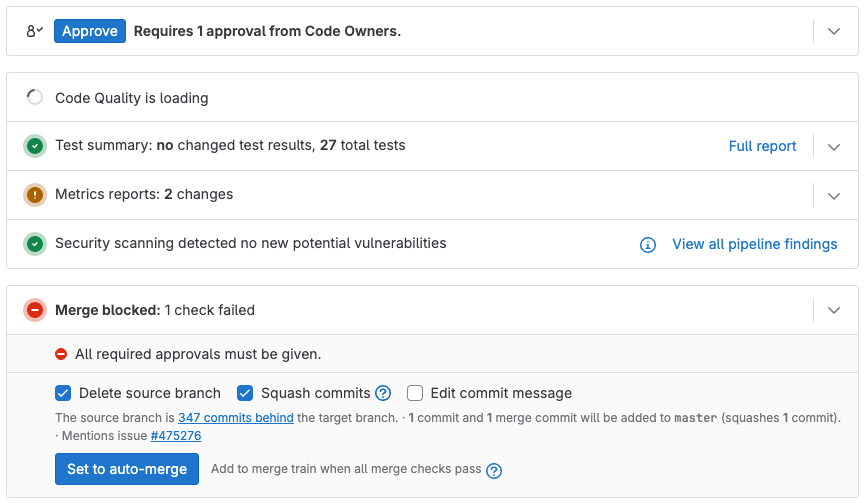
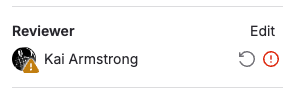



- Tier: 基础版，专业版，旗舰版
- Offering: JihuLab.com，私有化部署



为了给项目中的变更设置审查流程，配置合并请求审批。
审批有助于确保变更在合并到项目之前经过审查。
根据项目需求和极狐GitLab 订阅等级，您可以将审批配置为可选或必须。

- [极狐GitLab 基础版](https://gitlab.cn/pricing/) 允许所有至少具有[开发者](../../../permissions.md)角色的用户审批合并请求。这些审批是可选的，不会阻止未经审批的合并。
- [极狐GitLab 专业版](https://gitlab.cn/pricing/) 和 [极狐GitLab 旗舰版](https://gitlab.cn/pricing/) 为您提供更大的灵活性，可以：

  - 创建关于必需的审批数量和类型的强制[规则](rules.md)。
  - 为特定文件创建[代码所有者](../../codeowners/_index.md)列表。
  - 为[整个实例](../../../../administration/merge_requests_approvals.md)配置审批。
  - 配置[群组合并请求审批设置](../../../group/manage.md#group-merge-request-approval-settings)。

## 配置审批规则

前提条件：

- 您必须具有该项目的 开发者、维护者或所有者 角色。

配置审批规则：

1. 在顶部栏，选择 **搜索或跳转到** 并找到您的项目。
1. 在左侧边栏，选择 **设置** > **合并请求**。
1. 转到 **合并请求审批** 部分。
1. 设置您想要的规则。

您还可以配置：

- 更多[合并请求审批设置](settings.md)，以更好地控制项目所需的监督和安全级别。
- 通过[合并请求审批 API](../../../../api/merge_request_approvals.md) 配置合并请求审批规则。

有关配置规则的更多信息，请参阅[审批规则](rules.md)。

### 必需的审批



- Tier: 专业版，旗舰版
- Offering: JihuLab.com，私有化部署



必需的审批强制指定用户进行代码审查。如果没有这些审批，则无法合并。

用例包括：

- 强制审查所有合并到仓库的代码。
- 指定审查者和最少审批数量。
- 指定审查者类别，例如后端、前端、质量保证、数据库或文档。
- 使用 [`CODEOWNERS` 文件](../../codeowners/_index.md#codeowners-file) 确定审查者。
- 对[测试覆盖率下降](../../../../ci/testing/code_coverage/_index.md#add-a-coverage-check-approval-rule)要求审批。
- 极狐GitLab 旗舰版：对潜在漏洞[要求安全团队审批](../../../application_security/policies/merge_request_approval_policies.md)。

## 查看审批状态



- 更细粒度的审批人显示在极狐GitLab 17.10 中 GA。功能标志 `mr_approvers_filter_hidden_users` 已移除。



要查看合并请求的审批状态，请检查合并请求本身，或您的项目或群组的合并请求列表。

### 对于单个合并请求

[合格审批人](rules.md#eligible-approvers) 可以查看单个合并请求的审批状态。

查看审批状态：

1. 在顶部栏，选择 **搜索或跳转到** 并找到您的项目。
1. 在左侧边栏，选择 **代码** > **合并请求** 并找到您的合并请求。
1. 选择其标题以查看合并请求。
1. 转到合并请求小部件以查看审批状态。在此示例中，您可以审批该合并请求：

   

该小部件显示以下状态之一：

- **批准**：该合并请求需要更多审批。
- **额外批准**：该合并请求已达到所需的审批。
- **撤销批准**：您已经批准了该合并请求。

要检查您的审批是否满足代码所有者要求，选择 **展开合格审批人** ()。

审批人的可见性取决于您的项目成员资格和群组隐私：

- 项目成员可以看到所有审批人。
- 项目非成员可以看到：
  - 所有审批人，如果审批人都来自公开群组。
  - 无审批人信息，如果有任何审批人来自私有群组。

### 在合并请求列表中

[您的项目或群组](../_index.md#view-merge-requests) 的合并请求列表会显示每个合并请求的审批状态：

|                                       示例                                       | 说明 |
|:-----------------------------------------------------------------------------------:|-------------|
|                  | 缺少必需的审批。 () |
|                        | 审批已满足。 () |
|  | 审批已满足，且您是审批人之一。 () |

### 个人审查者状态

要查看每位审查者的审查和审批状态：

1. 打开合并请求。
1. 检查右侧边栏。

每位审查者的状态显示在其姓名旁边。

-  等待审查
-  审查中
-  已批准
-  审核人已评论
-  审核人请求修改

   

要[重新请求审查](../reviews/_index.md#re-request-a-review)，选择用户名旁边的 **重新请求审查** 图标 ()。

## 批准合并请求

合格审批人可以通过两种方式批准合并请求：

- 在合并请求小部件中，选择 **批准**。
- 在评论中使用 [`/approve` 快速操作](../../quick_actions.md#approve)。

已批准的合并请求会在审查者列表中的用户名旁边显示绿色对号 ()。
在合并请求收到所需的审批后，它就可以合并了，除非它被以下原因阻止：

- [合并冲突](../conflicts.md)
- [未解决的讨论串](../_index.md#prevent-merge-unless-all-threads-are-resolved)
- [失败的 CI/CD 流水线](../auto_merge.md)

### 禁止合并请求创建者批准

要禁止合并请求创建者批准自己的工作，启用 [**禁止合并请求创建者批准**](settings.md#prevent-approval-by-merge-request-creator) 设置。

### 审批规则变更

如果您启用了[审批规则覆盖](settings.md#prevent-editing-approval-rules-in-merge-requests)，对默认审批规则的更改不会影响现有合并请求，除非是[目标分支](rules.md#approvals-for-protected-branches)更改。

## 无效规则



- 在极狐GitLab 16.2 中 GA。功能标志 `invalid_scan_result_policy_prevents_merge` 已移除。



当审批规则无法满足时，极狐GitLab 将它们标记为 **自动批准**，例如当：

- 唯一的合格审批人是合并请求作者。
- 没有合格审批人分配给该规则。
- 所需的审批数量超过合格审批人的数量。

这些规则会自动批准以解除合并请求的阻塞，除非您通过[合并请求审批策略](../../../application_security/policies/merge_request_approval_policies.md)创建了规则。

通过策略创建的无效规则：

- 显示为 **需要操作**。
- 不会自动批准。
- 阻止受影响的合并请求。
