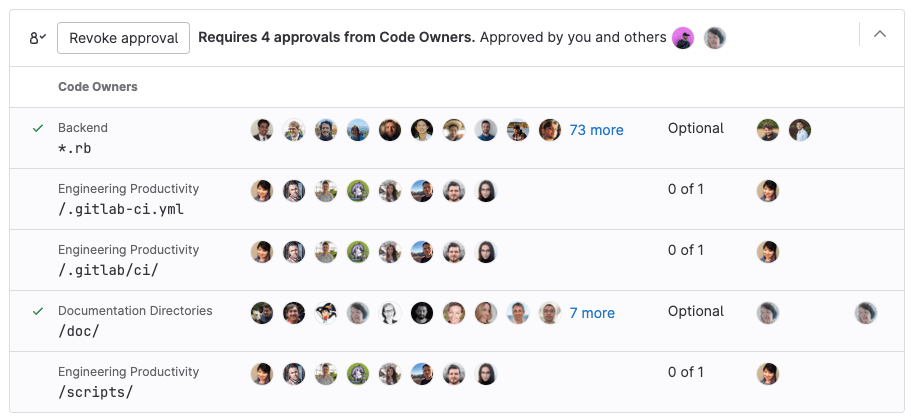
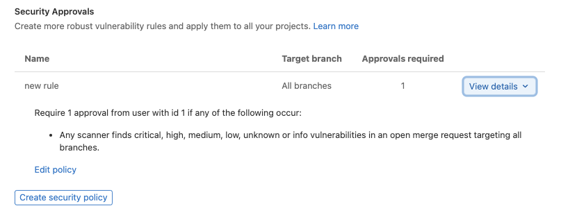
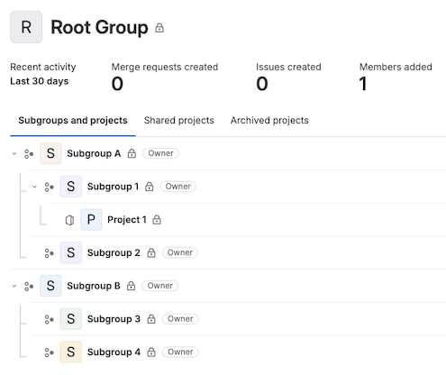
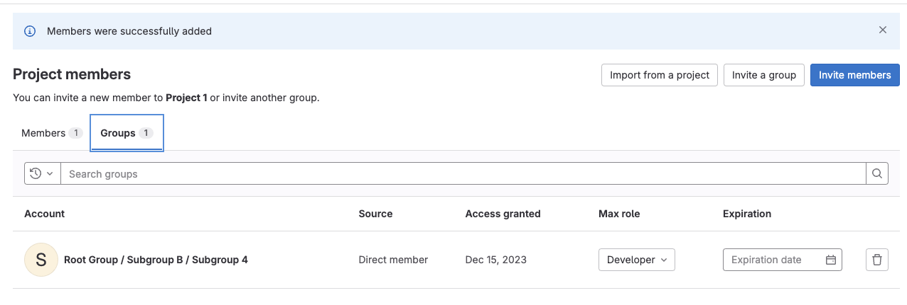



- Tier: 专业版，旗舰版
- Offering: JihuLab.com，私有化部署



审批规则定义了合并请求在合并前需要获得多少个[审批](_index.md)，以及哪些用户应执行审批。它们可以与[代码所有者](#code-owners-as-approvers)结合使用，以确保变更既由维护该功能的群组审查，也由负责特定监督领域的群组审查。

您可以在以下范围定义审批规则：

- [作为项目默认规则](#add-an-approval-rule)。
- [针对每个合并请求](#edit-or-override-merge-request-approval-rules)。

您可以配置审批规则：

- [针对整个实例](../../../../administration/merge_requests_approvals.md)。

如果您未定义[默认审批规则](#add-an-approval-rule)，则任何用户都可以审批合并请求。即使没有定义规则，您仍然可以在项目设置中强制执行[所需审批者的最低数量](settings.md)。

目标为不同项目的合并请求（例如从派生到上游项目），使用目标（上游）项目的默认审批规则，而不是源（派生）项目的规则。

合并请求审批可以全局配置，通过[策略](../../../application_security/policies/_index.md)应用于所有（或部分）项目。[合并请求审批策略](../../../application_security/policies/merge_request_approval_policies.md)还提供了更细粒度的配置选项，增加了灵活性。

## 添加审批规则

先决条件：

- 您必须具备项目的维护者或所有者角色。
- 要在 JihuLab.com 上添加群组作为审批者，您必须是该群组的成员，或者该群组必须是公开的。

要添加合并请求审批规则：

1. 在顶部栏中，选择 **搜索或跳转到** 并找到您的项目。
2. 在左侧边栏中，选择 **设置** > **合并请求**。
3. 在 **合并请求审批** 区域， **审批规则** 部分，选择 **添加审批规则**。
4. 在右侧边栏中，填写以下字段：
   - 在 **所需审批数** 中，值为 `0` 使 [规则变为可选](#configure-optional-approval-rules)，任何大于 `0` 的数字创建必选规则。
     所需审批数的最大值为 `100`。
   - 从 **添加审批者** 中，选择 [有审批资格的](#eligible-approvers) 用户或群组。
     极狐GitLab 会根据之前更改过合并请求中文件的作者来建议审批者。
5. 选择 **保存更改**。你可以添加 [多个审批规则](#multiple-approval-rules)。

您对审批规则覆盖的配置决定了新规则是否应用于现有合并请求：

- 如果允许 [审批规则覆盖](settings.md#prevent-editing-approval-rules-in-merge-requests)，则对这些默认规则的更改不会应用于现有合并请求，但更改规则的 [目标分支](#approvals-for-protected-branches) 除外。
- 如果不允许审批规则覆盖，则对默认规则的所有更改都将应用于现有合并请求。之前在允许审批规则覆盖期间手动 [覆盖](#edit-or-override-merge-request-approval-rules) 的任何审批规则不会被修改。

## 编辑审批规则

先决条件：

- 您必须具备项目的维护者或所有者角色。
- 要在 JihuLab.com 上添加群组作为审批者，您必须是该群组的成员，或者该群组必须是公开的。

要编辑合并请求审批规则：

1. 在顶部栏中，选择 **搜索或跳转到** 并找到您的项目。
2. 在左侧边栏中，选择 **设置** > **合并请求**。
3. 在 **合并请求审批** 区域， **审批规则** 部分，在您要编辑的规则旁边，选择 **编辑**。
4. 在右侧边栏中，编辑字段：
   - 在 **所需审批数** 中，值为 `0` 使 [规则变为可选](#configure-optional-approval-rules)，任何大于 `0` 的数字创建必选规则。
     所需审批数的最大值为 `100`。
   - 要移除用户或群组，找到要移除的群组或用户，然后选择 **移除** ()。
5. 选择 **保存更改**。

## 删除审批规则

先决条件：

- 您必须具备项目的维护者或所有者角色。

要删除合并请求审批规则：

1. 在顶部栏中，选择 **搜索或跳转到** 并找到您的项目。
2. 在左侧边栏中，选择 **设置** > **合并请求**。
3. 在 **合并请求审批** 区域，在您要删除的规则旁边，选择垃圾桶图标 ()。
4. 选择 **移除审批者**。

## 多个审批规则

要对合并请求强制执行多个审批规则，需要为项目添加多个默认审批规则。

当 [有资格的审批者](#eligible-approvers) 批准合并请求时，会减少该审批者所属的所有规则中剩余的审批数（**审批** 列）：

## 获取所有您可以审批的合并请求通知

要在每次创建您可以审批的合并请求时收到电子邮件通知：

- 将您的 [通知级别](../../../profile/notifications.md#edit-notification-settings) 设置为 **自定义**，
  并勾选 **创建您具备审批资格的合并请求** 事件。

## 编辑或覆盖合并请求审批规则

您可以通过以下方式覆盖项目的合并请求审批规则：

- 编辑现有合并请求。
- 创建新的合并请求。

先决条件：

- 项目设置 [**禁止编辑合并请求中的审批规则**](settings.md#prevent-editing-approval-rules-in-merge-requests) 已禁用。
- 以下条件之一必须为真：
  - 您拥有管理员访问权限。
  - 您是合并请求的作者，并且具备项目中的开发者、维护者或所有者角色。
  - 您具备项目的维护者或所有者角色。

要覆盖合并请求的审批者：

1. 在 [创建新合并请求](../creating_merge_requests.md) 时，滚动到 **审批规则** 部分，
   在选中 **创建合并请求** 之前添加或删除所需的审批规则。
2. 查看现有合并请求时：
   1. 在顶部栏中，选择 **搜索或跳转到** 并找到您的项目。
   2. 在左侧边栏中，选择 **代码** > **合并请求** 并找到您的合并请求。
   3. 选择 **编辑**。
   4. 滚动到 **审批规则** 部分。
   5. 添加或删除所需的审批规则。
   6. 选择 **保存更改**。

管理员可以更改 [合并请求审批设置](settings.md#prevent-editing-approval-rules-in-merge-requests) 以防止用户覆盖合并请求的审批规则。

## 要求规则多次审批

要创建需要多于一次审批的审批规则：

- 当您 [创建](#add-an-approval-rule) 或 [编辑](#edit-an-approval-rule) 规则时，将 **所需审批数** 设置为 `2` 或更多。

要要求规则多次审批，您还可以使用 [合并请求审批 API](../../../../api/merge_request_approvals.md#update-an-approval-rule-for-a-project) 将 `approvals_required` 属性设置为 `2` 或更多。

## 配置可选审批规则

对于审批被重视但非必需的项目，合并请求审批可以是可选的。要使审批规则变为可选：

- 当您 [创建或编辑规则](#edit-an-approval-rule) 时，将 **所需审批数** 设置为 `0`。

要使审批规则变为可选，您还可以使用 API [更新项目的审批规则](../../../../api/merge_request_approvals.md#update-an-approval-rule-for-a-project)，并将 `approvals_required` 属性设置为 `0`。

## 受保护分支的审批

审批规则通常只适用于特定分支，例如您的 [默认分支](../../repository/branches/default.md)。要为某些分支配置审批规则：

1. [创建审批规则](#add-an-approval-rule)。
2. 转到您的项目并选择 **设置** > **合并请求**。
3. 在 **合并请求审批** 区域，滚动到 **审批规则**。
4. 对于 **目标分支**：
   - 要将规则应用于所有受保护分支，选择 **所有受保护分支**。
   - 要将规则应用于特定分支，从列表中选择它。
5. 要启用此配置，请执行 [要求对受保护分支进行代码所有者审批](../../repository/branches/protected.md#require-code-owner-approval)。

## 为其他用户启用审批权限

在具备计划者或报告者角色的用户能够合并到受保护分支之前，您必须授予他们批准合并请求的权限。
某些用户（如经理）可能不需要推送或合并代码的权限，但仍然需要对拟议工作进行监督。

具备计划者或报告者角色的用户只能通过常规审批规则批准合并请求。
代码所有者审批规则要求用户具备开发者、维护者或所有者角色。有关更多信息，
请参见 [有资格的审批者](#eligible-approvers)。

先决条件：

- 您必须选择一个特定的分支，因为此方法不适用于 `所有分支` 或 `所有受保护分支` 设置。
- 共享的群组必须添加到审批规则中，而不是单个用户，即使添加的用户是该群组的成员。

要在不授予这些用户推送访问权限的情况下为他们启用审批权限：

1. [创建受保护分支](../../repository/branches/protected.md)
2. 为需要审批权限且具备计划者或报告者角色的用户 [创建新群组](../../../group/_index.md#create-a-group)。
3. [将用户添加到群组](../../../group/_index.md#add-users-to-a-group)。
   用户必须具备计划者、报告者、开发者、维护者或所有者角色。
4. [将项目共享给您的群组](../../members/sharing_projects_groups.md#invite-a-group-to-a-project)，
   并赋予报告者、开发者、维护者或所有者角色。
5. 在顶部栏中，选择 **搜索或跳转到** 并找到您的项目。
6. 在左侧边栏中，选择 **设置** > **合并请求**。
7. 在 **合并请求审批** 区域，**审批规则** 部分中：
   - 对于新规则，选择 **添加审批规则** 并指定受保护分支。
   - 对于现有规则，选择 **编辑** 并指定受保护分支。
8. 在右侧边栏的 **添加审批者** 中，选择您创建的群组。
9. 选择 **保存更改**。

## 安全审批



- Tier: 旗舰版
- Offering: JihuLab.com，私有化部署





- 审批的机器人评论在极狐GitLab 16.2 引入，带有一个功能标志，名为 `security_policy_approval_notification`。默认启用。
- 审批的机器人评论在极狐GitLab 16.3 一般可用。功能标志 `security_policy_approval_notification` 已移除。



您可以使用 [合并请求审批策略](../../../application_security/policies/merge_request_approval_policies.md#merge-request-approval-policy-editor) 根据合并请求和默认分支中的漏洞状态来定义安全审批。
每个安全策略的详细信息显示在合并请求配置的 **安全审批** 部分。

安全审批规则适用于所有合并请求，直到流水线完成。安全审批规则的应用可防止用户在安全扫描运行之前合并代码。流水线完成后，会检查安全审批规则以确定是否仍需要安全审批。
如果流水线中的扫描器识别到问题并且需要安全审批，则会在合并请求上生成机器人评论，以指示需要继续执行的步骤。

这些策略均在 [安全策略编辑器](../../../application_security/policies/_index.md#policy-editor) 中创建和编辑。

## 有资格的审批者

要成为项目的合格审批者，用户必须是以下至少一项的直接成员：

- 您的项目。
- 您项目的群组。
- 您项目群组的任何父群组。
- 已 [与您的项目共享](../../members/sharing_projects_groups.md#sharing-projects) 的其他群组。
- 已 [与您的项目群组或其任何父群组共享](../../members/sharing_projects_groups.md#sharing-groups) 的其他群组。
- [作为审批者添加的群组](#group-approvers)。

具备开发者角色的用户可以在满足以下条件之一时批准合并请求：

- 在项目或合并请求级别添加为审批者的用户。
- 是合并请求中更改文件的 [代码所有者](#code-owners-as-approvers) 的用户。

具备计划者或报告者角色的用户只有在以下所有条件均满足时才能批准：

- 用户属于已与项目 [共享](../../members/sharing_projects_groups.md) 的群组。
  该群组必须具备报告者、开发者、维护者或所有者角色。
- 针对计划者和报告者角色的审批权限 [已启用](#enable-approval-permissions-for-additional-users)。

为了显示谁参与了合并请求审查，合并请求中的审批小部件显示 **评论者** 列。此列列出了对合并请求发表评论的合格审批者。它帮助作者和审查者确定应就合并请求内容联系谁。

如果所需的审批次数超过分配的审批者数量，则项目中其他具备开发者、维护者或所有者角色的用户的审批也可以计入所需的审批次数，即使这些用户未明确列在审批规则中。

### 代码所有者作为审批者

如果您将 [代码所有者](../../codeowners/_index.md) 添加到仓库，则文件的所有者将成为项目中的合格审批者。要启用此合并请求审批规则：

1. 在顶部栏中，选择 **搜索或跳转到** 并找到您的项目。
2. 在左侧边栏中，选择 **设置** > **合并请求**。
3. 在 **合并请求审批** 区域，**审批规则** 部分，找到 **所有合格用户** 规则。
4. 在 **所需审批数** 列中，输入所需的审批数量。

您还可以
[要求对受保护分支进行代码所有者审批](../../repository/branches/protected.md#require-code-owner-approval)。

### 按成员类型划分的审批者

#### 用户资格

| 成员类型 | 审批规则 | 代码所有者 |
|-------|-------|-------|
| 项目的直接成员 |  |  |
| 项目群组的直接成员 |  |  |
| 项目群组的继承成员 |  |  |
| 被 [邀请加入项目的群组](../../members/sharing_projects_groups.md#sharing-projects) 的直接成员 |  |  |
| 被邀请加入项目的群组的继承成员 |  |  |
| 被 [邀请加入项目群组的群组](../../members/sharing_projects_groups.md#sharing-groups) 的直接成员 |  |  |
| 被邀请加入项目群组的群组的继承成员 |  |  |
| 被邀请加入项目群组的父群组的群组的直接成员 |  |  |
| 被邀请加入项目群组的父群组的群组的继承成员 |  |  |

#### 群组资格

| 群组类型 | 审批规则 | 代码所有者 |
|------|-------|-------|
| [被邀请加入项目的群组](../../members/sharing_projects_groups.md#sharing-projects) |  |  |
| [被邀请加入项目群组的群组](../../members/sharing_projects_groups.md#sharing-groups) |  |  |
| 被邀请加入项目群组的父群组的群组 |  |  |
| 项目的群组 |  |  |
| 项目群组的父群组 |  |  |

> [!note]
> 对于基于群组的审批，只有群组的直接成员可以批准合并请求。
> 有资格群组的继承成员不能提供审批。

### 群组审批者

您可以将一组用户添加为审批者。此群组的所有直接成员都可以批准该规则。继承成员不能批准该规则。

通常该群组是您顶级命名空间中的一个子群组，除非您正在与外部群组协作。如果您正在与另一个群组协作，并希望将该群组的成员用作审批者，您可以：

- [共享项目的访问权限](../../members/sharing_projects_groups.md#sharing-projects)。
- [共享您的项目群组的访问权限](../../members/sharing_projects_groups.md#sharing-groups)，这使外部群组能够审批您项目群组中的所有项目。

用户在审批者群组中的成员身份以以下方式决定其个人审批权限：

- 继承成员不被视为审批者。只有直接成员可以批准合并请求。
- 来自群组审批者群组的用户，如果后来也被添加为个人审批者，则计为一个审批者，而不是两个。
- 默认情况下，合并请求作者不能批准自己的合并请求。要改变此行为，请禁用项目设置中的 [**禁止合并请求创建者审批**](settings.md#prevent-approval-by-merge-request-creator)。
- 默认情况下，向合并请求提交代码的用户可以批准合并请求。要改变此行为，请启用项目设置中的 [**禁止提交者审批**](settings.md#prevent-approvals-by-users-who-add-commits)。

## 疑难解答

### 审批规则名称不能为空

作为此验证错误的解决方法，您可以通过 API 删除审批规则。

1. [列出项目的所有审批规则](../../../../api/merge_request_approvals.md#list-all-approval-rules-for-a-project)。
2. [删除规则](../../../../api/merge_request_approvals.md#delete-an-approval-rule-for-a-project)。

### 群组需要项目的显式或继承的开发者角色

为处理审批而创建的群组可能创建在项目层次结构的不同区域，与需要审查的项目不同。如果发生这种情况，群组成员可能没有批准合并请求的权限，因为他们无法访问它。

例如：

在下面的群组结构中，项目 1 属于子群组 1，子群组 4 中拥有用户。

项目 1 为项目配置了审批规则，将子群组 4 指定为审批者。
当创建合并请求时，子群组 4 的审批者会出现在合格审批者列表中。
但是，由于子群组 4 的用户没有权限查看合并请求，会返回 `404` 错误。
要授予成员资格，必须邀请该群组作为项目成员。现在子群组 4 的用户可以批准了。

